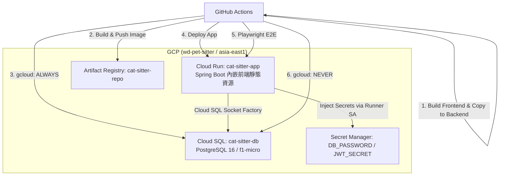

# GCP 極省錢部署與 CI/CD 工作流規劃 (修訂版 4)

此計畫旨在為專案 `wd-pet-sitter` 在台灣區域 (`asia-east1`) 建立 Cloud Run 與 Cloud SQL (`db-f1-micro`) 的部署。
為了極小化費用，我們設計了 **「CI/CD 自動喚醒/關閉資料庫」** 的工作流：只在部署與測試期間開啟 Cloud SQL，跑完即關機，使月度資料庫帳單降低至台幣 50 元以下。

同時，前端採用**一體化部署方案**（打包進 Spring Boot 靜態目錄），節省多開 Cloud Run 服務的成本，並自然規避 CORS 跨域問題。

---

## 1. 系統架構與部署決策

### A. 前端部署架構：一體化打包部署 (Spring Boot Static Resources)
*   **決策**：在建置階段，前端 React (Vite) 編譯產生的 `frontend/dist/` 會被複製至後端的 `backend/src/main/resources/static/`。
*   **優勢**：
    1. **費用極小化**：不需部署第二個 Cloud Run 實例，也無須使用 Firebase Hosting，整體雲端僅運行一個 Cloud Run 容器。
    2. **無跨域 CORS 問題**：前後端同源 (Same-Origin)。
    3. **E2E 測試簡化**：Playwright 測試可直接針對 Cloud Run 部署完成後的 URL 進行全功能端到端測試。

### B. GCP 拓撲架構


---

## 2. GCP 資源配置清單 (手動/CLI 初始化)

在啟動 CI/CD 之前，需在 GCP 上初始化資源。我們採用 **Workload Identity Federation (WIF)** 以避免洩漏 SA Key JSON 的風險，並為 Cloud Run 設定專用的 Runtime SA。

### A. 啟用相關 API (已包含 WIF 必要的 iamcredentials)
```bash
gcloud services enable \
    sqladmin.googleapis.com \
    run.googleapis.com \
    artifactregistry.googleapis.com \
    secretmanager.googleapis.com \
    iamcredentials.googleapis.com
```

### B. 建立 Artifact Registry、Cloud SQL 實例與資料庫/用戶
```bash
# Artifact Registry
gcloud artifacts repositories create cat-sitter-repo \
    --repository-format=docker \
    --location=asia-east1 \
    --description="Docker repository for Cat Sitter PWA"

# Cloud SQL (PostgreSQL 16, db-f1-micro, 10GB HDD)
gcloud sql instances create cat-sitter-db \
    --database-version=POSTGRES_16 \
    --tier=db-f1-micro \
    --region=asia-east1 \
    --storage-type=HDD \
    --storage-size=10 \
    --availability-type=zonal

# 建立專案 DB 
gcloud sql databases create petsitter_db --instance=cat-sitter-db

# 建立 DB 專用使用者
gcloud sql users create petsitter_user \
    --instance=cat-sitter-db \
    --password="<STRONG_PASSWORD>"
```

### C. 建立 Secret Manager Secrets (敏感密鑰儲存)
```bash
# 建立資料庫密碼 Secret (請替換為你的強密碼)
echo -n "<STRONG_PASSWORD>" | gcloud secrets create DB_PASSWORD \
    --data-file=- \
    --replication-policy=automatic

# 建立 JWT 簽章密鑰 Secret (請替換為長度足夠的隨機 Base64 字串)
echo -n "<RANDOM_JWT_SECRET_KEY>" | gcloud secrets create JWT_SECRET \
    --data-file=- \
    --replication-policy=automatic
```

### D. 建立並授權 Cloud Run 運行期專用 SA (Runtime SA)
不使用預設 Compute SA，新建專屬 SA 限制其僅能讀取 Secret Manager 與連接 SQL：
```bash
# 1. 建立 Runtime SA
gcloud iam service-accounts create cat-sitter-runner \
    --display-name="Cat Sitter Cloud Run Runner"

# 2. 授權其可存取 Secret Manager (唯讀存取特定 secret)
gcloud secrets add-iam-policy-binding DB_PASSWORD \
    --member="serviceAccount:cat-sitter-runner@wd-pet-sitter.iam.gserviceaccount.com" \
    --role="roles/secretmanager.secretAccessor"

gcloud secrets add-iam-policy-binding JWT_SECRET \
    --member="serviceAccount:cat-sitter-runner@wd-pet-sitter.iam.gserviceaccount.com" \
    --role="roles/secretmanager.secretAccessor"

# 3. 授予 Cloud SQL Client 權限
gcloud projects add-iam-policy-binding wd-pet-sitter \
    --member="serviceAccount:cat-sitter-runner@wd-pet-sitter.iam.gserviceaccount.com" \
    --role="roles/cloudsql.client"
```

### E. 建立 GitHub Actions 部署專用 SA (Deployment SA)
為確保設定 `--allow-unauthenticated` 時擁有設定 IAM policy 的權限，部署 SA 的 Role 必須為 `roles/run.admin` (而非 `run.developer`)：
```bash
# 1. 建立部署 SA
gcloud iam service-accounts create github-actions-deployer \
    --display-name="GitHub Actions Deployer"

# 2. 授權部署 SA 權限 (調整 roles/run.developer 為 roles/run.admin)
gcloud projects add-iam-policy-binding wd-pet-sitter \
    --member="serviceAccount:github-actions-deployer@wd-pet-sitter.iam.gserviceaccount.com" \
    --role="roles/cloudsql.admin" # 用於自動開關機

gcloud projects add-iam-policy-binding wd-pet-sitter \
    --member="serviceAccount:github-actions-deployer@wd-pet-sitter.iam.gserviceaccount.com" \
    --role="roles/run.admin" # 用於部署 Cloud Run 且授權公開存取

gcloud projects add-iam-policy-binding wd-pet-sitter \
    --member="serviceAccount:github-actions-deployer@wd-pet-sitter.iam.gserviceaccount.com" \
    --role="roles/artifactregistry.writer" # 用於推送 Image

gcloud projects add-iam-policy-binding wd-pet-sitter \
    --member="serviceAccount:github-actions-deployer@wd-pet-sitter.iam.gserviceaccount.com" \
    --role="roles/iam.serviceAccountUser" # 允許部署時指定 Runtime SA
```

### F. 初始化 Workload Identity Federation (WIF)
使用 OIDC 以取代傳統金鑰，安全登入；加上安全防護條件，防止其他 GitHub Repository 冒用：
```bash
# 1. 建立 WIF Pool
gcloud iam workload-identity-pools create github-pool \
    --location=global \
    --display-name="GitHub Actions Pool"

# 2. 建立 Provider
gcloud iam workload-identity-pools providers create-oidc github-provider \
    --location=global \
    --workload-identity-pool=github-pool \
    --issuer-uri="https://token.actions.githubusercontent.com" \
    --attribute-mapping="google.subject=assertion.sub,attribute.repository=assertion.repository"

# 3. 允許 GitHub 專案庫使用部署 SA (請替換 <OWNER> 與 <REPO>，例如 willchiangch/cat-sitter-project)
# 請先利用此指令取得 <PROJECT_NUMBER>：gcloud projects describe wd-pet-sitter --format="value(projectNumber)"
# 加入 --attribute-condition 限制僅特定 repo 能進行 identity exchange
gcloud iam service-accounts add-iam-policy-binding \
    github-actions-deployer@wd-pet-sitter.iam.gserviceaccount.com \
    --role=roles/iam.workloadIdentityUser \
    --member="principalSet://iam.googleapis.com/projects/<PROJECT_NUMBER>/locations/global/workloadIdentityPools/github-pool/attribute.repository/<OWNER>/<REPO>"
```

---

## 3. Proposed Changes (專案代碼調整)

### 後端配置

#### [MODIFY] [pom.xml](file:///Users/will_chiang/Widget_home/cat-sitter-project/backend/pom.xml) (已新增)
- **新增 Cloud SQL Socket Factory 依賴**，以便 Cloud Run 透過 Google 的 Socket Factory 驅動連接 Cloud SQL：
```xml
        <dependency>
            <groupId>com.google.cloud.sql</groupId>
            <artifactId>postgres-socket-factory</artifactId>
            <version>1.19.0</version>
        </dependency>
```

#### [NEW] [application-prod.yml](file:///Users/will_chiang/Widget_home/cat-sitter-project/backend/src/main/resources/application-prod.yml) (已新增)
- **強制作為 Blocking 變更**：使用 Cloud SQL Socket Factory URL 並限制 Hikari 連接池：
```yaml
spring:
  datasource:
    url: jdbc:postgresql:///petsitter_db?cloudSqlInstance=wd-pet-sitter:asia-east1:cat-sitter-db&socketFactory=com.google.cloud.sql.postgres.SocketFactory
    username: ${SPRING_DATASOURCE_USERNAME}
    password: ${SPRING_DATASOURCE_PASSWORD}
    hikari:
      maximum-pool-size: 2
  jpa:
    hibernate:
      ddl-auto: validate
  flyway:
    enabled: true
    baseline-on-migrate: false

app:
  security:
    jwt-secret: ${APP_SECURITY_JWT_SECRET}
    jwt-expiration: 86400000
```

### 測試配置

#### [MODIFY] [playwright.config.ts](file:///Users/will_chiang/Widget_home/cat-sitter-project/frontend/playwright.config.ts)
- 修正 `baseURL` 硬編碼，支援動態變數；當 CI 環境傳入 URL 時，不重複啟動本地 `webServer`：
```typescript
  use: {
    baseURL: process.env.BASE_URL || 'http://localhost:5173',
    ...
  },
  webServer: process.env.BASE_URL ? undefined : {
    command: 'npm run dev',
    url: 'http://localhost:5173',
    reuseExistingServer: !process.env.CI
  }
```

### CI/CD 工作流

#### [NEW] [deploy.yml](file:///Users/will_chiang/Widget_home/cat-sitter-project/.github/workflows/deploy.yml)
- 實作完整 GitHub Actions：
  1. 透過 `google-github-actions/auth` (WIF) 登入。
  2. 執行 Docker 認證設定：`gcloud auth configure-docker asia-east1-docker.pkg.dev`。
  3. 構建前端 `npm run build` 並移動至 `backend/src/main/resources/static/`。
  4. `gcloud sql` 開機，並 polling 等待 `describe` 的 `state` 欄位變為 `RUNNABLE`。
  5. Build & Push 後端 Docker Image。
  6. 部署至 Cloud Run：
     * **必須指定** `--set-env-vars SPRING_PROFILES_ACTIVE=prod,SPRING_DATASOURCE_USERNAME=petsitter_user`
     * **必須掛載 Secret Manager secrets** `--set-secrets SPRING_DATASOURCE_PASSWORD=DB_PASSWORD:latest,APP_SECURITY_JWT_SECRET=JWT_SECRET:latest`
     * **必須指定** `--service-account=cat-sitter-runner@wd-pet-sitter.iam.gserviceaccount.com`
     * **必須指定** `--add-cloudsql-instances=wd-pet-sitter:asia-east1:cat-sitter-db`
     * **必須允許公開存取** `--allow-unauthenticated`
  7. 獲取 Cloud Run 的服務 URL，帶入 `BASE_URL` 執行前端 Playwright E2E 測試。
  8. 關閉資料庫安全防護（在 `always()` 步驟執行關機，防止因測試失敗導致資料庫未關閉）。

---

## 4. Verification Plan

### Automated Tests
- 推送測試 commit，確認 GitHub Actions 順利跑完並輸出測試結果。
- 檢查關機步驟確實執行，並且資料庫處於 `STOPPED`。
