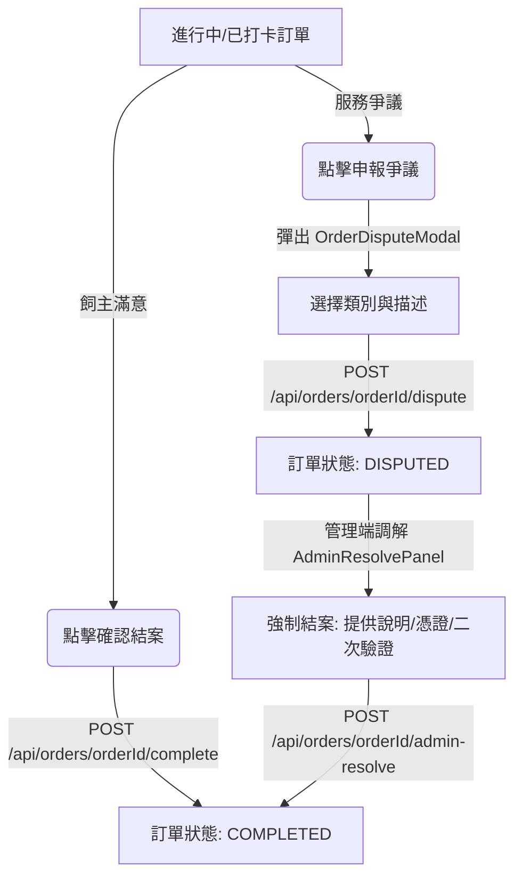
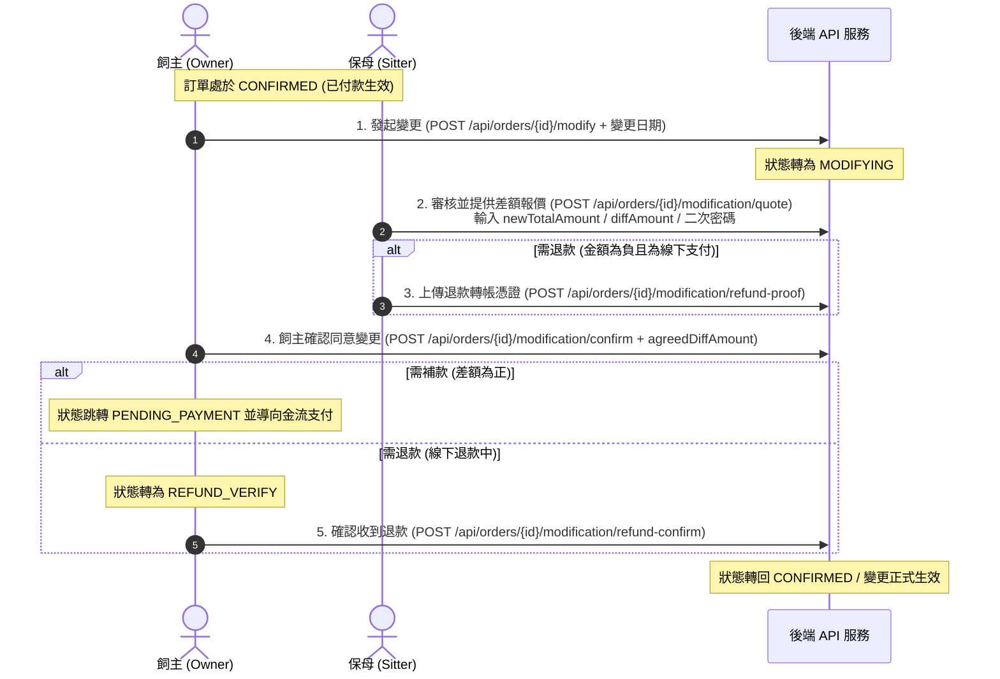

# SD-009 & SD-016 前端實作規劃計畫

本計畫旨在規劃與實作 `SD-009` (訂單結案與爭議) 與 `SD-016` (訂單雙向變更與退款) 的前端介面、組件架構與頁面流轉，並對齊 `Stitch` 設計憲法（無線條設計 `No-Line Philosophy`、精緻版面 `Editorial Aesthetic` 與流暢微動效）。

---

## 🎨 Stitch 設計憲法與 UI 規範

1. **無線條哲學 (No-Line Philosophy)**：
   - 避免使用傳統的 `border` 做區塊分割。
   - 改以陰影層級 (`box-shadow`)、背景色塊對比（`var(--color-surface-low)` 到 `var(--color-surface-high)`）與邊距 (`gap`) 來做視覺邊界。
2. **字體與色調 (Harmonious Palette & Typography)**：
   - 採用 Google Fonts `Outfit` (標題) 與 `Inter` (內文)。
   - 使用動態玻璃態 (`glassmorphism`) 做浮動面板與 Modal 底部遮罩。
3. **微互動 (Micro-animations)**：
   - 按鈕懸停有細微縮放效果 (`scale(1.02)`)，主色按鈕以漸變平滑過渡。
   - 金額試算與變更對比表使用平滑滑入展開動畫。

---

## 📂 系統變更與檔案路徑 (Proposed Changes)

### 1. 後端 API 補齊與種子帳號資料
為了防範 ROLE 權限不足的 403 阻擋，我們除了確認 Controller 的 API 暴露，還需補上 admin 種子帳號：

* #### [NEW] [V20260524_02__add_admin_seed_user.sql](file:///Users/will_chiang/Widget_home/cat-sitter-project/backend/src/main/resources/db/migration/V20260524_02__add_admin_seed_user.sql)
  - 插入 `admin@test.com` (ROLE: ADMIN) 的本地測試管理員種子帳號，確保後端 `/admin-resolve` 能通過 `ROLE_ADMIN` 的安全校驗。
* #### [MODIFY] [OrderController.java](file:///Users/will_chiang/Widget_home/cat-sitter-project/backend/src/main/java/com/petsitter/interfaces/controller/OrderController.java)
  - 確認並暴露以下 4 個 REST 端點，Service 層維持現有邏輯：
    1. `POST /api/orders/{orderId}/dispute` (飼主提出爭議 -> 呼叫 `CompletionService.disputeOrder`)
    2. `POST /api/orders/{orderId}/admin-resolve` (管理員強制結案 -> 呼叫 `CompletionService.resolveDisputedOrder`)
    3. `POST /api/orders/{orderId}/modification/refund-proof` (保母上傳退款憑證 -> 呼叫 `ModificationService.uploadRefundProof`)
    4. `POST /api/orders/{orderId}/modification/refund-confirm` (飼主確認退款 -> 呼叫 `ModificationService.confirmRefund`)

---

### 2. 前端變更與新增檔案路徑

#### A. 角色與路由主框架
* #### [MODIFY] [RoleContext.tsx](file:///Users/will_chiang/Widget_home/cat-sitter-project/frontend/src/contexts/RoleContext.tsx)
  - `Role` type 新增 `'admin'` 成員，改為 `'sitter' | 'client' | 'admin'`。
  - `RoleContextType` 新增 `setRole: (role: Role) => void` 介面。
  - **動態 JWT 同步機制**：在 `setRole(role)` 中切換角色時，前端會自動呼叫後端 `/api/auth/login` (使用各角色在本地聯調的種子帳號：`sitter@test.com`, `owner@test.com`, `admin@test.com`，密碼均為 `password`)，自動更新 localStorage 中的 `accessToken` 與 `refreshToken`。確保切換角色後，發出的後端 API 請求均帶有正確角色的 JWT，防止 403 Forbidden 錯誤。
* #### [MODIFY] [App.tsx](file:///Users/will_chiang/Widget_home/cat-sitter-project/frontend/src/App.tsx)
  - `ViewState` type 新增支援新頁面的 `name` union member：
    `'owner-orders' | 'owner-order-detail' | 'admin-resolve' | 'modification-wizard' | 'sitter-modification-quote' | 'owner-modification-confirm'`
  - `renderView()` 中的 `switch` case 補上對應組件的渲染與 mock 參數傳遞。
  - 於 Demo 首頁 (default case) 新增對應的快速測試與角色切換按鈕：
    - 【進入訂單管理 (飼主端)】 -> 跳轉 `'owner-orders'`
    - 【進入爭議調解 (管理端)】 -> 跳轉 `'admin-resolve'` (傳遞 Mock disputed order id)
    - 【發起變更精靈 (Demo 入口)】 -> 跳轉 `'modification-wizard'`
    - 【切換至管理員 (Admin)】 -> 呼叫 `setRole('admin')` 切換角色並自動登入 admin 取得 token
    - 【切換至保母 (Sitter)】 -> 呼叫 `setRole('sitter')` 切換角色並自動登入 sitter 取得 token
    - 【切換至飼主 (Client)】 -> 呼叫 `setRole('client')` 切換角色並自動登入 owner 取得 token

#### B. API Client 封裝
* #### [NEW] [orderApi.ts](file:///Users/will_chiang/Widget_home/cat-sitter-project/frontend/src/api/orderApi.ts)
  - 封裝所有訂單結案、申報爭議、管理端調解以及變更（modify, quote, confirm, refund）等相關 API 請求。

#### C. 訂單結案與爭議面板 (SD-009)
* #### [MODIFY] [SitterOrders.tsx](file:///Users/will_chiang/Widget_home/cat-sitter-project/frontend/src/pages/sitter/SitterOrders.tsx)
  - 增加變更中 `MODIFYING` 與退款確認中 `REFUND_VERIFY` 等狀態在 Tab 中的對應分類呈現。
* #### [NEW] [OwnerOrders.tsx](file:///Users/will_chiang/Widget_home/cat-sitter-project/frontend/src/pages/client/OwnerOrders.tsx)
  - 飼主端專屬的訂單列表管理頁。包含進行中與歷史訂單篩選，並能導向訂單詳細頁。
* #### [NEW] [OwnerOrderDetail.tsx](file:///Users/will_chiang/Widget_home/cat-sitter-project/frontend/src/pages/client/OwnerOrderDetail.tsx)
  - 飼主端訂單詳情頁。呈現打卡進度、照護日誌，並提供【確認結案】與【回報爭議】的實體按鈕入口（ROLE_OWNER）。
* #### [NEW] [OrderDisputeModal.tsx](file:///Users/will_chiang/Widget_home/cat-sitter-project/frontend/src/components/orders/OrderDisputeModal.tsx)
  - 飼主申報爭議的 Modal 彈窗。支援選擇爭議類別與填寫詳情。
* #### [NEW] [AdminResolvePanel.tsx](file:///Users/will_chiang/Widget_home/cat-sitter-project/frontend/src/pages/admin/AdminResolvePanel.tsx)
  - 管理員專用爭議調解與強制結案介面（含二次密碼驗證、差額填寫與證據上傳）。
  - *註：`src/pages/admin/` 目錄將會被全新建立，同時於 `App.tsx` 的 routing 新增 admin 角色守衛 (Admin Route Guard)。*

#### D. 訂單雙向變更與退款流轉 (SD-016)
* #### [NEW] [OrderModificationWizard.tsx](file:///Users/will_chiang/Widget_home/cat-sitter-project/frontend/src/pages/client/OrderModificationWizard.tsx)
  - 飼主/保母發起變更申請的日期選擇與趟數調整精靈。具備前端保母方案日期區間安全卡控與名額防呆。
  - *支援「預約取消 (Cancellation)」：於精靈首頁或 `OwnerOrderDetail` 提供【取消預約】快捷入口。在 Modification 精靈中勾選「取消此預約」後直接發起空日期的變更請求，送出至保母審核退款，確認後結轉為 `CANCELLED` 狀態。*
* #### [NEW] [SitterModificationQuote.tsx](file:///Users/will_chiang/Widget_home/cat-sitter-project/frontend/src/pages/sitter/SitterModificationQuote.tsx)
  - 保母審核變更提案的微調報價頁面。顯示預估差額、加價/折扣微調、退款憑證上傳 (GCP Storage)、與二次密碼校驗。
* #### [NEW] [OwnerModificationConfirm.tsx](file:///Users/will_chiang/Widget_home/cat-sitter-project/frontend/src/pages/client/OwnerModificationConfirm.tsx)
  - 飼主最終確認同意變更與退款確認頁。呈現變更前後明細、同意差額對帳防線，支援補款跳轉支付與線下退款確認。

---

## 🔄 業務流轉與 API 串接規格

### 1. 訂單結案與爭議申報 (SD-009)

### 2. 訂單變更與退補款 (SD-016)

---

## 🛡️ 前端安全防守與零信任防線 (NFR & UX)

1. **Idempotency-Key 阻守**：
   - 每次點擊結案、發起變更、保母報價與最終確認時，前端會自動在 Header 帶入隨機產生的 `Idempotency-Key` (UUID)。在 API 回應完成前，對應的 Action 按鈕會呈現 `Loading` 狀態且為 `disabled`，嚴防連擊。
2. **零信任金額校驗 (Zero Trust)**：
   - 飼主最終確認變更同意差額時，API 參數必須帶入 `agreedDiffAmount`。前端會精確比對並要求 agreedDiffAmount 必須與保母最後一次報價的 `diffAmount` 數值完全一致，若有任何不合（如中途保母重新修改報價），直接提示錯誤並引導重新載入，拒絕對帳漏洞。
3. **二次安全認證 (NFR-003)**：
   - 保母送出微調報價、管理員處理爭議 resolve 時，前端會彈出密碼二次輸入框，輸入並雜湊後連同 API 請求發送，阻擋越權操作。
4. **時程變更前端防呆**：
   - 在 `OrderModificationWizard` 日期調整精靈中，前端加載該方案的 `startDate`/`endDate`。如果修改的日期有任何一天落在生效區間外，前端會直接將該日期框標紅並 disabled，點擊提交時提示 `PLAN_NOT_IN_RANGE` 前置警告。

---

## 🧪 驗證計畫 (Verification Plan)

### 自動化測試
我們將在 `frontend/e2e` 目錄下撰寫 Playwright 測試：
- **`dispute-and-completion.spec.ts`**：
  - 模擬飼主手動結案，驗證訂單狀態變更。
  - 模擬飼主申報爭議，驗證 Dispute Modal 欄位送出後狀態轉為 `DISPUTED`。
- **`order-modification.spec.ts`**：
  - 模擬完整變更鏈路：發起變更 -> 保母微調報價 -> 飼主同意補/退款。
  - 驗證 agreedDiffAmount 零信任金額不符時阻擋成功。
  - 驗證重複點擊時 Idempotency-Key 攔截。

### 手動與 UI 驗證
1. 部署本地服務，以 `sitter` 與 `client` 不同瀏覽器視窗登入，進行即時報價試算與對帳單對比。
2. 檢查在不同行動裝置解析度下，試算表格及 Modal 彈窗的 `Stitch` 設計適配度，確保無破版。
