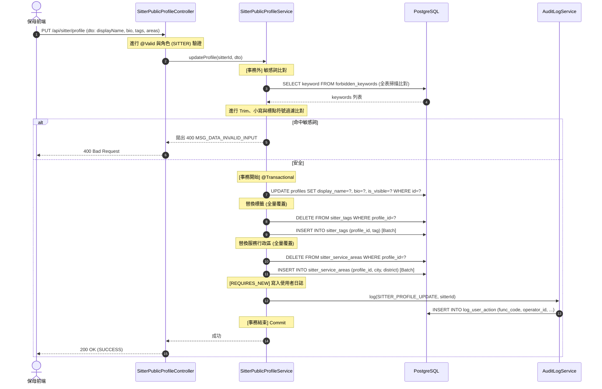
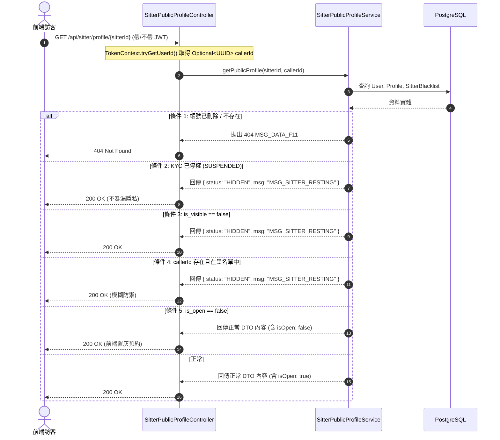

# SD-018: 保母公開檔案與標籤管理實作計劃

本計劃旨在規劃並實作 **SD-018: 保母公開檔案與標籤管理**，提供保母編輯自我介紹、大頭貼、標籤與服務區域的功能，並支援管理端敏感詞庫分頁與攔截、KYC 停權連動防禦，以及基於黑名單的隱私模糊化查詢。

---

## 1. 資料庫與實體設計 (Database & ERD)

### 1.1. Sitter Profile 擴充
* 於 `profiles` (保母簡介) 表新增以下欄位：
  * `avatar_url` VARCHAR(512)：個人大頭貼連結。
  * `display_name` VARCHAR(100)：公開顯示名稱。
  * `bio` TEXT：自我介紹（100-500 字）。
  * `is_visible` BOOLEAN NOT NULL DEFAULT TRUE：公開/隱藏狀態切換。

### 1.2. Sitter Tags 表 (一對多，全量覆蓋策略)
* 新增 `sitter_tags` 表：
  * `id` UUID PRIMARY KEY
  * `profile_id` UUID NOT NULL (FK -> profiles.id)
  * `tag` VARCHAR(20) NOT NULL (單個標籤限制 10 字以內)
  * 複合唯一索引 `uk_sitter_tag (profile_id, tag)`。
  * **替換策略**：採取 **DELETE all + INSERT new** 全量覆蓋。簡單、無併發 Diff 計算開銷，且順序隱含由前端陣列順序定義。

### 1.3. Sitter Service Areas 表 (服務行政區複選，全量覆蓋策略)
* 新增 `sitter_service_areas` 表：
  * `id` UUID PRIMARY KEY
  * `profile_id` UUID NOT NULL (FK -> profiles.id)
  * `city` VARCHAR(50) NOT NULL (縣市，例如：台北市)
  * `district` VARCHAR(50) NOT NULL (行政區，例如：大安區)
  * 複合唯一索引 `uk_sitter_area (profile_id, city, district)`。

### 1.4. Forbidden Keywords 表 (敏感詞庫)
* 新增 `forbidden_keywords` 表：
  * `id` UUID PRIMARY KEY
  * `keyword` VARCHAR(50) NOT NULL UNIQUE (敏感字，不分大小寫)
  * `created_by` UUID, `created_at` TIMESTAMPTZ。

---

## 2. 業務流程與事務邊界 (Sequence Diagrams)

### 2.1. 編輯公開檔案：`PUT /api/sitter/profile`
* 敏感詞查詢置於 `@Transactional` 寫入事務之外，防止因外部大文字查詢及比對拉長寫入事務時間。
* 審計日誌 (`log_user_action`) 採用 `Propagation.REQUIRES_NEW` 獨立事務，以防編輯失敗回滾時丟失審計軌跡。



### 2.2. 查詢公開檔案與 Gating 優先級：`GET /api/sitter/profile/{sitterId}`
* 設計為 **Optional JWT** (Spring Security 設為 `permitAll()`)，未登入者（匿名）跳過黑名單檢查，已登入者（由 `TokenContext.tryGetUserId()` 取得 `callerId`）進行黑名單排除判定。

#### Gating 優先級判定表
| 優先級 | 條件 | 結果 | 備註 |
|:---:|---|---|---|
| 1 (最高) | 帳號已刪除 (`user.is_deleted` 或查無 user) | 404 Not Found (`MSG_DATA_F11`) | 隱蔽已刪除帳號 |
| 2 | KYC 被停權 (`kycStatus == SUSPENDED`) | 200 OK 模糊化轉導 | 內容僅帶有 `HIDDEN` 狀態與 `MSG_SITTER_RESTING` 警語 |
| 3 | `is_visible == false` (公開檔案隱藏) | 200 OK 模糊化轉導 | 內容僅帶有 `HIDDEN` 狀態與 `MSG_SITTER_RESTING` 警語 |
| 4 | 訪客已登入，且在該保母的「預約黑名單」中 | 200 OK 模糊化轉導 | 內容僅帶有 `HIDDEN` 狀態與 `MSG_SITTER_RESTING` 警語 (避免洩露封鎖資訊) |
| 5 (最低) | `is_open == false` (不接單，但公開檔案可見) | 200 OK 正常顯示 | 檔案內容正常渲染，但預約按鈕為 Disabled 狀態 |



---

## 3. Avatar 大頭貼上傳機制

* **上傳模式**：採用 **Multipart POST -> 後端 -> GCS** 轉存模式。
  * **決策背景**：頭像為完全公開資料，不涉及隱私與存取時效卡控（不同於 KYC 文件的 Signed URL 直傳模式）。透過後端可限制檔案格式、轉換大小並最大化整合管理。
* **介面擴充**：`MediaStorageService` 介面將新增大頭貼專屬方法簽名：
  ```java
  String uploadAvatar(UUID sitterId, MultipartFile file);
  ```
  並在對應實作類（如 `LocalMediaStorageService`, `GcsMediaStorageService`）中實作此方法。
* **API 端點**：`POST /api/sitter/profile/avatar`
  * 限制檔案格式僅限 `image/jpeg` 與 `image/png`。
  * 前端限制檔案大小 `<= 2MB`。
* **儲存路徑**：`avatars/{sitterId}.{ext}`
  * 採 **方案 1：保留原始副檔名**（`.jpg` 或者是 `.png`），解決副檔名與 MIME type 不符之問題。
  * 採 **覆蓋式寫入**（不加入隨機雜湊尾碼），以節省 GCS 儲存空間，並防止保母頻繁更換頭像時殘留垃圾圖片。

---

## 4. 其它細部設計與 NFR 校驗

### 4.1. 擴充 `TokenContext.java`
* 為支援 Optional JWT 匿名讀取，現有僅包含強制的 `getUserId()` 方法之 `TokenContext` 需新增：
  ```java
  public static Optional<UUID> tryGetUserId() {
      Authentication auth = SecurityContextHolder.getContext().getAuthentication();
      if (auth == null || !auth.isAuthenticated() || auth instanceof AnonymousAuthenticationToken) {
          return Optional.empty();
      }
      // 從 Principal 或驗證資訊中取得 userId UUID
      return Optional.of(UUID.fromString(auth.getName()));
  }
  ```

### 4.2. Controller 命名衝突防範
* 為避免與已有之 `SitterProfileController.java` (`/api/sitter/payment-info`) 衝突，新增之公開檔案端點將統一定義於 `SitterPublicProfileController.java`。
* 管理端敏感字端點定義於 `AdminForbiddenKeywordController.java`。

### 4.3. 敏感詞 GET 列表分頁與搜尋
* `GET /api/admin/forbidden-keywords` 必須加入分頁與搜尋防禦：
  * **參數**：`?page=0&size=50&q=keyword` (q 為可選關鍵字搜尋)。
  * **回傳**：分頁封裝格式之 DTO。

### 4.4. KYC 停權狀態連動防禦 (同交易處理)
* 當保母的 KYC 狀態變更為 `SUSPENDED`（停權）時，必須將接單狀態強制變更為隱藏以作防禦。
* **連動實作點**：在 `KycServiceImpl.suspendSitter(UUID recordId, String reason)` 的同一個寫入事務 (`@Transactional`) 內，直接加入 `profile.setOpen(false)`。這能確保資料一致性，且避免多餘的非同步事件通訊與可能的事務延遲。

### 4.5. 審計 Action 日誌功能代碼 (func_code) 對齊
* 寫入 `log_user_action` 表（對齊 `V20260527_01` 遷移定義）：
  * `PUT /api/sitter/profile` -> `SITTER_PROFILE_UPDATE`
  * `POST /api/admin/forbidden-keywords` -> `ADMIN_FORBIDDEN_KEYWORD_ADD`
  * `DELETE /api/admin/forbidden-keywords/{id}` -> `ADMIN_FORBIDDEN_KEYWORD_DELETE`

---

## 5. 前端與 E2E 測試驗證計畫 (TS-018)

### 5.1. 前端 UI 設計 (Stitch & testid)
* **`SitterProfileEdit.tsx` (保母編輯)**：大頭貼上傳、自我介紹、Tag Chip 選擇器（最多10個）、City->District 連動勾選行政區、Visibility滑動 Toggle。
* **`SitterPublicProfileView.tsx` (前台展示)**：當 status 為 `HIDDEN` 時，渲染溫馨之「休息中 🐾」提示頁。
* **testid 規格**：
  * 大頭貼上傳：`data-testid="sitter-profile-avatar-upload"`
  * 標籤輸入：`data-testid="sitter-profile-tag-input"`
  * 公開切換：`data-testid="sitter-profile-visibility-toggle"`
  * 儲存按鈕：`data-testid="sitter-profile-save-btn"`

### 5.2. E2E 測試與位置相容性
* E2E 測試中若需要返回 Demo 頁面，需確認 `返回 Demo 首頁` 按鈕定位為 `top: 120px` 避開 top banner 的 pointer 攔截。
