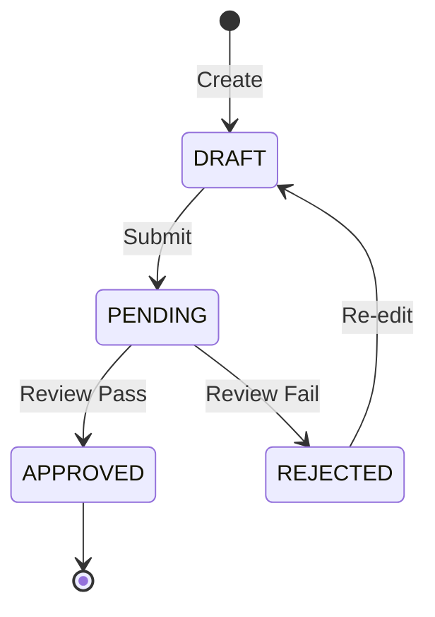

# SA Skill: Professional System Analysis and Documentation

This skill enables Claude to analyze business requirements and produce high-quality System Analysis (SA) documents. It strictly follows the project template and incorporates advanced engineering mindsets to ensure robustness, scalability, and maintainability.

## Core Principles

Apply these 6 professional mindsets during the analysis and writing process:

### 1. User Story & AC Splitting (8 AC Rule)
- **Granularity Control**: If a single User Story has more than 8 Acceptance Criteria (AC), it likely contains multiple sub-processes.
- **Splitting Dimensions**:
  - **By Permission**: Separate behaviors for different roles (e.g., "Member" vs. "Admin").
  - **By Lifecycle**: Separate phases (e.g., "Create Record" vs. "Audit/Review Record").
- **Goal**: Shorten the testing path for a single ticket and reduce Regression Test complexity.

### 2. Main Flow: From Behavior to State
- **State Machine Thinking**: Do not just describe a path from A to B. Explicitly define:
  - All Enum values for the `status` field.
  - Transformation trigger points (what events cause state transitions).
- **Idempotency**: Consider repeated clicks or network retries for backend APIs, especially for financial or inventory transactions.

### 3. Exception Handling: Cemetery Path Thinking
- **Error Codes**: Precisely define 4xx vs. 5xx responses and how the frontend should react.
- **409 Conflict**: Handle concurrent modifications (e.g., "Data has been modified by another user, please refresh").
- **Fallback Mechanism**: Define degradation plans when external services (e.g., GCP Vertex AI) are unavailable.

### 4. Data Rules: Technical Precision
- **Precision**: Use `BigDecimal(18,4)` for all currency/amount fields to avoid floating-point errors.
- **Timezone**: Store in UTC; display according to `Asia/Taipei`.
- **Audit Trail**: Define tracking fields: `created_by`, `updated_by`, and `version` (for optimistic locking).

### 5. Impact Analysis: Global Side Effects
- **Side Effects**: Analyze if changes to a table (e.g., `tb_member`) will break existing Tableau reports or Data Pipelines.
- **Backward Compatibility**: Ensure changes are compatible with older frontend/APP versions. Implement API Versioning if necessary.

### 6. Expert Recommendations (Proactive Thinking)
- **Observability**: Specify `Correlation-ID` or Business Log formats to allow quick reconstruction of business scenarios from logs.
- **Data Retention**: Define data cleanup or archival (Cold Storage) policies based on regulations and performance.
- **Performance Budget**: Define expected Response Time targets (e.g., 95th percentile < 300ms).

## Workflow

### Step 1: Requirements Gathering
- Extract User Stories and business goals from user input.
- Clarify ambiguous requirements by asking targeted questions.

### Step 2: Architecture & Data Analysis
- Identify impacted database tables and shared designs (e.g., RBAC).
- Check existing `schema.sql` or domain models to ensure technical accuracy.

### Step 3: Document Writing
- Use the template located at `references/template.md`.
- **User Stories**: Write in the format: "As a [Role], I want [Behavior], so that [Purpose]."
- **State Diagrams**: Use Mermaid syntax to visualize complex state transitions.
- **Exception Table**: Map error scenarios to specific behaviors and status codes.

### Step 4: Verification
- Review the drafted SA against the "8 AC Rule".
- Ensure all technical rules (Timezone, Precision, Audit Trail) are addressed.

## Document Template
The skill uses the standard template provided in `references/template.md`. Always maintain the structure while filling in the analyzed content.

## Example Mermaid State Machine

