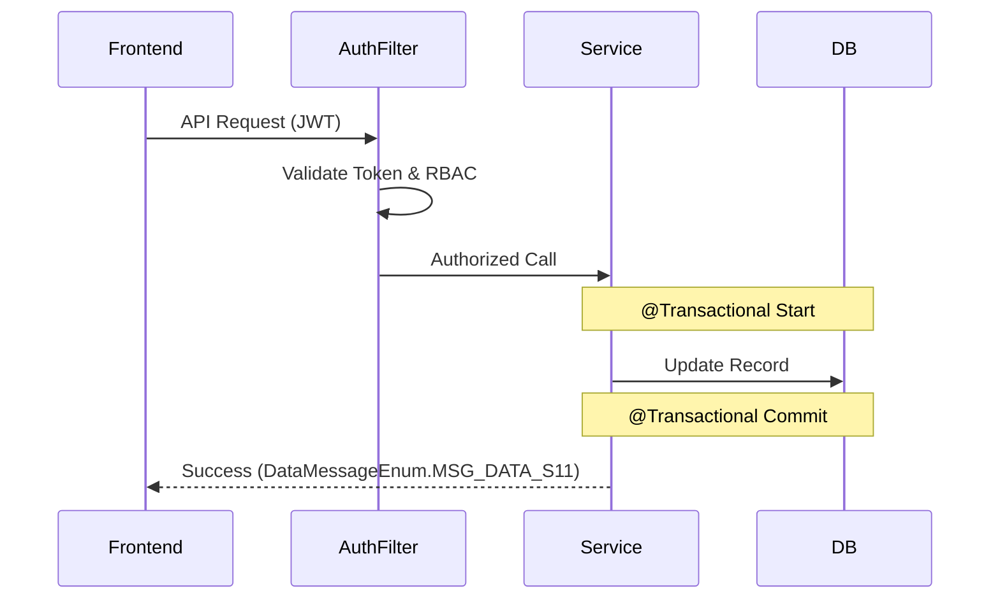

# SD Skill: Professional System Design and Documentation

This skill enables Claude to design robust system architectures and produce high-quality System Design (SD) documents. It translates System Analysis (SA) requirements into technical specifications, following project templates and advanced engineering principles.

## Design Principles

Apply these 4 core thinking models during the design process:

### 1. Sequence Diagram: Defining Boundaries & Responsibilities
- **Beyond Happy Path**: Do not just design the successful flow.
- **Permission Interception**: Identify where Spring Security/Filters intercept JWT. Define if RBAC checks occur at the Gateway or Service layer.
- **Transaction Boundary**: Explicitly mark steps that must execute within the same `@Transactional` block. Define rollback strategies for external API failures (e.g., Vertex AI).
- **Asynchronous Processing**: Identify actions suitable for Message Queues (e.g., Google Cloud Pub/Sub). Distinguish between "Response returned to user" and "Background execution".

### 2. Data Model: Integrity & Traceability
- **Multi-tenancy Isolation**: Every SQL query and table design must include `org_code` or `tenant_id` filtering logic, especially for GCP deployments.
- **Audit Trail**: Precisely define trigger points for `log_user_action`. Use `Propagation.REQUIRES_NEW` for logging to ensure logs are written even if the main service transaction fails.
- **Performance Pre-evaluation**: Choose appropriate types (e.g., `varchar(255)` vs `text`) and design indexes. Identify potential query hotspots.

### 3. API Design: Standardization & Defensiveness
- **Precise Error Codes (Enum)**: Use `DataMessageEnum` (e.g., `MSG_DATA_F11` for "Data not found") instead of generic 500 errors.
- **Idempotency**: Include `request_id` in POST/PUT interfaces to prevent duplicate transactions or data from repeated clicks/retries.
- **Pagination & Rate Limiting**: Enforce pagination on GET interfaces. Implement rate limiting for high-concurrency scenarios.

### 4. Shared Design: DRY (Don't Repeat Yourself)
- **Componentization**: Use existing project components (e.g., `file-upload.md`, `cronjob.md`) rather than reinventing the wheel.
- **Configuration-Driven**: Move parameters (API Timeouts, Endpoints, Business Rules) to `cfg_system`. Avoid hard-coding.

## Workflow

### Step 1: Input Analysis
- Read the corresponding SA document (PRD-XXX) and requirements.
- Identify core entities, API endpoints, and external dependencies.

### Step 2: Technical Architecture Design
- Define the sequence of calls between Frontend, Backend, and DB.
- Determine transaction boundaries and permission requirements.
- Select appropriate shared components and templates.

### Step 3: Document Writing
- Use the template located at `references/template.md`.
- **Sequence Diagrams**: Use Mermaid syntax. Ensure permission and transaction boundaries are clear.
- **Data Model**: Provide SQL snippets for DDL changes.
- **API Spec**: Detail Request/Response structures and specific `DataMessageEnum` mappings.

### Step 4: Consistency Check
- Ensure `org_code` is handled for multi-tenancy.
- Verify `log_user_action` coverage for all write operations.
- Check that all configurable values are assigned to `cfg_system`.

## Document Template
The skill uses the standard template provided in `references/template.md`. Always maintain the structure while filling in the technical design details.

## Example Sequence Diagram with Boundary

