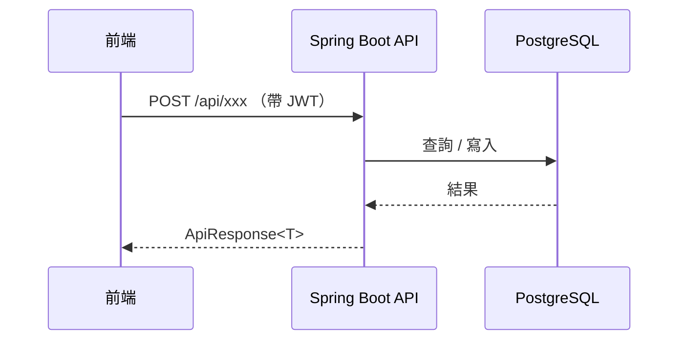
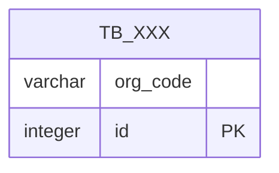

# SD-XXX: [功能名稱] 設計文件

| 項目 | 內容 |
|------|------|
| 對應需求 | PRD-XXX |
| 負責 SD | |
| 建立日期 | YYYY-MM-DD |
| 狀態 | Draft |
| DB 表 | （主要涉及的 table，如 `tb_member`, `cfg_role_func`） |
| 相依共用設計 | [錯誤回應](shared/error-response.md), [RBAC 權限](shared/permission-rbac.md), [多租戶稽核](shared/audit-tenancy.md), [功能表設計](shared/menu-function.md), [代碼表](shared/code-table.md), [檔案上傳](shared/file-upload.md), [排程設計](shared/cronjob.md), [系統配置](shared/config-system.md), [索引](shared/00-index.md) |

---

## 序列圖



---

## 資料模型變更

### 新增 / 修改 Table

（無變更請寫「無」）

```sql
-- 新增欄位範例
ALTER TABLE tb_xxx ADD COLUMN xxx varchar(50) NOT NULL DEFAULT '';

-- 新增 table 範例
CREATE TABLE tb_xxx (
    org_code    varchar(50) NOT NULL,
    ...
    PRIMARY KEY (org_code, ...)
);
```

### log_user_action — 操作日誌寫入規格

> 參考 [多租戶稽核設計 §四](shared/audit-tenancy.md)

每次寫入操作成功後，Service 層需寫入一筆 `log_user_action`：

| 欄位 | 值 |
|------|----|
| `func_code` | `（填入對應功能代碼，如 SYS_SET_USER_MGT）` |
| `action_type` | 首次建立 → `CREATE`；更新既有 → `UPDATE` |
| `action_result` | `SUCCESS` / `FAIL` |
| `target_id` | 主鍵值 |
| `target_table` | 對應 table 名稱 |
| `client_ip` | 由 `IpContext` 取得 |

### ER Diagram（如有變更）



---

## API 設計

> 對應 [docs/api/openapi.yaml](../api/openapi.yaml)

| Method | Path | 說明 | 權限（funcCode） |
|--------|------|------|-----------------|
| GET | /api/xxx | 查詢 | `FUNC_CODE:CRUD` |
| POST | /api/xxx | 新增 | `FUNC_CODE:CRUD` |

### Request Body

```json
{
  "field1": "string",
  "field2": 0
}
```

### Response

```json
{
  "code": 200,
  "message": "OK",
  "data": { }
}
```

---

## 權限設計

> 參考 [RBAC 權限設計](shared/permission-rbac.md)

| 角色 | 功能代碼 | 授權動作 |
|------|---------|---------|
| SYS_OP | `FUNC_CODE` | CRUD |

---

## UX 設計

（說明操作流程、裁切框計算公式、例外顯示規則等行為規格）

### 視覺設計

（待補充截圖或 Figma 連結）

---

## 備註

- **Response message 使用 DataMessageEnum**（參考 [錯誤回應設計](shared/error-response.md)）：
  - 新增成功 → `DataMessageEnum.MSG_DATA_S11`
  - 修改成功 → `DataMessageEnum.MSG_DATA_S12`
  - 查無資料 → `DataMessageEnum.MSG_DATA_F11`
  - （依實際需求補充其他 enum 值）
- **tb_func / cfg_role_func 設定**（參考 [功能表設計](shared/menu-function.md)）：
  - 說明功能代碼是否已存在、是否需新增 `tb_func` 記錄或 `cfg_role_func` 授權初始化
- **list_code 使用範圍**（參考 [代碼表設計](shared/code-table.md)）：
  - 後端查詢條件使用常數，不從 `list_code` 動態讀取判斷值
  - 若前端需顯示類型名稱，說明建議補充哪些 `list_code` 記錄
- **檔案上傳**（若有，參考 [檔案上傳設計](shared/file-upload.md)）：
  - 說明使用的 `cfg_upload` 群組（uploadGroupType / uploadSubType）
  - 若需 PNG 轉檔請確認 `upload_process_type = UPLOAD_IMG`
  - 若需去背請確認 `upload_setting` 含 `TRANSPARENT=TRUE`
  - 若需後端圖片加工（如重寫 DPI metadata）說明為何不走 FileController、改用何種方式
- **排程工作**（若有，參考 [排程設計](shared/cronjob.md)）：
  - 說明 Job 類別名稱（= `cfg_cronjob.job_proc_name` 首字大寫）
  - 說明 cron 表達式（5 欄位，最小單位：分鐘）與超時設定
  - 確認 `cfg_cronjob` INSERT 腳本已納入部署初始化
- （其他：技術決策原因、已知限制、後續優化方向）
