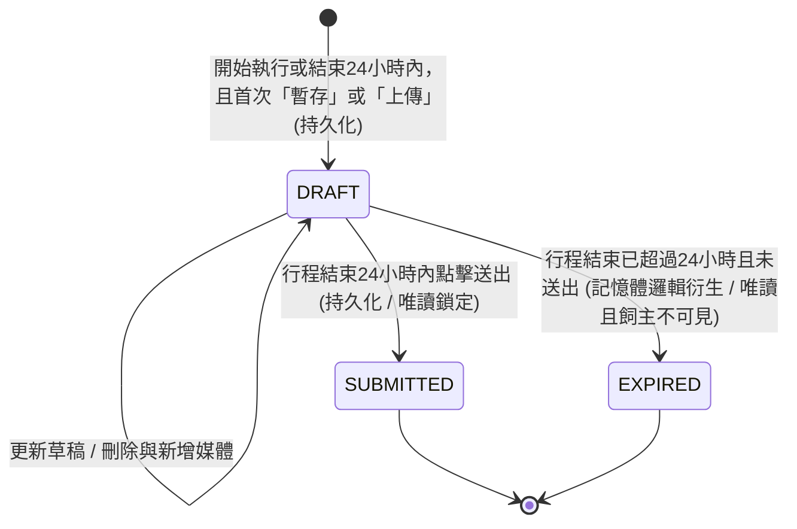

# PRD-022: 行程照護日誌與多媒體回報

| 項目 | 內容 |
|------|------|
| 負責 SA | AI (Antigravity) |
| 建立日期 | 2026-05-23 |
| 狀態 | Approved |
| 影響模組 | frontend / backend |
| 影響實體 (Entities) | 行程 (Visit)、服務日誌 (Service Report)、日誌多媒體 (Report Media) |
| 相依共用設計 | 通知系統、多媒體儲存、SaaS 四級訂閱架構、多媒體保留策略 (PRD-013) |
| 對應 SD | SD-022 |
| 對應測試情境 | TS-022 |

---

## 背景與目的

在服務執行期間，保母需要記錄並向飼主回報每一次行程（Visit）的即時服務狀態。這項日常回報稱為「照護日誌 (Care Log / Visit Log)」，保母可以填寫文字並上傳照片與影片，讓飼主能安心掌握毛孩的即時近況。為確保平台流量與儲存成本可控，此功能的多媒體上傳數量與格式需受到保母當前訂閱的 SaaS 方案限制。

依據 `sa-skill` 的 **8 AC 原則**，本功能在規格與驗收上拆分為兩個子模組：
1. **子模組 A：日誌與媒體編輯管理 (Core Editor & Media)**
2. **子模組 B：日誌送出、非同步通知與逾期判定 (Submission & Expiration)**

---

## 使用者故事

### 子模組 A：日誌與媒體編輯管理
- 身為 **保母**，我希望能為當次行程填寫照護日誌，記錄文字日誌以回報服務狀態。
- 身為 **保母**，我希望能上傳照片與影片作為照護佐證，且能依我的方案額度上傳足夠的媒體。
- 身為 **保母**，我希望在草稿狀態下能自由刪除拍糊的照片，以便重新上傳正確的媒體。

### 子模組 B：日誌送出、非同步通知與逾期判定
- 身為 **保母**，我希望能確認並送出日誌，以便正式回報今日的照護結果並讓飼主查閱。
- 身為 **飼主**，我希望在保母送出該次行程照護日誌後收到通知，以便即時掌握貓咪的最新動態。
- 身為 **飼主**，我希望能在過期前下載或保存日誌中的多媒體內容。

---

## 功能規格

### 子模組 A：日誌與媒體編輯管理

#### A.1 唯一性與 DRAFT 建立時機
- 每個行程只能對應一份照護日誌。
- **建立時機**：保母在行程詳情中首次進行「暫存草稿」或「上傳媒體」時，系統會自動建立一份處於 `DRAFT` 狀態的日誌。後續的暫存或媒體更新均會更新此份草稿，且系統需防止重複建立。

#### A.2 開放填寫與編輯條件
- **待執行狀態 (PENDING / SCHEDULED)**：當行程時間尚未到達且處於待執行狀態時，保母不可編輯、暫存或上傳媒體，系統不提供編輯入口。
- **進行中狀態 (IN_PROGRESS)**：行程開始執行後，開放保母編輯、暫存及上傳媒體以建立草稿，**但此狀態下不開放「送出日誌」**。
- **已結束狀態 (DONE) 且未逾期**：行程結束後，只要該日誌尚未送出，保母仍可繼續編輯草稿、上傳媒體與點選送出。

#### A.3 照護日誌內容欄位
* `文字日誌`：多行文字 (最多 1000 字)。
  - **UX 行為**：前端文字輸入框下方需即時顯示「目前字數 / 1000」，且當字數達到 1000 字時，直接限制輸入，不允許繼續鍵入。
* `多媒體列表`：上傳的媒體清單，包含以下約束：
  - `說明文字`：選填 (Nullable)，最長 100 字。
  - `媒體檔案`：照片或影片。
  - `媒體類型`：區分為照片 (IMAGE) 或影片 (VIDEO)。

#### A.4 SaaS 訂閱等級與媒體上傳限制
系統在保母進行「媒體上傳」時，必須檢核保母當前的 SaaS 訂閱等級。限制規則如下：

| 方案等級 | 照護回報媒體限制 | 支援檔案格式 | 單圖大小限制 | 影片長度與大小限制 |
|:---|:---|:---|:---|:---|
| **體驗版 (Free)** | 僅限文字（0 照片 / 0 影片） | N/A | N/A | N/A |
| **新手版 (Basic)** | 最多 5 張照片（0 影片） | JPG, PNG, WebP | < 1MB | N/A |
| **專業版 (Pro)** | 最多 10 張照片 + 2 影片 | 照片同上；影片支援 MP4, MOV | 同上 | 15 ~ 30 秒，且單檔 < 50MB |
| **頂級版 (Premium)** | 最多 25 張照片 + 5 影片 | 照片同上；影片支援 MP4, MOV | 同上 | 15 ~ 30 秒，且單檔 < 50MB |

#### A.5 多媒體刪除與替換機制
- **草稿狀態移除**：在日誌為 `DRAFT` 狀態下，保母可自由點擊刪除已上傳的照片或影片。刪除後該媒體額度立即釋放，保母可上傳新媒體替代。

---

### 子模組 B：日誌送出、非同步通知與逾期判定

#### B.1 送出條件與唯讀鎖定
- 只有當行程變更為已結束（`Visit` 狀態為 `DONE`）且未逾期時，保母才可以點擊「送出日誌」。
- 送出後，日誌狀態變更為 `SUBMITTED`，進入唯讀鎖定狀態，不可再修改文字或刪除/新增媒體。
- **降級與合約保護**：依據 `PRD-013` 規範，日誌中的多媒體保留期限（Free 7天、Basic 30天、Pro 90天、Premium 永久）依據「訂單成立時」的方案鎖定，不隨保母中途到期降級而追溯。

#### B.2 補送期限與超時懶加載判定
- **補送期限**：最遲必須在行程結束時間（`finished_at`）起算 24 小時內送出日誌。
- **懶加載判定機制 (Pure Lazy 策略)**：
  - 本功能採用懶加載策略，系統僅持久化 `DRAFT` 與 `SUBMITTED` 兩個狀態，不儲存 `EXPIRED`（邏輯衍生狀態），且無背景排程任務（排程 = 否）。
  - 前後端讀取或嘗試編輯日誌時，系統即時判斷當前時間是否已超過 `finished_at` 起算 24 小時。
  - 若已逾期，且日誌實體狀態仍為 `DRAFT`，則系統在記憶體中將其視為 `EXPIRED`。
- **逾期草稿處理**：被判定為邏輯 `EXPIRED` 狀態的日誌：
  * 保母端編輯與送出入口自動關閉，該草稿直接失效變更為唯讀過期狀態（僅能檢視暫存的文字，不可修改/上傳/送出）。
  * 對飼主端永遠不可見，且不發送任何通知。

#### B.3 狀態變更定義
- **`DRAFT` (草稿)**：保母編輯日誌內容時的初始狀態。此狀態下飼主無法查看。
- **`SUBMITTED` (已送出)**：保母確認並送出日誌後的狀態。送出後日誌變更為唯讀鎖定（不可再修改），飼主即可查閱，系統並會非同步觸發通知.
- **`EXPIRED` (已逾期，邏輯狀態)**：日誌未在行程結束時間起算 24 小時內送出時，系統經由時間即時計算判定的**邏輯衍生狀態，非持久化狀態，系統不記錄此值**。此狀態下保母僅能唯讀查閱已暫存的內容，對飼主永遠不可見。

#### B.4 非同步通知
- 當照護日誌狀態轉換為 `SUBMITTED` 時，系統非同步發送站內通知給該訂單的飼主（不影響日誌送出的主要流程）：
  > 「[預約日期] 的行程日誌已由保母回報，快來看看毛孩的近況吧！」
  - **日期格式**：`[預約日期]` 的格式固定為 `YYYY-MM-DD`。

---

## 例外處理 (Cemetery Path)

| 子模組 | 情境 | 預期行為 | HTTP 狀態碼 |
|------|------|---------|-------------|
| A | 當前方案上傳超限 (例如：Free 版嘗試上傳照片，或 Pro 版上傳第 11 張照片) | 前端置灰上傳按鈕並顯示「您的訂閱方案不支援上傳更多媒體」；後端服務檢核若超限，拒絕寫入並回傳方案限制錯誤。 | `403 Forbidden` (`AUTH_PLAN_LIMIT`) |
| A | 上傳不合規影片 (長度 < 15s 或 > 30s，或 > 50MB，或非 MP4/MOV) | 前端利用瀏覽器 API 檢測檔案，拒絕選取並提示具體限制；後端服務檢驗不符則拒絕接收並提示錯誤。 | `400 Bad Request` (`INVALID_MEDIA_FORMAT`) |
| A | 行程尚未開始 (PENDING/SCHEDULED) 時保母嘗試編輯或上傳 | 前端不顯示任何編輯與上傳入口；後端服務檢驗行程狀態，若非進行中 (IN_PROGRESS) 或已結束 (DONE)（且未逾期），拒絕日誌建立或暫存。 | `422 Unprocessable Entity` (`INVALID_VISIT_STATUS`) |
| A | 保母以過期版本（舊 version）嘗試暫存草稿（並發衝突） | 後端服務拒絕寫入，前端提示「內容已被更新，請重新整理後再試」。 | `409 Conflict` (`VERSION_CONFLICT`) |
| A | 上傳媒體時，雲端儲存服務 (如 GCS) 斷線或不可用 | 前端提示保母「儲存服務暫時無法使用，請稍候重試」，且不清除保母當前已選取的檔案，允許保母稍後點擊重試上傳。 | `503 Service Unavailable` (`STORAGE_SERVICE_UNAVAILABLE`) |
| A/B | 送出日誌或上傳媒體時網路重試 (重複提交) | 請求必須攜帶冪等性識別碼 (Idempotency Key)。系統檢測到重複的識別碼，則拒絕重複處理，並回傳衝突錯誤。 | `409 Conflict` (`IDEMPOTENCY_CONFLICT`) |
| B | 行程進行中 (IN_PROGRESS) 嘗試送出日誌 | 前端禁用「送出」按鈕，僅能點選暫存草稿；後端服務檢核若 Visit 狀態非 `DONE`，拒絕送出。 | `422 Unprocessable Entity` (`VISIT_NOT_FINISHED`) |
| B | 保母嘗試編輯已送出 (`SUBMITTED`) 的日誌，或嘗試刪除其媒體 | 系統隱藏所有輸入與編輯/刪除按鈕；後端服務檢核若狀態為 `SUBMITTED` 則拒絕所有修改與刪除請求。 | `409 Conflict` (`REPORT_STATE_CONFLICT`) |
| B | 行程結束已超過 24 小時（以 `finished_at` 起算），或訂單已結案 (COMPLETED) 時保母嘗試編輯、暫存或送出 | 前端關閉日誌編輯與提交入口；既存之 `DRAFT` 日誌草稿直接失效變更為唯讀過期狀態；後端服務檢核若判定已逾期，或訂單狀態為 `COMPLETED`，拒絕日誌的建立、暫存或送出。 | `403 Forbidden` (`REPORT_EXPIRED` 或 `ORDER_COMPLETED`) |

---

## 資料規則 / 業務規則

- **狀態唯讀性**：日誌一旦轉換為 `SUBMITTED`，即不可再回退至 `DRAFT`。
- **權限防禦**：僅有該行程所屬訂單的「主保母」有權限編輯與送出日誌。飼主端僅能讀取已送出之日誌。
- **時區標準**：日誌的所有時間戳記（建立時間、送出時間）均以 UTC 儲存，前端依瀏覽器時區（預設 `Asia/Taipei`）渲染。
- **稽核與併發鎖定軌跡 (Audit Trail)**：
  - 日誌實體需包含基礎軌跡欄位：`created_by` (UUID), `updated_by` (UUID)。
  - 必須包含 `version` (INT) 欄位，實作樂觀鎖 (Optimistic Locking) 防禦，以防弱網下保母連點或同帳號多裝置並發編輯導致的覆蓋風險。

---

## 驗收標準（AC）

### 子模組 A：日誌與媒體編輯管理

- [ ] **AC-1.1 (行程日誌唯一性與建立時機)**：一個行程只能對應建立一份照護日誌。行程開始執行 (IN_PROGRESS) 或結束 (DONE) 且在 24 小時內點暫存或上傳，才允許建立/編輯草稿；未執行或已逾期之行程拒絕建立。
- [ ] **AC-1.2 (草稿隔離)**：狀態為 `DRAFT` 時，飼主端無法讀取該日誌，且前端不顯示該回報。
- [ ] **AC-1.3 (Free 方案 Gating)**：體驗版 (Free) 保母在行程日誌介面上無法點選上傳圖片/影片，服務亦拒絕上傳。
- [ ] **AC-1.4 (Basic/Pro/Premium 媒體額度檢核)**：上傳媒體數量與類型必須嚴格受到對應額度限制，超額上傳時前端阻擋，後端服務拋出方案限制錯誤。
- [ ] **AC-1.5 (格式與長度防禦)**：保母上傳非合規格式或非 15-30 秒/超大影片時，前端與後端攔截並提示限制。
- [ ] **AC-1.6 (草稿狀態媒體刪除與額度釋放)**：在 `DRAFT` 狀態下，保母可點擊刪除已上傳媒體，刪除後該媒體額度釋放且可重新上傳。
- [ ] **AC-1.7 (並發版本衝突防禦)**：保母以過期版本（舊 version）嘗試暫存草稿時，服務拒絕寫入並回傳版本衝突錯誤（409 VERSION_CONFLICT），前端提示使用者重新整理。

### 子模組 B：日誌送出、非同步通知與逾期判定

- [ ] **AC-2.1 (送出限制與非同步通知)**：只有在行程為 `DONE` 狀態且未逾期時，保母才允許點選送出。送出後狀態變為 `SUBMITTED` 且唯讀。系統非同步發送站內通知至對應飼主，通知失敗不影響日誌送出結果。
- [ ] **AC-2.2 (防重送與冪等)**：送出日誌（SUBMIT）與媒體上傳之請求必須攜帶冪等性識別碼，重複發送同識別碼之請求需予以拒絕。
- [ ] **AC-2.3 (合約保護)**：訂單成立後，即使保母降級，該訂單行程日誌的媒體保留天數與自動清理時間點仍依成交時的方案快照計算，不予追溯縮短。
- [ ] **AC-2.4 (草稿逾期鎖定)**：當行程結束時間（`finished_at`）起算超過 24 小時，且日誌仍處於 `DRAFT` 狀態時，保母僅能唯讀查閱既存草稿內容，無法編輯、上傳媒體或點選送出；飼主端對該日誌永遠不可見。

---

## 影響範圍

| 面向 | 說明 |
|------|------|
| 資料結構/實體新增 | 是。需要新增行程服務日誌與日誌多媒體的實體資料結構。 |
| API 新增/修改 | 是。新增日誌暫存、送出、媒體上傳、媒體刪除與讀取 API。 |
| 前端頁面 | 是。保母端行程管理之日誌編輯與媒體管理畫面；飼主端訂單行程之唯讀回報檢視卡片。 |
| 通知/郵件 | 是。日誌送出時，非同步發送站內通知。 |
| 排程 | 否 |

---

## 相依功能

- **PRD-008 (服務執行)**：行程日誌為行程執行的實質產出。
- **PRD-012 (平台訂閱方案)**：定義了 Free/Basic/Pro/Premium 的功能解鎖門檻。
- **PRD-013 (多媒體保留策略)**：決定日誌中媒體檔案的過期與自動清理天數。

---

## 效能與可觀測性 (Non-Functional Requirements)

### 1. 效能預算 (Performance Budget)
- **媒體上傳回應時間**：在上傳小於 1MB 圖片的場景下，API 端點的回應時間目標為 P95 < 2s（包含後端 WebP 二次壓縮檢查與儲存層寫入，依 `PRD-NFR-001`）。

### 2. 可觀測性 (Observability)
- **稽核日誌記錄**：當保母執行暫存（DRAFT）、送出（SUBMIT）與刪除媒體時，系統必須統一生成業務審計 Log。
- **Log 格式範例**：
  `[Service-Report-Action] - Sitter: {sitter_id} | Visit: {visit_id} | Action: {ACTION_TYPE} | Status: {SUCCESS/FAILED} | Timestamp: {ISO-8601-UTC}`。
- 必須攜帶全域 `Correlation-ID` 以便進行全鏈路追蹤。
