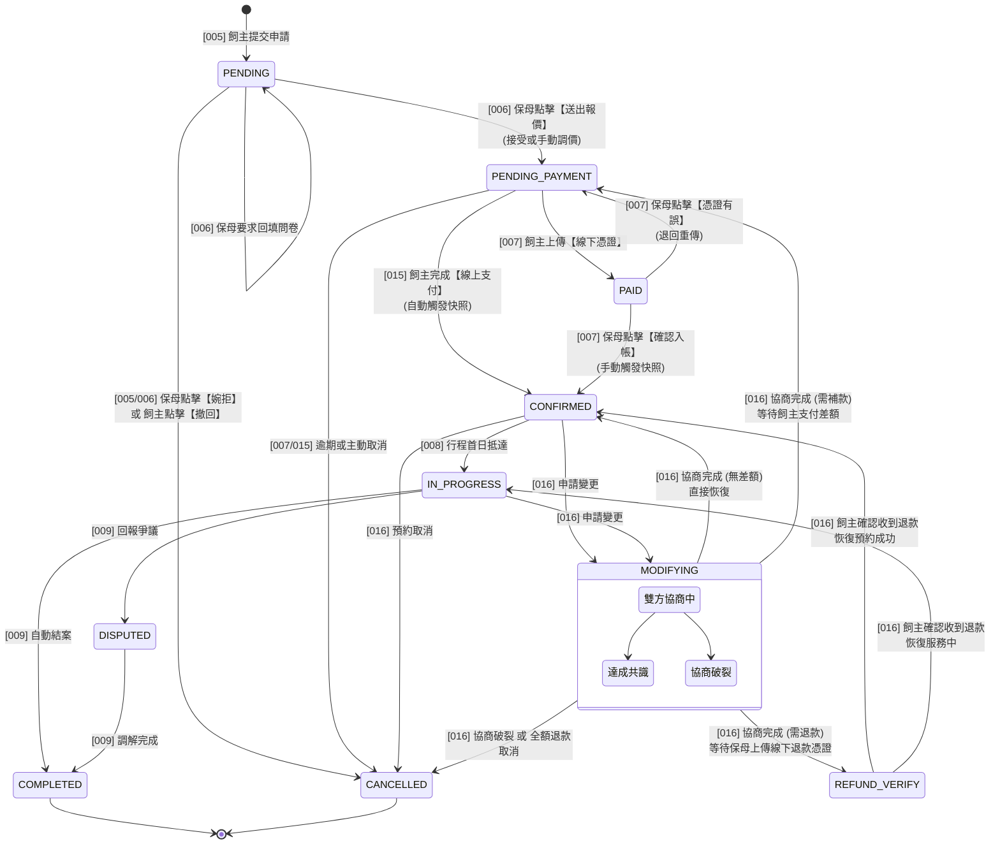

# 貓咪保母 PWA - SD 設計路徑與計畫

## 1. 設計戰略：核心向外擴散 (Heart-to-Shell)
為了極小化架構重工風險，本專案的系統設計 (SD) 並非按照 PRD 編號順序進行，而是優先攻克具備「高併發鎖定」、「複雜狀態機」與「多方資料匯聚」的核心模組。

### 為什麼先做 SD-005 (預約)？
- **資料匯聚點**：預約功能是飼主、毛孩、保母方案與檔期的交集。先定好「收據 (Order)」，才能精確定義「原料 (Master Data)」的規格。
- **風險早破**：Advisory Lock 與 Snapshot 機制是技術最難點，需優先驗證。

---

## 2. SD 執行順序與開發節奏 (Cadence)

為了平衡開發效率與架構穩定性，本專案採取雙軌制：

### 節奏一：核心引擎 - 連環設計 (Core Serial Design)
- **涵蓋模組**：`005` (預約)、`006` (報價)、`009` (結案)、`016` (變更/退款)。
- **執行方式**：
  1. **一口氣設計**：連續完成這四個模組的 SD 文件，鎖定狀態機。
  2. **合併測試案例**：編寫貫穿全生命週期的 TS。
  3. **整組開發**：代碼實作一氣呵成，確保核心邏輯無縫對接。

---

## 3. 核心設計準則：預約階段不可變性 (Booking Immutability)
為了確保檔期鎖定與金額計算的穩定性，本系統執行以下嚴格約束：
- **CONFIRMED 前 (預約中)**：
  - **禁止修改**：日期 (Dates)、方案 (Plan)、毛孩數量 (Pets)。
  - **僅允許調整**：報價金額 (Adjustment Amount) 與調整原因。
  - **變更路徑**：若飼主或保母欲修改日期/方案，必須執行 `CANCELLED` 後重新下單。
- **CONFIRMED 後 (合約成立)**：
  - 所有的變更必須進入 `MODIFYING` 狀態進行正式協商 (PRD-016)。
  - **支持雙向變更**：允許增加/減少天數或次數。
  - **補款機制**：若變更導致總額增加，訂單將回流至 `PENDING_PAYMENT` 等待支付差額。

---

## 4. 核心引擎狀態機 (Order Lifecycle State Machine)
本圖定義了訂單從「預約」到「結案/取消」的所有合法轉移路徑。所有的 SD 模組設計均必須符合此狀態轉移邏輯。

---

## 4. SD 執行進度清單

### [第一階段] 核心引擎設計 (連環實裝進行中)
- [x] **SD-005: 預約送單與併發控制** (✅ **Implemented**)
- [x] **SD-006: 報價審核與金額快照** (✅ **Implemented**)
- [/] **SD-000: 身分驗證與權限控管 (Auth)** (🏗️ **Current Priority** - 建立系統防護罩)
- [ ] **SD-009: 服務完成與帳務歸屬** (📅 Next Up)
- [ ] **SD-016: 異常中斷與退款邏輯**
- [x] **TS-Core: 訂單全生命週期測試案例 (已拆分為 TS-005, 006, 009, 016)**

### [第二階段] 支撐實體設計 (垂直切片)
- [ ] **SD-021: 保母飼主記事本與媒體庫**
- [ ] **SD-003: 服務方案管理**
- [ ] **SD-002: 毛孩資料管理**
- [ ] **SD-001: 帳號 Profile 與門禁設定**
...

### 第三階段：外圍與基礎設施 (The Shell)
7. **`SD-000` (Auth)**：身分驗證。
8. **`SD-015` (金流串接)**：支付細節。
9. **其他 PRD**...

---

## 3. 全域設計基準
在開始任何模組設計前，必須參考：
- [SD-GLOBAL-SPEC (技術憲法)](./SD-GLOBAL-SPEC.md)
- [SD-ERD (核心資料模型)](./SD-ERD.md)
