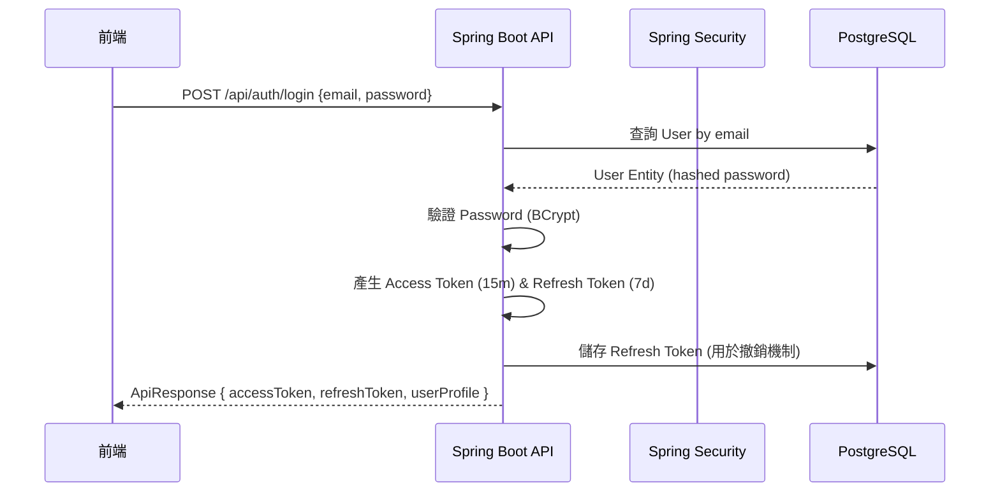
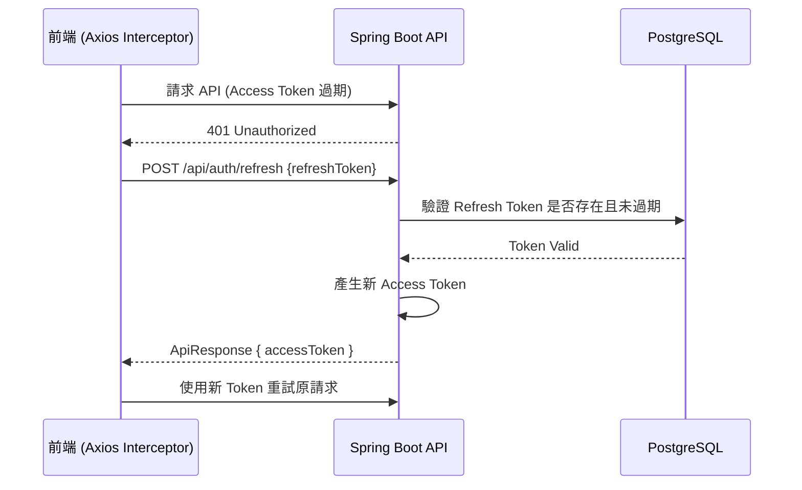
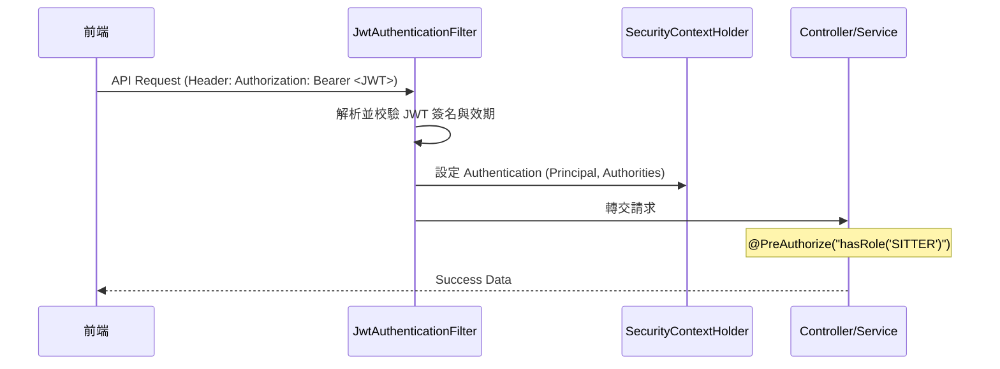
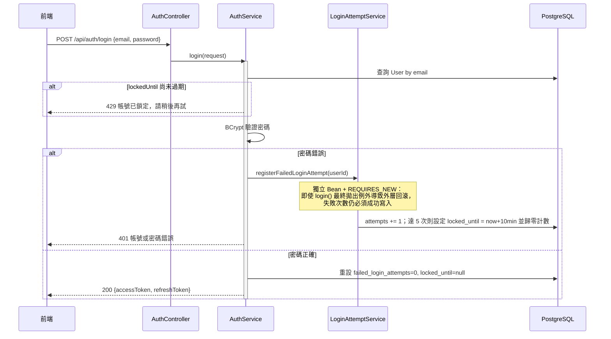
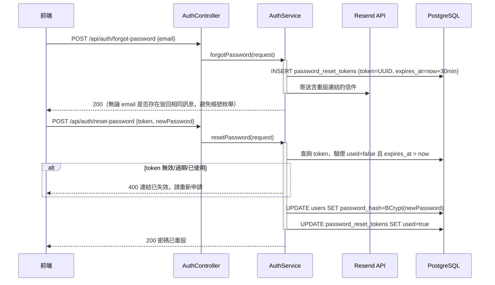

# SD-000: 身分驗證與權限控管 (Authentication & Authorization)

| 項目 | 內容 |
|------|------|
| 對應需求 | PRD-GLOBAL-SEC |
| 負責 SD | Antigravity |
| 建立日期 | 2026-05-11 |
| 狀態 | Draft |
| DB 表 | `users` |
| 相依共用設計 | [錯誤回應](shared/error-response.md), [RBAC 權限](shared/permission-rbac.md), [系統配置](shared/config-system.md) |

---

## 序列圖

### 1. 登入流程 (Authentication)


### 2. Token 刷新流程 (Token Refresh)


### 3. 授權請求流程 (Authorization Filter)


### 4. 登入失敗鎖定流程 (Account Lockout)

> [!IMPORTANT]
> `registerFailedLoginAttempt` 必須是**獨立 Spring Bean**（`LoginAttemptService`），不可寫成 `AuthService` 內的 self-invocation 私有方法——Spring AOP 無法攔截同類別內部呼叫，`@Transactional(propagation = REQUIRES_NEW)` 在 self-invocation 下會被靜默忽略，導致失敗次數計數隨著 `login()` 拋出的 `BadCredentialsException` 一併回滾，鎖定機制形同虛設。

### 5. 忘記密碼 / 重設密碼流程


---

## 資料模型變更

### 新增 / 修改 Table
```sql
-- 登入鎖定 (V20260718_01__add_login_lockout_fields.sql)
ALTER TABLE users ADD COLUMN failed_login_attempts INT NOT NULL DEFAULT 0;
ALTER TABLE users ADD COLUMN locked_until TIMESTAMPTZ;

-- 忘記密碼 (V20260718_02__add_password_reset_tokens.sql)
CREATE TABLE password_reset_tokens (
    id UUID PRIMARY KEY DEFAULT gen_random_uuid(),
    user_id UUID NOT NULL REFERENCES users(id),
    token VARCHAR(255) NOT NULL UNIQUE,
    expires_at TIMESTAMPTZ NOT NULL,
    used BOOLEAN NOT NULL DEFAULT FALSE,
    created_at TIMESTAMPTZ NOT NULL DEFAULT NOW()
);
```

### log_user_action — 操作日誌寫入規格
| 欄位 | 值 |
|------|----|
| `func_code` | `AUTH_LOGIN` / `AUTH_REGISTER` |
| `action_type` | `LOGIN` / `CREATE` |
| `action_result` | `SUCCESS` / `FAIL` |
| `target_id` | `user.id` |
| `target_table` | `users` |

---

## API 設計

| Method | Path | 說明 | 權限 |
|--------|------|------|-----------------|
| POST | /api/auth/login | 使用者登入取得雙 Token | `PermitAll` |
| POST | /api/auth/register | 新使用者註冊 | `PermitAll` |
| POST | /api/auth/refresh | 換發 Access Token | `PermitAll` (需帶有效 Refresh Token) |
| POST | /api/auth/forgot-password | 寄送密碼重設信 | `PermitAll` |
| POST | /api/auth/reset-password | 憑 token 重設密碼 | `PermitAll` |
| GET | /api/auth/me | 取得目前登入者資訊 | `Authenticated` |

### 錯誤代碼映射
- 登入失敗 (密碼錯誤/帳號不存在) → `DataMessageEnum.MSG_AUTH_F01` (401)
- Token 過期或無效 → `DataMessageEnum.MSG_AUTH_F02` (401)
- 權限不足 → `DataMessageEnum.MSG_AUTH_F03` (403)
- 帳號已鎖定 (5 次失敗，鎖定 10 分鐘) → `429 Too Many Requests`

> [!NOTE]
> 帳號鎖定刻意回傳 **429**、而非 401——本專案前端 axios 攔截器對所有 401 回應會自動觸發 refresh-token 靜默重試（見 [SD-FRONTEND-SPEC](SD-FRONTEND-SPEC.md)）。若鎖定情境也回 401，會被前端誤判為 token 過期而重試，掩蓋掉「帳號被鎖定」的真實錯誤訊息。同一理由也適用於其他「已登入但業務邏輯拒絕」的情境（例如 SD-009 的管理員二次驗證錯誤，改用 403）。401 僅保留給真正的 session 過期。

---

## 權限設計 (RBAC Matrix)

| 角色 | 權限範例 | 說明 |
|------|---------|---------|
| `ROLE_OWNER` | `OWNER_BOOKING_CREATE` | 僅能管理自己的預約單 |
| `ROLE_SITTER` | `SITTER_ORDER_CONFIRM` | 僅能處理指派給自己的訂單 |
| `ROLE_ADMIN` | `ADMIN_SYSTEM_MGT` | 系統最高權限，可管理所有用戶與訂單 |

---

## 備註

- **密碼安全性**：必須使用 `BCryptPasswordEncoder` 進行加密儲存。
- **JWT 配置**：
  - `Header`: `{"alg": "HS512", "typ": "JWT"}`
  - `Payload`: `sub` (userId), `email`, `role`, `iat`, `exp`
  - `AccessToken`: 效期 15 分鐘。
  - `RefreshToken`: 效期 7 天，儲存於資料庫（表：`refresh_tokens`）以支援多設備登入管理與緊急撤銷。
- **Security 核心配置 (Spring Security 7+ 規範)**：
  - **Stateless**: 必須設定 `SessionCreationPolicy.STATELESS`。
  - **CSRF**: 必須關閉 `.csrf(AbstractHttpConfigurer::disable)`。
  - **CORS**: 必須啟用 `.cors(Customizer.withDefaults())`。
  - **OPTIONS**: 必須放行 `HttpMethod.OPTIONS` 預檢請求。
- **Security Context 獲取方式**：
  - 推薦使用 `@AuthenticationPrincipal` 註解直接注入 `UserDetails` 或自定義 `UserContext` 物件。
  - 嚴禁在 Service 層手動解析 Header 字串。
- **登入鎖定參數**：`MAX_FAILED_LOGIN_ATTEMPTS = 5`，`LOCKOUT_MINUTES = 10`（`LoginAttemptService` 常數，非資料庫可調參數）。
- **密碼重設 Token**：效期 30 分鐘、一次性使用 (`used` 欄位)，寄信與重設分屬兩支獨立 API，`forgot-password` 無論 email 是否存在都回傳相同成功訊息，避免帳號枚舉攻擊。
- **Email 發送**：透過 Resend API（`java.net.http.HttpClient` 直接呼叫，未新增 Maven 依賴），API Key 存於 GCP Secret Manager (`resend-api`)，經 `--set-secrets` 帶入 Cloud Run 環境變數；Cloud Run 服務帳號需具備 `roles/secretmanager.secretAccessor`。`RESEND_API_KEY` 為空時降級為記錄 log、不寄信，不阻斷主流程。
