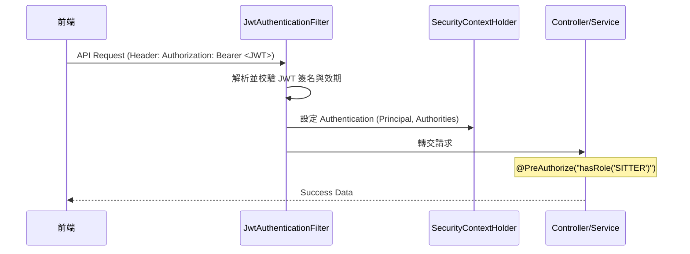

# SD-000: 身分驗證與權限控管 (Authentication & Authorization)

| 項目 | 內容 |
|------|------|
| 對應需求 | PRD-GLOBAL-SEC |
| 負責 SD | Antigravity |
| 建立日期 | 2026-05-11 |
| 狀態 | Draft |
| DB 表 | `users` |
| 相依共用設計 | [錯誤回應](shared/error-response.md), [RBAC 權限](shared/permission-rbac.md), [系統配置](shared/config-system.md) |

---

## 序列圖

### 1. 登入流程 (Authentication)
```mermaid
sequenceDiagram
    participant FE as 前端
    participant BE as Spring Boot API
    participant Sec as Spring Security
    participant DB as PostgreSQL

    FE->>BE: POST /api/auth/login {email, password}
    BE->>DB: 查詢 User by email
    DB-->>BE: User Entity (hashed password)
    BE->>BE: 驗證 Password (BCrypt)
    BE->>BE: 產生 Access Token (15m) & Refresh Token (7d)
    BE->>DB: 儲存 Refresh Token (用於撤銷機制)
    BE-->>FE: ApiResponse { accessToken, refreshToken, userProfile }

### 2. Token 刷新流程 (Token Refresh)
```mermaid
sequenceDiagram
    participant FE as 前端 (Axios Interceptor)
    participant BE as Spring Boot API
    participant DB as PostgreSQL

    FE->>BE: 請求 API (Access Token 過期)
    BE-->>FE: 401 Unauthorized
    FE->>BE: POST /api/auth/refresh {refreshToken}
    BE->>DB: 驗證 Refresh Token 是否存在且未過期
    DB-->>BE: Token Valid
    BE->>BE: 產生新 Access Token
    BE-->>FE: ApiResponse { accessToken }
    FE->>BE: 使用新 Token 重試原請求
```

### 3. 授權請求流程 (Authorization Filter)


---

## 資料模型變更

### 新增 / 修改 Table
本模組主要利用現有的 `users` 表。密鑰與過期時間等參數將定義於 `application.yml`。

### log_user_action — 操作日誌寫入規格
| 欄位 | 值 |
|------|----|
| `func_code` | `AUTH_LOGIN` / `AUTH_REGISTER` |
| `action_type` | `LOGIN` / `CREATE` |
| `action_result` | `SUCCESS` / `FAIL` |
| `target_id` | `user.id` |
| `target_table` | `users` |

---

## API 設計

| Method | Path | 說明 | 權限 |
|--------|------|------|-----------------|
| POST | /api/auth/login | 使用者登入取得雙 Token | `PermitAll` |
| POST | /api/auth/register | 新使用者註冊 | `PermitAll` |
| POST | /api/auth/refresh | 換發 Access Token | `PermitAll` (需帶有效 Refresh Token) |
| GET | /api/auth/me | 取得目前登入者資訊 | `Authenticated` |

### 錯誤代碼映射
- 登入失敗 (密碼錯誤/帳號不存在) → `DataMessageEnum.MSG_AUTH_F01` (401)
- Token 過期或無效 → `DataMessageEnum.MSG_AUTH_F02` (401)
- 權限不足 → `DataMessageEnum.MSG_AUTH_F03` (403)

---

## 權限設計 (RBAC Matrix)

| 角色 | 權限範例 | 說明 |
|------|---------|---------|
| `ROLE_OWNER` | `OWNER_BOOKING_CREATE` | 僅能管理自己的預約單 |
| `ROLE_SITTER` | `SITTER_ORDER_CONFIRM` | 僅能處理指派給自己的訂單 |
| `ROLE_ADMIN` | `ADMIN_SYSTEM_MGT` | 系統最高權限，可管理所有用戶與訂單 |

---

## 備註

- **密碼安全性**：必須使用 `BCryptPasswordEncoder` 進行加密儲存。
- **JWT 配置**：
  - `Header`: `{"alg": "HS512", "typ": "JWT"}`
  - `Payload`: `sub` (userId), `email`, `role`, `iat`, `exp`
  - `AccessToken`: 效期 15 分鐘。
  - `RefreshToken`: 效期 7 天，儲存於資料庫（表：`refresh_tokens`）以支援多設備登入管理與緊急撤銷。
- **Security 核心配置 (Spring Security 7+ 規範)**：
  - **Stateless**: 必須設定 `SessionCreationPolicy.STATELESS`。
  - **CSRF**: 必須關閉 `.csrf(AbstractHttpConfigurer::disable)`。
  - **CORS**: 必須啟用 `.cors(Customizer.withDefaults())`。
  - **OPTIONS**: 必須放行 `HttpMethod.OPTIONS` 預檢請求。
- **Security Context 獲取方式**：
  - 推薦使用 `@AuthenticationPrincipal` 註解直接注入 `UserDetails` 或自定義 `UserContext` 物件。
  - 嚴禁在 Service 層手動解析 Header 字串。
