# SD-000: 身分驗證與權限控管 (Authentication & Authorization)

| 項目 | 內容 |
|------|------|
| 對應需求 | PRD-GLOBAL-SEC |
| 負責 SD | Antigravity |
| 建立日期 | 2026-05-11 |
| 狀態 | Draft |
| DB 表 | `users` |
| 相依共用設計 | [錯誤回應](shared/error-response.md), [RBAC 權限](shared/permission-rbac.md), [系統配置](shared/config-system.md) |

---

## 序列圖

### 1. 登入流程 (Authentication)
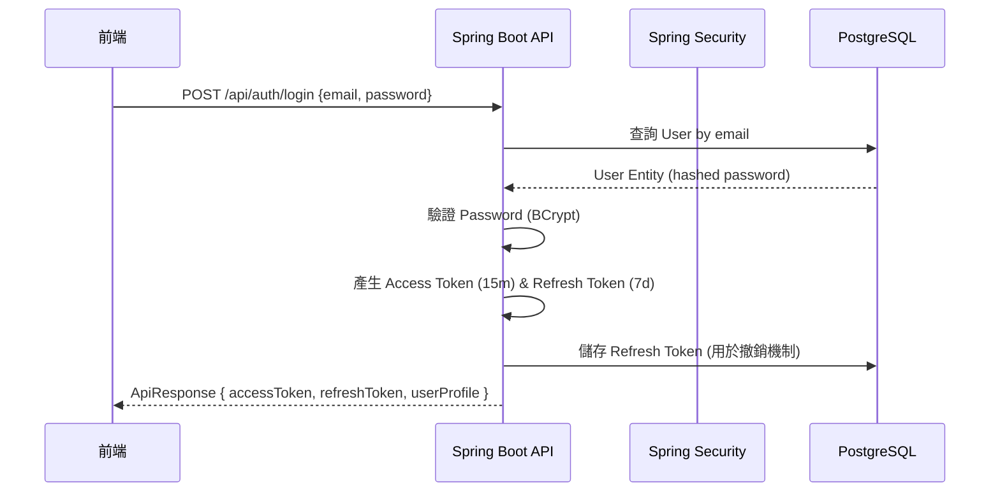

### 2. Token 刷新流程 (Token Refresh)
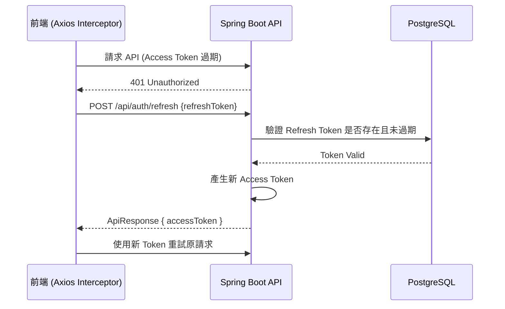

### 3. 授權請求流程 (Authorization Filter)
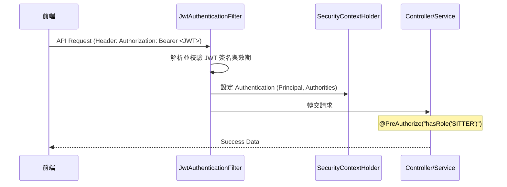

### 4. 登入失敗鎖定流程 (Account Lockout)
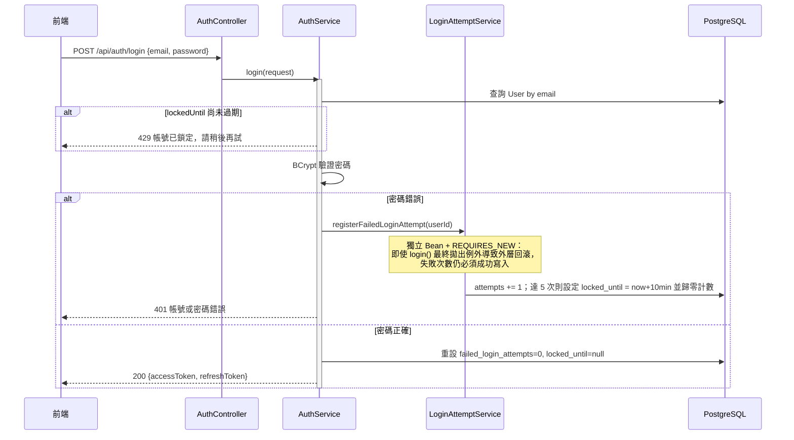
> [!IMPORTANT]
> `registerFailedLoginAttempt` 必須是**獨立 Spring Bean**（`LoginAttemptService`），不可寫成 `AuthService` 內的 self-invocation 私有方法——Spring AOP 無法攔截同類別內部呼叫，`@Transactional(propagation = REQUIRES_NEW)` 在 self-invocation 下會被靜默忽略，導致失敗次數計數隨著 `login()` 拋出的 `BadCredentialsException` 一併回滾，鎖定機制形同虛設。

### 5. 忘記密碼 / 重設密碼流程
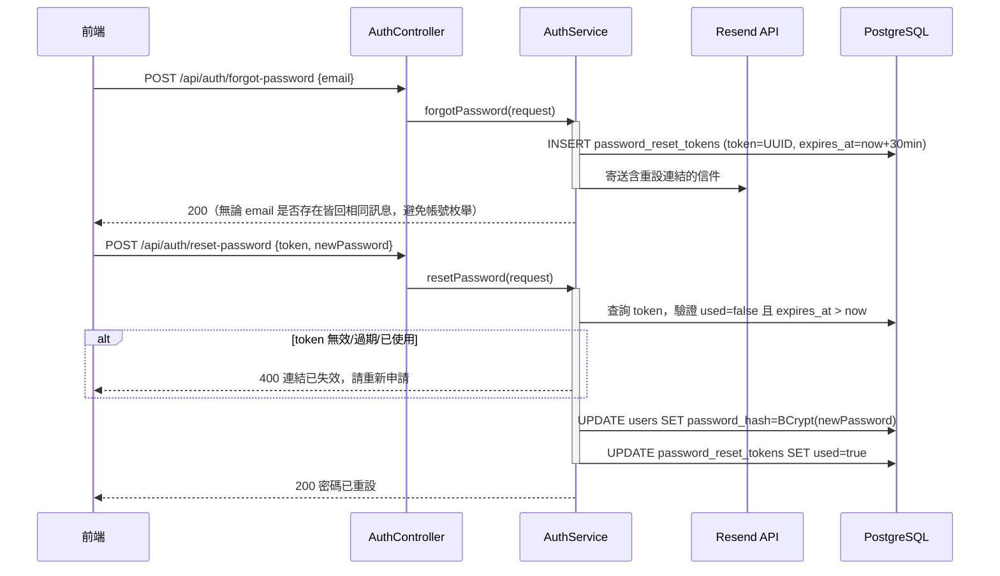

### 6. Email OTP 註冊驗證流程 (PRD-000 AC-1)
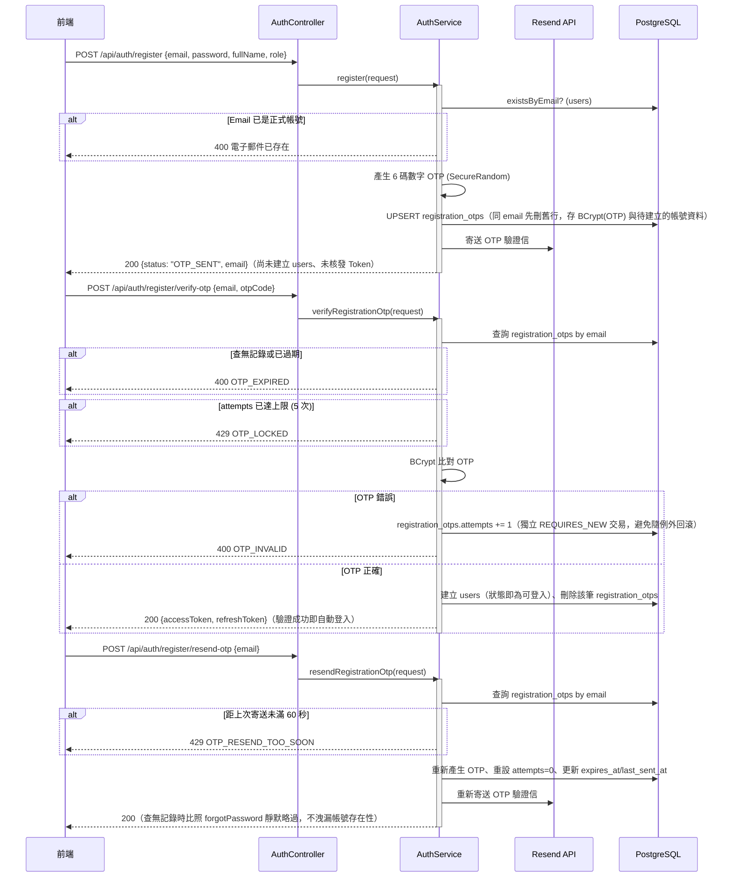
> [!IMPORTANT]
> `registration_otps.attempts` 的累加必須透過獨立 Bean `RegistrationOtpAttemptService` 以 `@Transactional(propagation = REQUIRES_NEW)` 執行——原因與 `LoginAttemptService` 相同：`verifyRegistrationOtp()` 驗證失敗時最終會拋出 `RegistrationException`，若寫入跟該方法共用同一筆交易，錯誤次數會隨例外一起被 rollback，導致鎖定機制永遠不會生效。

### 7. 帳號註銷流程 (PRD-000 AC-8)
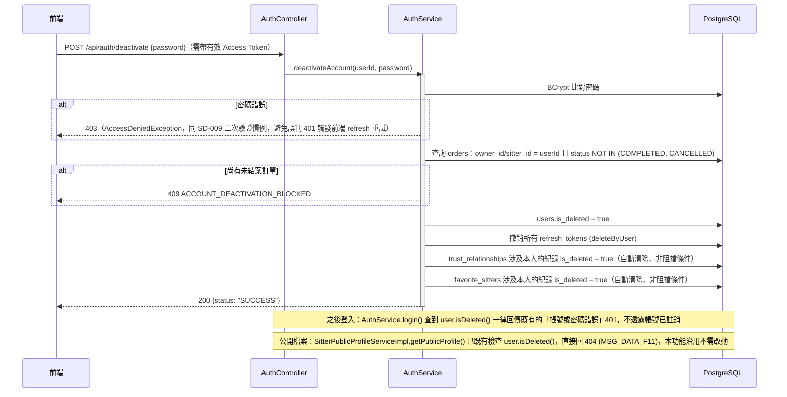
> [!NOTE]
> 「未結案訂單」定義：`Order.status` 除 `COMPLETED`、`CANCELLED` 兩個終態外，其餘（`PENDING`/`PENDING_PAYMENT`/`PAID`/`CONFIRMED`/`MODIFYING`/`REFUND_VERIFY`/`IN_PROGRESS`/`DISPUTED`）一律視為未結案，飼主與保母角色（`owner_id`/`sitter_id`）共用同一套判斷。
>
> **已知限制（本輪不做）**：PRD-000 提及「已註銷帳號 Email 30 天冷卻期後可重新註冊」。`users.email` 為 DB 硬 UNIQUE 約束，要支援冷卻後複用需額外機制（如背景 Job 改名/清空已註銷帳號 email），現況為**已註銷帳號的 Email 永久佔用、不可重新註冊**（比規格更嚴格，不影響資料安全），待有需要再實作自動化解鎖。

### 8. Google 第三方登入流程 (PRD-000 AC-5)
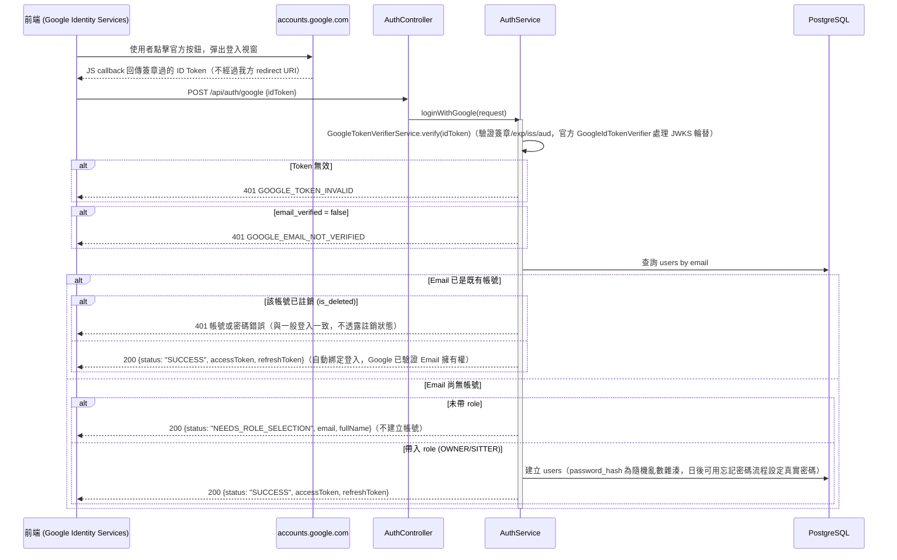
> [!NOTE]
> **技術選型**：採 Google Identity Services (GIS) 前端按鈕 + 後端驗證 ID Token，而非傳統「整頁跳轉到 Google 再導回來」的 Authorization Code 流程。因此**不需要設定 Authorized redirect URI**，後端**完全不使用 Client Secret**（驗證 ID Token 只需 Client ID 比對 `aud`），大幅降低實作與維運複雜度。
>
> **Client ID 為何直接寫入版控預設值**：Client ID 設計上就是公開值（本來就要嵌入前端 JS），且本專案僅建立一個 OAuth Client、其「已授權 JavaScript 來源」同時涵蓋本地開發與正式網域，因此本地/正式共用同一組 Client ID，`.github/workflows/deploy.yml` 不需要另外注入 `GOOGLE_CLIENT_ID` 覆寫。
>
> **不建立 `google_id` 欄位**：綁定邏輯純粹以 Email 比對（Google 已驗證 Email 擁有權，等同一般密碼註冊流程對 Email 的信任程度），不需要在 `users` 表新增儲存 Google 帳號 ID 的欄位。

### 9. 登出所有裝置流程 (PRD-000 業務規則)
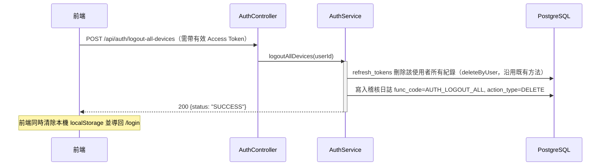
> [!NOTE]
> **已知限制**：`AuthService.createRefreshToken()` 與 `switchRole()` 在建立新 refresh token 前都會先 `deleteByUser`，代表現況架構下**同一帳號同時只保留一組 refresh token**，並非真正支援 PRD-000 業務規則提到的「多裝置同時在線」。因此本功能實質上等同「登出目前這組 session」，而非「找出並逐一撤銷多台裝置的 session」。若日後要精確符合 PRD 文字，需將 `refresh_tokens` 改為一人多筆並移除 login/register/google-login/switch-role 共用的 `deleteByUser` 清空行為，屬於更大範圍的架構改動，非本輪範圍。

### 10. 生物辨識登入流程 (WebAuthn, PRD-000 AC-6)

**技術選型**：採用 `com.yubico:webauthn-server-core`（Yubico 官方 FIDO2/WebAuthn 函式庫，處理 COSE/CBOR 解析、attestation/assertion 簽章驗證與 sign count 防重放），延續本專案「第三方憑證驗證一律用官方函式庫」慣例（同 `GoogleIdTokenVerifier` 的選型理由）。不採用 Spring Security 6.4+ 的實驗性 WebAuthn 模組，因為該模組預設走 session-based 登入後行為，跟本專案既有的 stateless JWT 簽發流程（`AuthService.createAuthResponse`）整合較繞；直接呼叫 Yubico 函式庫、登入成功後重用既有的 `createAuthResponse(user)` 簽發我方 JWT 較單純可控。不限制每人只能綁一組憑證——WebAuthn 憑證本質綁裝置，允許一人多筆（手機一組、筆電一組）。

後端無 HTTP session，`RelyingParty.startRegistration()`/`startAssertion()` 產生的 `PublicKeyCredentialCreationOptions`/`AssertionRequest` 需要在 `/options` 與 `/verify` 兩次呼叫之間暫存，做法比照 `registration_otps`/`password_reset_tokens`：存入 `webauthn_challenges`（5 分鐘效期，用完即刪），序列化用函式庫自帶的 `toJson()`/`fromJson()`（與回傳給前端用的 `toCredentialsCreateJson()`/`toCredentialsGetJson()` 是不同格式，見下方 API 表備註）。

**註冊流程**：
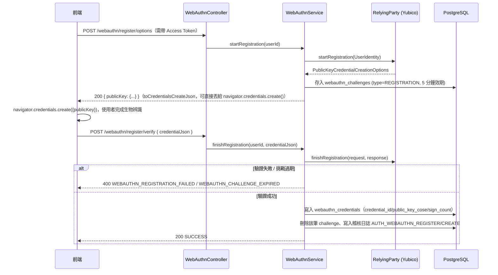

**登入流程**：
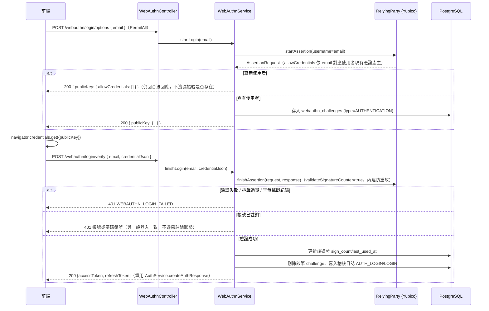
> [!NOTE]
> **帳號枚舉防禦**：`login/options` 對不存在的 Email 或沒有任何已註冊憑證的 Email，一律回傳合法但 `allowCredentials` 為空陣列的回應（200），不用 404/400 洩漏帳號是否存在或是否開了生物辨識——WebAuthn 規範建議的寫法，瀏覽器端會自然因找不到可用憑證而失敗，不需要後端刻意用狀態碼差異化。
>
> **前端相容性**：base64url ↔ ArrayBuffer 轉換刻意手刻，不依賴瀏覽器較新的 `PublicKeyCredential.parseCreationOptionsFromJSON()`/`toJSON()`（WebAuthn Level 3），因為 NFR-005 要求相容 Safari (iOS 15+)，這兩個 API 在舊版 Safari 尚未支援；未支援 WebAuthn 的裝置（`window.PublicKeyCredential === undefined`）前端直接隱藏相關按鈕，比照既有 Google 按鈕降級精神與 PRD-000 備註的既定原則。

### 資料模型變更（WebAuthn）
```sql
-- V20260723_02__create_webauthn_tables.sql
CREATE TABLE webauthn_credentials (
    id UUID PRIMARY KEY DEFAULT gen_random_uuid(),
    user_id UUID NOT NULL REFERENCES users(id),
    credential_id TEXT NOT NULL UNIQUE,
    public_key_cose TEXT NOT NULL,
    sign_count BIGINT NOT NULL DEFAULT 0,
    created_at TIMESTAMPTZ NOT NULL DEFAULT NOW(),
    last_used_at TIMESTAMPTZ
);

CREATE TABLE webauthn_challenges (
    id UUID PRIMARY KEY DEFAULT gen_random_uuid(),
    user_id UUID NOT NULL REFERENCES users(id),
    challenge_type VARCHAR(20) NOT NULL,  -- REGISTRATION / AUTHENTICATION
    request_json TEXT NOT NULL,
    expires_at TIMESTAMPTZ NOT NULL,
    created_at TIMESTAMPTZ NOT NULL DEFAULT NOW()
);
```
> [!IMPORTANT]
> `webauthn_challenges` 需要 `challenge_type` 欄位區分註冊挑戰與登入挑戰。原因：註冊需要已登入使用者（`TokenContext`），登入挑戰則是匿名使用者憑 email 查詢——若不分類型，同一使用者同時有一筆待完成的登入挑戰與註冊挑戰時，`findTopByUserIdOrderByCreatedAtDesc` 可能撈到錯誤那筆，導致 `PublicKeyCredentialCreationOptions.fromJson()` 去解析一個實際上是 `AssertionRequest` 的 JSON 而炸掉。
>
> `log_user_action.operator_id` 對 `users(id)` 有 FK 約束的踩雷同 SD-000 第 9 節「log_user_action」小節所述——`finishRegistration`/`finishLogin` 的目標使用者都是先前已 commit 的既有帳號，不是本交易內新建立的，因此可以安全使用既有 `REQUIRES_NEW` 版本的 `writeUserActionLog`，不需要 `writeUserActionLogInline`。

---

## 資料模型變更

### 新增 / 修改 Table
```sql
-- 登入鎖定 (V20260718_01__add_login_lockout_fields.sql)
ALTER TABLE users ADD COLUMN failed_login_attempts INT NOT NULL DEFAULT 0;
ALTER TABLE users ADD COLUMN locked_until TIMESTAMPTZ;

-- 忘記密碼 (V20260718_02__add_password_reset_tokens.sql)
CREATE TABLE password_reset_tokens (
    id UUID PRIMARY KEY DEFAULT gen_random_uuid(),
    user_id UUID NOT NULL REFERENCES users(id),
    token VARCHAR(255) NOT NULL UNIQUE,
    expires_at TIMESTAMPTZ NOT NULL,
    used BOOLEAN NOT NULL DEFAULT FALSE,
    created_at TIMESTAMPTZ NOT NULL DEFAULT NOW()
);

-- Email OTP 註冊驗證 (V20260723_01__create_registration_otps.sql)
-- 註冊當下 User 尚不存在，待建立的帳號資料（含已雜湊密碼）與 OTP 一併暫存於此表，
-- 驗證通過才正式寫入 users；email 設 UNIQUE，重複註冊會覆蓋舊的待驗證紀錄。
CREATE TABLE registration_otps (
    id UUID PRIMARY KEY DEFAULT gen_random_uuid(),
    email VARCHAR(255) NOT NULL UNIQUE,
    password_hash VARCHAR(255) NOT NULL,
    full_name VARCHAR(255) NOT NULL,
    role VARCHAR(20) NOT NULL,
    otp_hash VARCHAR(255) NOT NULL,
    attempts INT NOT NULL DEFAULT 0,
    expires_at TIMESTAMPTZ NOT NULL,
    last_sent_at TIMESTAMPTZ NOT NULL DEFAULT now(),
    created_at TIMESTAMPTZ NOT NULL DEFAULT now()
);
```

### log_user_action — 操作日誌寫入規格
透過 `AuditLogService`（寫入 `log_user_action` 表）記錄：

| 情境 | `func_code` | `action_type` | 寫入方式 | 現況 |
|------|------------|---------------|---------|------|
| OTP 驗證通過、正式建立帳號 (`verifyRegistrationOtp`) | `AUTH_REGISTER` | `CREATE` | `writeUserActionLogInline`（同交易） | ✅ 已串接 |
| Google 登入首次建立帳號 (`loginWithGoogle`) | `AUTH_REGISTER` | `CREATE` | `writeUserActionLogInline`（同交易） | ✅ 已串接 |
| 帳號註銷 (`deactivateAccount`) | `AUTH_DEACTIVATE` | `DELETE` | `writeUserActionLog`（獨立 `REQUIRES_NEW` 交易） | ✅ 已串接 |
| 一般帳密登入 (`login`) | `AUTH_LOGIN` | `LOGIN` | — | ⚠️ 尚未串接（既有缺口，待後續補上） |

> [!IMPORTANT]
> `log_user_action.operator_id` 對 `users(id)` 有 FK 約束。建立新帳號當下（OTP 驗證、Google 首次登入）若沿用既有的 `writeUserActionLog`（`REQUIRES_NEW`），會切到獨立交易/連線寫入稽核紀錄；此時外層交易的新使用者尚未 commit，在 `REQUIRES_NEW` 交易眼中該筆使用者還不存在，FK 檢查必定失敗（`DataIntegrityViolationException`）。因此這兩處改用 `writeUserActionLogInline`（不開新交易，與建立使用者的主體交易一起 commit/rollback）。帳號註銷因為目標使用者是先前已 commit 的既有帳號，沒有這個問題，維持 `REQUIRES_NEW`。

`target_id`/`target_table` 皆為觸發操作之 `user.id` / `users`。`action_result` 目前固定寫入 `SUCCESS`（`AuditLogService` 內部設計如此，失敗路徑不落地失敗紀錄，屬既有限制，非本次新增缺口）。

---

## API 設計

| Method | Path | 說明 | 權限 |
|--------|------|------|-----------------|
| POST | /api/auth/login | 使用者登入取得雙 Token | `PermitAll` |
| POST | /api/auth/register | 送出註冊表單，寄送 Email OTP（不立即建立帳號、不核發 Token） | `PermitAll` |
| POST | /api/auth/register/verify-otp | 驗證 OTP，通過後正式建立帳號並自動登入（取得雙 Token） | `PermitAll` |
| POST | /api/auth/register/resend-otp | 重新寄送註冊 OTP（60 秒冷卻） | `PermitAll` |
| POST | /api/auth/deactivate | 帳號註銷（軟刪除），需重新輸入密碼確認 | `Authenticated`（實際靠 JWT 解出 `TokenContext`，與 `switch-role` 相同模式） |
| POST | /api/auth/google | Google 第三方登入（既有 Email 自動綁定；新 Email 需帶 `role` 才建立帳號） | `PermitAll` |
| POST | /api/auth/logout-all-devices | 登出所有裝置（現況等同登出目前這組 session，見上方已知限制說明） | `Authenticated` |
| POST | /api/auth/webauthn/register/options | 產生生物辨識裝置註冊選項（回傳格式為 `toCredentialsCreateJson()`，可直接丟給 `navigator.credentials.create()`） | `Authenticated`（經 `TokenContext` 手動把關，同 `/deactivate`） |
| POST | /api/auth/webauthn/register/verify | 驗證註冊回應並寫入新憑證 | `Authenticated` |
| GET | /api/auth/webauthn/credentials | 查詢自己名下已註冊的生物辨識裝置清單 | `Authenticated` |
| DELETE | /api/auth/webauthn/credentials/{id} | 移除自己名下的一組生物辨識裝置（403 若嘗試刪他人的） | `Authenticated` |
| POST | /api/auth/webauthn/login/options | 依 email 產生登入斷言選項（查無使用者/無憑證仍回合法但空 `allowCredentials` 的回應） | `PermitAll` |
| POST | /api/auth/webauthn/login/verify | 驗證登入斷言，通過後核發 JWT | `PermitAll` |
| POST | /api/auth/refresh | 換發 Access Token | `PermitAll` (需帶有效 Refresh Token) |
| POST | /api/auth/forgot-password | 寄送密碼重設信 | `PermitAll` |
| POST | /api/auth/reset-password | 憑 token 重設密碼 | `PermitAll` |
| GET | /api/auth/me | 取得目前登入者資訊 | `Authenticated` |

### 錯誤代碼映射
> [!NOTE]
> 本模組**未使用**專案模板慣例的全域 `DataMessageEnum`（該 class 在本專案中不存在）。實際採用的是各領域自訂例外類別（`status`/`error`/`message` 三欄位，比照 `KycException` 慣例），由 `GlobalExceptionHandler` 逐一 `@ExceptionHandler` 映射為 HTTP 狀態碼；`error` 欄位即為下方列出的字串代碼，前端據此判斷分支邏輯（而非解析 message 文字）。

| 情境 | 例外類別 | `error` 代碼 | HTTP 狀態 |
|------|---------|-------------|-----------|
| 登入失敗 (密碼錯誤/帳號不存在/已註銷) | `BadCredentialsException` (Spring Security 內建) | — | 401 |
| Token 過期或無效 | `JwtException` 系列 | — | 401 |
| 權限不足 (RBAC) | `AccessDeniedException` (Spring Security 內建) | — | 403 |
| 帳號已鎖定 (5 次失敗，鎖定 10 分鐘) | `LockedException` | — | 429 |
| 敏感操作二次驗證密碼錯誤 (帳號註銷) | `AccessDeniedException` | — | 403 |
| 註銷時尚有未結案訂單 | `AccountDeactivationException` | `ACCOUNT_DEACTIVATION_BLOCKED` | 409 |
| OTP 錯誤 / 已過期 / 已達重試上限 / 重寄過快 | `RegistrationException` | `OTP_INVALID` / `OTP_EXPIRED` / `OTP_LOCKED` / `OTP_RESEND_TOO_SOON` | 400 / 400 / 429 / 429 |
| Google ID Token 驗證失敗 | `GoogleAuthException` | `GOOGLE_TOKEN_INVALID` | 401 |
| Google 帳號 Email 未驗證 | `GoogleAuthException` | `GOOGLE_EMAIL_NOT_VERIFIED` | 401 |
| 一般參數/業務規則錯誤 (如 Email 已存在) | `IllegalArgumentException` | `INVALID_PARAMETER` | 400 |

> [!NOTE]
> 帳號鎖定刻意回傳 **429**、而非 401——本專案前端 axios 攔截器對所有 401 回應會自動觸發 refresh-token 靜默重試（見 [SD-FRONTEND-SPEC](SD-FRONTEND-SPEC.md)）。若鎖定情境也回 401，會被前端誤判為 token 過期而重試，掩蓋掉「帳號被鎖定」的真實錯誤訊息。同一理由也適用於其他「已登入但業務邏輯拒絕」的情境（例如 SD-009 的管理員二次驗證錯誤，改用 403）。401 僅保留給真正的 session 過期。

---

## 權限設計 (RBAC Matrix)

| 角色 | 權限範例 | 說明 |
|------|---------|---------|
| `ROLE_OWNER` | `OWNER_BOOKING_CREATE` | 僅能管理自己的預約單 |
| `ROLE_SITTER` | `SITTER_ORDER_CONFIRM` | 僅能處理指派給自己的訂單 |
| `ROLE_ADMIN` | `ADMIN_SYSTEM_MGT` | 系統最高權限，可管理所有用戶與訂單 |

---

## 備註

- **密碼安全性**：必須使用 `BCryptPasswordEncoder` 進行加密儲存。
- **JWT 配置**：
  - `Header`: `{"alg": "HS512", "typ": "JWT"}`
  - `Payload`: `sub` (userId), `email`, `role`, `iat`, `exp`
  - `AccessToken`: 效期 15 分鐘。
  - `RefreshToken`: 效期 7 天，儲存於資料庫（表：`refresh_tokens`）以支援多設備登入管理與緊急撤銷。
- **Security 核心配置 (Spring Security 7+ 規範)**：
  - **Stateless**: 必須設定 `SessionCreationPolicy.STATELESS`。
  - **CSRF**: 必須關閉 `.csrf(AbstractHttpConfigurer::disable)`。
  - **CORS**: 必須啟用 `.cors(Customizer.withDefaults())`。
  - **OPTIONS**: 必須放行 `HttpMethod.OPTIONS` 預檢請求。
- **Security Context 獲取方式**：
  - 推薦使用 `@AuthenticationPrincipal` 註解直接注入 `UserDetails` 或自定義 `UserContext` 物件。
  - 嚴禁在 Service 層手動解析 Header 字串。
- **登入鎖定參數**：`MAX_FAILED_LOGIN_ATTEMPTS = 5`，`LOCKOUT_MINUTES = 10`（`LoginAttemptService` 常數，非資料庫可調參數）。
- **密碼重設 Token**：效期 30 分鐘、一次性使用 (`used` 欄位)，寄信與重設分屬兩支獨立 API，`forgot-password` 無論 email 是否存在都回傳相同成功訊息，避免帳號枚舉攻擊。
- **註冊 OTP 參數**：6 碼數字（`SecureRandom` 產生，雜湊後存入 DB，不留明文）；效期 10 分鐘；重寄冷卻 60 秒；同一筆最多允許 5 次錯誤嘗試，超過需重新寄送（`AuthService` 常數 `OTP_EXPIRY_MINUTES`/`OTP_RESEND_COOLDOWN_SECONDS`/`OTP_MAX_ATTEMPTS`，非資料庫可調參數）。
- **Email 發送**：透過 Resend API（`java.net.http.HttpClient` 直接呼叫，未新增 Maven 依賴），API Key 存於 GCP Secret Manager (`resend-api`)，經 `--set-secrets` 帶入 Cloud Run 環境變數；Cloud Run 服務帳號需具備 `roles/secretmanager.secretAccessor`。`RESEND_API_KEY` 為空時降級為記錄 log、不寄信，不阻斷主流程。
- **服務條款同意 (PRD-000 AC-2)**：純前端表單卡控，`RegisterPage.tsx` 送出按鈕在勾選「我已閱讀並同意《服務條款》與《隱私權政策》」前維持 disabled；後端不額外驗證（不影響資料安全，屬 UX 前置檢查，與現況無獨立條款頁面/版本記錄機制），待日後有正式條款頁面時再補齊版本追蹤需求。
