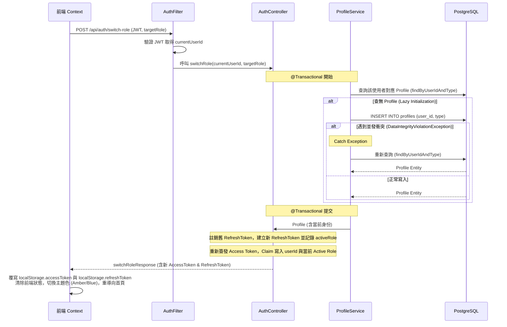
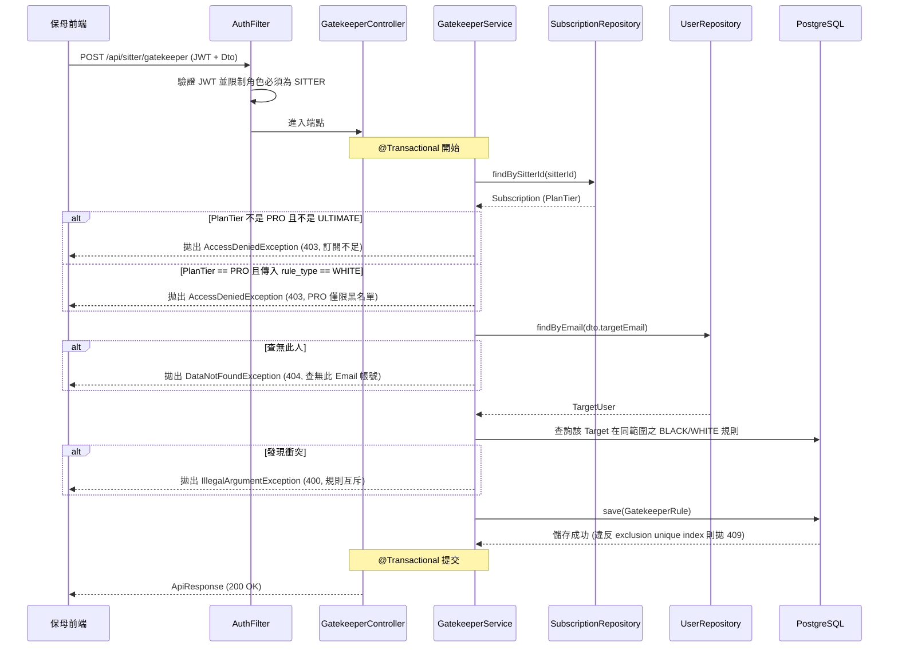
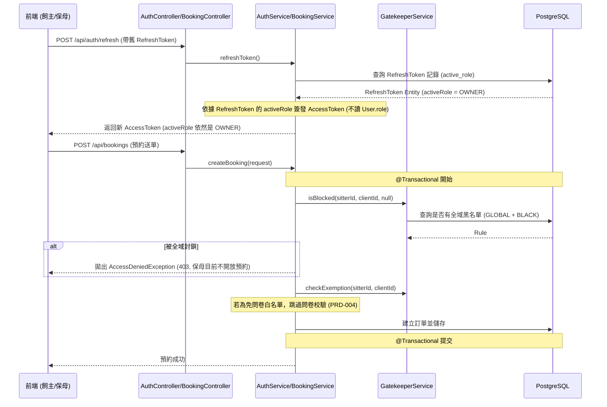

# SD-001: 角色切換與檔案管理 (含預約門禁) 設計文件

| 項目 | 內容 |
|------|------|
| 對應需求 | PRD-001 |
| 負責 SD | Antigravity (AI) |
| 建立日期 | 2026-05-27 |
| 狀態 | Approved |
| DB 表 | `profiles`, `gatekeeper_rules`, `users`, `subscriptions`, `refresh_tokens`, `log_user_action` |
| 相依共用設計 | [錯誤回應](shared/error-response.md), [RBAC 權限](shared/permission-rbac.md), [多租戶稽核](shared/audit-tenancy.md), [系統配置](shared/config-system.md) |

---

## 技術設計決策 (Design Decisions)

### 1. TokenContext 永遠回傳 Dummy UUID 與 JWT claims 修正 (CRITICAL)
- **問題背景**：`TokenContext.getUserId()` 依賴 `ThreadLocal` 獲取當前登入者 ID，但由於 `JwtAuthenticationFilter` 未執行 `TokenContext.setUserId()`，導致生產環境中 ID 恆為 zero-UUID (`00000000-0000-0000-0000-000000000000`)。這會造成資料庫 FK 錯誤，以及所有防 IDOR 和多租戶防線全面失效。
- **技術防禦**：
  - **JWT Claims 擴充**：於 `AuthService.createAuthResponse()` 簽發 token 時，在 extra claims 中塞入 `userId` (即 `user.getId().toString()`)。
  - **Filter 截收與執行期綁定**：在 `JwtAuthenticationFilter.doFilterInternal()` 驗證 JWT 並解析 claims 時，從 claims 取出 `userId`，呼叫 `TokenContext.setUserId(UUID.fromString(userId))`。
  - **ThreadLocal 洩漏防禦**：在 `filterChain.doFilter(request, response)` 執行完成後，於 `finally` 區塊強制呼叫 `TokenContext.clear()`，杜絕 ThreadLocal 髒資料污染與潛在記憶體洩漏。
- **Known Deviation**：為避免影響範圍過大，JWT `subject` 仍維持使用 `email`，暫不重構為 `accountId`。此偏離已於 `SD-GLOBAL-SPEC` 補強備註。

### 2. Switch-Role 角色回退與 Refresh Token 角色維持防線 (CRITICAL)
- **問題背景**：原設計在 `POST /api/auth/switch-role` 時僅回傳 `accessToken`。當 access token (15分鐘) 過期前端打 `/refresh` 時，`AuthService.refreshToken()` 會直接讀取 DB 欄位 `User.getRole()` 重新簽發 token，導致使用者無感地被「強制回退到原 DB role」。
- **技術防禦**：
  - **Token 完整回傳**：`/api/auth/switch-role` 接口被修正為返回完整 `AuthResponse`（含新的 access + refresh token）。每次切換時，舊的 refresh token 會被強制註銷 (revoke)，並建立全新的一筆。
  - **Refresh Token 角色狀態化**：在 `refresh_tokens` 表中加入 `active_role` 欄位。當 switch-role 發生時，將切換後的核心角色寫入該 refresh token 的 `active_role` 中。
  - **Refresh 邏輯重構**：重構 `AuthService.refreshToken()` 邏輯。簽發新的 access token 時，其 role 欄位**不再**讀取 DB `User.getRole()`，而是從 `RefreshToken.getActiveRole()` 讀取，確保角色狀態跨 Token 週期性存續。

### 3. 角色切換與 Lazy Initialization 的並發安全
- **問題背景**：並發切換角色時，`check-then-act` 條件競爭可能在 DB 內產生兩筆重複的 Profile。
- **技術防禦**：
  - **DB 唯一索引**：在 `profiles` 表加上唯一索引 `UNIQUE (user_id, type)`。
  - **應用級補償**：後端在 `switch-role` 事務中，若因並發插入觸發 `DataIntegrityViolationException`，會主動 catch 該例外，並退回執行 `findByUserIdAndType` 重新查出已建立的 Profile，完成冪等處理。

### 4. 門禁規則 (Gatekeeper) 的黑白名單互斥與 DB Constraint 確保
- **DB 級排除 (Partial Unique Index)**：建立局部唯一索引，排除 `BLACK` 與 `WHITE` 同時並存的可能，但不限制 `NO_QUESTIONNAIRE`：
  - 全域排除：`CREATE UNIQUE INDEX uidx_gatekeeper_global_excl ON gatekeeper_rules(sitter_id, target_user_id) WHERE scope_type = 'GLOBAL' AND rule_type IN ('BLACK', 'WHITE');`
  - 方案排除：`CREATE UNIQUE INDEX uidx_gatekeeper_plan_excl ON gatekeeper_rules(sitter_id, plan_id, target_user_id) WHERE scope_type = 'PLAN' AND rule_type IN ('BLACK', 'WHITE');`
- **CHECK constraint 防漏防護**：因為 PostgreSQL unique 索引遇到 NULL 欄位會跳過重複性檢核，在 DB 加上 CHECK 約束防止 `scope_type = 'PLAN'` 時 `plan_id` 為 NULL 導致互斥索引失效：
  ```sql
  CONSTRAINT chk_plan_scope CHECK (scope_type != 'PLAN' OR plan_id IS NOT NULL)
  ```

### 5. 敏感信用指標 (Trust Score) 隱私防守
- **規格背景**：保母 Profile 內含 `trust_score` (初始值 100)，供管理後台監控，屬高度敏感資料。
- **防禦設計**：
  - 本 SD 不提供 Profile CRUD API（歸屬 `PRD-018`）。
  - 對外的 DTO（如 `SitterProfileDto`）完全**不宣告** `trustScore` 屬性，且 JWT token claims 內亦不攜帶此值，杜絕前台資料外洩風險。

### 6. 方案到期與降級失效 (Subscription Gating)
- 前台載入方案列表 (GET `/api/sitters/{sitterId}/plans`) 與送單預約 (POST `/api/bookings`) 時，後端將即時關聯 `Subscription`：
  - 若保母訂閱過期 (`expiredAt` < NOW()) 或訂閱等級為 `FREE`/`BASIC`，則在記憶體過濾階段**直接跳過** Gatekeeper 門禁過濾邏輯（即規則標記為失效，全部放行）。

---

## 序列圖

### 1. 角色切換與 Lazy Initialization (Switch Role)



### 2. 預約門禁設定 (Gatekeeper Rule CRUD)



### 3. 預約送單與 token refresh 防線 (Refresh & Booking Gating)



---

## 資料模型變更

### 1. 新增 Table 與 唯一索引 (Flyway Migration)

建立 `V20260527_01__create_profiles_and_gatekeeper.sql`：

```sql
-- 建立 Profile 檔案側表
CREATE TABLE profiles (
    id          UUID PRIMARY KEY DEFAULT gen_random_uuid(),
    user_id     UUID NOT NULL REFERENCES users(id),
    type        VARCHAR(50) NOT NULL, -- SITTER, CLIENT
    trust_score INT NOT NULL DEFAULT 100, -- 信用指標
    kyc_status  VARCHAR(50) NOT NULL DEFAULT 'PENDING',
    created_at  TIMESTAMPTZ NOT NULL DEFAULT NOW(),
    updated_at  TIMESTAMPTZ NOT NULL DEFAULT NOW()
);

-- 防止 lazy initialization 競爭衝突
CREATE UNIQUE INDEX uidx_profiles_user_type ON profiles(user_id, type);

-- 建立預約門禁規則表
CREATE TABLE gatekeeper_rules (
    id              UUID PRIMARY KEY DEFAULT gen_random_uuid(),
    sitter_id       UUID NOT NULL REFERENCES users(id),
    rule_type       VARCHAR(50) NOT NULL, -- BLACK, WHITE, NO_QUESTIONNAIRE
    scope_type      VARCHAR(50) NOT NULL, -- GLOBAL, PLAN
    plan_id         UUID REFERENCES service_plans(id),
    target_user_id  UUID NOT NULL REFERENCES users(id),
    created_at      TIMESTAMPTZ NOT NULL DEFAULT NOW(),
    CONSTRAINT chk_plan_scope CHECK (scope_type != 'PLAN' OR plan_id IS NOT NULL)
);

-- 門禁互斥局部唯一索引
-- 1. 全域黑白單互斥
CREATE UNIQUE INDEX uidx_gatekeeper_global_excl ON gatekeeper_rules(sitter_id, target_user_id) 
WHERE scope_type = 'GLOBAL' AND rule_type IN ('BLACK', 'WHITE');

-- 2. 方案黑白單互斥
CREATE UNIQUE INDEX uidx_gatekeeper_plan_excl ON gatekeeper_rules(sitter_id, plan_id, target_user_id) 
WHERE scope_type = 'PLAN' AND rule_type IN ('BLACK', 'WHITE');

-- 3. 重複規則防呆 (GLOBAL & PLAN)
CREATE UNIQUE INDEX uidx_gatekeeper_global_duplicate ON gatekeeper_rules(sitter_id, rule_type, target_user_id)
WHERE scope_type = 'GLOBAL';

CREATE UNIQUE INDEX uidx_gatekeeper_plan_duplicate ON gatekeeper_rules(sitter_id, rule_type, plan_id, target_user_id)
WHERE scope_type = 'PLAN';

-- 4. 優化檢索索引
CREATE INDEX idx_gatekeeper_sitter ON gatekeeper_rules(sitter_id);

-- 5. 補充建立 log_user_action 表 (對齊多租戶稽核規範)
CREATE TABLE log_user_action (
    id           UUID PRIMARY KEY DEFAULT gen_random_uuid(),
    func_code    VARCHAR(100) NOT NULL,
    action_type  VARCHAR(50) NOT NULL,
    action_result VARCHAR(50) NOT NULL DEFAULT 'SUCCESS',
    operator_id  UUID REFERENCES users(id),
    target_id    UUID,
    target_table VARCHAR(100),
    created_at   TIMESTAMPTZ NOT NULL DEFAULT NOW()
);

-- 6. 擴充 refresh_tokens 表，儲存 active_role 角色狀態
ALTER TABLE refresh_tokens ADD COLUMN active_role VARCHAR(50);
```

### 2. log_user_action — 操作日誌稽核規格

每次寫入操作成功後，Service 層需寫入操作日誌：

| 功能項目 | `func_code` | `action_type` | `target_table` |
|--------|-------------|---------------|----------------|
| 角色切換 Profile 建立 | `SYS_SWITCH_ROLE` | `CREATE` | `profiles` |
| 新增門禁規則 | `SITTER_GATEKEEPER_MGT` | `CREATE` | `gatekeeper_rules` |
| 刪除門禁規則 | `SITTER_GATEKEEPER_MGT` | `DELETE` | `gatekeeper_rules` |

---

## API 設計

### 1. 角色切換
`POST /api/auth/switch-role`
- **Request Body**
```json
{
  "targetRole": "SITTER" // SITTER, OWNER
}
```
- **Response**
```json
{
  "code": 200,
  "message": "OK",
  "data": {
    "accessToken": "new_jwt_token_with_role_claim",
    "refreshToken": "new_refresh_token_with_active_role"
  }
}
```

### 2. 門禁規則 CRUD
| Method | Path | 說明 | 權限 |
|--------|------|------|-----|
| GET | `/api/sitter/gatekeeper` | 取得當前保母的門禁設定列表 | Sitter |
| POST | `/api/sitter/gatekeeper` | 新增門禁規則 | Sitter |
| DELETE | `/api/sitter/gatekeeper/{ruleId}` | 刪除門禁規則 | Sitter |

---

## 權限與訂閱鎖定設計 (SaaS Gating)

| Sitter Subscription | 門禁管理權限 | 容許規則 |
|--------------------|-------------|---------|
| `FREE`, `BASIC` | ❌ 禁用 (前端隱藏，後端 403) | 無 |
| `PRO` | 展開設定 (僅限黑名單) | `BLACK` |
| `ULTIMATE` | 展開設定 (無限制) | `BLACK`, `WHITE`, `NO_QUESTIONNAIRE` |

---

## UX 設計

- **切換角色 UI**：點擊切換時，前端全域套用 `data-theme`（`sitter` = Amber，`client` = Blue）。
- **名單輸入 Email 格式校驗**：前端欄位輸入時需有正則表達式防呆。
- **門禁衝突 Toast**：當後端拋出互斥限制 (400) 或查無帳號 (404) 時，頁面阻擋並展示對應 Toast。
