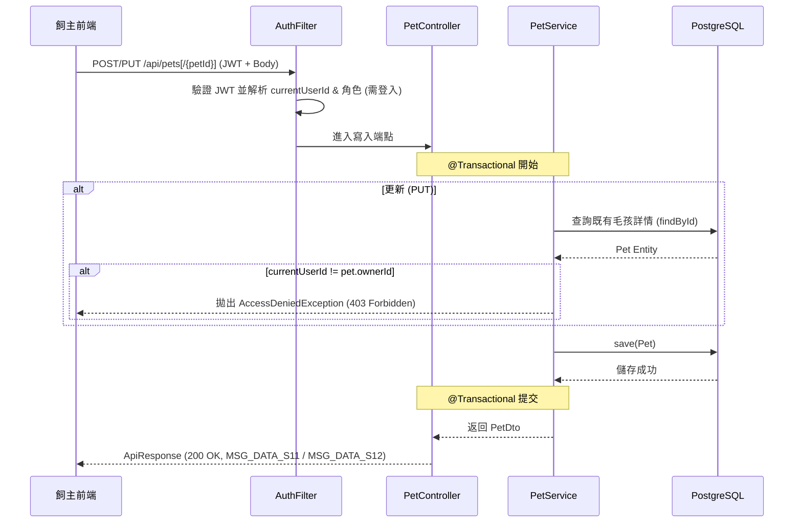
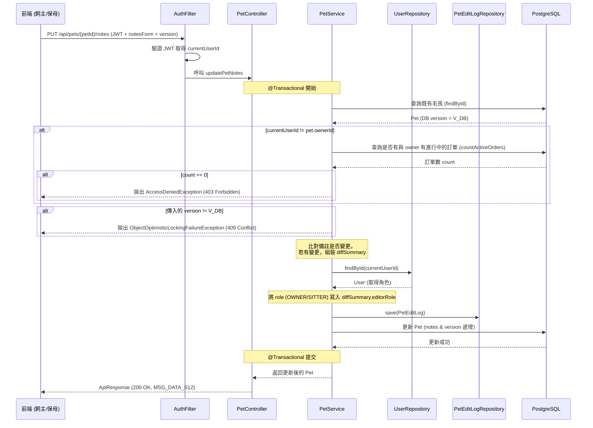
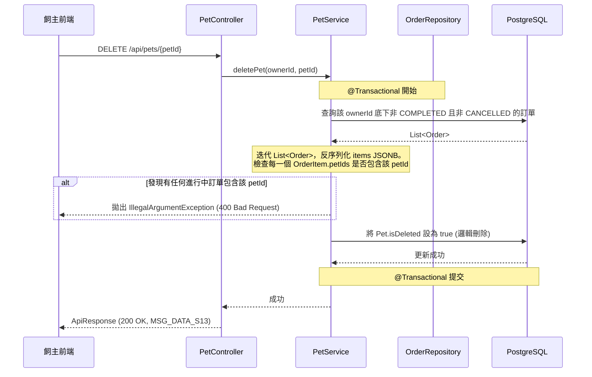

# SD-002: 毛孩資料與注意事項管理 設計文件

| 項目 | 內容 |
|------|------|
| 對應需求 | PRD-002 |
| 負責 SD | Antigravity (AI) |
| 建立日期 | 2026-05-26 |
| 狀態 | Approved |
| DB 表 | `pets`, `pet_edit_logs`, `orders` |
| 相依共用設計 | [錯誤回應](shared/error-response.md), [RBAC 權限](shared/permission-rbac.md), [多租戶稽核](shared/audit-tenancy.md), [檔案上傳](shared/file-upload.md) |

---

## 技術設計決策 (Design Decisions)

### 1. 權限隔離與 IDOR 防護 (Access Control & Security)
- **基本 CRUD 與大頭照上傳**：僅限該毛孩的「飼主 (Owner)」本人。非 owner 操作將直接返回 `403 Forbidden`。
- **注意事項檢視與共同編輯**：
  - 該毛孩的「飼主 (Owner)」具備完整權限。
  - 與該飼主擁有「進行中訂單」（狀態為 `PENDING`, `CONFIRMED`, `MODIFYING`, `REFUND_VERIFY`, `PENDING_PAYMENT`, `DISPUTED` 等，非 `COMPLETED` 且非 `CANCELLED`）的「保母 (Sitter)」，例外授予「檢視」與「更新注意事項」的權限，以便於服務期間進行必要記錄。
  - 其他無關使用者存取一律攔截並回傳 `403 Forbidden`。

### 2. 注意事項共同編輯與樂觀鎖控制
- 在注意事項更新時，後端利用 JPA 實體 `Pet` 的 `@Version` 欄位實作樂觀鎖。
- 若 Sitter 與 Owner 同時編輯同隻毛孩的注意事項，後儲存者會因 `version` 不符觸發 `ObjectOptimisticLockingFailureException`。
- 前端 API 攔截此錯誤 (409 Conflict)，彈出警告提示，但**不關閉編輯表單與輸入框**，以防止使用者撰寫的備註內容遺失。

### 3. 進行中訂單阻擋刪除卡控 (Active Order Gating)
- 為避免刪除被進行中服務關聯的毛孩資料，刪除毛孩前會查詢該 Owner 是否有任何進行中的訂單。
- 系統會比對這些訂單的 `items` JSON 陣列中，各項目 (OrderItem) 的 `petIds` 是否包含欲刪除之 `petId`。
- 若有關聯，拋出 `IllegalArgumentException` (後端 Controller 轉換為 400 Bad Request) 阻止刪除。

### 4. 異動日誌與角色顯示 (Audit Log)
- 當注意事項欄位 (`medicalPersonalityNotes` 或 `environmentalNotes`) 被修改，後端會在儲存時比對變更，並自動寫入 `pet_edit_logs` 日誌中。
- 為避免前端展示日誌時需額外查詢使用者角色，後端寫入 `diff_summary` JSONB 時，會主動向 `UserRepository` 查詢修改者角色，並於 JSONB 塞入 `editorRole`（例如 `OWNER`/`SITTER`），前端可直接解構並展示「編輯者角色：保母/飼主」。

---

## 序列圖

### 1. 飼主新增/修改毛孩基本資料 (Owner Create/Update Pet)



### 2. 注意事項共同編輯與樂觀鎖 (Service Notes Edit & Optimistic Locking)



### 3. 毛孩刪除前進行中訂單卡控 (Delete Pet & Active Order Gating)



---

## 資料模型變更

### 1. 資料庫變更 (Flyway Migration)

新增遷移腳本 `V20260526_01__create_pets_and_logs.sql`：

```sql
-- 建立毛孩資料表
CREATE TABLE pets (
    id                          UUID PRIMARY KEY DEFAULT gen_random_uuid(),
    owner_id                    UUID NOT NULL REFERENCES users(id),
    name                        VARCHAR(100) NOT NULL,
    species                     VARCHAR(50) NOT NULL,
    gender                      VARCHAR(20),
    neutered                    BOOLEAN,
    weight                      DECIMAL(5,2),
    birth_year                  INT,
    photo_url                   VARCHAR(512),
    medical_personality_notes   TEXT,
    environmental_notes         TEXT,
    version                     INT NOT NULL DEFAULT 1,
    created_at                  TIMESTAMPTZ NOT NULL DEFAULT NOW(),
    created_by                  UUID REFERENCES users(id),
    updated_at                  TIMESTAMPTZ NOT NULL DEFAULT NOW(),
    updated_by                  UUID REFERENCES users(id),
    is_deleted                  BOOLEAN NOT NULL DEFAULT FALSE
);

-- 建立注意事項異動日誌表
CREATE TABLE pet_edit_logs (
    id              UUID PRIMARY KEY DEFAULT gen_random_uuid(),
    pet_id          UUID NOT NULL REFERENCES pets(id),
    editor_id       UUID NOT NULL REFERENCES users(id),
    diff_summary    JSONB NOT NULL,
    created_at      TIMESTAMPTZ NOT NULL DEFAULT NOW()
);

-- 建立索引以提升效能
CREATE INDEX idx_pets_owner ON pets(owner_id) WHERE is_deleted = FALSE;
CREATE INDEX idx_pet_logs_pet_id ON pet_edit_logs(pet_id);
```

### 2. OrderItem 欄位向後相容
為了不破壞既有訂單結構，`OrderItem` 映射的 JSONB 中新增 `petIds` 屬性。

```java
public class OrderItem {
    // ... 既有屬性 ...
    
    // 向後相容：當 JSON 中不存在此欄位時，Jackson 會自動注入空陣列，防止 NPE
    @JsonSetter(nulls = Nulls.AS_EMPTY)
    private List<UUID> petIds = new ArrayList<>();
}
```

---

## API 設計

所有 API 均統一回傳格式：
```json
{
  "code": 200,
  "message": "OK",
  "data": { ... }
}
```

| Method | Path | 說明 | 存取權限 |
|--------|------|------|---------|
| GET | `/api/pets` | 取得當前使用者名下的毛孩列表 | 登入者 (Owner) |
| GET | `/api/pets/{petId}` | 取得特定毛孩詳情 | 該毛孩 Owner 或關聯 Sitter |
| POST | `/api/pets` | 新增毛孩資料 | 登入者 (Owner) |
| PUT | `/api/pets/{petId}` | 修改毛孩基本資料 | 該毛孩 Owner |
| DELETE | `/api/pets/{petId}` | 邏輯刪除毛孩 (受進行中訂單限制) | 該毛孩 Owner |
| PUT | `/api/pets/{petId}/notes` | 共同更新注意事項 | 該毛孩 Owner 或關聯 Sitter |
| GET | `/api/pets/{petId}/edit-logs` | 取得注意事項異動紀錄 | 該毛孩 Owner 或關聯 Sitter |
| POST | `/api/pets/{petId}/avatar` | 上傳毛孩頭像 (MultipartForm) | 該毛孩 Owner |

### Request/Response 結構範例

#### 1. POST/PUT `/api/pets`
- **Request Body**
```json
{
  "name": "咪咪",
  "species": "CAT",
  "gender": "FEMALE",
  "neutered": true,
  "weight": 4.5,
  "birthYear": 2021
}
```

#### 2. PUT `/api/pets/{petId}/notes`
- **Request Body**
```json
{
  "medicalPersonalityNotes": "對海鮮過敏，個性傲嬌。",
  "environmentalNotes": "不能開陽台門，喜歡高處。",
  "version": 1
}
```

#### 3. GET `/api/pets/{petId}/edit-logs`
- **Response Data**
```json
[
  {
    "id": "d1023000-0000-0000-0000-000000000001",
    "petId": "e1023000-0000-0000-0000-000000000001",
    "editorId": "3d498178-14c0-4376-b81e-7fb02e615dda",
    "diffSummary": {
      "editorRole": "SITTER",
      "changes": {
        "medicalPersonalityNotes": {
          "before": "無特別過敏。",
          "after": "對海鮮過敏，個性傲嬌。"
        }
      }
    },
    "createdAt": "2026-05-26T12:00:00Z"
  }
]
```

---

## 備註

- **Response message 統一使用 DataMessageEnum**：
  - 新增成功 → `DataMessageEnum.MSG_DATA_S11`
  - 修改成功 → `DataMessageEnum.MSG_DATA_S12`
  - 刪除成功 → `DataMessageEnum.MSG_DATA_S13`
  - 查無資料 → `DataMessageEnum.MSG_DATA_F11`
  - 衝突 (409) → `DataMessageEnum.MSG_DATA_CONFLICT`
- **GCS 上傳頭像路徑格式**：
  - 格式：`/pet-avatars/{ownerId}/{petId}.{ext}`
  - **合規性說明**：頭像屬永久型個人資料圖，遵循 SD-003 sitter-avatar 路徑慣例，不套用訂單媒體路徑格式。
- **預約流程 (PublicBookingPage) 前置擴充**：
  - 在 Step 1 中，預約請求需包含寵物勾選，將 `petIds` 送出，後端 `BookingService` 將映射並寫入該預約之 `OrderItem.petIds`。
