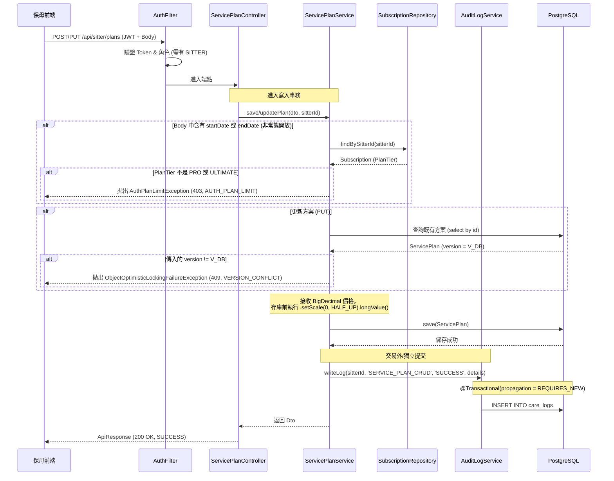
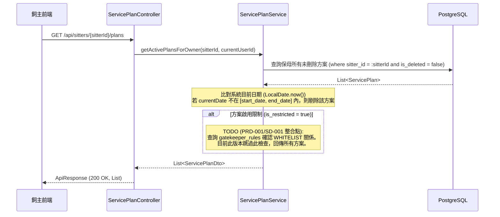
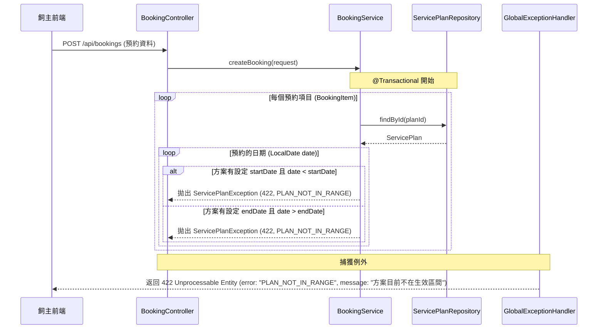
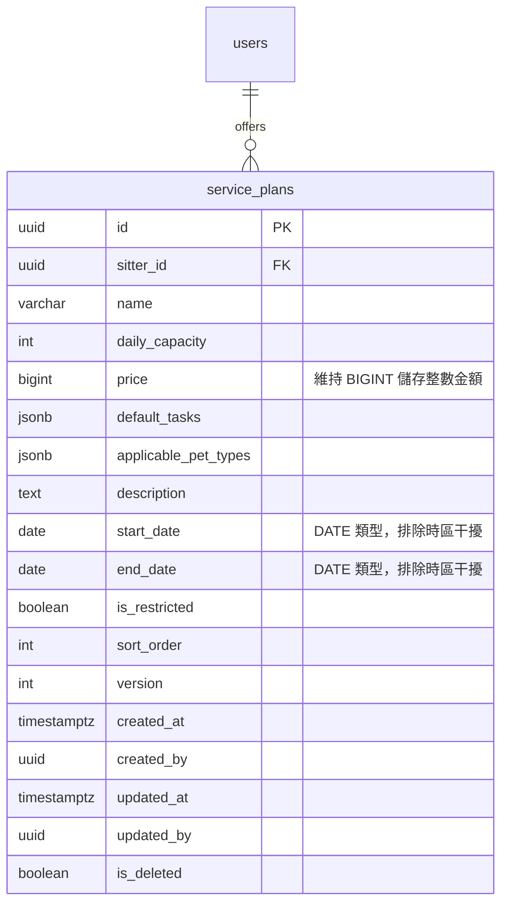

# SD-003: 保母服務方案設定 設計文件

| 項目 | 內容 |
|------|------|
| 對應需求 | PRD-003 |
| 負責 SD | Antigravity (AI) |
| 建立日期 | 2026-05-24 |
| 狀態 | Approved |
| DB 表 | `service_plans`, `care_logs`, `subscriptions` |
| 相依共用設計 | [錯誤回應](shared/error-response.md), [RBAC 權限](shared/permission-rbac.md), [多租戶稽核](shared/audit-tenancy.md) |

---

## 技術設計決策 (Design Decisions)

### 1. 欄位級別 SaaS Gating 的例外允許 (Conscious Exception)
- **規範對齊**：`SD-GLOBAL-SPEC 3.1` 規定「禁止在 Service 層寫死方案判斷，統一由 Controller 層標註權限」。
- **決策背景**：自定義註解 `@RequirePlan(PlanTier)` 只能在 API 方法層進行卡控，無法在 AOP 攔截器中精確解析 Request Body 的特定進階欄位（如本功能的 `startDate`/`endDate` 開放預約日期區間限制）。
- **特例設計**：在此功能中，我們例外允許在 Service 層（或 Controller 方法內部）執行方案等級（PlanTier）的屬性級檢核卡控，若保母非 `PRO`/`ULTIMATE` 卻傳入日期限制時，拋出 `AuthPlanLimitException` (403)。

---

## 序列圖

### 1. 保母建立/更新服務方案 (Sitter CRUD Service Plan)

此圖描述保母進行方案寫入的防禦邏輯，包含屬性級 SaaS 權限卡控、樂觀鎖與 `care_logs` 稽核寫入（透過 `REQUIRES_NEW` 獨立事務提交）。



### 2. 飼主查詢保母服務方案 (GET /api/sitters/{sitterId}/plans)

前台飼主查詢保母的方案列表，後端進行 Lazy Evaluation 區間過濾與白名單 `TODO` 檢查。



### 3. 飼主預約送單時程防禦 (Booking Time Gating)

在預約時的防禦，當預約日期不在方案的生效區間內時拋出 `422` 錯誤，不回傳 500。



---

## 資料模型與程式碼變更

### 1. 資料庫變更 (Flyway Migration)

將在 `backend/src/main/resources/db/migration/` 中新增遷移腳本 `V20260524_01__add_service_plan_columns.sql`：

```sql
-- 新增保母服務方案欄位
ALTER TABLE service_plans ADD COLUMN default_tasks JSONB NOT NULL DEFAULT '[]';
ALTER TABLE service_plans ADD COLUMN applicable_pet_types JSONB NOT NULL DEFAULT '[]';
ALTER TABLE service_plans ADD COLUMN description TEXT;
ALTER TABLE service_plans ADD COLUMN start_date DATE;
ALTER TABLE service_plans ADD COLUMN end_date DATE;
ALTER TABLE service_plans ADD COLUMN is_restricted BOOLEAN NOT NULL DEFAULT FALSE;
ALTER TABLE service_plans ADD COLUMN sort_order INT NOT NULL DEFAULT 0;

-- 建立索引以提升前台查詢性能
CREATE INDEX idx_service_plans_sitter_deleted ON service_plans(sitter_id) WHERE is_deleted = FALSE;
```

### 2. 全域異常處理器擴充 (GlobalExceptionHandler)

實作時需同步修改 `GlobalExceptionHandler.java` 補上對應 Exception 處理器，確保 `ServicePlanException` 回傳之 HTTP 狀態碼為動態配置（同時支援 404 與 422 等狀態），並修補樂觀鎖 409 漏洞：

```java
    // 方案業務異常處理 (動態讀取 HTTP 狀態，支援 404 PLAN_NOT_FOUND 與 422 PLAN_NOT_IN_RANGE)
    @ExceptionHandler(ServicePlanException.class)
    public ResponseEntity<Map<String, String>> handleServicePlan(ServicePlanException ex) {
        return ResponseEntity.status(ex.getStatus())
                .body(Map.of("error", ex.getError(), "message", ex.getMessage()));
    }

    // 樂觀鎖衝突防護 (409)
    @ExceptionHandler(org.springframework.orm.ObjectOptimisticLockingFailureException.class)
    public ResponseEntity<Map<String, String>> handleOptimisticLock(org.springframework.orm.ObjectOptimisticLockingFailureException ex) {
        return ResponseEntity.status(HttpStatus.CONFLICT)
                .body(Map.of("error", "VERSION_CONFLICT", "message", "內容已被更新，請重新整理後再試"));
    }
```

### 3. care_logs — 操作日誌寫入規格

方案 CRUD 不屬於訂單生命週期，故會將操作成功/失敗的紀錄寫入通用操作日誌 `care_logs`，而非寫入訂單專屬的 `order_logs`。
每次方案寫入操作成功後，Service 層需呼叫 `AuditLogService.writeLog(userId, action, status, details)`：

| 欄位 | 值 |
|------|----|
| `userId` | 當前操作之保母 ID (`TokenContext.getUserId()`) |
| `action` | `"SERVICE_PLAN_CRUD"` |
| `status` | 建立成功 → `"CREATE_SUCCESS"`；更新成功 → `"UPDATE_SUCCESS"`；刪除成功 → `"DELETE_SUCCESS"`；失敗 → `"CREATE_FAIL"` / `"UPDATE_FAIL"` 等 |
| `details` | 操作詳情字串，例如：`"Created service plan with ID: [uuid] and name: [name]"` |

### 4. ER Diagram



---

## API 設計

### 1. 建立服務方案
* **Method & Path**：`POST /api/sitter/plans`
* **說明**：保母新增自訂服務方案。
* **權限 (currentRole)**：`SITTER`

#### Request Body
```json
{
  "name": "30 分鐘到府餵食",
  "price": 500,
  "dailyCapacity": 3,
  "defaultTasks": ["基本餵食", "清理砂盆", "更換新鮮水"],
  "applicablePetTypes": ["CAT", "DOG"],
  "description": "30分鐘專業照護與陪伴",
  "startDate": "2026-06-01",
  "endDate": "2026-08-31",
  "isRestricted": false,
  "sortOrder": 1
}
```

#### Response (200 OK)
```json
{
  "code": 200,
  "message": "新增成功",
  "data": {
    "id": "2d1e9ae3-3607-42ac-afa7-23ae29ea4e91",
    "name": "30 分鐘到府餵食",
    "price": 500,
    "dailyCapacity": 3,
    "defaultTasks": ["基本餵食", "清理砂盆", "更換新鮮水"],
    "applicablePetTypes": ["CAT", "DOG"],
    "description": "30分鐘專業照護與陪伴",
    "startDate": "2026-06-01",
    "endDate": "2026-08-31",
    "isRestricted": false,
    "sortOrder": 1,
    "version": 0
  }
}
```

### 2. 編輯服務方案
* **Method & Path**：`PUT /api/sitter/plans/{planId}`
* **說明**：保母編輯既有服務方案。
* **權限 (currentRole)**：`SITTER` (且需進行 IDOR 檢查確保為該方案擁有者)。

#### Request Body
```json
{
  "name": "30 分鐘到府餵食 (暑期特惠)",
  "price": 550,
  "dailyCapacity": 3,
  "defaultTasks": ["基本餵食", "清理砂盆", "更換新鮮水"],
  "applicablePetTypes": ["CAT"],
  "description": "暑期貓咪專業到府照護",
  "startDate": "2026-07-01",
  "endDate": "2026-08-31",
  "isRestricted": false,
  "sortOrder": 1,
  "version": 0
}
```

#### Response (200 OK)
```json
{
  "code": 200,
  "message": "修改成功",
  "data": {
    "id": "2d1e9ae3-3607-42ac-afa7-23ae29ea4e91",
    "name": "30 分鐘到府餵食 (暑期特惠)",
    "price": 550,
    "dailyCapacity": 3,
    "defaultTasks": ["基本餵食", "清理砂盆", "更換新鮮水"],
    "applicablePetTypes": ["CAT"],
    "description": "暑期貓咪專業到府照護",
    "startDate": "2026-07-01",
    "endDate": "2026-08-31",
    "isRestricted": false,
    "sortOrder": 1,
    "version": 1
  }
}
```

### 3. 下架/邏輯刪除服務方案
* **Method & Path**：`DELETE /api/sitter/plans/{planId}`
* **說明**：保母刪除方案（後端將 `is_deleted` 改為 `true`，以利歷史訂單回溯）。
* **權限 (currentRole)**：`SITTER` (有 IDOR 檢查)。

#### Response (200 OK)
```json
{
  "code": 200,
  "message": "刪除成功",
  "data": null
}
```

### 4. 方案排序調整
* **Method & Path**：`POST /api/sitter/plans/sort`
* **說明**：調整方案列表的前台拖曳排序順序。
* **權限 (currentRole)**：`SITTER`

#### Request Body
```json
{
  "planIds": [
    "2d1e9ae3-3607-42ac-afa7-23ae29ea4e91",
    "5cb2910c-99da-4a5f-b52e-c765fa8a4f10"
  ]
}
```
*註：後端將讀取該 UUID 陣列，直接以陣列中元素的 index 作為該方案之 `sort_order` 值進行批次更新。*

#### Response (200 OK)
```json
{
  "code": 200,
  "message": "修改成功",
  "data": null
}
```

### 5. 保母查詢自訂方案列表
* **Method & Path**：`GET /api/sitter/plans`
* **說明**：保母後台查詢自己的所有方案（含過期但未邏輯刪除之方案，用於後台呈現）。
* **權限 (currentRole)**：`SITTER`

#### Response (200 OK)
```json
{
  "code": 200,
  "message": "OK",
  "data": [
    {
      "id": "2d1e9ae3-3607-42ac-afa7-23ae29ea4e91",
      "name": "30 分鐘到府餵食",
      "price": 500,
      "dailyCapacity": 3,
      "defaultTasks": ["基本餵食", "清理砂盆"],
      "applicablePetTypes": ["CAT"],
      "description": "貓咪到府照顧",
      "startDate": "2026-06-01",
      "endDate": "2026-08-31",
      "isRestricted": false,
      "sortOrder": 0,
      "version": 1
    }
  ]
}
```

### 6. 前台飼主查詢保母開放方案列表
* **Method & Path**：`GET /api/sitters/{sitterId}/plans`
* **說明**：前台預約網頁拉取保母的生效方案。
* **過濾規則**：
  1. 排除 `is_deleted = true`。
  2. 依 `sort_order` 由小到大排序。
  3. 生效日期區間過濾：比對目前系統日期。若有設定 `startDate` / `endDate` 且不在範圍內，則直接排除。
  4. 白名單過濾：**`TODO (PRD-001/SD-001 整合點)`**。若 `isRestricted = true` 則檢核目前登入飼主是否在保母的 whitelist 中，不符或未登入則排除此方案。當前版本跳過此檢核。
* **權限 (currentRole)**：不限（免登入可讀取基本方案，但白名單 TODO 整合後需有登入 JWT 才能檢核白名單關係）。

#### Response (200 OK)
```json
{
  "code": 200,
  "message": "OK",
  "data": [
    {
      "id": "2d1e9ae3-3607-42ac-afa7-23ae29ea4e91",
      "name": "30 分鐘到府餵食",
      "price": 500,
      "dailyCapacity": 3,
      "defaultTasks": ["基本餵食", "清理砂盆"],
      "applicablePetTypes": ["CAT"],
      "description": "貓咪到府照顧",
      "startDate": "2026-06-01",
      "endDate": "2026-08-31",
      "isRestricted": false,
      "sortOrder": 0,
      "version": 1
    }
  ]
}
```

---

## 權限與異常設計

### 1. 權限角色矩陣

| 端點 | SITTER (擁有者) | SITTER (非擁有者) | OWNER | 訪客 (未登入) |
|------|:---:|:---:|:---:|:---:|
| `POST /api/sitter/plans` | ✅ 允許 | — | ❌ 403 | ❌ 401 |
| `PUT /api/sitter/plans/{planId}` | ✅ 允許 | ❌ 403 (IDOR) | ❌ 403 | ❌ 401 |
| `DELETE /api/sitter/plans/{planId}` | ✅ 允許 | ❌ 403 (IDOR) | ❌ 403 | ❌ 401 |
| `POST /api/sitter/plans/sort` | ✅ 允許 | — | ❌ 403 | ❌ 401 |
| `GET /api/sitter/plans` | ✅ 允許 | — | ❌ 403 | ❌ 401 |
| `GET /api/sitters/{sitterId}/plans` | ✅ 允許 | ✅ 允許 | ✅ 允許 | ✅ 允許 |

### 2. 業務異常代碼對應

| 異常情境 | HTTP 狀態 | 錯誤代碼 (error) | 錯誤訊息 (message) |
|----------|-----------|------------------|-------------------|
| 方案不存在 | 404 Not Found | `PLAN_NOT_FOUND` | 找不到指定的服務方案 |
| 價格小於等於 0 | 400 Bad Request | `INVALID_PARAMETER` | 價格必須為大於 0 的有效數字 |
| 非專業版保母設定日期區間 | 403 Forbidden | `AUTH_PLAN_LIMIT` | 僅限專業版以上方案可設定開放預約區間 |
| 編輯時樂觀鎖衝突 | 409 Conflict | `VERSION_CONFLICT` | 內容已被更新，請重新整理後再試 |
| 預約的日期不在方案生效區間 | 422 Unprocessable Entity | `PLAN_NOT_IN_RANGE` | 方案目前不在生效區間 |
| IDOR 越權操作 | 403 Forbidden | `FORBIDDEN` | 無權限操作此方案 |

