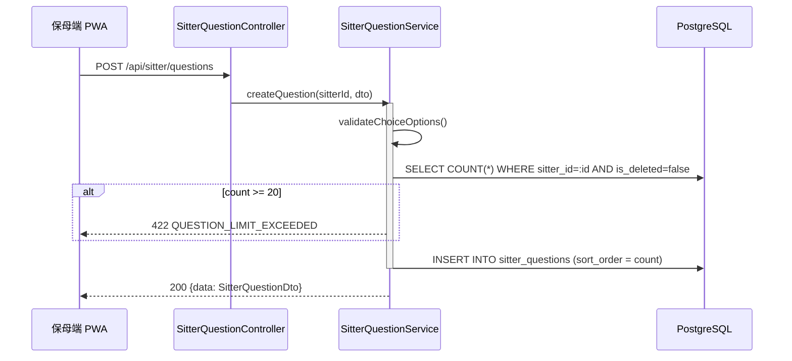
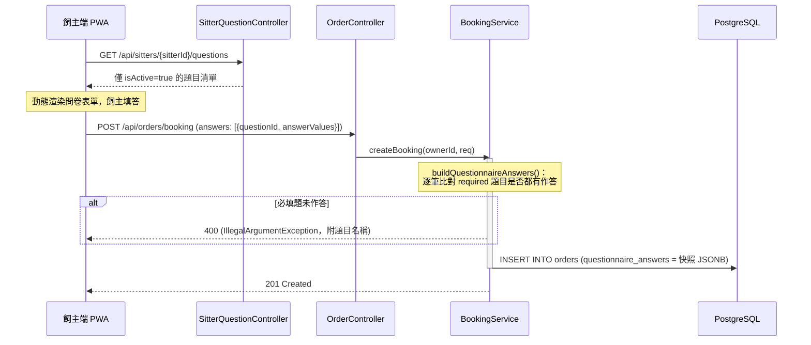

# SD-004: 事前問卷設定 (Pre-Booking Questionnaire)

| 項目 | 內容 |
|------|------|
| 模組編號 | SD-004 |
| 對應 PRD | PRD-004, PRD-005 |
| 核心技術 | JSONB 選項儲存, 歷史快照隔離 (Answer Snapshot), IDOR 防禦 |
| 狀態 | **Approved** |

---

## 1. 業務邏輯與流程設計

### 1.1 核心流程說明
保母於「事前問卷設定」頁面自訂題目（單選/多選/文字/長文字），供飼主在預約流程 (SD-005) 中填答。題目與飼主的填答結果是**兩份獨立資料**：

- **題目本體** (`sitter_questions`)：保母可隨時新增/編輯/停用/刪除，屬於「目前生效中」的設定。
- **填答快照** (`orders.questionnaire_answers`)：飼主送出預約時，將當下的 `questionText`/`answerType` 連同答案一併寫入訂單的 JSONB 欄位，而非只存 `questionId`。

此設計是為了滿足歷史隔離：題目日後被保母修改文字、停用或刪除後，既有訂單裡飼主當時看到並回答的題目內容仍必須完整可讀（PRD-004 資料規則）。

### 1.2 上限與防呆
- 每位保母最多 **20 題**（`SitterQuestionService.MAX_QUESTIONS_PER_SITTER`）。
- `questionText` 上限 200 字，每個選項 (`options[]`) 上限 50 字（Bean Validation，`SitterQuestionDto`）。
- `RADIO`/`CHECKBOX` 型題目建立或編輯時，`options` 至少須有 1 筆，否則拒絕。
- 所有寫入操作（`updateQuestion`/`deleteQuestion`/`toggleActive`）皆先驗證 `question.sitter_id == 目前登入者`，越權操作回 `403 FORBIDDEN`（IDOR 防禦）。
- 刪除採**邏輯刪除** (`is_deleted = true`)，不做實體刪除，理由同 1.1 的歷史隔離。

---

## 2. API 定義

### 2.1 保母管理自己的問卷
| Method | Path | 說明 | Auth |
|--------|------|------|------|
| GET | `/api/sitter/questions` | 查詢自己全部題目（含停用中） | `ROLE_SITTER` |
| POST | `/api/sitter/questions` | 新增題目 | `ROLE_SITTER` |
| PUT | `/api/sitter/questions/{questionId}` | 編輯題目（帶 `version` 樂觀鎖） | `ROLE_SITTER` |
| DELETE | `/api/sitter/questions/{questionId}` | 邏輯刪除 | `ROLE_SITTER` |
| PUT | `/api/sitter/questions/{questionId}/active` | 啟用/停用 (`{"active": true\|false}`) | `ROLE_SITTER` |
| POST | `/api/sitter/questions/sort` | 依陣列順序覆寫 `sortOrder` (`{"questionIds": [...]}`) | `ROLE_SITTER` |

### 2.2 供預約流程動態渲染（公開）
- **Endpoint**: `GET /api/sitters/{sitterId}/questions`
- **Auth**: 公開（無需登入，比照保母公開 Profile 頁）
- **回傳**: 僅 `isActive = true` 且未刪除的題目，供 SD-005 預約頁 Step 2 動態渲染表單

### Request Body（新增/編輯共用）
```json
{
  "questionText": "貓咪是否怕生？",
  "answerType": "RADIO",
  "options": ["會", "不會", "不確定"],
  "required": true,
  "version": 1
}
```

---

## 3. 詳細邏輯與序列圖 (Sequence Diagram)





---

## 4. 資料庫異動與限制 (DB Constraint)

```sql
CREATE TABLE sitter_questions (
    id UUID PRIMARY KEY DEFAULT gen_random_uuid(),
    sitter_id UUID NOT NULL REFERENCES users(id),
    question_text VARCHAR(200) NOT NULL,
    answer_type VARCHAR(20) NOT NULL, -- RADIO, CHECKBOX, INPUT, TEXTAREA
    options JSONB NOT NULL DEFAULT '[]',
    required BOOLEAN NOT NULL DEFAULT FALSE,
    sort_order INT NOT NULL DEFAULT 0,
    is_active BOOLEAN NOT NULL DEFAULT TRUE,
    version INT NOT NULL DEFAULT 1,
    created_at TIMESTAMPTZ NOT NULL DEFAULT NOW(),
    updated_at TIMESTAMPTZ NOT NULL DEFAULT NOW(),
    is_deleted BOOLEAN NOT NULL DEFAULT FALSE
);
CREATE INDEX idx_sitter_questions_sitter_id ON sitter_questions(sitter_id);

-- orders 表新增問卷回覆快照欄位
ALTER TABLE orders ADD COLUMN questionnaire_answers JSONB NOT NULL DEFAULT '[]';
```

- `questionnaire_answers` 陣列每筆元素為 `{questionId, questionText, answerType, answerValues}`，`questionText`/`answerType` 為送出當下的快照值，與 `sitter_questions` 表無外鍵關聯（故意如此，避免刪題連動影響歷史訂單）。

---

## 5. 防呆與邊界條件 (Edge Cases)

| 情境 | 處理方式 |
|------|---------|
| 保母刪除題目後，舊訂單被開啟查看 | 顯示訂單快照中的 `questionText`，不受題目已刪除影響 |
| 飼主預約時保母同時停用某題 | 飼主端渲染的清單是送出當下 GET 到的版本，不做即時 WebSocket 同步；若送出時後端仍接受該欄位快照即可 |
| 選擇題送出時 `options` 為空 | 建立/編輯階段即拒絕（422），不允許存入無效狀態 |
| 非本人操作他人題目（改網址 ID） | `findOwnedQuestion` 比對 `sitter_id`，回 403 |
| 已刪除或不存在的 `questionId` | 統一回 404 `QUESTION_NOT_FOUND`，不洩漏題目是否曾經存在 |
