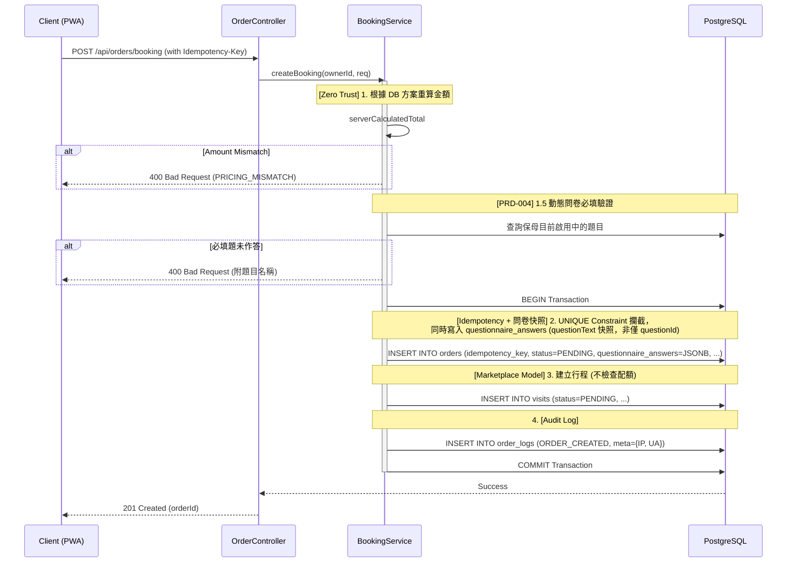

# SD-005: 飼主預約申請 (Public Booking)

| 項目 | 內容 |
|------|------|
| 模組編號 | SD-005 |
| 對應 PRD | PRD-005 |
| 核心技術 | Zero-Trust Pricing, DB-Level Idempotency, Deferred Capacity Check |
| 狀態 | **Approved (Marketplace Model)** |

---

## 1. 業務邏輯與流程設計

### 1.1 核心流程說明
飼主提交預約申請。根據 **PRD-005**，預約送單階段 **不佔用名額**，允許多位飼主同時對同一時段送單，實際檔期佔用延遲至保母審核確認階段 (SD-006)。

### 1.2 併發與冪等性
1. **送單階段**：主要透過 `idempotency_key` 的資料庫 `UNIQUE` 約束防止重複送單。
2. **鎖定階段**：已移至 SD-006 (Confirm Order)。在保母接單時，系統將執行 **Sorted Advisory Locks** 以確保配額檢核的原子性。

### 1.3 動態問卷渲染與快照 (PRD-004 聯動)
飼主進入預約 Step 2 時，前端呼叫 `GET /api/sitters/{sitterId}/questions`（見 SD-004）動態渲染保母自訂的問卷表單。送單時：
- 後端重新查詢該保母**目前啟用中**的題目清單，逐一比對 `required` 題目是否有值，未填則拋出 `400`（`IllegalArgumentException`，訊息附題目名稱）——不信任前端傳來的必填檢查。
- 通過驗證後，將題目文字與答案一併寫入 `orders.questionnaire_answers`（JSONB 快照），詳見 SD-004 §1.1 歷史隔離設計。

### 1.4 Zero-Trust Pricing
`BookingRequest.expectedTotalAmount` 是前端試算的金額，僅供比對用途。後端一律以資料庫當下的 `ServicePlan.price` 重新計算 `totalAmount`，兩者不符時拒絕送單（`400 PRICING_MISMATCH`），避免飼主填表期間方案價格被異動、卻無感沿用舊報價成交。

---

## 2. API 定義

### 2.1 提交預約申請
- **Endpoint**: `POST /api/orders/booking`
- **Auth**: `ROLE_OWNER`
- **Headers**:
  - `Idempotency-Key`: `UUID` (必填)
- **Request Body**:
```json
{
  "sitterId": "uuid",
  "expectedTotalAmount": 2500,
  "items": [
    {
      "planId": "uuid-planA",
      "petIds": ["uuid-pet1", "uuid-pet2"],
      "dates": ["2026-06-01", "2026-06-02", "2026-06-03"],
      "timesPerDay": 2
    },
    {
      "planId": "uuid-planB",
      "petIds": ["uuid-pet1", "uuid-pet2"],
      "dates": ["2026-06-01", "2026-06-02", "2026-06-03"],
      "timesPerDay": 1
    },
    {
      "planId": "uuid-planA",
      "petIds": ["uuid-pet1", "uuid-pet2"],
      "dates": ["2026-06-04"],
      "timesPerDay": 1
    }
  ],
  "answers": [
    {"questionId": "uuid-q1", "answerValues": ["會怕生"]}
  ]
}
```

---

## 3. 詳細邏輯與序列圖 (Sequence Diagram)



> [!NOTE]
> **Advisory Lock 與 Capacity Check** 已移至 SD-006 (保母報價與接單階段) 執行。

---

## 4. 資料庫異動與限制 (DB Constraint)

### 4.1 冪等性實作
- **Table**: `ORDERS`
- **Constraint**: `UNIQUE(idempotency_key)`

---

## 5. 防呆與邊界條件 (Edge Cases)

| 情境 | 處理方式 |
|------|---------|
| 併發送單 | 透過 `Idempotency-Key` 攔截，後到者回傳 409 或重複成功訊息。 |
| 檔期已滿 | 送單階段不阻擋。保母在接單時若名額已滿，系統將提示保母無法接單。 |
| 送單金額與方案現價不符 | 400 `PRICING_MISMATCH`，不建立訂單，提示飼主重新整理頁面。 |
| 保母問卷必填題未作答 | 400，訊息附題目名稱，不建立訂單。 |
| 送單當下保母剛停用某題目 | 該題不在後端查到的「啟用中題目」清單內，不驗證也不快照，視同題目不存在。 |
| 保母尚未設定任何問卷題目 | `questionnaire_answers` 存空陣列 `[]`，不影響送單。 |
