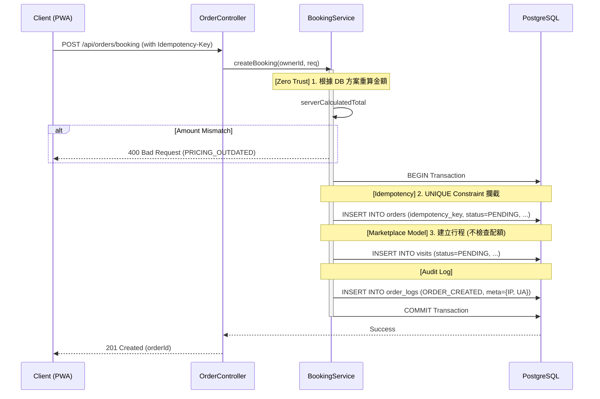

# SD-005: 飼主預約申請 (Public Booking)

| 項目 | 內容 |
|------|------|
| 模組編號 | SD-005 |
| 對應 PRD | PRD-005 |
| 核心技術 | Zero-Trust Pricing, DB-Level Idempotency, Deferred Capacity Check |
| 狀態 | **Approved (Marketplace Model)** |

---

## 1. 業務邏輯與流程設計

### 1.1 核心流程說明
飼主提交預約申請。根據 **PRD-005**，預約送單階段 **不佔用名額**，允許多位飼主同時對同一時段送單，實際檔期佔用延遲至保母審核確認階段 (SD-006)。

### 1.2 併發與冪等性
1. **送單階段**：主要透過 `idempotency_key` 的資料庫 `UNIQUE` 約束防止重複送單。
2. **鎖定階段**：已移至 SD-006 (Confirm Order)。在保母接單時，系統將執行 **Sorted Advisory Locks** 以確保配額檢核的原子性。

---

## 2. API 定義

### 2.1 提交預約申請
- **Endpoint**: `POST /api/orders/booking`
- **Auth**: `ROLE_OWNER`
- **Headers**:
  - `Idempotency-Key`: `UUID` (必填)
- **Request Body**:
```json
{
  "sitterId": "uuid",
  "clientCalculatedTotal": 1500,
  "items": [
    {
      "planId": "uuid",
      "petIds": ["uuid", "uuid"],
      "dates": ["2026-06-01", "2026-06-02"],
      "timesPerDay": 2
    }
  ]
}
```

---

## 3. 詳細邏輯與序列圖 (Sequence Diagram)



> [!NOTE]
> **Advisory Lock 與 Capacity Check** 已移至 SD-006 (保母報價與接單階段) 執行。

---

## 4. 資料庫異動與限制 (DB Constraint)

### 4.1 冪等性實作
- **Table**: `ORDERS`
- **Constraint**: `UNIQUE(idempotency_key)`

---

## 5. 防呆與邊界條件 (Edge Cases)

| 情境 | 處理方式 |
|------|---------|
| 併發送單 | 透過 `Idempotency-Key` 攔截，後到者回傳 409 或重複成功訊息。 |
| 檔期已滿 | 送單階段不阻擋。保母在接單時若名額已滿，系統將提示保母無法接單。 |
