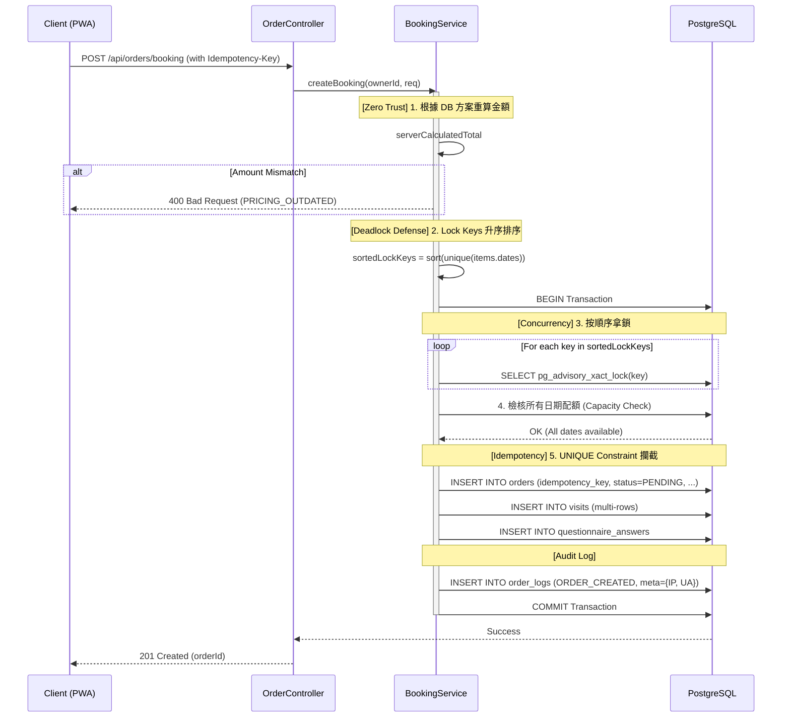

# SD-005: 飼主預約申請 (Public Booking)

| 項目 | 內容 |
|------|------|
| 模組編號 | SD-005 |
| 對應 PRD | PRD-005 |
| 核心技術 | PostgreSQL Advisory Locks (Sorted), Zero-Trust Pricing, DB-Level Idempotency |
| 狀態 | **Approved with Consultant Feedback** |

---

## 1. 業務邏輯與流程設計

### 1.1 核心流程說明
飼主提交包含多組方案組合的預約申請。系統執行「排序鎖定」、「零信任價格校驗」與「原子化建單」。

### 1.2 併發與死結防護：Sorted Advisory Locks
為避免不同請求因獲取鎖的順序不同而導致 **Deadlock (死結)**，系統強制執行以下規則：
1. **生成鎖標的**：收集所有項目的 `Hash(sitterId + date)`。
2. **強制排序**：在呼叫資料庫前，必須對所有 Lock Keys 進行 **「升序排列 (ASC)」**。
3. **循序拿鎖**：Transaction 內按排序後的順序執行 `pg_advisory_xact_lock()`。

---

## 2. API 定義

### 2.1 提交預約申請
- **Endpoint**: `POST /api/orders/booking`
- **Auth**: `ROLE_OWNER`
- **Headers**:
  - `Idempotency-Key`: `UUID` (必填)
- **Request Body**:
```json
{
  "sitterId": "uuid",
  "clientCalculatedTotal": 1500,
  "items": [
    {
      "planId": "uuid",
      "petIds": ["uuid", "uuid"],
      "dates": ["2026-06-01", "2026-06-02"],
      "timesPerDay": 2
    }
  ],
  "answers": [
    {
      "questionId": "uuid",
      "answerText": "貓咪對雞肉過敏",
      "selectedOptionIds": ["uuid"]
    }
  ]
}
```

---

## 3. 詳細邏輯與序列圖 (Sequence Diagram)



---

## 4. 資料庫異動與限制 (DB Constraint)

### 4.1 冪等性簡化實作
- **Table**: `ORDERS`
- **Constraint**: `UNIQUE(idempotency_key)`
- **Logic**: 
  - 後端不執行 `SELECT` 檢查，直接 `INSERT`。
  - 若拋出 `DataIntegrityViolationException`，則視為重複請求。
  - **優點**：效能最高，不需額外過期清理機制（隨訂單永久留存）。

### 4.2 錯誤代碼 (DataMessageEnum)
- `ORDER_PRICING_OUTDATED`: 前端試算金額與後端不符（可能方案已調價）。
- `ORDER_DUPLICATE_SUBMISSION`: 重複送單（Idempotency Key 碰撞）。

---

## 5. 防呆與邊界條件 (Edge Cases)

| 情境 | 處理方式 |
|------|---------|
| 併發搶單 (Deadlock) | 已透過 **Sorted Lock Keys** 機制完全消除死結風險。 |
| 跨方案組合預約 | `items` 結構支援單一訂單組合多種方案，例如「2天洗澡 + 3天餵食」。 |
| 方案下架中 | 檢核 `items.planId` 狀態，若任一方案不可售則整筆失敗。 |
| 金額篡改 | 已透過 **clientCalculatedTotal** 比對進行零信任防護。 |
