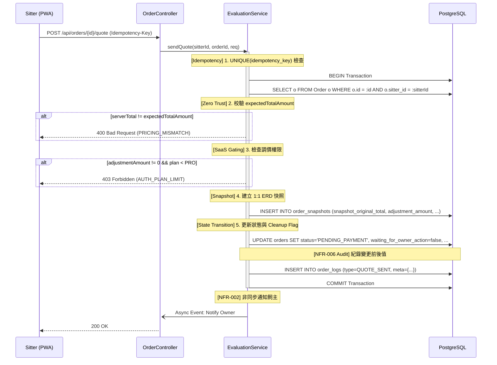

# SD-006: 保母報價審核與金額快照 (Order Evaluation)

| 項目 | 內容 |
|------|------|
| 模組編號 | SD-006 |
| 對應 PRD | PRD-004, PRD-006, PRD-012, PRD-013 |
| 核心技術 | Optimistic Locking (@Version), SaaS Plan Gating, Full-Contract Snapshotting, Zero-Trust Pricing |
| 狀態 | **Approved with Consultant Feedback** |

---

## 1. 業務邏輯與流程設計

### 1.1 核心流程說明
保母對 `PENDING` 狀態的訂單進行審核。所有操作皆須具備 **冪等性 (Idempotency)** 與 **狀態清理 (State Cleanup)** 機制。
當訂單完成報價或婉拒後，系統必須確保所有中間狀態 Flag（如 `waiting_for_owner_action`）被正確重設。

### 1.2 金額與權限規則
- **Sitter-Side Zero Trust**：保母送出報價時，必須傳回其畫面上顯示的 `expectedTotalAmount`。後端重新計算 `原始金額 + adjustmentAmount` 後，兩者若不符則拒絕報價，防止前端緩存過期導致的誤判。

---

## 2. API 定義

### 2.1 送出報價 (Accept & Quote)
- **Endpoint**: `POST /api/orders/{orderId}/quote`
- **Auth**: `ROLE_SITTER`
- **Headers**: `Idempotency-Key: UUID` (必填)
- **Request Body**: 
```json
{
  "adjustmentAmount": 200,
  "expectedTotalAmount": 1200,
  "adjustmentReason": "連假加收",
  "version": 1
}
```
- **邏輯檢核**:
  - 若 `adjustmentAmount != 0` 且保母方案 < `PRO`，拋出 `AUTH_PLAN_LIMIT`。
  - **Zero-Trust**: 校驗 `serverTotal == expectedTotalAmount`。
  - **Cleanup**: 強制將 `waiting_for_owner_action` 設為 `false`。

### 2.2 要求回填問卷 (Request Info)
- **Endpoint**: `POST /api/orders/{orderId}/request-info`
- **Headers**: `Idempotency-Key: UUID` (必填)
- **說明**: 狀態維持 `PENDING`，更新 `waiting_for_owner_action = true` 並觸發通知。

### 2.3 婉拒預約 (Reject)
- **Endpoint**: `POST /api/orders/{orderId}/reject`
- **Headers**: `Idempotency-Key: UUID` (必填)
- **Request Body**: `{ "rejectReason": "...", "version": 1 }`
- **邏輯檢核**: 狀態轉為 `CANCELLED`，重設 `waiting_for_owner_action = false`。

---

## 3. 詳細邏輯與序列圖 (Sequence Diagram)



---

## 4. 資料庫異動與限制 (DB Constraint)

### 4.1 快照資料結構 (ORDER_SNAPSHOT)
對齊 SD-ERD 2.2 節欄位：
```json
{
  "orderId": "uuid",
  "snapshotAt": "timestamp",
  "snapshotOriginalTotal": 1000,
  "adjustmentAmount": 200,
  "mediaRetentionDays": 30,
  "maxPhotos": 10,
  "maxVideoSeconds": 0,
  "items": [
    {
      "planId": "uuid",
      "planName": "專業餵食",
      "unitPrice": 500,
      "timesPerDay": 2,
      "dates": ["2026-06-01", "2026-06-02"]
    }
  ]
}
```

---

## 5. 防呆與邊界條件 (Edge Cases)

| 情境 | 處理方式 |
|------|---------|
| 報價重複送單 | `Idempotency-Key` 透過資料庫 `UNIQUE` 限制攔截並報錯。 |
| 報價時方案已調價 | 系統依據 **預約送單時的單價** 進行重算。若與保母畫面上的 `expectedTotalAmount` 不同則報錯。 |
| 髒資料防護 | 無論執行報價或婉拒，皆會強制清空 `waiting_for_owner_action` 標記。 |
