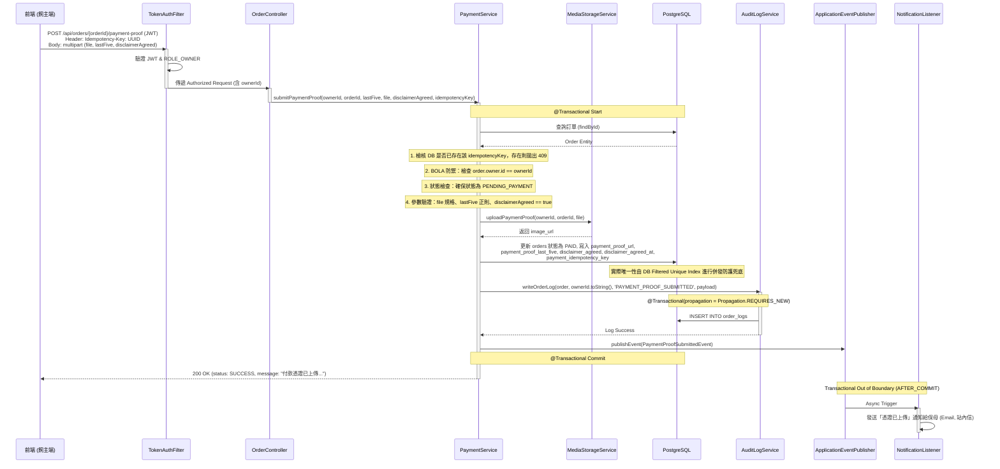
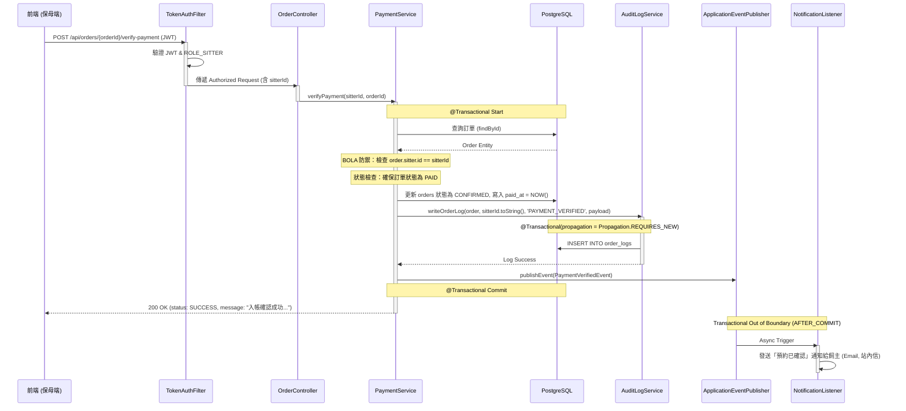
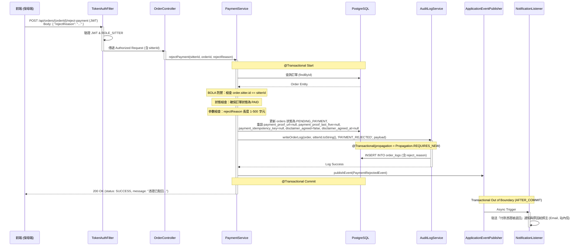
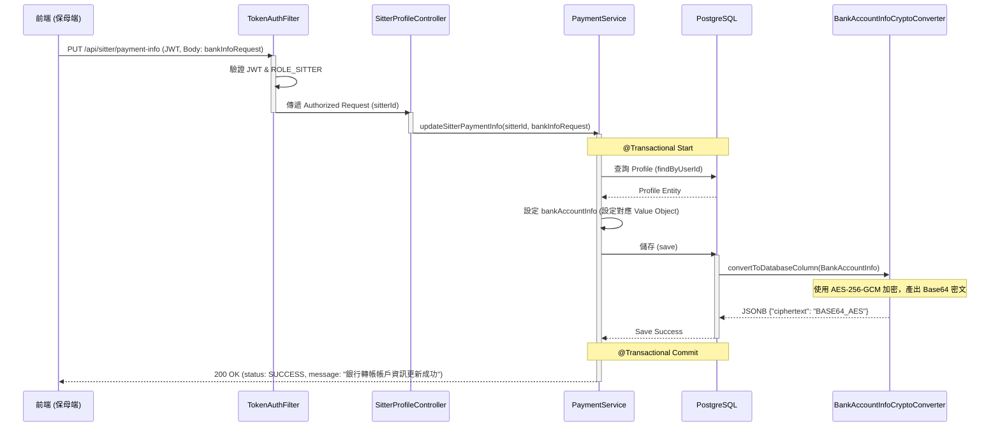
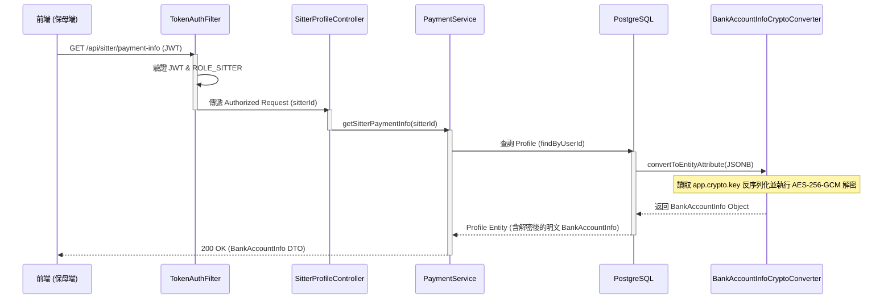

# SD-007: 線下付款憑證上傳與確認 (Offline Payment Verification)

| 項目 | 內容 |
|------|------|
| 對應需求 | [PRD-007-offline-payment.md](file:///Users/will_chiang/Widget_home/cat-sitter-project/docs/sa/fr/PRD-007-offline-payment.md) |
| 負責 SD | AI (Antigravity) |
| 建立日期 | 2026-06-01 |
| 狀態 | Draft |
| DB 表 | `orders`, `profiles`, `order_logs` |
| 相依共用設計 | [全域架構與開發規範](file:///Users/will_chiang/Widget_home/cat-sitter-project/docs/sd/SD-GLOBAL-SPEC.md) |

---

## 1. 業務邏輯與流程設計

### 1.1 付款狀態生命週期與變遷規則
本功能旨在打通線下轉帳付款的完整流程，訂單狀態之變遷路徑定義如下：
1. **`PENDING_PAYMENT → PAID` (飼主上傳憑證)**：
   - 飼主在收到保母報價後，訂單狀態為 `PENDING_PAYMENT`。
   - 飼主轉帳完成後，必須填寫「轉帳帳號後五碼」、上傳「轉帳憑證圖片」，並勾選同意「線下交易免責聲明」。
   - 送出後，訂單狀態變更為 `PAID` (已付款待核對)，並通知保母。
2. **`PAID → CONFIRMED` (保母確認入帳)**：
   - 保母檢視飼主上傳的憑證與後五碼，確認款項入庫後點擊「確認入帳」。
   - 訂單狀態變更為 `CONFIRMED` (已確認)，填入 `paid_at` (付款確認時間)，並發送「預約確認」通知給飼主。
3. **`PAID → PENDING_PAYMENT` (保母駁回憑證)**：
   - 若保母核對後發現金額不符或憑證無效，點擊「駁回憑證」並填寫駁回原因。
   - 訂單狀態退回 `PENDING_PAYMENT`，清空 DB 中的憑證圖片與後五碼，且**重設免責聲明同意狀態**，並通知飼主。

### 1.2 銀行帳戶安全暴露範圍與加密存儲 (對齊 ERD)
1. **隱私控制**：
   - 僅在訂單狀態為 `PENDING_PAYMENT` 或 `PAID` 且查詢者為該訂單的 `owner` (飼主) 或 `sitter` (保母) 時，查詢該訂單詳情 DTO (`OrderDetailResponseDto`) 才會包含保母的收款帳戶資訊。其餘狀態一律強制回傳 `null`。
2. **加密存儲 (對齊 SD-ERD.md:75)**：
   - 保母收款帳戶資訊不儲存為明文欄位，統一存儲於 `profiles.bank_account_info` (型別為 `JSONB`)。
   - 資料結構包含：`bankCode` (銀行代碼)、`bankBranch` (分行名稱)、`bankAccount` (帳戶號碼)、`bankPayeeName` (戶名)。
   - **加密規格**：使用 `AES-256-GCM` 加密演算法，加密金鑰源自系統配置 `app.crypto.key`。寫入資料庫時，將結構化 JSON 加密為密文字串，存入 JSONB 的 `{"ciphertext": "BASE64_CIPHERTEXT"}` 欄位中；查詢時解密還原。

### 1.3 駁回時的重設與 GCS 處理
當保母駁回憑證時，為防範狀態機與重複提交漏洞，必須重設以下欄位：
- 狀態退回 `PENDING_PAYMENT`。
- 清空 `orders` 中的 `payment_proof_url` 與 `payment_proof_last_five` (重設為 `null`)。
- **清空 `payment_idempotency_key`** (重設為 `null`)：這能確保被駁回後，飼主重新提交付款憑證時可以帶入新的 `Idempotency-Key`，避免觸發舊資料鎖定而無法再次上傳。
- 強制將 `disclaimer_agreed` 重設為 `false`，將 `disclaimer_agreed_at` 重設為 `null`。這能確保飼主若需重新上傳，必須再度勾選免責聲明，以在法務審計中留下最新、最正確的時間戳記。
- **檔案生命週期**：付款憑證屬於財務舉證，因此在 GCS Lifecycle 中排除（永不刪除）。駁回時系統不主動刪除 GCS 實體圖片，僅切斷資料庫的關聯。該部分列為已知技術債。

### 1.4 正規校驗與防呆
- **後五碼**：必須為 5 碼且全為數字字元（`^\d{5}$`）。
- **檔案規格**：上傳之憑證圖片大小上限為 5MB，僅允許 MIME 類型為 `image/jpeg`、`image/png`、`image/webp`。
- **銀行帳戶資訊**：
  - `bankCode`：必須為 3 碼數字（`^\d{3}$`）。
  - `bankAccount`：必須為 10 到 16 碼數字（`^\d{10,16}$`）。
  - `bankBranch` 與 `bankPayeeName`：長度上限為 100 字元，不可為空。
- **駁回原因 (rejectReason)**：必填，長度限制為 1 至 500 字元。

---

## 2. 序列圖

### 2.1 飼主上傳憑證流程


### 2.2 保母確認入帳流程


### 2.3 保母駁回憑證流程


### 2.4 保母更新/讀取轉帳帳戶資訊流程

#### 1. 更新轉帳資訊 (PUT)


#### 2. 讀取轉帳資訊 (GET)


---

## 3. 基礎設施與資料模型變更

### 3.1 擴充現有 Tables DDL
利用 Flyway 管理，新增版本遷移指令檔：`V20260530_01__add_payment_proof_fields_to_orders.sql`

```sql
-- 1. orders 表擴充：新增付款憑證、後五碼、免責聲明與冪等 Key 欄位
ALTER TABLE orders ADD COLUMN payment_proof_url VARCHAR(512);
ALTER TABLE orders ADD COLUMN payment_proof_last_five VARCHAR(5);
ALTER TABLE orders ADD COLUMN disclaimer_agreed BOOLEAN NOT NULL DEFAULT FALSE;
ALTER TABLE orders ADD COLUMN disclaimer_agreed_at TIMESTAMPTZ;
ALTER TABLE orders ADD COLUMN payment_idempotency_key VARCHAR(100);

-- 於 orders 新增 payment_idempotency_key 的唯一約束，防止重複提交
CREATE UNIQUE INDEX idx_orders_payment_idempotency ON orders(payment_idempotency_key) WHERE payment_idempotency_key IS NOT NULL;

-- 2. profiles 表擴充 (SITTER 側表)：新增加密的銀行帳戶資訊欄位
ALTER TABLE profiles ADD COLUMN bank_account_info JSONB;
```

### 3.2 JPA Entity 欄位新增對應
#### `Order.java`
- 移除 `@Column(unique = true)` 以免與 Flyway 的局部過濾唯一約束 (Filtered Unique Index) 語意重複或干擾。
```java
@Column(name = "payment_proof_url")
private String paymentProofUrl;

@Column(name = "payment_proof_last_five", length = 5)
private String paymentProofLastFive;

@Column(name = "disclaimer_agreed", nullable = false)
private boolean disclaimerAgreed = false;

@Column(name = "disclaimer_agreed_at")
private OffsetDateTime disclaimerAgreedAt;

@Column(name = "payment_idempotency_key")
private String paymentIdempotencyKey;
```

#### `Profile.java`
```java
@Convert(converter = BankAccountInfoCryptoConverter.class)
@Column(name = "bank_account_info", columnDefinition = "jsonb")
private BankAccountInfo bankAccountInfo;
```

### 3.3 銀行帳戶加密基礎設施與對應屬性

#### 1. BankAccountInfo Value Object
套件路徑：`com.petsitter.domain.model`
```java
package com.petsitter.domain.model;

import lombok.AllArgsConstructor;
import lombok.Builder;
import lombok.Data;
import lombok.NoArgsConstructor;

@Data
@Builder
@NoArgsConstructor
@AllArgsConstructor
public class BankAccountInfo {
    private String bankCode;
    private String bankBranch;
    private String bankAccount;
    private String bankPayeeName;
}
```

#### 2. BankAccountInfoCryptoConverter JPA Converter
套件路徑：`com.petsitter.infrastructure.security`
- 使用 Java 內建的 `javax.crypto.Cipher` (使用 `AES-256-GCM`：`AES/GCM/NoPadding`)。
- **建構子注入模式**：不再使用靜態欄位，透過建構子以 `@Value` 注入金鑰，確保 Spring 管理之 Bean 初始化時金鑰注入完全，徹底防止 NullPointerException。
- **字元集指定**：強制指定 `StandardCharsets.UTF_8` 進行字串與位元組轉換，防範跨平台字元集設定不一致造成的解密失敗。

```java
package com.petsitter.infrastructure.security;

import com.fasterxml.jackson.databind.ObjectMapper;
import com.petsitter.domain.model.BankAccountInfo;
import jakarta.persistence.AttributeConverter;
import jakarta.persistence.Converter;
import org.springframework.beans.factory.annotation.Value;
import org.springframework.stereotype.Component;

import javax.crypto.Cipher;
import javax.crypto.spec.GCMParameterSpec;
import javax.crypto.spec.SecretKeySpec;
import java.nio.charset.StandardCharsets;
import java.security.SecureRandom;
import java.util.Base64;
import java.util.Map;

@Converter
@Component
public class BankAccountInfoCryptoConverter implements AttributeConverter<BankAccountInfo, String> {

    private static final String ALGORITHM = "AES";
    private static final String TRANSFORMATION = "AES/GCM/NoPadding";
    private static final int GCM_TAG_LENGTH = 128;
    private static final int IV_LENGTH = 12;

    private final String secretKeyString;
    private final ObjectMapper objectMapper = new ObjectMapper();

    public BankAccountInfoCryptoConverter(@Value("${app.crypto.key}") String secretKeyString) {
        this.secretKeyString = secretKeyString;
    }

    @Override
    public String convertToDatabaseColumn(BankAccountInfo attribute) {
        if (attribute == null) return null;
        try {
            byte[] keyBytes = Base64.getDecoder().decode(secretKeyString);
            SecretKeySpec keySpec = new SecretKeySpec(keyBytes, ALGORITHM);
            byte[] iv = new byte[IV_LENGTH];
            new SecureRandom().nextBytes(iv);

            Cipher cipher = Cipher.getInstance(TRANSFORMATION);
            GCMParameterSpec spec = new GCMParameterSpec(GCM_TAG_LENGTH, iv);
            cipher.init(Cipher.ENCRYPT_MODE, keySpec, spec);

            String json = objectMapper.writeValueAsString(attribute);
            byte[] encrypted = cipher.doFinal(json.getBytes(StandardCharsets.UTF_8));

            byte[] encryptedWithIv = new byte[iv.length + encrypted.length];
            System.arraycopy(iv, 0, encryptedWithIv, 0, iv.length);
            System.arraycopy(encrypted, 0, encryptedWithIv, iv.length, encrypted.length);

            String ciphertext = Base64.getEncoder().encodeToString(encryptedWithIv);
            return objectMapper.writeValueAsString(Map.of("ciphertext", ciphertext));
        } catch (Exception e) {
            throw new IllegalStateException("Failed to encrypt bank info", e);
        }
    }

    @Override
    public BankAccountInfo convertToEntityAttribute(String dbData) {
        if (dbData == null || dbData.isBlank()) return null;
        try {
            Map<?, ?> map = objectMapper.readValue(dbData, Map.class);
            String ciphertext = (String) map.get("ciphertext");
            if (ciphertext == null) return null;

            byte[] keyBytes = Base64.getDecoder().decode(secretKeyString);
            SecretKeySpec keySpec = new SecretKeySpec(keyBytes, ALGORITHM);
            byte[] encryptedWithIv = Base64.getDecoder().decode(ciphertext);

            byte[] iv = new byte[IV_LENGTH];
            System.arraycopy(encryptedWithIv, 0, iv, 0, iv.length);
            byte[] encrypted = new byte[encryptedWithIv.length - iv.length];
            System.arraycopy(encryptedWithIv, iv.length, encrypted, 0, encrypted.length);

            Cipher cipher = Cipher.getInstance(TRANSFORMATION);
            GCMParameterSpec spec = new GCMParameterSpec(GCM_TAG_LENGTH, iv);
            cipher.init(Cipher.DECRYPT_MODE, keySpec, spec);

            byte[] decrypted = cipher.doFinal(encrypted);
            return objectMapper.readValue(new String(decrypted, StandardCharsets.UTF_8), BankAccountInfo.class);
        } catch (Exception e) {
            throw new IllegalStateException("Failed to decrypt bank info", e);
        }
    }
}
```

---

## 4. API 設計

### 4.1 飼主上傳付款憑證
- **Method**: `POST`
- **Path**: `/api/orders/{orderId}/payment-proof`
- **Auth**: `ROLE_OWNER` (透過 JWT 提取 `userId`，拒絕 RequestParam)
- **Headers**:
  - `Authorization: Bearer <JWT>`
  - `Idempotency-Key: <UUID>` (必填)
- **Content-Type**: `multipart/form-data`
- **Form Parameters**:
  - `file`: MultipartFile (憑證圖片，小於 5MB，限制 jpg/png/webp)
  - `lastFive`: String (轉帳帳號後五碼，必須為 5 碼數字)
  - `disclaimerAgreed`: boolean (必須為 `true`)

**Response (200 OK)**:
```json
{
  "status": "SUCCESS",
  "message": "付款憑證已上傳，等待保母核對"
}
```

### 4.2 保母確認入帳
- **Method**: `POST`
- **Path**: `/api/orders/{orderId}/verify-payment`
- **Auth**: `ROLE_SITTER` (透過 JWT 提取 `userId`，拒絕 RequestParam)
- **Headers**:
  - `Authorization: Bearer <JWT>`

**Response (200 OK)**:
```json
{
  "status": "SUCCESS",
  "message": "入帳確認成功，訂單已生效"
}
```

### 4.3 保母駁回付款憑證
- **Method**: `POST`
- **Path**: `/api/orders/{orderId}/reject-payment`
- **Auth**: `ROLE_SITTER` (透過 JWT 提取 `userId`，拒絕 RequestParam)
- **Headers**:
  - `Authorization: Bearer <JWT>`
- **Request Body**:
```json
{
  "rejectReason": "匯款金額不符，請重新確認"
}
```

**Response (200 OK)**:
```json
{
  "status": "SUCCESS",
  "message": "憑證已駁回，訂單退回待付款狀態"
}
```

### 4.4 保母更新轉帳帳戶資訊 (路由放置 SitterProfileController)
- **Method**: `PUT`
- **Path**: `/api/sitter/payment-info`
- **Auth**: `ROLE_SITTER` (透過 JWT 提取 `userId`)
- **Headers**:
  - `Authorization: Bearer <JWT>`
- **Request Body** (以 `UpdateSitterPaymentInfoRequest` DTO 承接):
```json
{
  "bankCode": "822",
  "bankBranch": "忠孝分行",
  "bankAccount": "123456789012",
  "bankPayeeName": "王小明"
}
```

**Response (200 OK)**:
```json
{
  "status": "SUCCESS",
  "message": "銀行轉帳帳戶資訊更新成功"
}
```

### 4.5 保母取得個人轉帳帳戶資訊 (路由放置 SitterProfileController)
- **Method**: `GET`
- **Path**: `/api/sitter/payment-info`
- **Auth**: `ROLE_SITTER` (透過 JWT 提取 `userId`)
- **Headers**:
  - `Authorization: Bearer <JWT>`

**Response (200 OK)**:
```json
{
  "bankCode": "822",
  "bankBranch": "忠孝分行",
  "bankAccount": "123456789012",
  "bankPayeeName": "王小明"
}
```

### 4.6 建立 `GET /api/orders/{orderId}` 詳情查詢端點
- **說明**：本端點為本次新增，放置於 `OrderController.java`，支援 BOLA 身分驗證。
- **Auth**: `@PreAuthorize("hasAnyRole('OWNER', 'SITTER')")`
- **呼叫服務**：呼叫新建的 `OrderQueryService.java` 進行查詢、BOLA 身分驗證與隱私過濾。
- **Headers**:
  - `Authorization: Bearer <JWT>`

**Response Body (200 OK)**:
```json
{
  "id": "123e4567-e89b-12d3-a456-426614174000",
  "ownerId": "876d5432-b21a-34c5-d678-987654321000",
  "sitterId": "987f6543-a21b-43c2-e890-123456789000",
  "status": "PENDING_PAYMENT",
  "totalAmount": 1500,
  "adjustmentAmount": 0,
  "adjustmentReason": null,
  "paymentProofUrl": null,
  "paymentProofLastFive": null,
  "disclaimerAgreed": false,
  "disclaimerAgreedAt": null,
  "paidAt": null,
  "completedAt": null,
  "payoutAt": null,
  "items": [
    {
      "category": "基本照護",
      "serviceName": "貓咪餵食半小時",
      "unitPrice": 500,
      "quantity": 3,
      "planId": "abc12345-e89b-12d3-a456-426614174000",
      "dates": ["2026-07-01", "2026-07-02", "2026-07-03"],
      "timesPerDay": 1,
      "petIds": ["876d5432-b21a-34c5-d678-987654321000"]
    }
  ],
  "sitterPaymentInfo": {
    "bankCode": "822",
    "bankBranch": "忠孝分行",
    "bankAccount": "123456789012",
    "bankPayeeName": "王小明"
  }
}
```

---

## 5. 跨服務與介面變更

### 5.1 MediaStorageService 介面擴充
為處理付款憑證之上傳，`MediaStorageService.java` 介面將定義新方法，並於實作類進行對應實作：

```java
// 於 MediaStorageService.java 新增
String uploadPaymentProof(UUID ownerId, UUID orderId, MultipartFile file);
```

1. **`LocalMediaStorageServiceImpl`** (本地模擬環境)：
   - 將檔案儲存至本地 `/tmp/cat-sitter/payment-proofs/{ownerId}/{orderId}_{uuid}.{ext}`，並回傳本地存取路徑。
2. **`GcsMediaStorageServiceImpl`** (生產環境 GCP)：
   - 將檔案上傳至 GCS 儲存桶。
   - **路徑格式對齊 (對齊 SD-GLOBAL-SPEC.md §4.1 例外)**：
     - `/{bucket}/payment-proofs/{date}/{orderId}_{file_uuid}`。
     - **永久保存聲明**：該路徑前綴將被配置於 GCS Bucket 檔案生命週期規則 (Lifecycle Rule) 的排除清單中，使該目錄下的財務憑證永不被刪除。

### 5.2 SitterProfileController 與 Request DTO 新建
於 `com.petsitter.interfaces.controller` 包中，新建 `SitterProfileController.java` 控制器，集中管理保母 Profile 相關設定端點，落實權限控管與單一職責原則。

#### UpdateSitterPaymentInfoRequest DTO
套件路徑：`com.petsitter.application.dto`
```java
package com.petsitter.application.dto;

import jakarta.validation.constraints.NotBlank;
import jakarta.validation.constraints.Pattern;
import jakarta.validation.constraints.Size;

public record UpdateSitterPaymentInfoRequest(
    @NotBlank(message = "銀行代碼不得為空") 
    @Pattern(regexp = "^\\d{3}$", message = "銀行代碼必須為 3 碼數字") 
    String bankCode,
    
    @NotBlank(message = "分行名稱不得為空") 
    @Size(max = 100, message = "分行名稱長度上限為 100 字元") 
    String bankBranch,
    
    @NotBlank(message = "銀行帳號不得為空") 
    @Pattern(regexp = "^\\d{10,16}$", message = "銀行帳號必須為 10 到 16 碼數字") 
    String bankAccount,
    
    @NotBlank(message = "戶名不得為空") 
    @Size(max = 100, message = "戶名長度上限為 100 字元") 
    String bankPayeeName
) {}
```

### 5.3 事件驅動與非同步通知基礎設施

#### 1. 新增 Events 類別
套件路徑：`com.petsitter.domain.event`
- **`PaymentProofSubmittedEvent.java`**
  ```java
  package com.petsitter.domain.event;
  import java.util.UUID;
  public record PaymentProofSubmittedEvent(UUID orderId, UUID ownerId, String paymentProofUrl) {}
  ```
- **`PaymentVerifiedEvent.java`**
  ```java
  package com.petsitter.domain.event;
  import java.util.UUID;
  public record PaymentVerifiedEvent(UUID orderId, UUID sitterId) {}
  ```
- **`PaymentRejectedEvent.java`**
  ```java
  package com.petsitter.domain.event;
  import java.util.UUID;
  public record PaymentRejectedEvent(UUID orderId, UUID sitterId, String rejectReason) {}
  ```

#### 2. 新增 NotificationListener 類別
套件路徑：`com.petsitter.application.listener`
- 用於非交易阻塞且非同步發送通知。

```java
package com.petsitter.application.listener;

import com.petsitter.domain.event.PaymentProofSubmittedEvent;
import com.petsitter.domain.event.PaymentRejectedEvent;
import com.petsitter.domain.event.PaymentVerifiedEvent;
import lombok.RequiredArgsConstructor;
import lombok.extern.slf4j.Slf4j;
import org.springframework.scheduling.annotation.Async;
import org.springframework.stereotype.Component;
import org.springframework.transaction.event.TransactionPhase;
import org.springframework.transaction.event.TransactionalEventListener;

@Slf4j
@Component
@RequiredArgsConstructor
public class NotificationListener {

    // 注入現有之信件或站內信發送服務 (Mocking Layer 支援)

    @Async
    @TransactionalEventListener(phase = TransactionPhase.AFTER_COMMIT)
    public void onPaymentProofSubmitted(PaymentProofSubmittedEvent event) {
        log.info("Async notification - Payment Proof Submitted for Order: {}", event.orderId());
        // 呼叫通知服務發信給保母
    }

    @Async
    @TransactionalEventListener(phase = TransactionPhase.AFTER_COMMIT)
    public void onPaymentVerified(PaymentVerifiedEvent event) {
        log.info("Async notification - Payment Verified for Order: {}", event.orderId());
        // 呼叫通知服務發信給飼主
    }

    @Async
    @TransactionalEventListener(phase = TransactionPhase.AFTER_COMMIT)
    public void onPaymentRejected(PaymentRejectedEvent event) {
        log.info("Async notification - Payment Rejected for Order: {}, Reason: {}", event.orderId(), event.rejectReason());
        // 呼叫通知服務發信給飼主告知駁回原因
    }
}
```

#### 3. 啟用非同步執行 `@EnableAsync`
- 在 `com.petsitter.infrastructure.config.AsyncConfig.java` 中建立配置類以開啟此功能。線程池相關規格統一藉由 `application.yml` 的 `spring.task.execution` 進行零程式碼的自動配置：

```java
package com.petsitter.infrastructure.config;

import org.springframework.context.annotation.Configuration;
import org.springframework.scheduling.annotation.EnableAsync;

@Configuration
@EnableAsync
public class AsyncConfig {
}
```

**`application.yml` 配置規格**：
```yaml
spring:
  task:
    execution:
      thread-name-prefix: notify-
      pool:
        core-size: 2
        max-size: 5
        queue-capacity: 100
```

### 5.4 OrderQueryService 介面簽章與 OrderDetailResponseDto 定義

#### OrderQueryService.java
套件路徑：`com.petsitter.application.service`
```java
package com.petsitter.application.service;

import com.petsitter.application.dto.OrderDetailResponseDto;
import java.util.UUID;

public interface OrderQueryService {
    OrderDetailResponseDto getOrderDetail(UUID orderId, UUID requesterId);
}
```

#### OrderDetailResponseDto
套件路徑：`com.petsitter.application.dto`
- 與實體 `Order` 之 items 欄位型別 `OrderItem` 一致。

```java
package com.petsitter.application.dto;

import com.petsitter.domain.model.BankAccountInfo;
import com.petsitter.domain.model.OrderItem;
import lombok.Builder;
import lombok.Data;

import java.time.OffsetDateTime;
import java.util.List;
import java.util.UUID;

@Data
@Builder
public class OrderDetailResponseDto {
    private UUID id;
    private UUID ownerId;
    private UUID sitterId;
    private String status;
    private Integer totalAmount;
    private Integer adjustmentAmount;
    private String adjustmentReason;
    private String paymentProofUrl;
    private String paymentProofLastFive;
    private boolean disclaimerAgreed;
    private OffsetDateTime disclaimerAgreedAt;
    private OffsetDateTime paidAt;
    private OffsetDateTime completedAt;
    private OffsetDateTime payoutAt;
    private List<OrderItem> items; // 預約內容快照清單
    private BankAccountInfo sitterPaymentInfo; // 解密後之保母收款資訊 (動態過濾，其餘狀態為 null)
}
```

---

## 6. NFR 規格與安全性防禦

### 6.1 BOLA 與身分驗證防範 (Zero-Trust)
- 新增與修改之 API 拒絕採用 `@RequestParam UUID` 的傳遞方式。
- 一律透過 `TokenContext` (或 Spring Security 框架) 提取經數位簽章校驗的 JWT `userId`，並在 Service 層或 QueryService 層嚴格檢查 `order.getOwner().getId()` 或 `order.getSitter().getId()` 是否與當前操作者 ID 相符。
- 在 Controller 宣告上，雙身分限制均使用 `@PreAuthorize("hasAnyRole('OWNER', 'SITTER')")` 或 `@PreAuthorize("hasRole('SITTER')")`。

### 6.2 冪等性防護 (Idempotency)
- 飼主付款憑證上傳介面要求強制的 `Idempotency-Key`。
- 後端使用資料庫唯一性約束：於 `orders` 的 `payment_idempotency_key` 建立部分唯一索引 (Filtered Unique Index)。若重複點擊，資料庫將拋出違反唯一約束之異常，並由全局異常處理器攔截回傳 `409 Conflict`，避免 GCS 重複寫入與日誌多次生成。

### 6.3 非交易阻塞通知 (Transactional Out of Boundary)
- 為了避免外部郵件/簡訊發送延遲導致資料庫長事務或因發送失敗導致已扣款/已確認狀態 Rollback。
- 所有的通知發送一律自 `PaymentService` 抽離。Service 層僅在資料庫事務成功提交前發布 Spring 事件，並由掛載了 `@TransactionalEventListener(phase = TransactionPhase.AFTER_COMMIT)` 的非同步監聽器 (`@Async`) 進行發送，確保系統財務狀態與通知解耦。

### 6.4 敏感性財務欄位加解密
- 保母收款帳號在資料庫中一律進行 AES-256-GCM 加密，確保即便資料庫遭洩漏，敏感資料依然安全。
- 解密僅在上述狀態機准許、且查詢者具有合法權限（訂單 owner/sitter）時，在應用層即時進行。
- **GCP Secret Manager 注入規格**：
  - 於 Secret Manager 建立 Secret，ID 為 `APP_CRYPTO_KEY`。
  - 金鑰格式：Base64 編碼之 256-bit AES 金鑰。
  - 注入方式：在 Cloud Run 部署的環境變數中，將 Secret 掛載為容器 the 環境變數 `APP_CRYPTO_KEY`。
  - `application.yml` 配置：
    ```yaml
    app:
      crypto:
        key: ${APP_CRYPTO_KEY}
    ```
