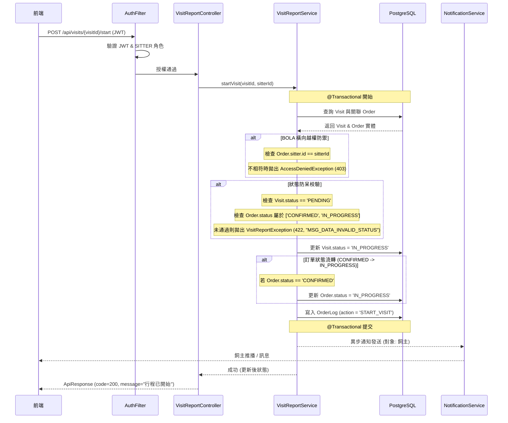

# SD-008: 服務執行與 Check-in 設計文件

| 項目 | 內容 |
|------|------|
| 對應需求 | [PRD-008-service-execution.md](file:///Users/will_chiang/Widget_home/cat-sitter-project/docs/sa/fr/PRD-008-service-execution.md) |
| 負責 SD | AI (Antigravity) |
| 建立日期 | 2026-06-04 |
| 狀態 | Draft |
| DB 表 | `visits`, `orders`, `order_logs` |
| 相依共用設計 | [SD-022: 行程照護日誌與多媒體回報](file:///Users/will_chiang/Widget_home/cat-sitter-project/docs/sd/SD-022-care-log.md), [SD-009: 服務完成與帳務歸屬](file:///Users/will_chiang/Widget_home/cat-sitter-project/docs/sd/SD-009-order-completion.md) |

---

## 1. 狀態移轉與聯動關係

本設計核心在於解決 `CONFIRMED` 狀態到 `IN_PROGRESS` 狀態的觸發機制，並將行程（Visit）的生命週期狀態機與訂單（Order）生命週期結合。

### 狀態流轉矩陣

| 當前訂單狀態 | 當前行程狀態 | 觸發動作 (API) | 變更後訂單狀態 | 變更後行程狀態 | 業務含意 |
| :--- | :--- | :--- | :--- | :--- | :--- |
| `CONFIRMED` | `PENDING` | `POST /start` | `IN_PROGRESS` | `IN_PROGRESS` | **首日 Check-in**：保母執行整個預約的第一個行程，訂單與行程皆轉為 `IN_PROGRESS` |
| `IN_PROGRESS` | `PENDING` | `POST /start` | `IN_PROGRESS` | `IN_PROGRESS` | **後續日 Check-in**：後續天數的行程啟動，僅將該行程狀態更新為 `IN_PROGRESS` |
| `IN_PROGRESS` | `IN_PROGRESS` | `POST /end` | `IN_PROGRESS` | `DONE` | **行程 Check-out**：今日服務結束，紀錄完工時間。此時保母才可填寫並提交服務日誌 |

---

## 2. 序列圖

### 2.1 行程 Check-in (開始服務)



---

## 3. 資料模型與 DDL 變更

本功能依賴既有的 `visits` 與 `orders` 結構，不需要新增 Table，但需要在程式碼層面規範狀態常數值。

### 欄位規格確認
* `visits.status`：`PENDING` (待執行) -> `IN_PROGRESS` (執行中) -> `DONE` (已結束) -> `CLOSED_BY_SYSTEM` (系統強制關閉)。
* `orders.status`：`CONFIRMED` -> `IN_PROGRESS` (在保母首日 Check-in 時觸發流轉)。

---

## 4. API 設計

### 4.1 開始行程 (Check-in)
* **Method**: `POST`
* **Path**: `/api/visits/{visitId}/start`
* **說明**: 保母抵達現場點擊開始，觸發行程與訂單狀態流轉。
* **權限**: 僅限 `SITTER` 角色，且需為訂單之受託保母。

#### Request Header
```http
Authorization: Bearer <JWT_TOKEN>
Idempotency-Key: <UUID> (必填)
```

#### Response (200 OK)
```json
{
  "code": 200,
  "message": "行程已開始",
  "data": {
    "visitId": "2624511e-3f10-4376-b81e-7fb02e615dda",
    "visitStatus": "IN_PROGRESS",
    "orderStatus": "IN_PROGRESS"
  }
}
```

---

### 4.2 結束行程 (Check-out)
* **Method**: `POST`
* **Path**: `/api/visits/{visitId}/end`
* **說明**: 保母照護服務結束點擊完工，記錄 `finished_at`，開啟服務日誌提交權限。
* **權限**: 僅限 `SITTER` 角色，且需為訂單之受託保母。

#### Request Header
```http
Authorization: Bearer <JWT_TOKEN>
Idempotency-Key: <UUID> (必填)
```

#### Response (200 OK)
```json
{
  "code": 200,
  "message": "行程已結束",
  "data": {
    "visitId": "2624511e-3f10-4376-b81e-7fb02e615dda",
    "visitStatus": "DONE",
    "finishedAt": "2026-06-04T12:00:00Z"
  }
}
```

---

## 5. 異常錯誤代碼

對應處理例外時應回傳之 `HttpStatus` 與錯誤代碼：

| 異常情境 | HTTP Status | Code | Message |
| :--- | :--- | :--- | :--- |
| 找不到對應行程 | 404 | `MSG_DATA_F11` | 找不到行程 |
| 越權操作他人訂單行程 | 403 | - | Access Denied / 權限不足 |
| 行程非 PENDING 卻嘗試 start | 422 | `MSG_DATA_INVALID_STATUS` | 行程非待執行狀態，無法開始 |
| 訂單非合規狀態 (非 CONFIRMED/IN_PROGRESS) | 422 | `MSG_DATA_INVALID_STATUS` | 訂單狀態不符合執行要求 |
| 行程非 IN_PROGRESS 卻嘗試 end | 422 | `MSG_DATA_INVALID_STATUS` | 行程非執行中狀態，無法結束 |

---

## 6. UX 與前端執行面板規範

為了便於保母在現場進行單手操作，前端應實作「**簡化執行控制台**」：
1. **大按鈕設計**：
   * 行程為 `PENDING` 時，僅顯示大尺寸的綠色「**開始服務 (Check-in)**」按鈕。
   * 點擊 Check-in 後，進入 `IN_PROGRESS` 面板，此時展開「照護 SOP 清單」與「多媒體日誌上傳」區塊，下方顯示紅色「**完成服務 (Check-out)**」按鈕。
   * 點擊 Check-out 後，行程進入 `DONE` 狀態，控制台鎖定 SOP 與媒體上傳，僅保留「編輯並提交今日服務報告」按鈕。
2. **離線支援防呆**：
   * 若網絡斷線，前端在點擊 Check-in / Check-out 時應本地記錄時間，並在連線恢復後以該時間發送補送請求。（離線補送機制已延後至 Open Beta 實作）
