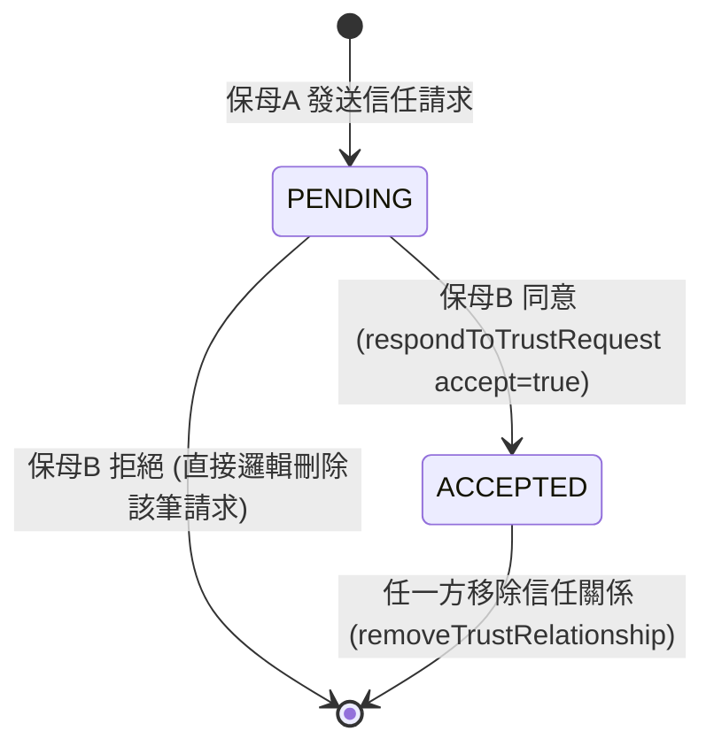
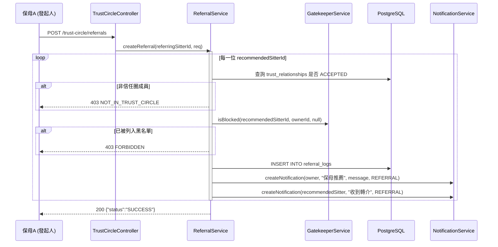

# SD-010: 信任圈與轉介機制 (Trust Circle & Referral)

| 項目 | 內容 |
|------|------|
| 模組編號 | SD-010 |
| 對應 PRD | PRD-010 |
| 核心技術 | 雙向同意制狀態機, 黑名單前置過濾, 跨角色通知 |
| 狀態 | **Approved** |

---

## 1. 業務邏輯與流程設計

### 1.1 信任圈：雙向同意制
`trust_relationships` 是一張 requester → target 的有向邊，但業務上必須雙方都同意才算成立：



- `(requester_id, target_id)` 有 `UNIQUE` 約束，防止對同一對象重複發送請求。
- 查詢「我的信任圈」時需同時查 `requester_id = 我` OR `target_id = 我` 且 `status = ACCEPTED`（`TrustRelationshipRepository.findAcceptedBySitterId`），因為信任關係建立後不分發起/被發起。
- 拒絕請求與移除信任關係都是**邏輯刪除**該筆 `trust_relationships`，不保留 `REJECTED` 狀態——PRD-010 未要求追蹤拒絕歷史，重複發送時 `UNIQUE` 約束不會擋到（舊記錄已標記刪除）。

### 1.2 轉介：黑名單前置過濾
轉介候選名單 (`ReferralService.getReferralCandidates`) 只回傳同時滿足以下條件的信任圈成員：
1. 與發起保母的信任關係為 `ACCEPTED`
2. **該候選保母尚未將目標飼主列入黑名單**（呼叫既有的 `GatekeeperService.isBlocked`，PRD-010 主流程 B.2「黑名單前置過濾」）

`createReferral` 寫入 `referral_logs` 前，會針對每一位被選中的推薦對象重新驗證上述兩項條件（而非只信任前端傳來的候選清單），避免飼主在候選名單顯示後，保母才臨時把該飼主加入黑名單造成的競態。

### 1.3 轉介的兩種入口
- **B. 訂單關聯轉介**：`CreateReferralRequest.orderId` 有值，`ownerId` 從該訂單反查，且驗證 `order.sitter_id == 發起人`。
- **D. 主動分享轉介**：`orderId` 為 null，改用 `ownerId` 直接指定通知對象（飼主 ID/Email 搜尋後取得）。

两種入口共用同一個 `createReferral` 寫入邏輯與通知邏輯，差異僅在 `owner` 的取得方式。

---

## 2. API 定義

全部端點掛在 `/api/sitter/trust-circle`，Controller 層統一 `@PreAuthorize("hasRole('SITTER')")`。

| Method | Path | 說明 |
|--------|------|------|
| GET | `/api/sitter/trust-circle` | 我的信任圈清單（僅 ACCEPTED） |
| GET | `/api/sitter/trust-circle/search?query=` | 依保母 UUID 或 Email 搜尋（供發送邀請前確認對象） |
| GET | `/api/sitter/trust-circle/requests/incoming` | 待我回應的邀請 |
| GET | `/api/sitter/trust-circle/requests/outgoing` | 我發出、對方尚未回應的邀請 |
| POST | `/api/sitter/trust-circle/requests/{targetId}` | 發送信任請求 |
| POST | `/api/sitter/trust-circle/requests/{relationshipId}/respond` | 回應邀請 `{"accept": true\|false}` |
| DELETE | `/api/sitter/trust-circle/{relationshipId}` | 移除信任關係（雙方皆可操作） |
| GET | `/api/sitter/trust-circle/referral-candidates?ownerId=` | 轉介候選名單（已過濾黑名單） |
| POST | `/api/sitter/trust-circle/referrals` | 送出轉介 |

### Request Body：送出轉介
```json
{
  "orderId": "uuid-or-null",
  "ownerId": "uuid-required-if-orderId-null",
  "recommendedSitterIds": ["uuid-1", "uuid-2"],
  "message": "這位保母也很細心，特別擅長照顧老貓"
}
```

---

## 3. 詳細邏輯與序列圖 (Sequence Diagram)



---

## 4. 資料庫異動與限制 (DB Constraint)

```sql
CREATE TABLE trust_relationships (
    id UUID PRIMARY KEY DEFAULT gen_random_uuid(),
    requester_id UUID NOT NULL REFERENCES users(id),
    target_id UUID NOT NULL REFERENCES users(id),
    status VARCHAR(20) NOT NULL DEFAULT 'PENDING', -- PENDING, ACCEPTED
    version INT NOT NULL DEFAULT 1,
    created_at TIMESTAMPTZ NOT NULL DEFAULT NOW(),
    updated_at TIMESTAMPTZ NOT NULL DEFAULT NOW(),
    is_deleted BOOLEAN NOT NULL DEFAULT FALSE,
    CONSTRAINT uk_trust_requester_target UNIQUE (requester_id, target_id)
);
CREATE INDEX idx_trust_relationships_requester ON trust_relationships(requester_id);
CREATE INDEX idx_trust_relationships_target ON trust_relationships(target_id);

CREATE TABLE referral_logs (
    id UUID PRIMARY KEY DEFAULT gen_random_uuid(),
    referring_sitter_id UUID NOT NULL REFERENCES users(id),
    order_id UUID REFERENCES orders(id), -- nullable：主動分享轉介無關聯訂單
    owner_id UUID NOT NULL REFERENCES users(id),
    recommended_sitter_id UUID NOT NULL REFERENCES users(id),
    message TEXT,
    version INT NOT NULL DEFAULT 1,
    created_at TIMESTAMPTZ NOT NULL DEFAULT NOW(),
    updated_at TIMESTAMPTZ NOT NULL DEFAULT NOW(),
    is_deleted BOOLEAN NOT NULL DEFAULT FALSE
);
CREATE INDEX idx_referral_logs_owner ON referral_logs(owner_id);
CREATE INDEX idx_referral_logs_recommended_sitter ON referral_logs(recommended_sitter_id);
```

- 通知系統 (`notification_preferences`/`notifications` 的 `category` CHECK 約束) 新增 `REFERRAL` 分類，需同步修改既有的兩處 CHECK 約束（見 `V20260719_04__add_referral_notification_category.sql`）。

---

## 5. 防呆與邊界條件 (Edge Cases)

| 情境 | 處理方式 |
|------|---------|
| 自己邀請自己 | 400，拒絕 |
| 邀請對象非保母角色 / 已刪除帳號 | 404 `SITTER_NOT_FOUND` |
| 重複發送邀請（已是 PENDING 或 ACCEPTED） | 409 `TRUST_ALREADY_EXISTS` |
| 回應已被處理過的請求（重複點擊） | 409 `STATE_CONFLICT` |
| 非邀請對象本人回應邀請 | 403 `FORBIDDEN` |
| 轉介對象目前休假/停權 | `ReferralCandidateDto.available=false`，前端標註但不隱藏（不阻擋轉介，只是提示） |
| 轉介給非信任圈成員（繞過前端直接打 API） | 403 `NOT_IN_TRUST_CIRCLE`，後端重新驗證，不信任前端候選清單 |
| 轉介候選已被保母事後加入黑名單 | 送出當下重新查 `GatekeeperService.isBlocked`，403 |
