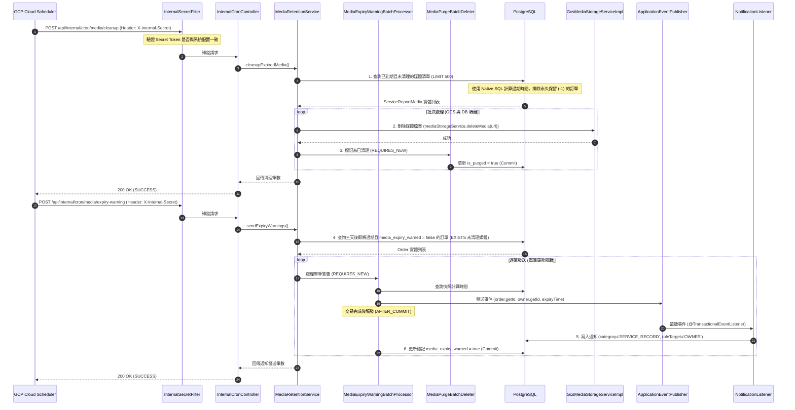

# SD-013: 多媒體生命週期與保留策略設計文件

| 項目 | 內容 |
|------|------|
| 對應需求 | PRD-013 |
| 負責 SD | AI (Antigravity) |
| 建立日期 | 2026-06-30 |
| 狀態 | Draft |
| DB 表 | `service_report_media`, `order_snapshots`, `orders` |
| 相依共用設計 | [SD-009 訂單自動結案](SD-009-order-completion.md), [SD-014 通知中心](SD-014-notification-center.md) |

---

## 1. 系統時序與業務流程

### 1.1. Cloud Run 相容之自動物理清理與通知流程

由於生產環境部署於 Cloud Run 且 `min-instances` 設定為 `0`，系統**禁用** Spring 內部的 `@Scheduled` 記憶體排程。
本設計全面採用 **GCP Cloud Scheduler -> HTTPS POST (帶 X-Internal-Secret) -> InternalCronController** 的主動觸發模式，經由安全過濾器驗證後調用 Service 執行。



---

## 2. 資料模型變更 (Schema Migrations)

### 2.1. 新增欄位與索引 (Database DDL)

本專案 `OrderSnapshot` 中已存在 `media_retention_days` (快照天數) 與 `plan_tier` (快照方案等級) 欄位，無需重複建立。
*   `media_retention_days` 為 `Integer`。`-1` 代表永久保留 (Infinity)，排程中會確認此值並予以排除。

本次 Flyway 遷移僅針對 `service_report_media` (多媒體日誌表) 與 `orders` (訂單表) 新增狀態欄位：

```sql
-- V20260630_02__add_media_purge_fields.sql

-- 1. 於 service_report_media 新增物理清理標記與時間
ALTER TABLE service_report_media ADD COLUMN is_purged BOOLEAN NOT NULL DEFAULT FALSE;
ALTER TABLE service_report_media ADD COLUMN purged_at TIMESTAMPTZ;

-- 2. 於 orders 新增逾期提醒通知發送標記
ALTER TABLE orders ADD COLUMN media_expiry_warned BOOLEAN NOT NULL DEFAULT FALSE;

-- 3. 建立複合索引優化清理排程的掃描效率
CREATE INDEX idx_report_media_purge ON service_report_media(is_purged) WHERE is_purged = FALSE;
CREATE INDEX idx_orders_expiry_warn ON orders(media_expiry_warned, status) WHERE status = 'COMPLETED';
```

### 2.2. Java Entity 欄位新增宣告 (對應 Lombok 規範)

為對齊 DDL，並遵循專案使用 `@SuperBuilder` 與 `@Builder.Default` 統一慣例，實體類別新增宣告如下：

#### A. `ServiceReportMedia.java` 新增：
```java
@Builder.Default
@Column(name = "is_purged", nullable = false)
private boolean isPurged = false;

@Column(name = "purged_at")
private OffsetDateTime purgedAt;
```
*   **Lombok 生成 Setter/Getter 命名規範**：
    *   Getter: `media.isPurged()`
    *   Setter: `media.setPurged(boolean)`
    *   PurgedAt Setter: `media.setPurgedAt(OffsetDateTime)`

#### B. `Order.java` 新增：
```java
@Builder.Default
@Column(name = "media_expiry_warned", nullable = false)
private boolean mediaExpiryWarned = false;
```
*   **Lombok 生成 Setter/Getter 命名規範**：
    *   Getter: `order.isMediaExpiryWarned()`
    *   Setter: `order.setMediaExpiryWarned(boolean)`

---

## 3. 核心 API 設計

### 3.1. [排程] 物理清理端點
* **Method**: `POST`
* **Path**: `/api/internal/cron/media/cleanup`
* **說明**: 物理刪除已過期的多媒體檔案並更新資料庫
* **安全防禦**: 受 `InternalSecretFilter` 保護，需帶 `X-Internal-Secret` 標頭
* **Response (200 OK)**:
```json
{
  "status": "SUCCESS",
  "message": "Media cleanup task executed",
  "deletedCount": 42
}
```

### 3.2. [排程] 逾期前三天通知端點
* **Method**: `POST`
* **Path**: `/api/internal/cron/media/expiry-warning`
* **說明**: 掃描三天後即將過期的日誌，發送通知給飼主
* **安全防禦**: 受 `InternalSecretFilter` 保護，需帶 `X-Internal-Secret` 標頭
* **Response (200 OK)**:
```json
{
  "status": "SUCCESS",
  "message": "Media expiry warning task executed",
  "warnedCount": 5
}
```

---

## 4. 關鍵技術實作

### 4.1. 物理清理 Native SQL 查詢
因為每個訂單的快照保留天數 (`media_retention_days`) 不同，且 JPQL 對於複雜 ON 聯接與 PostgreSQL 的 `INTERVAL` 運算支援不佳，此處使用 `nativeQuery = true` 以確保 PostgreSQL 執行效能：

```java
// ServiceReportMediaRepository.java
public interface ServiceReportMediaRepository extends JpaRepository<ServiceReportMedia, UUID> {

    @Query(value = """
        SELECT srm.* FROM service_report_media srm
        JOIN visit_service_reports sr ON srm.report_id = sr.id
        JOIN visits v ON sr.visit_id = v.id
        JOIN orders o ON v.order_id = o.id
        JOIN order_snapshots os ON os.order_id = o.id
        WHERE o.status = 'COMPLETED'
          AND srm.is_purged = false
          AND os.media_retention_days != -1
          AND o.completed_at + (os.media_retention_days || ' day')::interval < :now
        """, nativeQuery = true)
    List<ServiceReportMedia> findExpiredMedia(@Param("now") OffsetDateTime now, Pageable pageable);
}
```

### 4.2. 逾期通知 Native SQL 查詢 (防禦性過濾)
為防止排程停擺等異常狀況，導致照片早已被物理清理完畢，卻仍發送「即將到期」幽靈警告的邊界情境，查詢中必須透過 `EXISTS` 子查詢卡控：**僅針對仍有「未物理清理」且「未刪除」媒體的結案訂單**發送警告：

```java
// OrderRepository.java
public interface OrderRepository extends JpaRepository<Order, UUID> {

    @Query(value = """
        SELECT o.* FROM orders o
        JOIN order_snapshots os ON os.order_id = o.id
        WHERE o.status = 'COMPLETED'
          AND o.media_expiry_warned = false
          AND os.media_retention_days != -1
          AND o.completed_at + ((os.media_retention_days - 3) || ' day')::interval <= :now
          AND EXISTS (
              SELECT 1 FROM service_report_media srm2
              JOIN visit_service_reports sr2 ON srm2.report_id = sr2.id
              JOIN visits v2 ON sr2.visit_id = v2.id
              WHERE v2.order_id = o.id 
                AND srm2.is_purged = false 
                AND srm2.is_deleted = false
          )
        """, nativeQuery = true)
    List<Order> findOrdersPendingMediaExpiryWarning(@Param("now") OffsetDateTime now);
}
```

### 4.3. OrderSnapshotRepository 定義與升級追溯展延
當保母訂閱方案變更時，必須將其名下所有已結案且未物理清理的訂單快照展延。

在 `OrderSnapshotRepository.java` 中新增查詢方法：
```java
// OrderSnapshotRepository.java
public interface OrderSnapshotRepository extends JpaRepository<OrderSnapshot, UUID> {

    Optional<OrderSnapshot> findByOrderId(UUID orderId);

    @Query("SELECT os FROM OrderSnapshot os WHERE os.order.sitter.id = :sitterId AND os.order.status = 'COMPLETED'")
    List<OrderSnapshot> findActiveSnapshotsForUpgrade(@Param("sitterId") UUID sitterId);
}
```

在訂閱服務中執行升級邏輯：
```java
// SitterSubscriptionService.java
@Transactional
public void upgradeSitterMediaRetention(UUID sitterId, UUID operatorId, String newPlanTier, int newRetentionDays) {
    // 1. 查詢該保母名下所有已完成之訂單快照
    List<OrderSnapshot> snapshots = orderSnapshotRepository.findActiveSnapshotsForUpgrade(sitterId);
    
    for (OrderSnapshot snapshot : snapshots) {
        snapshot.setMediaRetentionDays(newRetentionDays);
        snapshot.setPlanTier(newPlanTier);
        orderSnapshotRepository.save(snapshot);
    }
    
    // 2. 寫入審計日誌 (5 參數簽章)
    // 參數順序: funcCode, actionType, operatorId, targetId, targetTable
    auditLogService.writeUserActionLog(
        "SITTER_MEDIA_RETENTION_EXTEND", 
        "UPDATE", 
        operatorId, 
        sitterId, 
        "order_snapshots"
    );
}
```

### 4.4. 批次清理與非同步通知發送實作 (防止單筆失敗阻塞)

為防範髒資料（如某一筆訂單的 Snapshot 遺失）導致整批排程拋出例外回滾，我們排除 `sendExpiryWarnings` 的大事務，並將每筆處理邏輯拆分為使用 `Propagation.REQUIRES_NEW` 的獨立事務 Bean。

```java
// MediaRetentionServiceImpl.java
@Service
@RequiredArgsConstructor
public class MediaRetentionServiceImpl implements MediaRetentionService {
    private final ServiceReportMediaRepository mediaRepository;
    private final MediaStorageService mediaStorageService;
    private final MediaPurgeBatchDeleter batchDeleter;
    private final OrderRepository orderRepository;
    private final MediaExpiryWarningBatchProcessor warningProcessor;

    @Override
    public int cleanupExpiredMedia() {
        OffsetDateTime now = OffsetDateTime.now(ZoneOffset.UTC);
        int deletedCount = 0;
        boolean hasMore = true;
        int limit = 500;

        while (hasMore) {
            List<ServiceReportMedia> expired = mediaRepository.findExpiredMedia(now, PageRequest.of(0, limit));
            if (expired.isEmpty()) {
                hasMore = false;
                continue;
            }

            for (ServiceReportMedia media : expired) {
                try {
                    // 1. 事務外執行 GCS 刪除
                    mediaStorageService.deleteMedia(media.getMediaUrl());

                    // 2. 跨 Bean 呼叫標記 DB 刪除 (開啟新事務)
                    batchDeleter.markAsPurged(media.getId());
                    deletedCount++;
                } catch (Exception e) {
                    log.error("Failed to purge media file: " + media.getMediaUrl(), e);
                }
            }
        }
        return deletedCount;
    }

    @Override
    public int sendExpiryWarnings() {
        OffsetDateTime now = OffsetDateTime.now(ZoneOffset.UTC);
        List<Order> pendingOrders = orderRepository.findOrdersPendingMediaExpiryWarning(now);
        int warnedCount = 0;

        for (Order order : pendingOrders) {
            try {
                // 3. 呼叫 REQUIRES_NEW 的處理器 (單筆事務提交，失敗不阻塞下一筆)
                warningProcessor.processWarning(order);
                warnedCount++;
            } catch (Exception e) {
                log.error("Failed to send expiry warning for order: " + order.getId(), e);
            }
        }
        return warnedCount;
    }
}

// MediaPurgeBatchDeleter.java
@Component
@RequiredArgsConstructor
public class MediaPurgeBatchDeleter {
    private final ServiceReportMediaRepository mediaRepository;

    @Transactional(propagation = Propagation.REQUIRES_NEW)
    public void markAsPurged(UUID mediaId) {
        ServiceReportMedia media = mediaRepository.findById(mediaId).orElseThrow();
        media.setPurged(true);
        media.setPurgedAt(OffsetDateTime.now(ZoneOffset.UTC));
        mediaRepository.saveAndFlush(media);
    }
}

// MediaExpiryWarningBatchProcessor.java
@Component
@RequiredArgsConstructor
public class MediaExpiryWarningBatchProcessor {
    private final OrderRepository orderRepository;
    private final OrderSnapshotRepository orderSnapshotRepository;
    private final ApplicationEventPublisher eventPublisher;

    @Transactional(propagation = Propagation.REQUIRES_NEW)
    public void processWarning(Order order) {
        OrderSnapshot snapshot = orderSnapshotRepository.findByOrderId(order.getId())
            .orElseThrow(() -> new IllegalStateException("Snapshot missing for order: " + order.getId()));
        
        // 計算精確的到期時間
        OffsetDateTime expiryTime = order.getCompletedAt().plusDays(snapshot.getMediaRetentionDays());

        // 發布事件
        eventPublisher.publishEvent(new MediaExpiryWarningEvent(order.getId(), order.getOwner().getId(), expiryTime));
        
        // 更新並存檔標記
        order.setMediaExpiryWarned(true);
        orderRepository.saveAndFlush(order);
    }
}
```

---

## 5. 權限與通知設計

### 5.1. 權限防禦
- `/api/internal/cron/**` 端點**不對外開放**。
- `InternalSecretFilter` 會過濾所有進入此路徑的請求，強制驗證 `X-Internal-Secret` 標頭值。驗證失敗直接回傳 `401 Unauthorized`。

### 5.2. 非同步通知發送機制
發送警告通知時，採用 Spring 事件解耦，並在 `MediaExpiryWarningEvent` 中傳遞 `expiryTime` 以便將具體日期格式化寫入通知：

```java
// MediaExpiryWarningEvent.java
@Getter
@AllArgsConstructor
public class MediaExpiryWarningEvent {
    private final UUID orderId;
    private final UUID ownerId;
    private final OffsetDateTime expiryTime;
}
```

```java
// MediaExpiryNotificationListener.java
@Component
@RequiredArgsConstructor
public class MediaExpiryNotificationListener {
    private final NotificationService notificationService;

    @Async
    @TransactionalEventListener(phase = TransactionPhase.AFTER_COMMIT)
    public void handleExpiryWarning(MediaExpiryWarningEvent event) {
        // 將到期時間格式化為 yyyy-MM-dd，消除模糊的「3天後」文案
        String dateStr = event.getExpiryTime().format(DateTimeFormatter.ofPattern("yyyy-MM-dd"));
        String content = "您的服務報告內含照片/影片將於 " + dateStr + " 自動移除，請儘速下載備份。";

        // 參數順序: userId, title, content, category, linkUrl, roleTarget
        notificationService.createNotification(
            event.getOwnerId(),
            "照護影像即將過期提醒",
            content,
            "SERVICE_RECORD",
            "/visits/report?orderId=" + event.getOrderId(),
            "OWNER"
        );
    }
}
```

---

## 6. 前端與 UX 串接設計

### 6.1. DTO 擴充與 Service 層組裝邏輯 (下沉至 Media 粒度)

為防止單筆報告內「部分媒體被清理，部分媒體仍在」時產生渲染誤判（例如：5張照片，3張逾期被清理，2張仍在，誤將整個報告全部遮擋成佔位盒），物理清理判定必須**下沉至 Media (單個檔案) 粒度**：

1.  **`ReportMediaDto.java`** 新增 `isPurged` 唯讀欄位：
    ```java
    // ReportMediaDto.java
    public class ReportMediaDto {
        private UUID mediaId;
        private String mediaUrl;
        private String mediaType;
        private String caption;
        private Integer version;
        private boolean isPurged; // 新增：個別媒體是否已物理清理標記
    }
    ```
2.  **`VisitServiceReportDto.java`** 擴充以下 4 個唯讀欄位：
    - `mediaRetentionDays`: Integer
    - `completedAt`: OffsetDateTime
    - `expiryTime`: OffsetDateTime
    - `isPurged`: Boolean (標示報告內是否「至少有任一媒體已過期」，供頂部 Banner 警示判定)

#### 後端組裝邏輯 (Assembly Logic)
在 `VisitReportService.java` 的 DTO 轉換方法中，對 per-item 與 report-level 的 isPurged 屬性進行組裝：

```java
// VisitReportService.java
private VisitServiceReportDto convertToDto(VisitServiceReport report, Visit visit) {
    List<ServiceReportMedia> mediaList = mediaRepository.findByReportIdAndIsDeletedFalse(report.getId());
    
    // 組裝個別媒體 DTO (Per-item 粒度)
    List<ReportMediaDto> mediaDtos = mediaList.stream()
            .map(m -> ReportMediaDto.builder()
                    .mediaId(m.getId())
                    .mediaUrl(m.getMediaUrl())
                    .mediaType(m.getMediaType())
                    .caption(m.getCaption())
                    .version(m.getVersion())
                    .isPurged(m.isPurged()) // 寫入單一媒體是否已被物理刪除
                    .build())
            .collect(Collectors.toList());

    // 判斷報告內是否「至少有任一媒體」已被清理 (Report-level 粒度，供 Banner 判定)
    boolean hasAnyPurged = mediaList.stream().anyMatch(ServiceReportMedia::isPurged);

    // 取得關聯 Order 與 OrderSnapshot
    Order order = visit.getOrder();
    Optional<OrderSnapshot> optSnapshot = orderSnapshotRepository.findByOrderId(order.getId());
    
    Integer mediaRetentionDays = null;
    OffsetDateTime completedAt = order.getCompletedAt();
    OffsetDateTime expiryTime = null;

    if (optSnapshot.isPresent()) {
        OrderSnapshot snapshot = optSnapshot.get();
        mediaRetentionDays = snapshot.getMediaRetentionDays();
        
        if (completedAt != null && mediaRetentionDays != -1) {
            expiryTime = completedAt.plusDays(mediaRetentionDays);
        }
    }

    return VisitServiceReportDto.builder()
            .reportId(report.getId())
            .visitId(report.getVisitId())
            .status(report.getStatus())
            .content(report.getContent())
            .submittedAt(report.getSubmittedAt())
            .media(mediaDtos) // 傳遞包含 isPurged 屬性的 list
            .isEditable(isEditable)
            .version(report.getVersion())
            .visitStatus(visit.getStatus())
            // 新增擴充屬性
            .mediaRetentionDays(mediaRetentionDays)
            .completedAt(completedAt)
            .expiryTime(expiryTime)
            .isPurged(hasAnyPurged) // 只要有一筆清理即為 true
            .build();
}
```

### 6.2. 前端 UX 渲染邏輯
在 `VisitReportManager.tsx` 中，對媒體列表依據 **單一媒體粒度 (`media.isPurged`)** 進行狀態攔截，確保未過期媒體仍可正常瀏覽：

```typescript
// 渲染媒體元素時 (Per-item 粒度判斷)
mediaList.map((media) => {
  if (media.isPurged) { // 修正為單筆 media 判斷
    return (
      <div className="purged-media-placeholder">
        <span className="icon">🐾</span>
        <span className="text">檔案已逾期移除</span>
      </div>
    );
  }
  return <MediaRenderer url={media.mediaUrl} caption={media.caption} />;
});
```

在頁面頂部，若訂單已結案且非永久保留，計算倒數天數：
- `remainingDays = Math.ceil((expiryTime - NOW) / (1000 * 60 * 60 * 24))`
- 若 `remainingDays <= 3` 且 `remainingDays > 0`：顯示黃色警告橫幅：**「⚠️ 此報告的照片將於 {remainingDays} 天後自動移除，請儘快備份。」**
- 若 `report.isPurged` 為 `true` (有部分或全部被清理)：於頂部顯示通知橫幅：**「🐾 此報告的部分照片已逾期移除。」**
