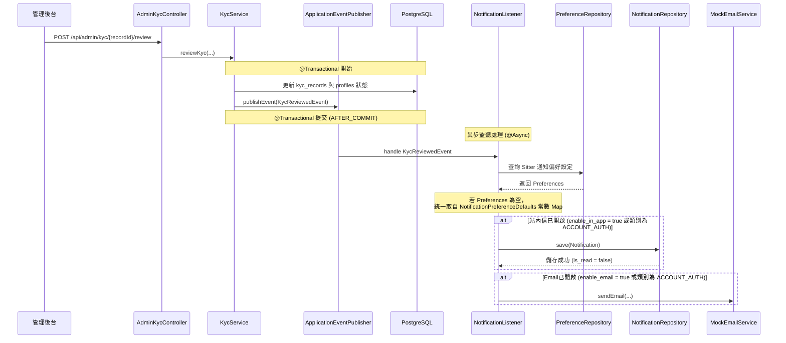
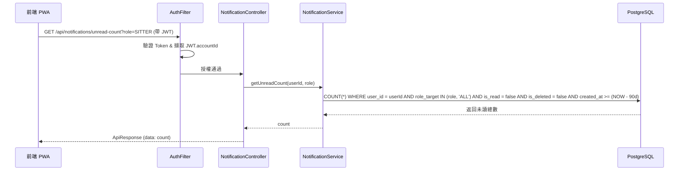
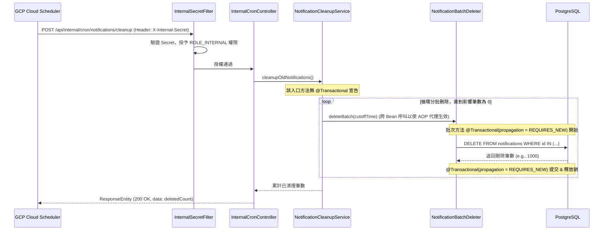

# SD-014: 訊息中心與推播通知設計文件

| 項目 | 內容 |
|------|------|
| 對應需求 | [PRD-014-notification-center.md](file:///Users/will_chiang/Widget_home/cat-sitter-project/docs/sa/fr/PRD-014-notification-center.md) |
| 負責 SD | AI (Antigravity) |
| 建立日期 | 2026-06-14 |
| 狀態 | Implemented & Verified |
| DB 表 | `notifications`, `notification_preferences` |
| 相依共用設計 | 帳號權限系統、內部 Cron 控制器安全設計、非同步事件處理器 |

---

## 1. 系統架構與技術決策

### 1.1. 避免無伺服器環境長連接陷阱 (Cloud Run min-instances: 0)
* **背景與限制**：平台在 Cloud Run 部署且設定 `min-instances: 0`。若使用 WebSocket 或 SSE (Server-Sent Events) 等長連接維持小鈴鐺的未讀數更新，會導致 Cloud Run 實體被長連接綁定而無法自動縮容至 0，從而產生高額且非預期的帳單。
* **技術決策**：
  * **禁用** WebSocket 與 SSE。
  * **小鈴鐺未讀數同步方案**：前端採用 **React Query (TanStack Query)** 搭配**主動拉取（Polling / Event-driven Refetch）**：
    1. 設定合理的快取時間 (`staleTime: 30000`，即 30 秒內不重複拉取)。
    2. 開啟 `refetchOnWindowFocus`，當使用者切換回 App 視窗時自動獲取最新通知。
    3. 當使用者在前端觸發特定會產生通知的關鍵操作時，主動調用 React Query 的 `invalidateQueries` 來刷新未讀計數。

### 1.2. 安全偏好常數配置與安全鎖 (Preference Safety Lock & Defaults)
* **偏好預設值方案（動態補齊）**：為避免程式碼多處硬編碼導致偏好設定預設值不一致（如 `SUBSCRIPTION_MAINTENANCE` 的 Email 預設不開啟），系統將建立全域常數 `NotificationPreferenceDefaults` 進行統一管理：
  * `ORDER_AFFAIR` -> `(inApp: true, email: true)`
  * `ACCOUNT_AUTH` -> `(inApp: true, email: true)`
  * `SUBSCRIPTION_MAINTENANCE` -> `(inApp: true, email: false)`
  * `SERVICE_RECORD` -> `(inApp: true, email: true)`
  * **API 查詢**與 **`NotificationListener` 發送事件**時，若在 `notification_preferences` 表中找不到對應的使用者設定，統一降級使用此常數作為預設配置。
* **安全控管鎖定**：系統定義 `ACCOUNT_AUTH` (帳號認證) 類別的通知直接與帳號資安、KYC 審核狀態及停權相關，為平台營運安全之核心，**必須強制發送**。
  1. 更新偏好設定 API：若嘗試將 `ACCOUNT_AUTH` 的偏好開關設為 `false`，API 需拋出 `400 BAD REQUEST` (代碼：`MSG_DATA_INVALID_INPUT`) 予以攔截。
  2. 通知發送邏輯：即使資料庫中 `ACCOUNT_AUTH` 開關因異常變為 false，後端發送服務仍需判定為 true 並強制發送。
  3. 資料庫層級約束防禦：於 DB 層設計 CHECK 限制（Defense-in-depth Check），確保 `ACCOUNT_AUTH` 的偏好在資料庫層級永遠無法被設定為 false。

---

## 2. 序列圖

### 2.1. 非同步通知發送流程 (以 KYC 審核結果事件為例)



### 2.2. 使用者查詢未讀數與清單 (角色隔離)



### 2.3. 90 天歷史通知物理清理流程



---

## 3. 資料模型變更

### 3.1. DDL 腳本 (`V20260614_01__create_notifications_and_preferences.sql`)

```sql
-- 1. 建立 notifications 表
CREATE TABLE notifications (
    id            uuid NOT NULL DEFAULT gen_random_uuid(),
    user_id       uuid NOT NULL,
    title         varchar(150) NOT NULL,
    content       text NOT NULL,
    category      varchar(50) NOT NULL, -- ORDER_AFFAIR, ACCOUNT_AUTH, SUBSCRIPTION_MAINTENANCE, SERVICE_RECORD
    is_read       boolean NOT NULL DEFAULT false,
    read_at       timestamp with time zone,
    link_url      varchar(255),
    role_target   varchar(20) NOT NULL DEFAULT 'ALL', -- SITTER, OWNER, ALL
    
    -- 基礎實體欄位
    version       integer NOT NULL DEFAULT 0,
    created_at    timestamp with time zone NOT NULL DEFAULT clock_timestamp(),
    updated_at    timestamp with time zone NOT NULL DEFAULT clock_timestamp(),
    created_by    uuid,
    updated_by    uuid,
    is_deleted    boolean NOT NULL DEFAULT false,
    
    PRIMARY KEY (id),
    CONSTRAINT fk_notification_user FOREIGN KEY (user_id) REFERENCES users(id),
    -- 資料庫層級 Category 防呆約束
    CONSTRAINT chk_notification_category CHECK (category IN ('ORDER_AFFAIR','ACCOUNT_AUTH','SUBSCRIPTION_MAINTENANCE','SERVICE_RECORD'))
);

-- 建立索引加速查詢與自動清理
-- 優化點：將 created_at 納入複合索引中，覆蓋 unread-count 條件及最近 10 筆通知的 Range Scan 需求
CREATE INDEX idx_notifications_user_role_read_created ON notifications(user_id, role_target, is_read, created_at);
CREATE INDEX idx_notifications_created_at ON notifications(created_at);

-- 2. 建立 notification_preferences 表
CREATE TABLE notification_preferences (
    id            uuid NOT NULL DEFAULT gen_random_uuid(),
    user_id       uuid NOT NULL,
    category      varchar(50) NOT NULL, -- ORDER_AFFAIR, ACCOUNT_AUTH, SUBSCRIPTION_MAINTENANCE, SERVICE_RECORD
    enable_in_app boolean NOT NULL DEFAULT true,
    enable_email  boolean NOT NULL DEFAULT true,
    
    -- 基礎實體欄位
    version       integer NOT NULL DEFAULT 0,
    created_at    timestamp with time zone NOT NULL DEFAULT clock_timestamp(),
    updated_at    timestamp with time zone NOT NULL DEFAULT clock_timestamp(),
    created_by    uuid,
    updated_by    uuid,
    is_deleted    boolean NOT NULL DEFAULT false,
    
    PRIMARY KEY (id),
    CONSTRAINT fk_preference_user FOREIGN KEY (user_id) REFERENCES users(id),
    CONSTRAINT uk_user_category UNIQUE (user_id, category),
    -- 資料庫層級 Category 防呆約束
    CONSTRAINT chk_pref_category CHECK (category IN ('ORDER_AFFAIR','ACCOUNT_AUTH','SUBSCRIPTION_MAINTENANCE','SERVICE_RECORD')),
    -- Defense-in-depth: 資料庫層級 ACCOUNT_AUTH 強制開啟防呆約束
    CONSTRAINT chk_pref_account_auth_locked CHECK (category != 'ACCOUNT_AUTH' OR (enable_in_app AND enable_email))
);

-- 建立索引
CREATE INDEX idx_notification_prefs_user ON notification_preferences(user_id);
```

### 3.2. JPA Entity 實體設計

#### `Notification.java`
```java
package com.petsitter.domain.model;

import jakarta.persistence.*;
import lombok.*;
import java.time.OffsetDateTime;
import java.util.UUID;

@Entity
@Table(name = "notifications")
@Getter
@Setter
@Builder
@NoArgsConstructor
@AllArgsConstructor
public class Notification {
    @Id
    @GeneratedValue
    private UUID id;

    @Column(name = "user_id", nullable = false)
    private UUID userId;

    @Column(nullable = false, length = 150)
    private String title;

    @Column(nullable = false, columnDefinition = "TEXT")
    private String content;

    @Column(nullable = false, length = 50)
    private String category;

    @Builder.Default
    @Column(name = "is_read", nullable = false)
    private boolean isRead = false;

    @Column(name = "read_at")
    private OffsetDateTime readAt;

    @Column(name = "link_url", length = 255)
    private String linkUrl;

    @Builder.Default
    @Column(name = "role_target", nullable = false, length = 20)
    private String roleTarget = "ALL";

    @Version
    private int version;

    @Column(name = "created_at", nullable = false, updatable = false)
    private OffsetDateTime createdAt;

    @Column(name = "updated_at", nullable = false)
    private OffsetDateTime updatedAt;

    @Column(name = "created_by")
    private UUID createdBy;

    @Column(name = "updated_by")
    private UUID updatedBy;

    @Builder.Default
    @Column(name = "is_deleted", nullable = false)
    private boolean isDeleted = false;

    @PrePersist
    protected void onCreate() {
        OffsetDateTime now = OffsetDateTime.now(java.time.ZoneOffset.UTC);
        this.createdAt = now;
        this.updatedAt = now;
    }

    @PreUpdate
    protected void onUpdate() {
        this.updatedAt = OffsetDateTime.now(java.time.ZoneOffset.UTC);
    }
}
```

#### `NotificationPreference.java`
```java
package com.petsitter.domain.model;

import jakarta.persistence.*;
import lombok.*;
import java.time.OffsetDateTime;
import java.util.UUID;

@Entity
@Table(name = "notification_preferences")
@Getter
@Setter
@Builder
@NoArgsConstructor
@AllArgsConstructor
public class NotificationPreference {
    @Id
    @GeneratedValue
    private UUID id;

    @Column(name = "user_id", nullable = false)
    private UUID userId;

    @Column(nullable = false, length = 50)
    private String category;

    @Builder.Default
    @Column(name = "enable_in_app", nullable = false)
    private boolean enableInApp = true;

    @Builder.Default
    @Column(name = "enable_email", nullable = false)
    private boolean enableEmail = true;

    @Version
    private int version;

    @Column(name = "created_at", nullable = false, updatable = false)
    private OffsetDateTime createdAt;

    @Column(name = "updated_at", nullable = false)
    private OffsetDateTime updatedAt;

    @Column(name = "created_by")
    private UUID createdBy;

    @Column(name = "updated_by")
    private UUID updatedBy;

    @Builder.Default
    @Column(name = "is_deleted", nullable = false)
    private boolean isDeleted = false;

    @PrePersist
    protected void onCreate() {
        OffsetDateTime now = OffsetDateTime.now(java.time.ZoneOffset.UTC);
        this.createdAt = now;
        this.updatedAt = now;
    }

    @PreUpdate
    protected void onUpdate() {
        this.updatedAt = OffsetDateTime.now(java.time.ZoneOffset.UTC);
    }
}
```

---

## 4. API 設計

### 4.1. 查詢訊息通知清單 (分頁)
* **Method**: `GET`
* **Path**: `/api/notifications`
* **Headers**: `Authorization: Bearer <JWT>`
* **Query Parameters**:
  * `page`: integer (optional, default: 0)
  * `size`: integer (optional, default: 20)
  * `isRead`: boolean (optional, 為空則不篩選讀取狀態)
  * `role`: string (optional, 例如 `SITTER` 或 `OWNER`，若帶入，則僅回傳 `role_target` 為該角色或 `ALL` 的通知，用以實作角色隔離)

#### Response (200 OK)
```json
{
  "code": 200,
  "message": "OK",
  "data": {
    "content": [
      {
        "id": "e2ba8178-14c0-4376-b81e-7fb02e615dda",
        "title": "有新的預約申請",
        "content": "飼主陳大華送出了一筆新的預約申請，請於 24 小時內評估並回覆。",
        "category": "ORDER_AFFAIR",
        "isRead": false,
        "createdAt": "2026-06-14T08:00:00Z",
        "linkUrl": "/sitter/orders",
        "roleTarget": "SITTER"
      }
    ],
    "page": 0,
    "size": 20,
    "totalElements": 1,
    "totalPages": 1
  }
}
```

---

### 4.2. 查詢未讀通知總數
* **Method**: `GET`
* **Path**: `/api/notifications/unread-count`
* **Headers**: `Authorization: Bearer <JWT>`
* **Query Parameters**:
  * `role`: string (optional, 例如 `SITTER` 或 `OWNER`)

#### Response (200 OK)
```json
{
  "code": 200,
  "message": "OK",
  "data": 5
}
```

---

### 4.3. 標示單則訊息為已讀
* **Method**: `POST`
* **Path**: `/api/notifications/{id}/read`
* **Headers**: `Authorization: Bearer <JWT>`
* **防禦性安全機制 (IDOR 漏洞防範與時序攻擊防禦)**：
  後端 Service 層必須嚴格驗證當前登入使用者與該通知之 Ownership，若通知不存在或不屬於當前使用者，**一律拋出 `ResourceNotFoundException("MSG_DATA_F11")` (404 Not Found)**。
  * **安全理由**：禁止使用 403 Forbidden 回傳，藉此隱藏資料存在性，防止攻擊者利用通知 ID 進行暴力枚舉 (Enumeration) 與時序差異攻擊。
  ```java
  Notification noti = notificationRepository.findById(id)
      .orElseThrow(() -> new ResourceNotFoundException("MSG_DATA_F11"));

  if (!noti.getUserId().equals(currentUserId)) {
      throw new ResourceNotFoundException("MSG_DATA_F11"); // 模糊化回應
  }
  ```

#### Response (200 OK)
```json
{
  "code": 200,
  "message": "標示已讀成功",
  "data": null
}
```

---

### 4.4. 一鍵全部標示為已讀
* **Method**: `POST`
* **Path**: `/api/notifications/read-all`
* **Headers**: `Authorization: Bearer <JWT>`
* **Query Parameters**:
  * `role`: string (optional, 例如 `SITTER` 或 `OWNER`，若帶入則僅將該角色及 `ALL` 的通知標示為已讀)
* **效能決策備註**：
  一鍵已讀 (read-all) 需採用 Bulk Update 實作 (`@Modifying @Query` 語法直接對 DB 執行更新)。此操作不會經過 Hibernate Lifecycle，因此 `updated_at` 與 `@Version` 不會被更新。此為刻意設計，旨在避免逐筆 save 產生的 N+1 效能衝擊。已讀欄位在業務上無並發衝突風險，此決策合理。

#### Response (200 OK)
```json
{
  "code": 200,
  "message": "全部標示已讀成功",
  "data": null
}
```

---

### 4.5. 查詢使用者通知偏好設定
* **Method**: `GET`
* **Path**: `/api/notifications/preferences`
* **Headers**: `Authorization: Bearer <JWT>`
* **動態補齊邏輯**：
  若資料庫中尚無該使用者的偏好設定紀錄（如新註冊用戶），後端應取用全域常數 `NotificationPreferenceDefaults` 動態補齊所有四個類別的值並回傳，不需強迫於註冊時硬性 INSERT 存量。

#### Response (200 OK)
```json
{
  "code": 200,
  "message": "OK",
  "data": [
    {
      "category": "ORDER_AFFAIR",
      "enableInApp": true,
      "enableEmail": true
    },
    {
      "category": "ACCOUNT_AUTH",
      "enableInApp": true,
      "enableEmail": true
    },
    {
      "category": "SUBSCRIPTION_MAINTENANCE",
      "enableInApp": true,
      "enableEmail": false
    },
    {
      "category": "SERVICE_RECORD",
      "enableInApp": true,
      "enableEmail": true
    }
  ]
}
```

---

### 4.6. 更新使用者通知偏好設定
* **Method**: `PUT`
* **Path**: `/api/notifications/preferences`
* **Headers**: `Authorization: Bearer <JWT>`
* **Request Body**:
```json
{
  "category": "SUBSCRIPTION_MAINTENANCE",
  "enableInApp": true,
  "enableEmail": true
}
```
* **防呆卡控**：若 `category` 為 `ACCOUNT_AUTH` 且傳入的 `enableInApp` 或 `enableEmail` 為 `false`，後端必須阻擋，拋出 `400 BAD REQUEST` (代碼：`MSG_DATA_INVALID_INPUT`)，並提示：「安全與認證通知為系統核心功能，無法關閉」。

#### Response (200 OK)
```json
{
  "code": 200,
  "message": "通知偏好更新成功",
  "data": null
}
```

---

### 4.7. [內部 Cron] 清除 90 天前的歷史通知
* **Method**: `POST`
* **Path**: `/api/internal/cron/notifications/cleanup`
* **Headers**: `X-Internal-Secret: <SECRET>` (必填)
* **安全卡控**：必須經由 `InternalSecretFilter` 驗證，限制僅具備 `ROLE_INTERNAL` 權限方能調用。
* **物理刪除例外與防鎖表分批設計**：
  * **物理刪除例外說明**：本表為系統中唯一採用物理刪除 (DELETE) 的例外（其餘實體表均為邏輯刪除 `is_deleted = true`），旨在防止高頻生成的系統通知紀錄無限增長，對微型資料庫 (`db-f1-micro`) 儲存與效能造成重大衝擊。
  * **分批刪除與事務邊界控制**：
    1. 在 db-f1-micro 上，若單次 DELETE 的資料量過大，會導致資料表被長時間鎖定。為此，實作上必須使用 LIMIT 分批循環清理。
    2. **核心防鎖機制**：主方法 `cleanupOldNotifications` 不得標記 `@Transactional`。在迴圈內部，調用標記為 `@Transactional(propagation = Propagation.REQUIRES_NEW)` 的批次方法，使每一個批次 (Batch) 獨立 Commit 釋放行級鎖與資源，確保其他交易能在 batch 之間插針執行。
    3. **⚠️ Spring AOP 自我呼叫 (Self-invocation) 代理失效防護**：
       若將主方法與批次刪除方法放在同一個 Service Class 內直接用 `this.deleteBatch(...)` 呼叫，會繞過 Spring AOP Proxy，導致 `@Transactional(REQUIRES_NEW)` 宣告失效。必須採用**拆分 Bean** 的架構實作：
       ```java
       // 方案 A：拆成兩個獨立 Bean 實作
       @Service
       @RequiredArgsConstructor
       public class NotificationCleanupService {
           private final NotificationBatchDeleter batchDeleter; // 注入不同的 Bean 實體

           public int cleanupOldNotifications() {
               int total = 0;
               int deleted;
               OffsetDateTime cutoff = OffsetDateTime.now(ZoneOffset.UTC).minusDays(90);
               do {
                   deleted = batchDeleter.deleteBatch(cutoff); // 跨 Bean 呼叫，代理生效
                   total += deleted;
               } while (deleted > 0);
               return total;
           }
       }

       @Component
       @RequiredArgsConstructor
       public class NotificationBatchDeleter {
           private final NotificationRepository notificationRepository;

           @Transactional(propagation = Propagation.REQUIRES_NEW)
           public int deleteBatch(OffsetDateTime cutoff) {
               return notificationRepository.deleteOldNotificationsLimit1000(cutoff);
           }
       }
       ```

#### Response (200 OK)
```json
{
  "code": 200,
  "message": "Cleanup successfully completed",
  "data": {
    "deletedCount": 142
  }
}
```

---

## 5. 異常錯誤代碼

| 異常情境 | HTTP Status | Code | Message |
| :--- | :--- | :--- | :--- |
| 嘗試關閉關鍵類別通知 (ACCOUNT_AUTH) | 400 | `MSG_DATA_INVALID_INPUT` | 安全與認證通知為系統核心功能，無法關閉 |
| 查無目標通知紀錄 / 越權存取他人通知 (IDOR) | 404 | `MSG_DATA_F11` | 找不到該通知紀錄 |
| 偏好設定更新帶入無效類別名稱 | 400 | `MSG_DATA_INVALID_INPUT` | 無效的通知類別 |

---

## 6. UX 與前端功能規格限制

### 6.1. 視覺設計與互動原則 (Design System)
1. **全域通知入口 (小鈴鐺)**：
   * 置於 `AppHeader` 右側。若有未讀通知，右上角疊加紅色計數 Badge（若未讀數大於 99，則顯示 `99+`）。
   * 點擊小鈴鐺時，彈出 `BottomSheet` (行動端) 或 Dropdown 顯示最近 10 筆通知。
   * 提供「查看全部」按鈕連結至 `/shared/notifications` 獨立頁面。
   * 提供「全部標示已讀」的文字按鈕，點擊後觸發 API 並將未讀數歸零，同時更新清單內的未讀狀態。
2. **角色隔離呈現**：
   * 當前為保母主題 (Amber) 時，小鈴鐺 API 自動帶入 `role=SITTER`，僅顯示保母事務或全域通知；切換至飼主主題 (Blue) 時，帶入 `role=OWNER`，僅顯示飼主相關通知。
3. **動態跳轉引導**：
   * 訊息清單內的每一則通知皆為可互動卡片。點擊後：
     1. 觸發 `POST /api/notifications/{id}/read` 標示為已讀。
     2. 根據 `linkUrl` 執行前端路由導向（例如：預約異動跳轉至 `/client/orders/{orderId}`，KYC 退件跳轉至 `/sitter/kyc`）。
4. **保母認證優先提示 (KYC Banner)**：
   * 若登入使用者為保母角色，且其 KYC 狀態為 `UNVERIFIED` 或 `REJECTED` 時，訊息中心頂部需固定置頂一條高對比提示 Banner，強烈提示：「您尚未完成實名認證，這將影響您接單的資格。 [立即認證]」。

### 6.2. 偏好設定頁面設計
* 開放四類通知的「站內通知」與「Email」開關。
* 當類別為 `ACCOUNT_AUTH`時，前端開關元件強制呈現為選取狀態，並設定為 `disabled` 屬性禁止點擊，並在開關下方備註：「安全與帳號認證通知為必收項目」。
