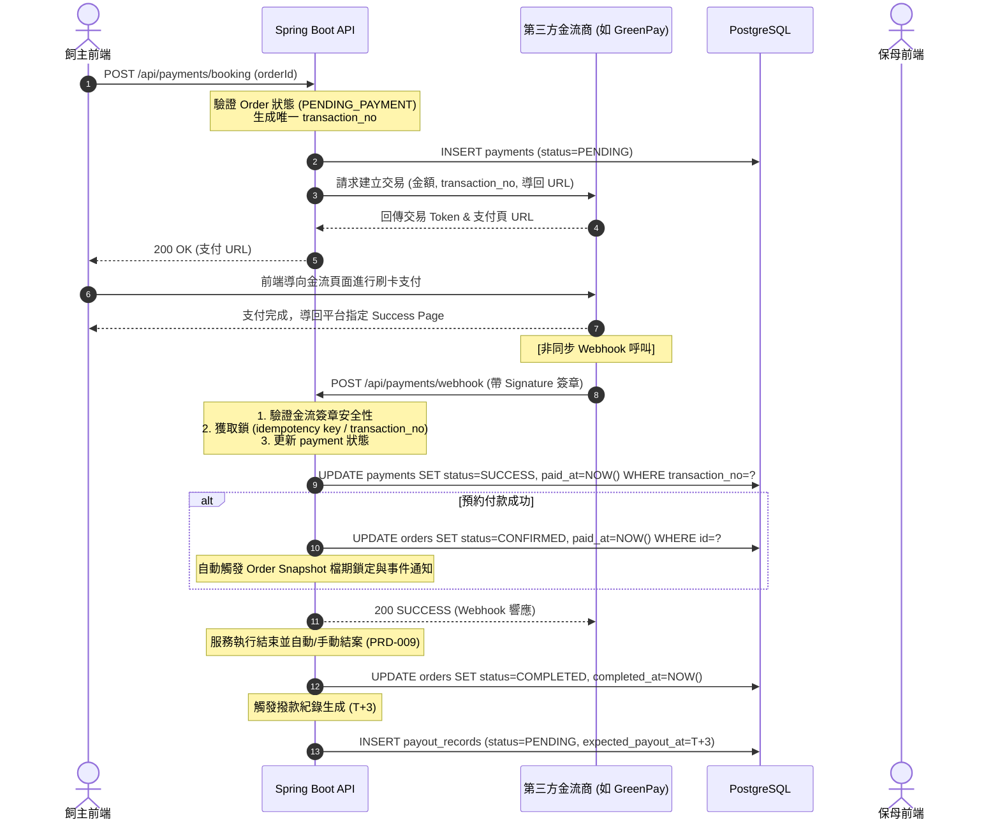

# SD-015: 線上支付與金流整合設計文件

| 項目 | 內容 |
|------|------|
| 對應需求 | PRD-015 |
| 負責 SD | AI (Antigravity) |
| 建立日期 | 2026-06-30 |
| 狀態 | Draft |
| DB 表 | `payments`, `payout_records`, `sitter_payout_settings` |
| 相依共用設計 | [錯誤回應](shared/error-response.md), [多租戶稽核](shared/audit-tenancy.md) |

---

## 1. 業務情境與金流狀態流轉

本系統支援兩大線上支付場景：**照護服務費代收代付**與**保母 SaaS 方案訂閱**。

### 1.1. 照護服務費支付與撥款流程 (代收代付)



---

## 2. 資料模型變更 (Schema Migrations)

### 2.1. 新增資料表

```sql
-- V20260630_01__create_payment_and_payout_tables.sql

-- 1. 保母收款帳戶設定表 (1-to-1 with profiles)
CREATE TABLE sitter_payout_settings (
    sitter_id       UUID PRIMARY KEY REFERENCES profiles(id) ON DELETE CASCADE,
    version         INT NOT NULL DEFAULT 0,
    bank_code       VARCHAR(10) NOT NULL,
    bank_name       VARCHAR(100) NOT NULL,
    branch_code     VARCHAR(10) NOT NULL,
    account_no      VARCHAR(50) NOT NULL,
    account_name    VARCHAR(100) NOT NULL,
    is_enabled      BOOLEAN NOT NULL DEFAULT FALSE,
    created_at      TIMESTAMPTZ NOT NULL DEFAULT CURRENT_TIMESTAMP,
    updated_at      TIMESTAMPTZ NOT NULL DEFAULT CURRENT_TIMESTAMP,
    created_by      UUID,
    updated_by      UUID
);

-- 2. 線上交易紀錄表
CREATE TABLE payments (
    id              UUID PRIMARY KEY,
    version         INT NOT NULL DEFAULT 0,
    order_id        UUID REFERENCES orders(id) ON DELETE SET NULL,
    sitter_id       UUID REFERENCES profiles(id) ON DELETE SET NULL, -- 用於訂閱付款
    payment_type    VARCHAR(30) NOT NULL, -- 'BOOKING', 'SUBSCRIPTION'
    payment_method  VARCHAR(30) NOT NULL, -- 'CREDIT_CARD', 'VIRTUAL_ACCOUNT'
    amount          INT NOT NULL, -- TWD 貨幣整數儲存
    status          VARCHAR(30) NOT NULL, -- 'PENDING', 'SUCCESS', 'FAILED', 'REFUNDED'
    transaction_no  VARCHAR(100) NOT NULL UNIQUE, -- 系統唯一交易號，防重送
    gateway_id      VARCHAR(100), -- 第三方金流平台之交易 ID
    paid_at         TIMESTAMPTZ,
    created_at      TIMESTAMPTZ NOT NULL DEFAULT CURRENT_TIMESTAMP,
    updated_at      TIMESTAMPTZ NOT NULL DEFAULT CURRENT_TIMESTAMP,
    created_by      UUID,
    updated_by      UUID
);

-- 3. 撥款紀錄表 (代收代付結算)
CREATE TABLE payout_records (
    id                  UUID PRIMARY KEY,
    version             INT NOT NULL DEFAULT 0,
    order_id            UUID NOT NULL REFERENCES orders(id) ON DELETE CASCADE,
    sitter_id           UUID NOT NULL REFERENCES profiles(id) ON DELETE CASCADE,
    amount              INT NOT NULL, -- 訂單總金額 (TWD)
    platform_fee        INT NOT NULL, -- 平台服務費 (扣除淨額之 % 或者是固定費用)
    payout_fee          INT NOT NULL, -- 金流撥款轉帳手續費 (如 TWD 15)
    net_amount          INT NOT NULL, -- 實際撥入保母之淨額 (amount - platform_fee - payout_fee)
    status              VARCHAR(30) NOT NULL, -- 'PENDING', 'PROCESSING', 'SUCCEEDED', 'FAILED', 'SUSPENDED'
    expected_payout_at  TIMESTAMPTZ NOT NULL, -- T + 3 工作日
    payout_account      JSONB NOT NULL, -- 結算時快照的銀行帳戶資訊，避免保母後續變更造成帳務對不上
    payout_at           TIMESTAMPTZ,
    error_message       TEXT,
    created_at          TIMESTAMPTZ NOT NULL DEFAULT CURRENT_TIMESTAMP,
    updated_at          TIMESTAMPTZ NOT NULL DEFAULT CURRENT_TIMESTAMP,
    created_by          UUID,
    updated_by          UUID
);

-- 建立索引優化財務對帳
CREATE INDEX idx_payments_order ON payments(order_id);
CREATE INDEX idx_payments_transaction_no ON payments(transaction_no);
CREATE INDEX idx_payout_records_sitter_status ON payout_records(sitter_id, status);
CREATE INDEX idx_payout_records_expected ON payout_records(expected_payout_at) WHERE status = 'PENDING';
```

### 2.2. 操作日誌寫入規格 (`log_user_action`)

每次財務異動成功後，必須記錄審計日誌：

| 功能操作 | `func_code` | `action_type` | `target_table` |
|----------|-------------|---------------|----------------|
| 綁定/修改收款帳戶 | `SITTER_PAYOUT_SET` | `UPDATE` | `sitter_payout_settings` |
| 發起支付請求 | `PAYMENT_INITIATED` | `CREATE` | `payments` |
| Webhook 支付完成 | `PAYMENT_SUCCESS` | `UPDATE` | `payments` |
| 建立撥款明細 | `PAYOUT_RECORD_GEN` | `CREATE` | `payout_records` |
| 人工退款執行 | `ADMIN_REFUND_EXEC` | `UPDATE` | `payments` |

---

## 3. API 設計

### 3.1. [保母] 收款設定 API
* **Method**: `PUT`
* **Path**: `/api/sitter/payout-settings`
* **說明**: 設定並開啟線上收款銀行帳戶
* **權限**: 需具備 `SITTER` 角色
* **Request Body**:
```json
{
  "bankCode": "822",
  "bankName": "中國信託商業銀行",
  "branchCode": "0123",
  "accountNo": "123456789012",
  "accountName": "王小明",
  "isEnabled": true
}
```
* **Response (200 OK)**:
```json
{
  "code": 200,
  "message": "OK",
  "data": {
    "sitterId": "9b1deb4d-3b7d-4bad-9bdd-2b0d7b3dcb6d",
    "isEnabled": true
  }
}
```

### 3.2. [飼主] 發起照護訂單支付
* **Method**: `POST`
* **Path**: `/api/payments/booking`
* **說明**: 針對 PENDING_PAYMENT 的預約發起付款請求，獲取支付跳轉網址
* **權限**: 需為訂單擁有者 (OWNER)
* **Request Body**:
```json
{
  "orderId": "e7b02e61-3f10-4376-b81e-7fb02e615dda"
}
```
* **Response (200 OK)**:
```json
{
  "code": 200,
  "message": "OK",
  "data": {
    "transactionNo": "TX202606302201938502",
    "paymentUrl": "https://gateway.greenpay.com.tw/pay/tkn_abc123xyz"
  }
}
```

### 3.3. [金流商] 支付 Webhook 接收端點
* **Method**: `POST`
* **Path**: `/api/payments/webhook`
* **說明**: 接收第三方金流商非同步付款成功通知
* **安全防禦**: 必帶金流商簽章 `X-GreenPay-Signature`，於 Filter/Interceptor 層強制比對簽章，防範偽造請求。
* **Request Body (由金流商定義，範例)**:
```json
{
  "transactionNo": "TX202606302201938502",
  "gatewayId": "GP_9876543210",
  "amount": 2500,
  "status": "PAID",
  "timestamp": "2026-06-30T22:05:00Z"
}
```
* **Response (200 OK)**:
```json
{
  "status": "SUCCESS"
}
```

---

## 4. 關鍵技術機制與防禦設計

### 4.1. TWD 貨幣高精度計算與防禦
* **原則**：資料庫與 API 傳輸一律採用 `Integer`。
* **分帳計算**：系統服務費與手續費在 Service 中使用 `BigDecimal` 進行高精度計算。
```java
// 範例：計算平台手續費與淨撥款額
public PayoutDetail calculatePayout(int originalAmount, double feeRate, int bankTransferFee) {
    BigDecimal amount = BigDecimal.valueOf(originalAmount);
    BigDecimal rate = BigDecimal.valueOf(feeRate);
    
    // 平台服務費 = 原始金額 * 費率，四捨五入到整數
    int platformFee = amount.multiply(rate)
            .setScale(0, RoundingMode.HALF_UP)
            .intValue();
            
    // 淨撥款額 = 原始金額 - 平台服務費 - 轉帳手續費
    int netAmount = originalAmount - platformFee - bankTransferFee;
    if (netAmount < 0) {
        netAmount = 0; // 防禦邊界：避免淨額為負數
    }
    return new PayoutDetail(platformFee, netAmount);
}
```

### 4.2. Webhook 安全簽章防禦 (Signature Verification)
為防止惡意使用者直接向 Webhook 端點發送偽造的成功請求來逃避付款，Webhook 端點必須實作 HMAC-SHA256 簽章驗證：
```java
public boolean verifySignature(String rawBody, String signatureHeader, String secretKey) {
    try {
        Mac sha256HMAC = Mac.getInstance("HmacSHA256");
        SecretKeySpec secretKeySpec = new SecretKeySpec(secretKey.getBytes(StandardCharsets.UTF_8), "HmacSHA256");
        sha256HMAC.init(secretKeySpec);
        byte[] hash = sha256HMAC.doFinal(rawBody.getBytes(StandardCharsets.UTF_8));
        String calculatedSignature = Hex.encodeHexString(hash);
        return calculatedSignature.equalsIgnoreCase(signatureHeader);
    } catch (Exception e) {
        return false;
    }
}
```

### 4.3. 冪等性控制 (Idempotency) 與 Webhook 防重送
* 金流 Webhook 可能重複發送。端點必須以 `transactionNo` 作為唯一標記，利用資料庫的樂觀鎖 (`@Version`) 或是 Redis 分布式鎖（依據架構決定，Close Beta 採 Pessimistic Lock / `@Version` 雙重保險）防止並發更新。
* 狀態流轉防呆：若 `Payment` 的狀態已為 `SUCCESS` 或 `FAILED`，則直接回傳 HTTP 200 成功，不重複觸發訂單轉換與通知。

---

## 5. 測試情境 (TS-015) 規劃

1. **收款綁定測試**：
   - 驗證 `SITTER` 可成功儲存收款設定。
   - 驗證輸入參數（如分行代碼、帳號格式）不合規時應退回 400 `MSG_DATA_INVALID_INPUT`。
2. **預約金流發起與跳轉測試**：
   - 驗證 `OWNER` 能成功為其 `PENDING_PAYMENT` 狀態的預約產生跳轉支付 URL。
   - 驗證若訂單已非 `PENDING_PAYMENT` 狀態時，發起支付會被阻擋並回傳 400 錯誤。
3. **Webhook 簽章驗證測試**：
   - 使用合法簽章呼叫，驗證訂單狀態成功流轉至 `CONFIRMED`，且產生快照。
   - 使用非法或偽造簽章呼叫，驗證應直接拒絕並退回 401/403，且訂單狀態不變。
4. **結案撥款生成測試**：
   - 訂單狀態流轉為 `COMPLETED` 時，驗證排程或監聽器是否正確插入一筆 `payout_records`，且 `expected_payout_at` 精確為 T+3 工作日。
   - 驗證 `net_amount` 與手續費計算符合公式且四捨五入正確。
