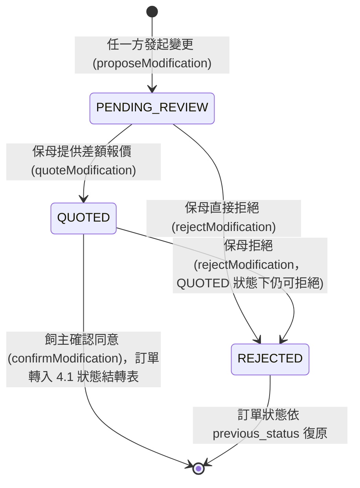
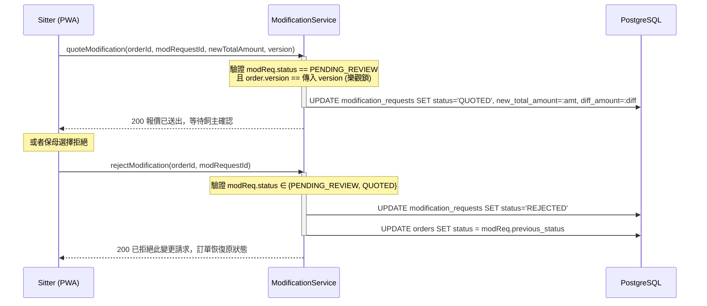
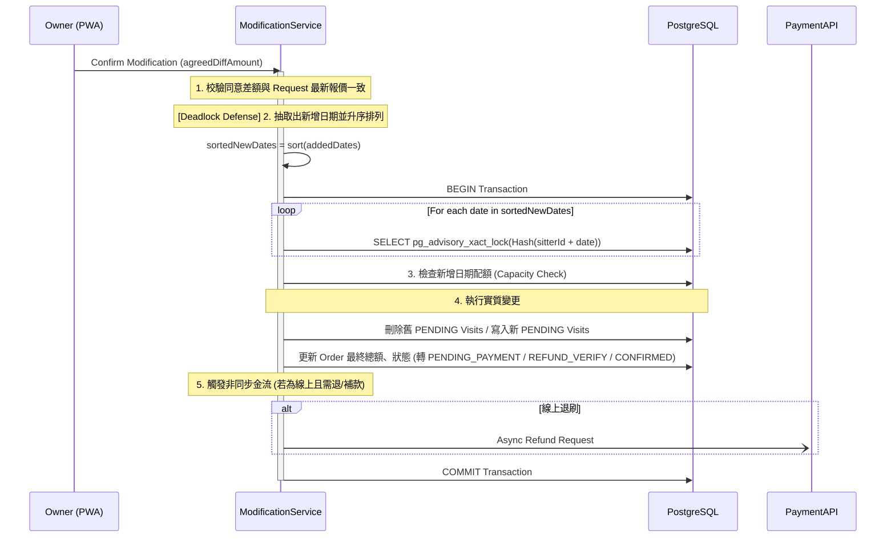

# SD-016: 訂單雙向變更與退款 (Modification & Cancellation)

| 項目 | 內容 |
|------|------|
| 模組編號 | SD-016 |
| 對應 PRD | PRD-016 |
| 核心技術 | Bidirectional Snapshot Recalculation, Refund Proof Verification, Sorted Advisory Locks |
| 狀態 | **Approved with Consultant Feedback** |

---

## 1. 業務邏輯與流程設計

### 1.1 變更請求與生效樞紐
1. **提案階段 (Proposal)**：不論由哪一方發起變更，系統僅紀錄 `MODIFICATION_REQUEST` 數據。此階段 **不觸發** 檔期鎖定或金流行為。
2. **生效階段 (Confirm)**：必須由 **飼主 (Owner)** 執行最終確認。此時系統才會執行實質的行程重刷、Sorted Advisory Locks 檢查以及退/補款邏輯。

### 1.2 金額試算與對帳
- **快照優先**：所有增減金額皆以 `ORDER_SNAPSHOT` 紀錄的合約單價為準。
- **零信任 (Zero Trust)**：確認 API 必須帶入 `agreedDiffAmount`，由後端重新校驗須與 `ModificationRequest.diffAmount`（保母最新報價）完全一致，不符則拋 `PricingMismatchException`，防止協商期間資料過期仍被沿用成交。

### 1.3 `ModificationRequest` 狀態機

- **`previous_status` 快照**：發起變更當下，`Order.status`（`CONFIRMED`/`IN_PROGRESS`）會快照進 `ModificationRequest.previousStatus`。保母拒絕時，訂單狀態依此欄位復原，而非寫死回 `CONFIRMED`——避免「進行中」訂單被拒絕變更後誤退回「已確認未開始」狀態。
- **`dates` 快照**：發起變更時鎖定的新日期清單同樣以 JSONB 存入 `ModificationRequest.dates`，`confirmModification` 執行實質行程重刷時直接讀取此快照，**不再信任飼主確認當下重送的日期**，理由同 1.2 零信任精神。

---

## 2. API 定義

### 2.1 發起變更請求 (飼主/保母)
- **Endpoint**: `POST /api/orders/{orderId}/modify`
- **Headers**: `Idempotency-Key: UUID` (必填)

### 2.2 查詢訂單目前進行中的變更請求
- **Endpoint**: `GET /api/orders/{orderId}/modification`
- **Auth**: `ROLE_OWNER` 或 `ROLE_SITTER`
- **說明**: 供前端頁面（`OrderModificationWizard`/`SitterModificationQuote`/`OwnerModificationConfirm`）掛載時查詢真實的 `modRequestId` 與目前狀態，取代早期草稿寫死 UUID 呼叫既有端點的作法。
```json
{
  "id": "uuid-modRequestId",
  "orderId": "uuid",
  "status": "QUOTED",
  "requestedBy": "OWNER",
  "diffAmount": -200,
  "newTotalAmount": 800,
  "currentOrderTotalAmount": 1000,
  "orderVersion": 2,
  "dates": ["2026-06-01", "2026-06-02"],
  "refundProofUrl": null
}
```

### 2.3 審核變更並提供差額報價 (保母)
- **Endpoint**: `POST /api/orders/{orderId}/modification/quote?modRequestId={id}`
- **Headers**: `Idempotency-Key: UUID` (必填)
- **權限**: `ROLE_SITTER`，且須為該訂單的保母
- **Request Body**:
```json
{
  "newTotalAmount": 800,
  "version": 1
}
```
- **前置條件**: `ModificationRequest.status == PENDING_REVIEW`，且 `version` 須與 `Order.version` 一致（樂觀鎖），否則 409。

### 2.4 拒絕變更請求 (保母)
- **Endpoint**: `POST /api/orders/{orderId}/modification/reject?modRequestId={id}`
- **Headers**: `Idempotency-Key: UUID` (必填)
- **權限**: `ROLE_SITTER`
- **前置條件**: `ModificationRequest.status ∈ {PENDING_REVIEW, QUOTED}`
- **邏輯**: `ModificationRequest.status → REJECTED`；`Order.status` 依 `previousStatus` 快照復原。

### 2.5 上傳退款憑證 (保母)
- **Endpoint**: `POST /api/orders/{orderId}/modification/refund-proof`
- **Headers**: `Idempotency-Key: UUID`

### 2.6 確認同意變更 (飼主)
- **Endpoint**: `POST /api/orders/{orderId}/modification/confirm?modRequestId={id}`
- **Headers**: `Idempotency-Key: UUID` (必填)
- **權限**: `ROLE_OWNER`，且須為該訂單的飼主
- **Request Body**:
```json
{
  "agreedDiffAmount": -200,
  "version": 1
}
```
- **前置條件**: `ModificationRequest.status == QUOTED`，且 `agreedDiffAmount` 須與 `ModificationRequest.diffAmount` 一致（Zero-Trust，見 §1.2）。
- **邏輯**: 執行實質的行程重算（讀取 `ModificationRequest.dates` 快照）、檔期鎖定與金流派發。

### 2.7 確認收到退款 (飼主) [新增]
- **Endpoint**: `POST /api/orders/{orderId}/modification/refund-confirm`
- **Headers**: `Idempotency-Key: UUID`
- **邏輯**: 解除 `REFUND_VERIFY` 狀態，依據變更請求內容，將訂單狀態正式轉回 `CONFIRMED` 或 `CANCELLED`。

---

## 3. 詳細邏輯與序列圖 (Sequence Diagram)

### 3.0 保母報價 / 拒絕流程 (Quote / Reject)



### 3.1 變更生效流程 (Confirm Modification)



---

## 4. 資料庫異動與限制 (DB Constraint)

### 4.1 狀態結轉規則
| 變更結果 | 最終狀態遷移 (Confirm / Refund Confirm 後) |
|---------|------------|
| 需退款 (線下) | `MODIFYING` -> `REFUND_VERIFY` -> `CONFIRMED` / `CANCELLED` |
| 需補款 (線上/線下) | `MODIFYING` -> `PENDING_PAYMENT` -> `CONFIRMED` |
| 無金額變動 | `MODIFYING` -> `CONFIRMED` |
| 整筆取消 (無退款 / 線上退刷成功) | `MODIFYING` -> `CANCELLED` |
| 保母拒絕變更 | `MODIFYING` -> `previousStatus`（`CONFIRMED` 或 `IN_PROGRESS`，依發起變更當下快照決定，非寫死） |

---

## 5. NFR 規格對齊 (NFR Alignment)

> [!WARNING]
> **已知落差（本次未修復）**：`propose`/`quote`/`reject`/`confirm` 四支端點的 `Idempotency-Key` 目前**僅止於 Controller 層的必填 Header**（缺少即 400），`ModificationService` 內部完全沒有呼叫 `IdempotencyService.checkAndConsume`，也沒有如 SD-005 訂單建立那樣依賴 DB `UNIQUE` 約束防重——與同專案的 `EvaluationService`/`KycServiceImpl`/`VisitReportService` 等其他寫入端點的既定慣例不一致。目前僅能靠 `ModificationRequest.status` 狀態機間接擋下重複提交（例如重複呼叫 `quote` 會因狀態已非 `PENDING_REVIEW` 而报錯），但這是「重試會失敗」而非「重試會被安全地去重」，網路重試情境下使用者體驗會是誤導性的錯誤訊息而非靜默成功。屬既有技術債，非本次修復範圍。

| NFR 編號 | 設計實作 |
|----------|----------|
| **NFR-003 (Security)** | 所有變更階段操作於 API 層強制要求 **Idempotency-Key** Header（實際去重邏輯未串接，見上方 WARNING）。 |

> [!NOTE]
> **文件修正**：早期草稿曾規劃保母報價需經密碼二次驗證（`confirmPassword`），但實際 `ModificationQuoteRequest`/`quoteModification()` 並未實作此檢查，僅驗證 `ModificationRequest.status` 與 `Order.version`。本文件已依實作現狀移除此項描述；是否補回二次驗證屬產品決策，非本次修復範圍。
| **NFR-002 (Availability)** | 線上退刷採非同步 Hook 模式，確保與第三方金流最終一致。 |
| **NFR-006 (Audit)** | `order_logs` 紀錄 `MODIFICATION_REQUEST` 完整的前後項 JSON Diff。 |
| **NFR-009 (i18n)** | 全程使用 `BigDecimal` 處理差額計算，最終入庫前依據 `SD-GLOBAL-SPEC` 執行 `HALF_UP` 並轉為 `INT` 儲存。 |
