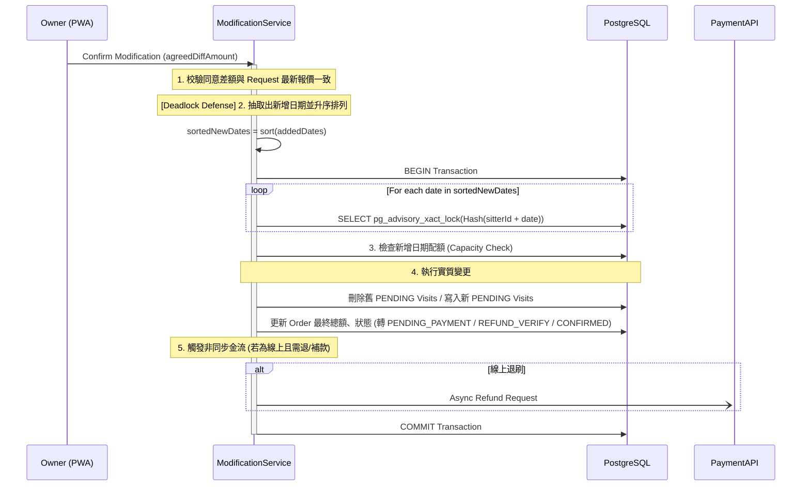

# SD-016: 訂單雙向變更與退款 (Modification & Cancellation)

| 項目 | 內容 |
|------|------|
| 模組編號 | SD-016 |
| 對應 PRD | PRD-016 |
| 核心技術 | Bidirectional Snapshot Recalculation, Refund Proof Verification, Sorted Advisory Locks |
| 狀態 | **Approved with Consultant Feedback** |

---

## 1. 業務邏輯與流程設計

### 1.1 變更請求與生效樞紐
1. **提案階段 (Proposal)**：不論由哪一方發起變更，系統僅紀錄 `MODIFICATION_REQUEST` 數據。此階段 **不觸發** 檔期鎖定或金流行為。
2. **生效階段 (Confirm)**：必須由 **飼主 (Owner)** 執行最終確認。此時系統才會執行實質的行程重刷、Sorted Advisory Locks 檢查以及退/補款邏輯。

### 1.2 金額試算與對帳
- **快照優先**：所有增減金額皆以 `ORDER_SNAPSHOT` 紀錄的合約單價為準。
- **零信任 (Zero Trust)**：確認 API 必須帶入 `agreedDiffAmount`，由後端重新校驗，防止協商期間方案變更或資料過期。

---

## 2. API 定義

### 2.1 發起變更請求 (飼主/保母)
- **Endpoint**: `POST /api/orders/{orderId}/modify`
- **Headers**: `Idempotency-Key: UUID` (必填)

### 2.2 審核變更並提供差額報價 (保母)
- **Endpoint**: `POST /api/orders/{orderId}/modification/quote`
- **Headers**: `Idempotency-Key: UUID` (必填)
- **Request Body**:
```json
{
  "newTotalAmount": 800,
  "diffAmount": -200, 
  "confirmPassword": "...", 
  "version": 1
}
```

### 2.3 上傳退款憑證 (保母)
- **Endpoint**: `POST /api/orders/{orderId}/modification/refund-proof`
- **Headers**: `Idempotency-Key: UUID`

### 2.4 確認同意變更 (飼主)
- **Endpoint**: `POST /api/orders/{orderId}/modification/confirm`
- **Headers**: `Idempotency-Key: UUID` (必填)
- **Request Body**:
```json
{
  "agreedDiffAmount": -200,
  "version": 1
}
```
- **邏輯**: 執行實質的行程重算、檔期鎖定與金流派發。

### 2.5 確認收到退款 (飼主) [新增]
- **Endpoint**: `POST /api/orders/{orderId}/modification/refund-confirm`
- **Headers**: `Idempotency-Key: UUID`
- **邏輯**: 解除 `REFUND_VERIFY` 狀態，依據變更請求內容，將訂單狀態正式轉回 `CONFIRMED` 或 `CANCELLED`。

---

## 3. 詳細邏輯與序列圖 (Sequence Diagram)

### 3.1 變更生效流程 (Confirm Modification)



---

## 4. 資料庫異動與限制 (DB Constraint)

### 4.1 狀態結轉規則
| 變更結果 | 最終狀態遷移 (Confirm / Refund Confirm 後) |
|---------|------------|
| 需退款 (線下) | `MODIFYING` -> `REFUND_VERIFY` -> `CONFIRMED` / `CANCELLED` |
| 需補款 (線上/線下) | `MODIFYING` -> `PENDING_PAYMENT` -> `CONFIRMED` |
| 無金額變動 | `MODIFYING` -> `CONFIRMED` |
| 整筆取消 (無退款 / 線上退刷成功) | `MODIFYING` -> `CANCELLED` |

---

## 5. NFR 規格對齊 (NFR Alignment)

| NFR 編號 | 設計實作 |
|----------|----------|
| **NFR-003 (Security)** | 所有變更階段操作強制執行 **Idempotency-Key**。保母報價時需進行密碼二次驗證。 |
| **NFR-002 (Availability)** | 線上退刷採非同步 Hook 模式，確保與第三方金流最終一致。 |
| **NFR-006 (Audit)** | `order_logs` 紀錄 `MODIFICATION_REQUEST` 完整的前後項 JSON Diff。 |
| **NFR-009 (i18n)** | 全程使用 `BigDecimal` 處理差額計算，最終入庫前依據 `SD-GLOBAL-SPEC` 執行 `HALF_UP` 並轉為 `INT` 儲存。 |
