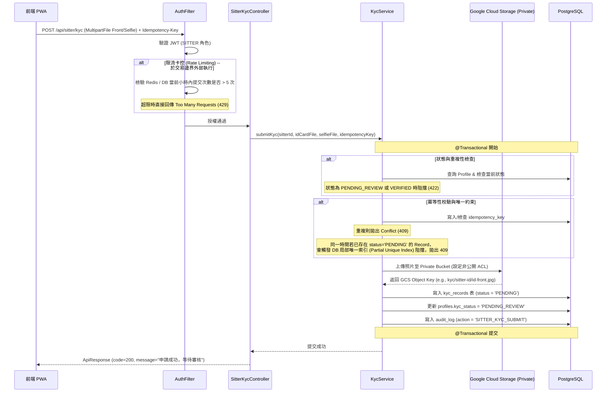
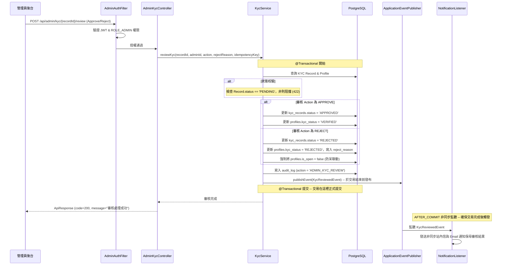
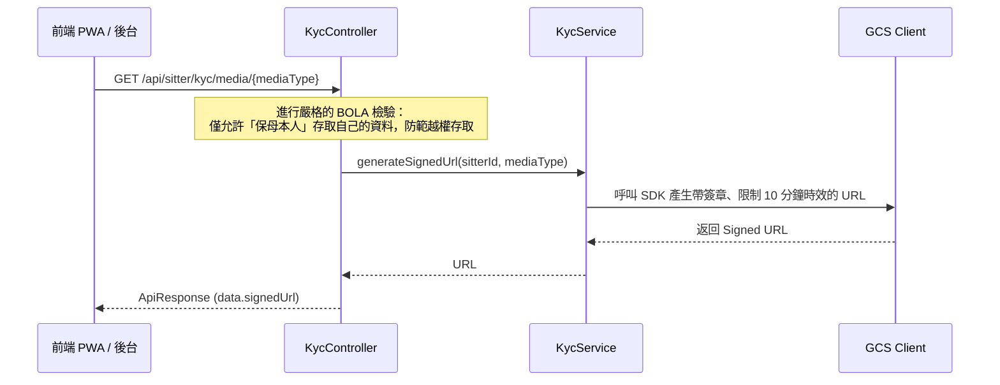
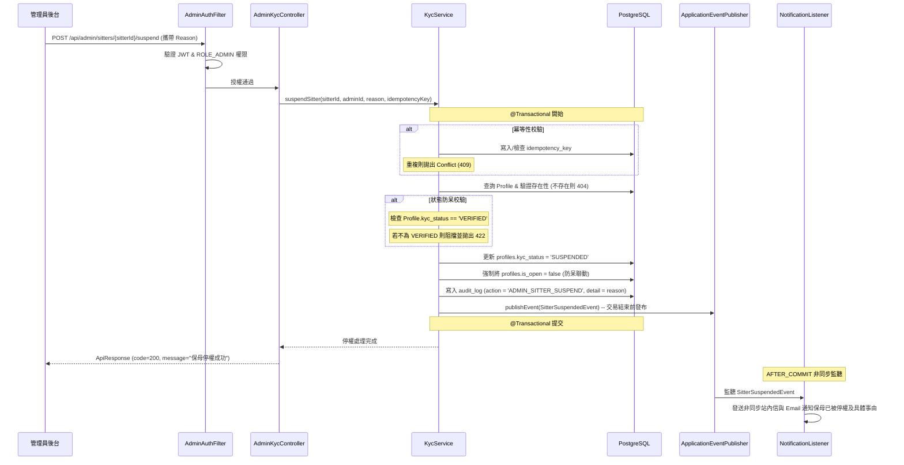
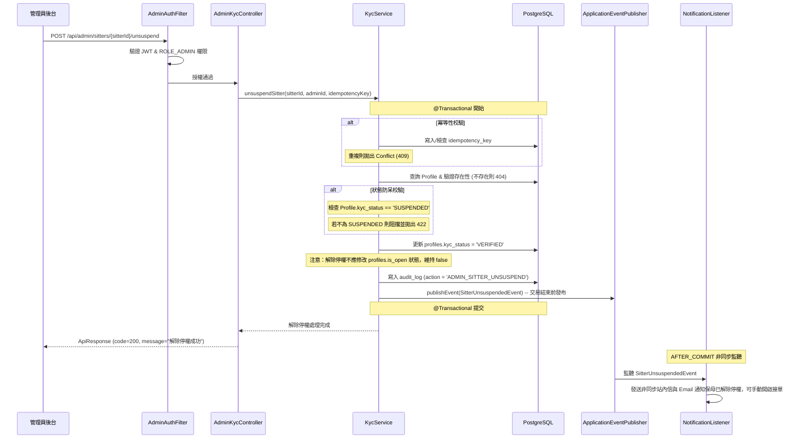

# SD-017: 保母實名認證與資格審查 (KYC) 設計文件

| 項目 | 內容 |
|------|------|
| 對應需求 | [PRD-017-sitter-kyc.md](file:///Users/will_chiang/Widget_home/cat-sitter-project/docs/sa/fr/PRD-017-sitter-kyc.md) |
| 負責 SD | AI (Antigravity) |
| 建立日期 | 2026-06-06 |
| 狀態 | Draft |
| DB 表 | `kyc_records`, `profiles`, `order_logs` |
| 相依共用設計 | 帳號權限系統、GCS 儲存服務（Private Bucket & Signed URL）、非同步通知 |

---

## 1. 狀態移轉與聯動關係

本設計核心在於確保保母的接單資格與其實名認證（KYC）狀態完美綁定，防止未認證或停權保母在平台接單。

### 1.1. 保母認證狀態機 (Profile.kyc_status)
為確保與現存程式碼相容性，本設計將直接沿用資料庫已有的 `profiles.kyc_status` 欄位，不再新建 `approval_status`。

```mermaid
stateDiagram-v2
    direction TB
    [*] --> UNVERIFIED: 帳號首次切換為保母 (Flyway 修正存量預設)
    
    UNVERIFIED --> PENDING_REVIEW: 保母提交認證資料
    REJECTED --> PENDING_REVIEW: 保母修正後重新提交
    
    state PENDING_REVIEW {
        Note right of PENDING_REVIEW: 預約網頁與接單功能皆為鎖定狀態
    }
    
    PENDING_REVIEW --> VERIFIED: 管理員執行【核准 (Approve)】
    PENDING_REVIEW --> REJECTED: 管理員執行【退件 (Reject)】
    
    VERIFIED --> SUSPENDED: 違規或檢舉，管理員強制【停權 (Suspend)】
    SUSPENDED --> VERIFIED: 調解完成，管理員【解除停權 (Unsuspend)】
```

### 1.2. 狀態與資格卡控矩陣

| Profile.kyc_status 狀態 | 是否允許開放預約 (`isOpen`) | 公開預約網頁是否生效 | 飼主存取公開網頁行為 |
|:---|:---:|:---:|:---|
| `UNVERIFIED` (未認證) | ❌ 阻擋 (403) | ❌ 不生效 | 顯示「保母尚未完成實名認證」 |
| `PENDING_REVIEW` (審核中) | ❌ 阻擋 (403) | ❌ 不生效 | 顯示「保母尚未完成實名認證（審核中）」 |
| `VERIFIED` (已認證) |  允許 (可自由切換) |  生效 | 正常顯示，允許預約 |
| `REJECTED` (退件) | ❌ 阻擋 (403) | ❌ 不生效 | 顯示「保母尚未完成實名認證」 |
| `SUSPENDED` (停權) | ❌ 阻擋 (403) | ❌ 強制失效 | 顯示「此保母已被系統暫停接單資格」 |

### 1.3. `isOpen` 與 `kyc_status` 的聯動業務規則
為了避免已啟用接單的保母在被停權、退件時仍對外開放預約，本設計將在 `profiles` 中引入 `is_open`（對應 Java Entity 屬性 `isOpen`）用以卡控，並定義以下聯動機制：
1. **防呆強制關閉**：當管理員將保母狀態變更為 `SUSPENDED` 或 `REJECTED` 時，系統必須在**同一個數據庫事務**內，強制將 `profiles.is_open` 設為 `false`。
2. **開啟接單卡控**：保母嘗試開啟接單狀態（將 `isOpen` 設為 `true`）時，API 必須前置檢驗 `profiles.kyc_status == 'VERIFIED'`，否則拋出 `403 FORBIDDEN` 攔截，提示保母需先通過實名審查。
3. **預約送單雙重校驗 (SD-005 聯動)**：飼主提交預約申請（SD-005）時，在 Advisory Lock 檔期鎖定與訂單建立的前置條件檢驗中，除了檢驗保母 `profiles.is_open == true`，必須**同時驗證 `profiles.kyc_status == 'VERIFIED'`**，任何一項不符即拋出 `422 UNPROCESSABLE_ENTITY` (代碼：`MSG_DATA_INVALID_STATUS`)。

---

## 2. 序列圖

### 2.1. 保母上傳認證資料與安全查閱



### 2.2. 管理員審核與通知發送



### 2.3. 個資安全防護：簽名 URL (Signed URL) 機制
為防範身分證等高度敏感個資洩漏，圖片在 GCS 中為 Private 狀態。保母或管理員檢視時，後端即時產生具備短效性（如 10 分鐘）的 Signed URL。



### 2.4. [管理後台] 保母強制停權流程 (Suspend)



### 2.5. [管理後台] 解除保母停權流程 (Unsuspend)



---

## 3. 資料模型變更

### 3.1. 存量資料與全新欄位遷移策略 (Flyway Migration)
現有資料庫沒有 `is_open` 欄位，且 `kyc_status` 預設為 `'PENDING'`，為此需建立全新的 Flyway 遷移指令（如 `V20260606_01__add_sitter_kyc_and_is_open.sql`）：
1. **新增 `is_open` 欄位**：在 `profiles` 中補上該布林值。
2. **更新預設值與存量清洗**：將 `profiles.kyc_status` 的 DEFAULT 值從 `'PENDING'` 修改為 `'UNVERIFIED'`，並將目前所有狀態為 `'PENDING'` 的 Profile 清洗為 `'UNVERIFIED'`。

```sql
-- Flyway 遷移指令
-- 1. 於 profiles 表新增 is_open 欄位，預設為關閉 (false)
ALTER TABLE profiles ADD COLUMN is_open BOOLEAN NOT NULL DEFAULT false;

-- 2. 修正 profiles 既有欄位 kyc_status 的預設值，並將存量 PENDING 恢復為 UNVERIFIED
ALTER TABLE profiles ALTER COLUMN kyc_status SET DEFAULT 'UNVERIFIED';
UPDATE profiles SET kyc_status = 'UNVERIFIED' WHERE kyc_status = 'PENDING';
```

### 3.2. 應用程式原始碼同步修改 (Application Code Adjustments)
Flyway 修正預設值後，後端 Application Code 必須同步修改，以防硬編碼覆蓋資料庫預設值，進而導致 `UNVERIFIED` 狀態失效：
1. **AuthService.java** 修正：
   在建立 SITTER Profile 的 Builder 區塊中，尋找 `.kycStatus("PENDING")`，將其**修改為 `.kycStatus("UNVERIFIED")`**，或直接將此屬性設值移除，由 JPA 依賴資料庫 DEFAULT 或 `@Builder.Default` 處理。
2. **PaymentService.java** 修正：
   在建立或初始化保母 Profile 資訊處，將明確設值的 `.kycStatus("PENDING")` **修改為 `.kycStatus("UNVERIFIED")`**。

### 3.3. JPA Entity 實體修改 (Profile.java)
配合 Flyway 變更，必須修改 Java 的 `Profile.java` 實體映射：
```java
@Builder.Default
@Column(name = "is_open", nullable = false)
private boolean isOpen = false;
```

### 3.4. DDL SQL 腳本 (新增 KYC 表與索引)

```sql
-- 新建 kyc_records 實體表
CREATE TABLE kyc_records (
    id                      uuid NOT NULL DEFAULT gen_random_uuid(),
    sitter_id               uuid NOT NULL,
    
    -- 改用 _key 以符合語意（存儲 GCS 檔案路徑 Object Key，而非公開 URL）
    id_card_front_key       varchar(512) NOT NULL,
    selfie_key              varchar(512) NOT NULL,
    
    status                  varchar(50) NOT NULL DEFAULT 'PENDING', -- PENDING, APPROVED, REJECTED
    reject_reason           varchar(500),
    reviewed_by             uuid,
    reviewed_at             timestamp with time zone,
    
    -- 審計欄位
    created_at              timestamp with time zone NOT NULL DEFAULT clock_timestamp(),
    updated_at              timestamp with time zone NOT NULL DEFAULT clock_timestamp(),
    created_by              uuid,
    updated_by              uuid,
    is_deleted              boolean NOT NULL DEFAULT false,
    version                 integer NOT NULL DEFAULT 0,
    
    PRIMARY KEY (id),
    CONSTRAINT fk_kyc_sitter FOREIGN KEY (sitter_id) REFERENCES users(id),
    CONSTRAINT fk_kyc_reviewer FOREIGN KEY (reviewed_by) REFERENCES users(id)
);

-- 建立索引加速後台篩選與防重提交
CREATE INDEX idx_kyc_sitter_id ON kyc_records(sitter_id);
CREATE INDEX idx_kyc_status ON kyc_records(status);

-- 建立局部唯一索引，保證單一保母同時間最多僅能有一筆 PENDING 的 KYC 紀錄，防堵併發重複提交
CREATE UNIQUE INDEX idx_kyc_sitter_pending_unique
    ON kyc_records(sitter_id)
    WHERE status = 'PENDING';
```

### 3.5. 操作稽核日誌規格 (log_user_action)

| 操作動作 | `func_code` | `action_type` | `target_table` |
| :--- | :--- | :--- | :--- |
| 提交 KYC 認證 | `SITTER_KYC_SUBMIT` | `CREATE` | `kyc_records` |
| 管理員審核 KYC | `ADMIN_KYC_REVIEW` | `UPDATE` | `kyc_records` |
| 強制保母停權 | `ADMIN_SITTER_SUSPEND` | `UPDATE` | `profiles` |
| 解除保母停權 | `ADMIN_SITTER_UNSUSPEND` | `UPDATE` | `profiles` |

---

## 4. API 設計

### 4.1. 保母提交實名認證資料
* **Method**: `POST`
* **Path**: `/api/sitter/kyc`
* **Headers**:
  * `Authorization: Bearer <JWT>`
  * `Idempotency-Key: <UUID>` (必填)
* **Request Body (Multipart Form-Data)**:
  * `idCardFront`: File (image/jpeg, image/png, <=5MB)
  * `selfie`: File (image/jpeg, image/png, <=5MB)
* **限流卡控**：同一 Sitter 限制每小時最多 5 次提交（於 Filter/Interceptor 層阻擋）。

#### Response (200 OK)
```json
{
  "code": 200,
  "message": "實名認證資料提交成功，已進入審核程序",
  "data": {
    "recordId": "4c9d8178-14c0-4376-b81e-7fb02e615dda",
    "status": "PENDING_REVIEW"
  }
}
```

---

### 4.2. 查詢保母自身 KYC 審查狀態
* **Method**: `GET`
* **Path**: `/api/sitter/kyc/status`

#### Response (200 OK)
```json
{
  "code": 200,
  "message": "OK",
  "data": {
    "kycStatus": "REJECTED",
    "rejectReason": "證件正面反光嚴重，身分證字號無法辨識，請重新上傳。",
    "submittedAt": "2026-06-06T12:00:00Z"
  }
}
```

---

### 4.3. 保母查閱證件圖片之短效安全簽名 URL
* **Method**: `GET`
* **Path**: `/api/sitter/kyc/media/{mediaType}`
* **說明**: `mediaType` 可為 `ID_CARD_FRONT` 或 `SELFIE`。
* **權限防護 (BOLA)**: 後端必須限制 `sitterId == CurrentUserId`。本端點**僅供保母查詢自己**的上傳結果，Admin 無法使用此路徑查詢他人。

#### Response (200 OK)
```json
{
  "code": 200,
  "message": "OK",
  "data": {
    "signedUrl": "https://storage.googleapis.com/sitter-kyc-private/id-front.jpg?GoogleAccessId=...&Expires=1780000000&Signature=..."
  }
}
```

---

### 4.4. [管理後台] 專屬：管理員查閱保母證件圖片之簽名 URL
* **Method**: `GET`
* **Path**: `/api/admin/kyc/{sitterId}/media/{mediaType}`
* **說明**: 管理員可帶入被審核保母之 `sitterId` 取得其證件媒體的暫時簽名 URL。
* **權限限制**: 僅限具備 `ROLE_ADMIN` 角色之 JWT Token 呼叫，否則回傳 `403 Forbidden`。

#### Response (200 OK)
```json
{
  "code": 200,
  "message": "OK",
  "data": {
    "signedUrl": "https://storage.googleapis.com/sitter-kyc-private/uuid/id-front.jpg?GoogleAccessId=...&Expires=1780000000&Signature=..."
  }
}
```

---

### 4.5. [管理後台] 專屬：查詢特定 KYC 紀錄與保母基本資料詳情
* **Method**: `GET`
* **Path**: `/api/admin/kyc/{recordId}`
* **說明**: 管理員進入審查明細頁時，用以獲取左欄保母 Profile 基本資料與右欄圖片的 Key 等 meta-data，以便進行比對。
* **權限限制**: 僅限具備 `ROLE_ADMIN` 角色之 JWT Token 呼叫，否則回傳 `403 Forbidden`。

#### Response (200 OK)
```json
{
  "code": 200,
  "message": "OK",
  "data": {
    "recordId": "4c9d8178-14c0-4376-b81e-7fb02e615dda",
    "sitterId": "3d498178-14c0-4376-b81e-7fb02e615dda",
    "fullName": "張小明",
    "email": "xiaoming@test.com",
    "kycStatus": "PENDING_REVIEW",
    "submittedAt": "2026-06-06T12:00:00Z",
    "idCardFrontKey": "kyc/3d498178-14c0-4376-b81e-7fb02e615dda/id-front.jpg",
    "selfieKey": "kyc/3d498178-14c0-4376-b81e-7fb02e615dda/selfie.jpg"
  }
}
```

---

### 4.6. [管理後台] 專屬：查詢待審核 KYC 紀錄列表
* **Method**: `GET`
* **Path**: `/api/admin/kyc/pending`
* **Query Parameters**:
  * `page`: integer (optional, default: 0, 0-indexed)
  * `size`: integer (optional, default: 10)
* **說明**: 管理員進入審查清單頁面時，用以獲取目前所有處於 `PENDING_REVIEW` 狀態的 KYC 紀錄列表，支援分頁。
* **權限限制**: 僅限具備 `ROLE_ADMIN` 角色之 JWT Token 呼叫，否則回傳 `403 Forbidden`。

#### Response (200 OK)
```json
{
  "code": 200,
  "message": "OK",
  "data": {
    "content": [
      {
        "recordId": "4c9d8178-14c0-4376-b81e-7fb02e615dda",
        "sitterId": "3d498178-14c0-4376-b81e-7fb02e615dda",
        "fullName": "張小明",
        "email": "xiaoming@test.com",
        "kycStatus": "PENDING_REVIEW",
        "submittedAt": "2026-06-06T12:00:00Z"
      }
    ],
    "page": 0,
    "size": 10,
    "totalElements": 1,
    "totalPages": 1
  }
}
```

---

### 4.7. [管理後台] 執行 KYC 審核
* **Method**: `POST`
* **Path**: `/api/admin/kyc/{recordId}/review`
* **Headers**:
  * `Authorization: Bearer <JWT>`
  * `Idempotency-Key: <UUID>` (必填)
* **Request Body**:
```json
{
  "action": "REJECT", // APPROVE or REJECT
  "rejectReason": "照片模糊，非本人自拍" // action 為 REJECT 時必填 (1-500字)
}
```

#### Response (200 OK)
```json
{
  "code": 200,
  "message": "審核結果處理成功",
  "data": null
}
```

---

### 4.8. [管理後台] 強制保母停權 (Suspend)
* **Method**: `POST`
* **Path**: `/api/admin/sitters/{sitterId}/suspend`
* **說明**: 強制中止保母接單資格，將 Profile.kyc_status 更新為 SUSPENDED，並在同一個 transaction 中將 Profile.is_open 改為 false。
* **Headers**:
  * `Authorization: Bearer <JWT>`
  * `Idempotency-Key: <UUID>` (必填)
* **Request Body**:
```json
{
  "reason": "收到多件飼主投訴，違反服務條款第7條" // 必填，1-300字
}
```

#### Response (200 OK)
```json
{
  "code": 200,
  "message": "已成功將該保母停權，接單功能已強制關閉",
  "data": null
}
```

---

### 4.9. [管理後台] 解除保母停權 (Unsuspend)
* **Method**: `POST`
* **Path**: `/api/admin/sitters/{sitterId}/unsuspend`
* **說明**: 解除停權狀態，使 `kyc_status` 恢復為 `VERIFIED`（注意：為保護安全，解除停權不應自動將 is_open 恢復為 true，應由保母之後在 PWA 自行開啟）。
* **Headers**:
  * `Authorization: Bearer <JWT>`
  * `Idempotency-Key: <UUID>` (必填)

#### Response (200 OK)
```json
{
  "code": 200,
  "message": "已成功解除保母停權狀態，接單資格已恢復",
  "data": null
}
```

---

## 5. 異常錯誤代碼與限流

| 異常情境 | HTTP Status | Code | Message |
| :--- | :--- | :--- | :--- |
| 重複提交 KYC 審查中申請 | 422 | `MSG_DATA_STATE_CONFLICT` | 資料審核中，請勿重複提交 |
| 駁回原因未填寫 | 400 | `MSG_DATA_INVALID_INPUT` | 駁回原因不可為空 |
| 上傳格式不合規 | 400 | `MSG_DATA_INVALID_MEDIA` | 證件照片格式僅限 JPG/PNG 且大小需在 5MB 以內 |
| 越權存取他人證件 (BOLA) | 403 | - | Access Denied / 權限不足 |
| 審核/停權/解停冪等金鑰重複 | 409 | `MSG_DATA_IDEMPOTENCY_CONFLICT` | 系統已受理此請求，請勿重複提交 |
| KYC 提交超限限制 (限流) | 429 | `MSG_DATA_RATE_LIMIT_EXCEEDED` | 提交次數過於頻繁，請於一小時後再試 |
| 找不到目標保母 | 404 | `MSG_DATA_F11` | 找不到該保母資料 |
| 對非 VERIFIED 保母執行停權 | 422 | `MSG_DATA_INVALID_STATUS` | 該保母未處於已驗證接單狀態，無法停權 |
| 對非 SUSPENDED 保母解除停權 | 422 | `MSG_DATA_INVALID_STATUS` | 該保母未被停權，無法執行解除操作 |

---

## 6. 基礎設施依賴 (GCS Private ACL & Signed URL)

### 6.1. 介面與依賴配置 (Maven & Code)
實作此設計前，後端基礎設施必須引入以下前置依賴，否則開發人員將面臨 Mock 缺漏問題：
1. **SDK 導入**：
   在 `pom.xml` 中引入 GCP Storage 的 SDK 套件：
   ```xml
   <dependency>
       <groupId>com.google.cloud</groupId>
       <artifactId>google-cloud-storage</artifactId>
   </dependency>
   ```
2. **介面擴充**：
   * 在 `MediaStorageService.java` 中新增生成 Signed URL 介面：
   ```java
   String generateSignedUrl(String objectKey, java.time.Duration ttl);
   ```

### 6.2. IAM 權限要求
產生 GCS Signed URL 的本體是透過私鑰對特定查詢參數做簽章。GCS 執行身份在生產環境中需滿足：
* 使用的 GCP Service Account 必須被賦予 `roles/storage.objectViewer` 權限。
* 同時必須具備 `roles/iam.serviceAccountTokenCreator`（用以讓 App 於運行期間動態調用自簽章 API，避免寫死 Private Key），或使用具有相同自簽章能力的 Key File 載入。

---

## 7. UX 與前端功能規格限制

### 7.1. 保母端認證操作流程 (PWA)
1. **門禁引導**：當保母嘗試在設定中將接單狀態開啟為「開放預約」時，若 `kyc_status !== 'VERIFIED'`，彈出 Dialog 阻擋並引導：「您需要先完成實名認證才能正式接單喔！」，點擊「立即去認證」跳轉。
2. **防呆上傳控制**：
   * 照片選擇框限制僅能接收 `image/jpeg, image/png`。
   * 本地預先檢查檔案大小，超過 5MB 拋出 Toast 警告並清空選擇。
   * 提供示範圖片框（身分證正面範例、手持證件自拍人臉無反光範例）。
3. **退件重設防呆**：
   * 當狀態為 `REJECTED` 時，KYC 頁面頂部顯示顯眼的紅色警告框：「⚠️ 認證未通過，原因：[管理員駁回原因]」。
   * 同時開放上傳框，容許保母替換照片並重新提交。

### 7.2. 管理員審核介面 (Admin Web)
1. **雙欄證件比對**：
   * 點進保母 KYC 審查詳情，左欄顯示保母 Profile 基本資料（姓名、Email 等）。
   * 大圖不支援右鍵儲存，且底層實作浮水印遮罩保護。
2. **大按鈕審查**：
   * 提供兩大動作按鈕：「核准認證」與「駁回申請」。
   * 點選「駁回申請」時，強制彈出文字框要求填寫「駁回具體原因（將傳送給保母）」，字數限制 500 字以內，防範無理由退件。
