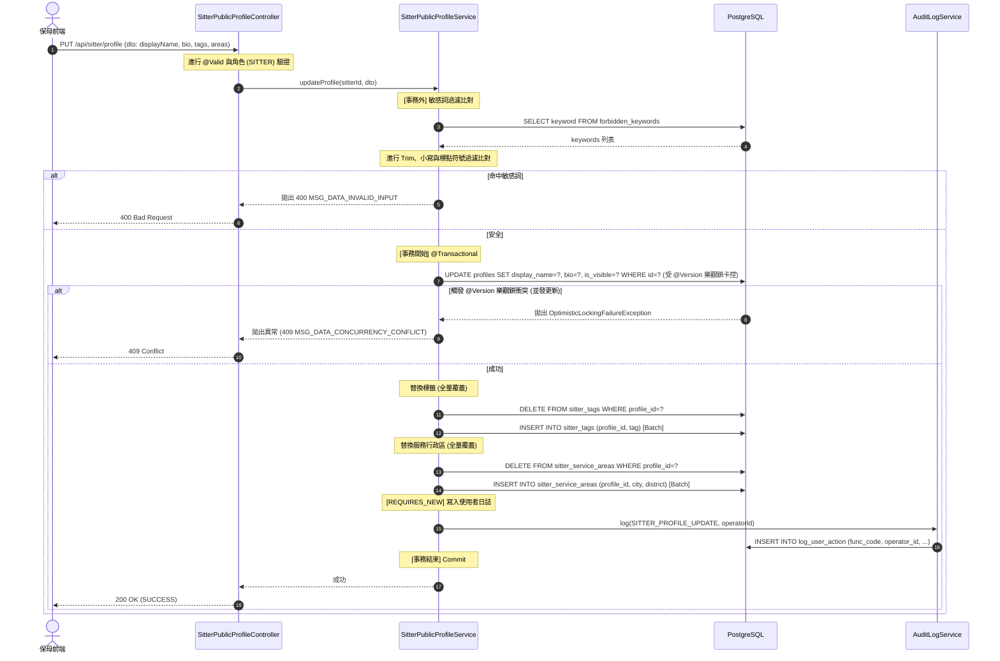
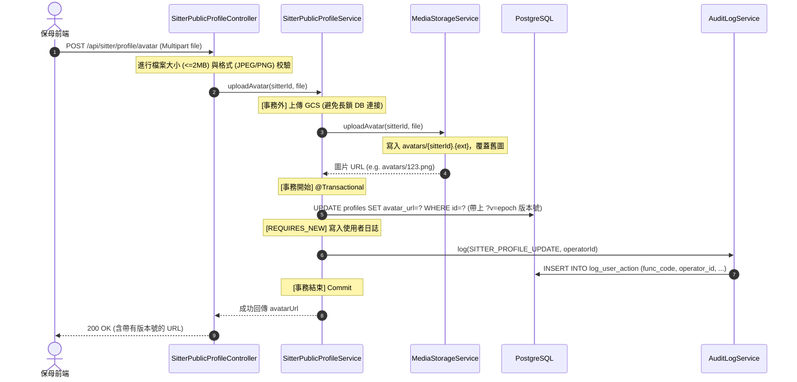
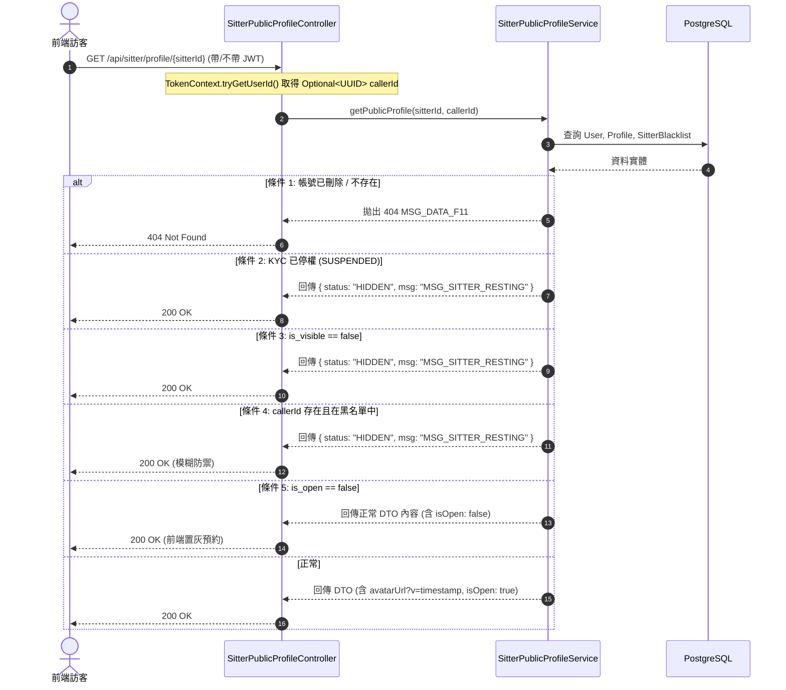

# SD-018: 保母公開檔案與標籤管理設計文件

| 項目 | 內容 |
| :--- | :--- |
| **對應需求** | [PRD-018-public-profile-management.md](file:///Users/will_chiang/Widget_home/cat-sitter-project/docs/sa/fr/PRD-018-public-profile-management.md) |
| **負責 SD** | AI (Antigravity) |
| **建立日期** | 2026-06-18 |
| **狀態** | Done (已設計完成) |
| **DB 表** | `profiles` (擴充), `sitter_tags`, `sitter_service_areas`, `forbidden_keywords` |
| **相依共用設計** | GCS 儲存服務 (`MediaStorageService`), 審計動作日誌 (`log_user_action`) |

---

## 1. 系統架構與技術決策

### 1.1. Optional JWT 匿名訪問與黑名單模糊防禦
* **背景與挑戰**：保母的預約頁面是完全公開的（訪客可訪問），但如果訪問者已被保母列入黑名單，系統應拒絕其預約。為了防範被黑名單封鎖的訪客利用「未登入與已登入」的頁面差異反推自己被封鎖，系統需要實施模糊防禦。
* **技術決策**：
  * 將 `GET /api/sitter/profile/{sitterId}` 端點在 Spring Security 中設定為 `permitAll()`，允許匿名訪問。
  * 擴充 `TokenContext.java`，新增 `tryGetUserId()` 方法，動態獲取當前呼叫者 ID。
  * **門禁 Gating 邏輯**：
    * 若 callerId 不存在（匿名訪客），跳過黑名單檢查，正常返回公開頁面。
    * 若 callerId 存在且在 `sitter_blacklists` 內，後端**不回傳 403**，而是返回狀態 `HIDDEN` 與 `MSG_SITTER_RESTING`（休息中）提示頁，此回應與保母自設隱藏的結果完全一致。

### 1.2. 敏感詞比對之長事務防禦
* **背景與挑戰**：保母在編輯自我介紹時會輸入大段文本。若將敏感詞比對、過濾邏輯置於 `@Transactional` 事務內，會因為載入關鍵字庫與文本庫比對的計算開銷，拉長資料庫事務時間，增加鎖爭用與連接池佔用風險。
* **技術決策**：
  * 在 `SitterPublicProfileService.updateProfile` 中，將敏感詞載入與比對算法設計於實體 `@Transactional` 事務之外。
  * 比對安全後，才正式啟動寫入事務執行 `profiles` 的更新與 `sitter_tags`/`sitter_service_areas` 的全量替換。

### 1.3. 頭像 GCS 覆蓋寫入與 Cache-Busting
* **背景與挑戰**：大頭貼是公開資料，走 Multipart POST 透過後端統一存儲至 `avatars/{sitterId}.{ext}`，採覆蓋寫入以節省儲存空間。但因 URL 不變，瀏覽器強快取會導致保母更換頭像後仍顯示舊圖。
* **技術決策**：
  * 實施**成本最低的 Cache-Busting 方案**：在 `profiles.avatar_url` 儲存與傳回時，一律加上 query string 版本號（例如 `?v={epoch_timestamp}`）。
  * 每次更換頭像並覆寫 GCS 實體時，更新此版本號並持久化至 `avatar_url`，強制瀏覽器拉取新圖。

### 1.4. KYC 停權連動防禦
* **技術決策**：當保母的 KYC 狀態變更為 `SUSPENDED`（停權）時，在 `KycServiceImpl.suspendSitter()` 的同一個寫入事務中，直接調用 `profile.setOpen(false)` 強制關閉接單，且在查詢 API 時將此 profile 強制標記為隱藏（Hidden），達成強一致性防禦。

### 1.5. 併發更新與 @Version 樂觀鎖衝突
* **技術決策**：
  * `profiles` 表中包含 `@Version` 版本控制欄位。若保母同時發送多筆 `PUT /api/sitter/profile` 編輯請求，後端將拋出 `OptimisticLockingFailureException` 樂觀鎖衝突。
  * 由 `GlobalExceptionHandler` 統一攔截此樂觀鎖異常，向前端回傳 `409 Conflict`，錯誤碼設定為 `"MSG_DATA_CONCURRENCY_CONFLICT"`，防止 500 錯誤暴露。

---

## 2. 序列圖

### 2.1. 編輯公開檔案：`PUT /api/sitter/profile`



### 2.2. 大頭貼上傳：`POST /api/sitter/profile/avatar`


* **異常補償說明**：若 GCS 上傳成功但後續 DB 寫入失敗，系統直接拋出異常回傳 500。由於採用覆蓋式路徑寫入且不帶雜湊，殘留於 GCS 的無 DB 關聯圖片將在下一次上傳時自動被覆寫，因此無需實作複雜的補償回滾機制。

### 2.3. 讀取公開檔案與 Gating 優先級：`GET /api/sitter/profile/{sitterId}`



---

## 3. 資料庫 Schema 變更 (Flyway Migration)

### [V20260618_01__add_sitter_profile_fields.sql](file:///Users/will_chiang/Widget_home/cat-sitter-project/backend/src/main/resources/db/migration/V20260618_01__add_sitter_profile_fields.sql)
```sql
-- 1. 擴充 profiles 表
ALTER TABLE profiles ADD COLUMN avatar_url VARCHAR(512);
ALTER TABLE profiles ADD COLUMN display_name VARCHAR(100);
ALTER TABLE profiles ADD COLUMN bio TEXT;
ALTER TABLE profiles ADD COLUMN is_visible BOOLEAN NOT NULL DEFAULT TRUE;

-- 2. 新增 sitter_tags 表
CREATE TABLE sitter_tags (
    id UUID PRIMARY KEY,
    profile_id UUID NOT NULL REFERENCES profiles(id) ON DELETE CASCADE,
    tag VARCHAR(20) NOT NULL, -- DB 使用 20 碼防禦性 buffer 防止表情符號或多位元字元截斷，應用層校驗限制 10 中英文字
    created_at TIMESTAMPTZ NOT NULL DEFAULT CURRENT_TIMESTAMP,
    CONSTRAINT uk_sitter_tag UNIQUE (profile_id, tag)
);
CREATE INDEX idx_sitter_tags_tag ON sitter_tags(tag);

-- 3. 新增 sitter_service_areas 表
CREATE TABLE sitter_service_areas (
    id UUID PRIMARY KEY,
    profile_id UUID NOT NULL REFERENCES profiles(id) ON DELETE CASCADE,
    city VARCHAR(50) NOT NULL,
    district VARCHAR(50) NOT NULL,
    created_at TIMESTAMPTZ NOT NULL DEFAULT CURRENT_TIMESTAMP,
    CONSTRAINT uk_sitter_area UNIQUE (profile_id, city, district)
);
CREATE INDEX idx_sitter_areas_city_dist ON sitter_service_areas(city, district);

-- 4. 新增 forbidden_keywords 表
CREATE TABLE forbidden_keywords (
    id UUID PRIMARY KEY,
    keyword VARCHAR(50) NOT NULL UNIQUE,
    created_by UUID,
    created_at TIMESTAMPTZ NOT NULL DEFAULT CURRENT_TIMESTAMP
);
```

---

## 4. API 規格與接口擴充

### 4.1. 系統內部接口與基礎設施擴充

#### `TokenContext.java` 擴充
* 需擴充以支援 Optional JWT 的匿名與登入分支卡控：
  ```java
  public static Optional<UUID> tryGetUserId() {
      Authentication auth = SecurityContextHolder.getContext().getAuthentication();
      if (auth == null || !auth.isAuthenticated() || auth instanceof AnonymousAuthenticationToken) {
          return Optional.empty();
      }
      return Optional.of(UUID.fromString(auth.getName()));
  }
  ```

#### `MediaStorageService.java` 擴充
* 需於介面與其實作類中，擴充大頭貼上傳的儲存與覆寫邏輯：
  ```java
  String uploadAvatar(UUID sitterId, MultipartFile file);
  ```
  * **GCS Path**：`avatars/{sitterId}.{ext}` (ext 動態保留原始副檔名，如 `.jpg` 或 `.png`)
  * **寫入方式**：直接覆寫。

---

### 4.2. API 端點詳細規格

#### 1. 讀取公開檔案
* **Method & Path**: `GET /api/sitter/profile/{sitterId}`
* **Authentication**: `permitAll()` (匿名可訪問)
* **Response (正常 - 200 OK)**:
  ```json
  {
    "status": "SUCCESS",
    "data": {
      "sitterId": "3d498178-14c0-4376-b81e-7fb02e615dda",
      "displayName": "小梅",
      "avatarUrl": "https://storage.googleapis.com/whiskerwatch/avatars/3d498178-14c0-4376-b81e-7fb02e615dda.png?v=1718712345",
      "bio": "專業貓咪保母，有老貓餵藥與怕生貓安撫經驗...",
      "isOpen": true,
      "kycStatus": "VERIFIED",
      "tags": ["老貓照護", "熟悉怕生貓", "餵食"],
      "serviceAreas": [
        { "city": "台北市", "district": "大安區" },
        { "city": "台北市", "district": "信義區" }
      ]
    }
  }
  ```
* **Response (隱藏/黑名單 - 200 OK)**:
  ```json
  {
    "status": "HIDDEN",
    "message": "MSG_SITTER_RESTING",
    "data": null
  }
  ```
* **Response (已註銷/不存在 - 404 Not Found)**:
  ```json
  {
    "status": "FAIL",
    "error": "MSG_DATA_F11",
    "message": "找不到該保母紀錄"
  }
  ```

#### 2. 編輯公開檔案
* **Method & Path**: `PUT /api/sitter/profile`
* **Authentication**: `ROLE_SITTER`
* **Request Body**:
  ```json
  {
    "displayName": "小梅 (改)",
    "bio": "貓咪專任管家，擁有 5 年到府照護經驗...",
    "isVisible": true,
    "tags": ["餵藥", "剪指甲", "陪玩"],
    "serviceAreas": [
      { "city": "台北市", "district": "中山區" }
    ]
  }
  ```
* **Response (200 OK)**:
  ```json
  {
    "status": "SUCCESS",
    "message": "更新成功"
  }
  ```
* **Response (400 Bad Request - 關鍵字或長度校驗攔截)**:
  ```json
  {
    "status": "FAIL",
    "error": "MSG_DATA_INVALID_INPUT",
    "message": "自我介紹或標籤含有違規禁止文字"
  }
  ```
* **Response (409 Conflict - 樂觀鎖更新衝突)**:
  ```json
  {
    "status": "FAIL",
    "error": "MSG_DATA_CONCURRENCY_CONFLICT",
    "message": "此公開檔案已被其他請求更新，請重試"
  }
  ```

#### 3. 上傳大頭貼
* **Method & Path**: `POST /api/sitter/profile/avatar`
* **Authentication**: `ROLE_SITTER`
* **Request Multipart**:
  * `file`: MultipartFile (jpeg/png, <= 2MB)
* **Response (200 OK)**:
  ```json
  {
    "status": "SUCCESS",
    "data": {
      "avatarUrl": "https://storage.googleapis.com/whiskerwatch/avatars/3d498178.png?v=1718712999"
    }
  }
  ```

#### 4. 管理端新增敏感詞 (Admin)
* **Method & Path**: `POST /api/admin/forbidden-keywords`
* **Authentication**: `ROLE_ADMIN`
* **Request Body**:
  ```json
  {
    "keyword": "皮下"
  }
  ```
* **Response (200 OK)**:
  ```json
  {
    "status": "SUCCESS",
    "message": "新增成功"
  }
  ```
* **Response (409 Conflict - 關鍵字已存在)**:
  ```json
  {
    "status": "FAIL",
    "error": "MSG_DATA_CONCURRENCY_CONFLICT",
    "message": "此關鍵字已存在"
  }
  ```
* **審計日誌寫入**：採用 `REQUIRES_NEW` 獨立子事務寫入 `log_user_action` 表（防範主事務回滾導致日誌丟失），`func_code` 設為 `ADMIN_FORBIDDEN_KEYWORD_ADD`，載入 `keyword` 資訊。

#### 5. 管理端刪除敏感詞 (Admin)
* **Method & Path**: `DELETE /api/admin/forbidden-keywords/{id}`
* **Authentication**: `ROLE_ADMIN`
* **Response (200 OK)**:
  ```json
  {
    "status": "SUCCESS",
    "message": "刪除成功"
  }
  ```
* **Response (404 Not Found)**:
  ```json
  {
    "status": "FAIL",
    "error": "MSG_DATA_F11",
    "message": "找不到該敏感關鍵字"
  }
  ```
* **審計日誌寫入**：採用 `REQUIRES_NEW` 獨立子事務寫入 `log_user_action` 表，`func_code` 設為 `ADMIN_FORBIDDEN_KEYWORD_DELETE`。

#### 6. 管理端分頁查詢敏感詞 (Admin)
* **Method & Path**: `GET /api/admin/forbidden-keywords`
* **Query Params**: `page=0&size=50&q=keyword` (q 為可選關鍵字搜尋)
* **Authentication**: `ROLE_ADMIN`
* **Response (200 OK)**:
  ```json
  {
    "status": "SUCCESS",
    "data": {
      "content": [
        { "id": "a1023000-0000-0000-0000-000000000000", "keyword": "皮下" }
      ],
      "page": 0,
      "size": 50,
      "totalElements": 1,
      "totalPages": 1
    }
  }
  ```

---

## 5. 異常代碼與驗收標準 (AC) 對齊

| 異常情境 | 傳回狀態碼 | 錯誤識別碼 (error) | 業務預期行為 |
|:---|:---:|:---:|:---|
| 自訂標籤字數超過 10 字 | `400` | `MSG_DATA_INVALID_INPUT` | 拒絕儲存並提示「單個標籤限 10 字內」（應用層 `@Size(max=10)` 進行校驗，DB `VARCHAR(20)` 為寬字元緩衝防截斷設計） |
| 保母標籤總數超過 10 個 | `400` | `MSG_DATA_INVALID_INPUT` | 拒絕儲存並提示「最多設定 10 個標籤」（應用層比對 list 大小，DB 僅為防禦） |
| 輸入命中敏感關鍵字 | `400` | `MSG_DATA_INVALID_INPUT` | 拒絕儲存並提示「含有禁止字眼」（`SitterPublicProfileService` 於事務外比對攔截） |
| 併發編輯 profiles 衝突 | `409` | `MSG_DATA_CONCURRENCY_CONFLICT` | 樂觀鎖衝突由 `GlobalExceptionHandler` 攔截轉譯 |
| 新增重複已存在的敏感詞 | `409` | `MSG_DATA_CONCURRENCY_CONFLICT` | 觸發 DB 唯一主鍵約束拋出，由 Controller 轉譯為 409 回傳 |
| 讀取不存在/已註銷保母 | `404` | `MSG_DATA_F11` | 隱蔽已刪除帳號 |
| 上傳大頭貼大於 2MB | `400` | `MSG_DATA_INVALID_INPUT` | 拒絕上傳並提示格式與大小限制 |

> [!NOTE]
> **實作提示**：`MSG_DATA_CONCURRENCY_CONFLICT` 為此次新增之錯誤代碼枚舉。實作時請務必至後端 `DataMessageEnum.java` 補齊對應之定義，確保與前端報錯對齊。

---

## 6. 前端 UI 與 testid 規格

### 6.1. `SitterProfileEdit.tsx` (保母編輯)
* 引入 iOS 風格之 Visibility Toggle 開關。
* 大頭貼上傳：限制 `2MB` 且檔案格式為 `image/jpeg` 或 `image/png`。
* **testid 規格**：
  * 大頭貼上傳 Input: `data-testid="sitter-profile-input-avatar"`
  * 自我介紹 TextArea: `data-testid="sitter-profile-input-bio"`
  * 標籤自訂輸入: `data-testid="sitter-profile-input-tag"`
  * 公開開關 Checkbox: `data-testid="sitter-profile-toggle-visible"`
  * 儲存按鈕: `data-testid="sitter-profile-btn-save"`

### 6.2. `SitterPublicProfileView.tsx` (前台展示)
* 當 API 返回 `status == "HIDDEN"` 時，畫面渲染溫馨的「保母目前休息中/暫不公開預約 🐾」提示頁。
* 當 `isOpen == false` 時，預約按鈕設為 Disabled 狀態。
