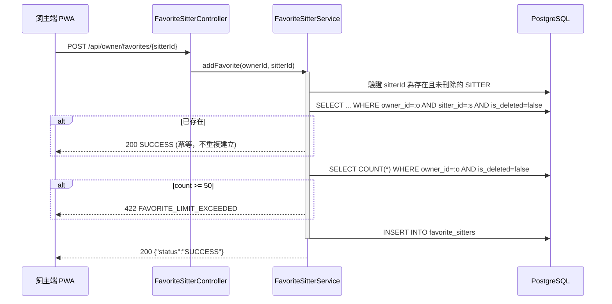

# SD-019: 飼主我的最愛保母 (Favorite Sitters)

| 項目 | 內容 |
|------|------|
| 模組編號 | SD-019 |
| 對應 PRD | PRD-019 |
| 核心技術 | 單向隱私規則, 冪等寫入, 狀態連動顯示 |
| 狀態 | **Approved** |

---

## 1. 業務邏輯與流程設計

### 1.1 單向隱私規則
收藏是飼主單方面的行為。系統**刻意不**：
- 發送任何通知給被收藏的保母
- 提供任何「誰收藏了我」的查詢管道給保母

這點在 `FavoriteSitterService` 類別註解中明確標註，是為了避免保母得知被收藏/取消收藏而對飼主造成心理壓力，屬於本模組的核心資料規則，日後新增功能時不可違反。

### 1.2 收藏行為冪等
`addFavorite`/`removeFavorite` 皆設計為冪等：
- 已收藏的保母再次呼叫新增 → 直接視為成功，不拋錯、不建立重複記錄。
- 未收藏的保母呼叫移除 → 直接視為成功。

這是配合前端愛心圖示（PublicBookingPage 心型 toggle）連續快速點擊、或網路重試時的自然容錯設計，不需要額外的 Idempotency-Key 機制。

### 1.3 狀態連動顯示
收藏清單回傳時，即時關聯查詢該保母目前的 `Profile`：
- `hidden = !profile.isOpen() || !profile.isVisible()`：保母目前休息中或已隱藏公開檔案，前端標示「休息中/隱藏中」但不從收藏清單移除。
- `removed = true`：保母帳號已被刪除（`user.isDeleted()`），前端可提示「此保母已離開平台」。

上限：每位飼主最多收藏 **50 位保母**（`MAX_FAVORITES_PER_OWNER`）。

---

## 2. API 定義

全部端點掛在 `/api/owner/favorites`，Controller 層統一 `@PreAuthorize("hasRole('OWNER')")`。

| Method | Path | 說明 |
|--------|------|------|
| GET | `/api/owner/favorites` | 我的收藏清單（含 hidden/removed 狀態標註） |
| GET | `/api/owner/favorites/search?query=` | 依保母 UUID 或 Email 搜尋 |
| POST | `/api/owner/favorites/{sitterId}` | 加入收藏（冪等） |
| DELETE | `/api/owner/favorites/{sitterId}` | 移除收藏（冪等） |

保母公開預約頁 (`PublicBookingPage.tsx`) 上的愛心圖示直接呼叫上述 POST/DELETE，並用 `GET /api/owner/favorites` 的結果判斷目前是否已收藏該保母。

---

## 3. 詳細邏輯與序列圖 (Sequence Diagram)



---

## 4. 資料庫異動與限制 (DB Constraint)

```sql
CREATE TABLE favorite_sitters (
    id UUID PRIMARY KEY DEFAULT gen_random_uuid(),
    owner_id UUID NOT NULL REFERENCES users(id),
    sitter_id UUID NOT NULL REFERENCES users(id),
    version INT NOT NULL DEFAULT 1,
    created_at TIMESTAMPTZ NOT NULL DEFAULT NOW(),
    updated_at TIMESTAMPTZ NOT NULL DEFAULT NOW(),
    is_deleted BOOLEAN NOT NULL DEFAULT FALSE,
    CONSTRAINT uk_favorite_owner_sitter UNIQUE (owner_id, sitter_id)
);
CREATE INDEX idx_favorite_sitters_owner_id ON favorite_sitters(owner_id);
```

- 移除收藏採邏輯刪除；重複加入同一保母時，因 `is_deleted=false` 的記錄已被排除在唯一性檢查之外，`UNIQUE` 約束不會擋到「先移除、再重新收藏」的情境。

---

## 5. 防呆與邊界條件 (Edge Cases)

| 情境 | 處理方式 |
|------|---------|
| 重複收藏同一保母（快速連點愛心） | 冪等，不報錯不重複寫入 |
| 收藏已達 50 位上限 | 422 `FAVORITE_LIMIT_EXCEEDED` |
| 被收藏的保母帳號已刪除 | 清單項目標記 `removed=true`，不拋錯 |
| 被收藏的保母目前休息中/隱藏檔案 | 清單項目標記 `hidden=true`，仍保留在清單中 |
| 搜尋不存在的保母 ID/Email | 404 `SITTER_NOT_FOUND` |
| 移除本來就不在清單中的保母 | 冪等，回傳成功 |
