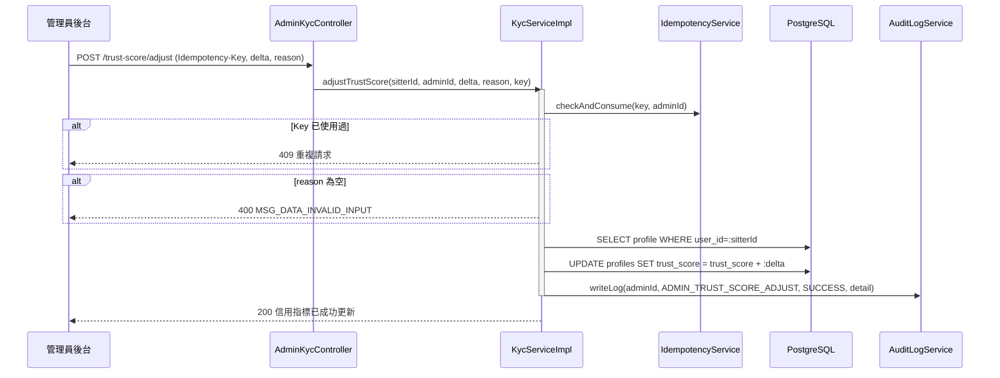

# SD-020: 系統管理後台 — 內部信用指標管理 (Admin Dashboard: Trust Score)

| 項目 | 內容 |
|------|------|
| 模組編號 | SD-020 |
| 對應 PRD | PRD-020（主流程 E：內部信用指標管理） |
| 核心技術 | Idempotency-Key 防重複扣點, 稽核日誌, 前台完全不可見 |
| 狀態 | **Approved (Partial — 僅涵蓋主流程 E)** |

> [!NOTE]
> PRD-020 完整範圍涵蓋 B（KYC/訂閱管理）、C（爭議訂單處理）、D（敏感詞庫維護）、E（內部信用指標管理）四條主流程。本文件僅補齊 **E 流程**的技術設計，因為這是本輪唯一新增且尚未有對應 SD 的部分：
> - **B（KYC 審核/停權復權）** 已由 [SD-017](SD-017-sitter-kyc.md) 涵蓋。
> - **C（爭議訂單/管理員強制結案）** 已由 [SD-009](SD-009-order-completion.md) 涵蓋。
> - **D（敏感詞庫維護）**：`ForbiddenKeyword` entity 與 `AdminForbiddenKeywordController` 已存在於程式碼中，但尚無對應 SD 文件，屬於既有技術債，不在本次補件範圍內。
> - **B（訂閱方案人工展期/退款工單）**：`Subscription` entity 與 `AdminSubscriptionController` 已存在，同樣尚無對應 SD 文件，屬既有技術債。

---

## 1. 業務邏輯與流程設計

### 1.1 信用指標的隱私邊界
`profiles.trust_score`（每位保母預設 100 點，`V20260527_01__create_profiles_and_gatekeeper.sql` 建表時已定義）是**後台內部指標**：
- 飼主端、保母端前台一律不提供任何查詢管道。
- 僅 `AdminKycController` 底下的兩支 `/api/admin/sitters/**` 端點可讀寫，並在 Controller 上維持既有的管理員權限攔截慣例。

### 1.2 手動增減與稽核
管理員增減點數時：
1. 必填「異動原因」(`reason`)，空白直接拒絕（400）——避免無說明的黑箱調整。
2. 透過 `IdempotencyService.checkAndConsume(idempotencyKey, adminId)` 防止管理端重試造成重複加減點。
3. 寫入 `AuditLogService`，記錄 `sitterId`/`delta`/`previousScore`/`newScore`/`reason`，供事後追查是誰、為何調整。

### 1.3 高風險連動預警
清單查詢 (`listSitterTrustScores`) 時，後端直接計算 `highRisk = trustScore < 60`（`TRUST_SCORE_HIGH_RISK_THRESHOLD`），前端依此標註「高風險」，供管理員評估是否進一步執行強制隱藏 (PRD-018) 或撤銷認證 (PRD-017)。**本階段僅止於標註提醒，不做自動連動處分**——是否停權/隱藏仍需管理員在對應功能頁手動操作。

---

## 2. API 定義

| Method | Path | 說明 | Auth |
|--------|------|------|------|
| GET | `/api/admin/sitters/trust-scores` | 全部保母信用指標清單（依分數由低到高排序） | `ROLE_ADMIN` |
| POST | `/api/admin/sitters/{sitterId}/trust-score/adjust` | 手動增減點數 | `ROLE_ADMIN` |

### Request Body（增減點數）
```json
{
  "delta": -10,
  "reason": "訂單爭議判賠，保母未依約定時間到府"
}
```
- **Headers**: `Idempotency-Key: UUID`（必填）

### Response（清單）
```json
{
  "code": 200,
  "message": "OK",
  "data": [
    {
      "sitterId": "uuid",
      "fullName": "測試保母",
      "email": "sitter@test.com",
      "trustScore": 55,
      "highRisk": true,
      "kycStatus": "VERIFIED"
    }
  ]
}
```

---

## 3. 詳細邏輯與序列圖 (Sequence Diagram)



---

## 4. 資料庫異動與限制 (DB Constraint)

- **無新增 table/欄位**：`profiles.trust_score` 欄位已存在（`V20260527_01__create_profiles_and_gatekeeper.sql`），本次僅新增管理端的讀寫 API 與稽核日誌寫入點，未產生新的 Flyway migration。
- 稽核紀錄透過既有的 `AuditLogService`/`log_user_action` 機制寫入，`action_type = ADMIN_TRUST_SCORE_ADJUST`。

---

## 5. 防呆與邊界條件 (Edge Cases)

| 情境 | 處理方式 |
|------|---------|
| `reason` 為空白字串 | 400，拒絕調整 |
| 重複送出同一個 `Idempotency-Key` | 第二次請求視為重複，不重複扣點 |
| 目標 `sitterId` 查無 Profile | 404 `MSG_DATA_F11` |
| 點數調整後低於 60 | 清單標記 `highRisk=true`，僅供人工判斷，不自動停權/隱藏 |
| 飼主/保母嘗試呼叫此 API | Controller 層權限攔截，非 `ROLE_ADMIN` 一律拒絕 |
