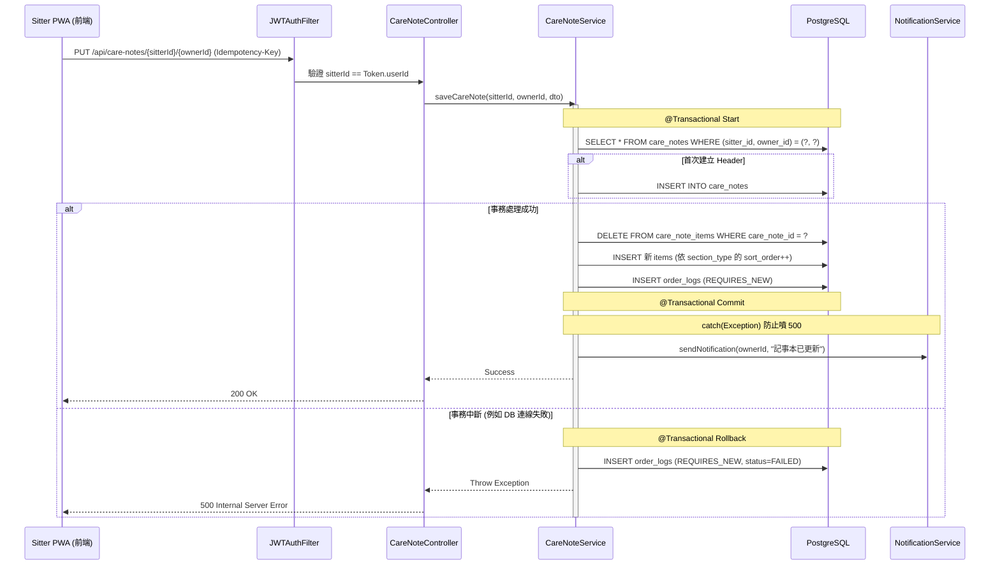
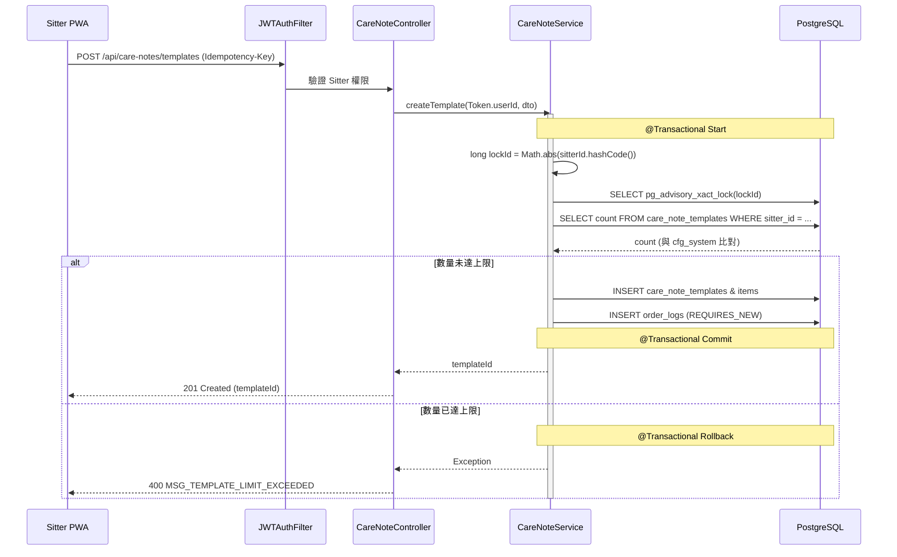
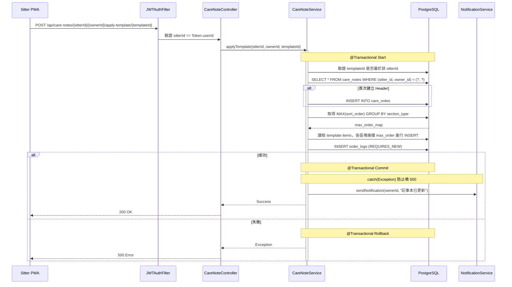
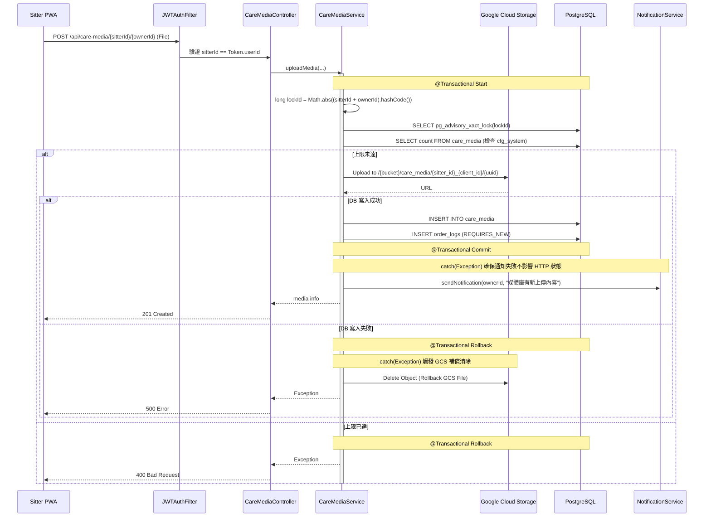
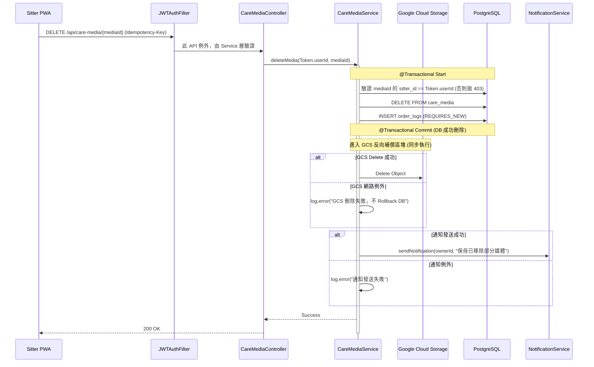
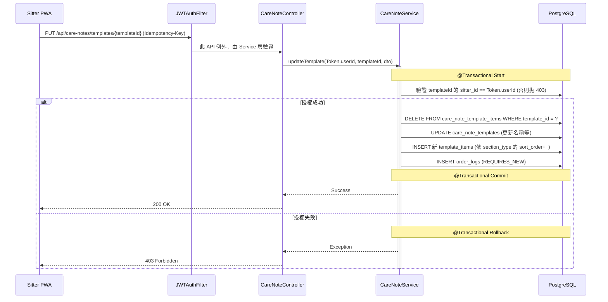
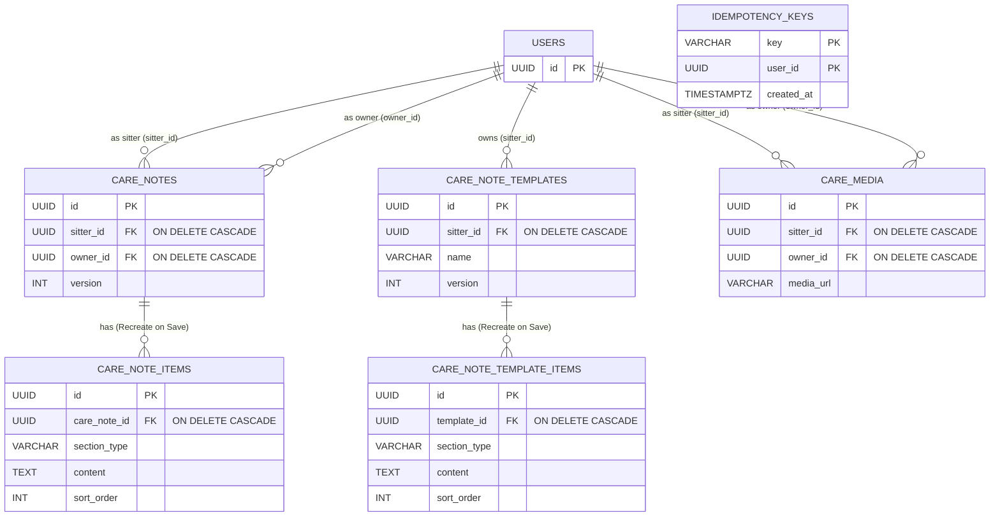

# SD-021: 保母飼主記事本與媒體庫設計文件

| 項目 | 內容 |
|------|------|
| 對應需求 | [PRD-021-care-notes-and-media.md](file:///Users/will_chiang/Widget_home/cat-sitter-project/docs/sa/fr/PRD-021-care-notes-and-media.md) |
| 負責 SD | AI (Antigravity) |
| 建立日期 | 2026-05-22 |
| 狀態 | Approved |
| DB 表 | `care_notes`, `care_note_items`, `care_note_templates`, `care_note_template_items`, `care_media`, `order_logs`, `idempotency_keys` |
| 相依共用設計 | 檔案上傳 ([shared/file-upload.md](file:///Users/will_chiang/Widget_home/cat-sitter-project/docs/sd/shared/file-upload.md))、通知系統 |

---

## 1. 業務邏輯與架構決策

### 1.1 記事本更新策略：覆蓋式更新 (Recreate-on-Save)
為了避免前後端在處理「新增、編輯、刪除、拖拽排序」時，進行複雜且易出錯的條目 Diff 運算，本系統採用 **Recreate-on-Save** 策略：
- 前端每次「儲存記事本」或「覆蓋模板」時，皆將目前的所有條目以完整的結構化陣列發送至後端。
- 後端在同一個 `@Transactional` 事務內，實體刪除（DELETE）該對關係或該模板原有的所有明細條目，並根據前端傳入的新列表重新 Insert，同時順序生成 `sort_order`（按 `section_type` 分組計算從 0 開始）。
- **初始化 Header**：若為首次儲存記事本（包含首次直接套用模板），系統必須先建立 `care_notes` 主檔記錄以取得 `care_note_id`。

### 1.2 模板套用策略：追加模式 (Append-Only) 與推播通知
- 根據 PRD 規範，當保母「套用模板」至現有記事本時，**絕對不可覆蓋或刪除原有記錄**。
- 系統會以 `section_type` 為維度，取得各區塊當前最大的 `sort_order`（`MAX(sort_order) GROUP BY section_type`）。若該區塊無資料 (如首次套用)，實作端需透過 `COALESCE(MAX(sort_order), -1) + 1` 確保新項目從 0 開始遞增。取得 order 後，將模板內的項目接續 `INSERT` 寫入，確保原有資料安全。
- **通知策略**：套用模板屬於記事本的實質寫入操作，因此與「儲存記事本」相同，套用完成後**必須觸發系統站內通知**告知飼主。

### 1.3 權限隔離、隱式綁定與 API 路由設計
- **SaaS Gating**: 依據 GLOBAL-SPEC 3.1 規範，所有 Controller API 必須宣告 `@RequirePlan(PlanTier.FREE)`。
- **JWT 驗證與路由消除歧義**:
  由於系統允許一個飼主擁有多位保母，為了讓飼主端與保母端都能精確存取對應的紀錄，存取記事本與媒體庫的 API 路徑皆設計為精確指定雙方的形式：`/api/.../{sitterId}/{ownerId}`。
  - **攔截器防禦 (`JWTAuthFilter`)**：驗證路徑中的 `{sitterId}` 或 `{ownerId}`，其中之一 **必須等於 `Token.userId`**。若兩者皆不符合，則拋出 `403 Forbidden`，防止越權存取他人資料。
  - **例外處理 (Service 層驗證)**：
    對於路徑中沒有 `{sitterId}` 的 API，Filter 無法套用路徑驗證。這些 API 包括：
    - `PUT /api/care-notes/templates/{templateId}`
    - `DELETE /api/care-notes/templates/{templateId}`
    - `DELETE /api/care-media/{mediaId}`
    以上 API 之身分驗證，統一交由 Service 層於操作前查詢對應資料表 ( `care_note_templates` 或 `care_media` ) 之 `sitter_id`，並驗證是否與 `Token.userId` 相符，不符則拋出 `403`。

### 1.4 冪等性防護與 TTL 排程 (DB-based Idempotency)
- 本專案不引入 Redis，故建立 `idempotency_keys` 表。
- 所有 `POST`, `PUT`, `DELETE` 請求必須攜帶 `Idempotency-Key` Header。攔截器在寫入前嘗試 `INSERT` 該 Key，違反唯一性約束則拒絕，防禦連點與網路重試。
- **TTL 清理排程實作**：定義 Spring 排程任務 `@Scheduled(cron = "0 0 3 * * ?")` (Job 名稱：`CleanIdempotencyKeysJob`)，於每日凌晨 3 點執行 `DELETE FROM idempotency_keys WHERE created_at < NOW() - INTERVAL '24 hours'`，避免資料表無限膨脹。

### 1.5 並發控制與上限配置 (Advisory Lock)
- 模板上限與媒體上限必須由 **`cfg_system`** 表統一控管，嚴禁 hardcode。
- 操作前計算 Hash (`Math.abs(sitterId.hashCode())` 或 `ownerId` 的組合)，傳入 `pg_advisory_xact_lock(:lockId)` 以進行事務級防護。

### 1.6 稽核日誌 (Audit Log)
所有對記事本、模板、媒體的操作，**全部寫入** `order_logs`。
必須標註 `@Transactional(propagation = Propagation.REQUIRES_NEW)`，確保主事務 rollback 時，依然保留嘗試軌跡。

### 1.7 使用者刪除級聯策略 (FK ON DELETE)
針對綁定使用者的外鍵（`sitter_id` 與 `owner_id`），一律採用 `ON DELETE CASCADE`。若使用者帳號被徹底物理刪除，系統將連帶刪除所有與該使用者關聯的照護記事與媒體，確保無孤兒紀錄且符合 GDPR。

---

## 2. 序列圖：邊界與職責

### 2.1 儲存照護記事本 (Recreate-on-Save 與 Header 初始化)


### 2.2 建立模板 (Advisory Lock 並發防護)


### 2.3 套用模板 (追加模式 Append-Only)


### 2.4 上傳媒體 (包含 GCS 補償機制與通知)


### 2.5 刪除媒體 (同步 GCS 反向補償)


### 2.6 覆蓋現有模板 (Recreate-on-Save 策略)


---

## 3. 資料庫結構 (完整 DDL)

### 3.1 實體關係圖 (ERD)


### 3.2 完整 DDL 腳本
```sql
-- V20260522_01__create_care_notes_and_media.sql

-- 1. 照護記事本主表
CREATE TABLE care_notes (
    id          UUID PRIMARY KEY DEFAULT gen_random_uuid(),
    sitter_id   UUID NOT NULL REFERENCES users(id) ON DELETE CASCADE,
    owner_id    UUID NOT NULL REFERENCES users(id) ON DELETE CASCADE,
    version     INT NOT NULL DEFAULT 0,
    created_at  TIMESTAMPTZ NOT NULL DEFAULT CURRENT_TIMESTAMP,
    updated_at  TIMESTAMPTZ NOT NULL DEFAULT CURRENT_TIMESTAMP,
    created_by  UUID,
    updated_by  UUID,
    CONSTRAINT uq_care_note_sitter_owner UNIQUE (sitter_id, owner_id)
);

-- 2. 照護記事本條目明細表 (Value Object，物理刪除無 version/is_deleted)
CREATE TABLE care_note_items (
    id           UUID PRIMARY KEY DEFAULT gen_random_uuid(),
    care_note_id UUID NOT NULL REFERENCES care_notes(id) ON DELETE CASCADE,
    section_type VARCHAR(50) NOT NULL CHECK (section_type IN ('SERVICE', 'CONTACT', 'WARNING', 'PREFERENCE', 'HOSPITAL', 'OTHER')), 
    title        VARCHAR(255) NOT NULL,
    content      TEXT NOT NULL,
    sort_order   INT NOT NULL,
    created_at   TIMESTAMPTZ NOT NULL DEFAULT CURRENT_TIMESTAMP,
    created_by   UUID
);

-- 3. 記事模板主表
CREATE TABLE care_note_templates (
    id          UUID PRIMARY KEY DEFAULT gen_random_uuid(),
    sitter_id   UUID NOT NULL REFERENCES users(id) ON DELETE CASCADE,
    name        VARCHAR(100) NOT NULL,
    version     INT NOT NULL DEFAULT 0,
    created_at  TIMESTAMPTZ NOT NULL DEFAULT CURRENT_TIMESTAMP,
    updated_at  TIMESTAMPTZ NOT NULL DEFAULT CURRENT_TIMESTAMP,
    created_by  UUID,
    updated_by  UUID
);

-- 4. 記事模板條目明細表 (Value Object，物理刪除無 version/is_deleted)
CREATE TABLE care_note_template_items (
    id           UUID PRIMARY KEY DEFAULT gen_random_uuid(),
    template_id  UUID NOT NULL REFERENCES care_note_templates(id) ON DELETE CASCADE,
    section_type VARCHAR(50) NOT NULL CHECK (section_type IN ('SERVICE', 'CONTACT', 'WARNING', 'PREFERENCE', 'HOSPITAL', 'OTHER')),
    title        VARCHAR(255) NOT NULL,
    content      TEXT NOT NULL,
    sort_order   INT NOT NULL,
    created_at   TIMESTAMPTZ NOT NULL DEFAULT CURRENT_TIMESTAMP,
    created_by   UUID
);

-- 5. 照護媒體庫表 (只有新增/刪除，移除 version 與 updated_at 死欄位)
CREATE TABLE care_media (
    id          UUID PRIMARY KEY DEFAULT gen_random_uuid(),
    sitter_id   UUID NOT NULL REFERENCES users(id) ON DELETE CASCADE,
    owner_id    UUID NOT NULL REFERENCES users(id) ON DELETE CASCADE,
    caption     VARCHAR(255) NOT NULL,
    media_url   VARCHAR(1024) NOT NULL,
    media_type  VARCHAR(50) NOT NULL,
    created_at  TIMESTAMPTZ NOT NULL DEFAULT CURRENT_TIMESTAMP,
    created_by  UUID
);

-- 6. DB 冪等性防護表
CREATE TABLE idempotency_keys (
    idempotency_key VARCHAR(128) NOT NULL,
    user_id         UUID NOT NULL,
    response_body   TEXT,
    created_at      TIMESTAMPTZ NOT NULL DEFAULT CURRENT_TIMESTAMP,
    CONSTRAINT pk_idempotency PRIMARY KEY (idempotency_key, user_id)
);

-- 7. 索引
CREATE INDEX idx_care_notes_lookup ON care_notes(sitter_id, owner_id);
CREATE INDEX idx_care_note_items_ref ON care_note_items(care_note_id);
CREATE INDEX idx_care_note_templates_sitter ON care_note_templates(sitter_id);
CREATE INDEX idx_care_note_template_items_ref ON care_note_template_items(template_id);
CREATE INDEX idx_care_media_lookup ON care_media(sitter_id, owner_id);
CREATE INDEX idx_idempotency_keys_created ON idempotency_keys(created_at);
```

---

## 4. API 設計與 Request/Response Schema

*(所有 API 宣告 `@RequirePlan(PlanTier.FREE)`，並透過 `JWTAuthFilter` 驗證，路徑中只要有 `{sitterId}` 或 `{ownerId}`，兩者之一必須符合 `Token.userId`)*

### 4.1 取得照護記事本
- **Method & Path**: `GET /api/care-notes/{sitterId}/{ownerId}`
- **Auth**: `Authenticated` (保母或飼主)
- **首次存取行為**: 當查詢不到對應的 `care_notes` 主記錄時，**回傳 200 OK 與全空的 6 大分區**，且 `careNoteId` 為 `null`，讓前端擁有乾淨初始結構。
- **Response (首次查無紀錄)**:
```json
{
  "code": 200,
  "message": "OK",
  "data": {
    "careNoteId": null,
    "sitterId": "uuid-sitter",
    "ownerId": "uuid-owner",
    "sections": {
      "SERVICE": [],
      "CONTACT": [],
      "WARNING": [],
      "PREFERENCE": [],
      "HOSPITAL": [],
      "OTHER": []
    }
  }
}
```
- **Response (已有紀錄)**:
```json
{
  "code": 200,
  "message": "OK",
  "data": {
    "careNoteId": "uuid-note",
    "sitterId": "uuid-sitter",
    "ownerId": "uuid-owner",
    "sections": {
      "SERVICE": [
        { "id": "uuid-item1", "title": "餵食", "content": "每天早上8點餵罐頭", "sortOrder": 0 }
      ],
      "CONTACT": [],
      "WARNING": [
        { "id": "uuid-item2", "title": "開門防護", "content": "貓咪會嘗試衝門", "sortOrder": 0 }
      ],
      "PREFERENCE": [],
      "HOSPITAL": [],
      "OTHER": []
    }
  }
}
```

### 4.2 儲存照護記事本 (Recreate-on-Save)
- **Method & Path**: `PUT /api/care-notes/{sitterId}/{ownerId}`
- **Headers**: `Idempotency-Key`
- **Auth**: `ROLE_SITTER` (且 `{sitterId} == Token.userId`)
- **Request Body**:
```json
{
  "items": [
    { "sectionType": "SERVICE", "title": "餵食", "content": "每天早上8點餵罐頭" },
    { "sectionType": "WARNING", "title": "開門防護", "content": "貓咪會嘗試衝門" }
  ]
}
```
- **Response**:
```json
{
  "code": 200,
  "message": "修改成功",
  "data": {
    "careNoteId": "uuid-note"
  }
}
```

### 4.3 取得模板列表
- **Method & Path**: `GET /api/care-notes/templates`
- **Auth**: `ROLE_SITTER`
- **Response**:
```json
{
  "code": 200,
  "data": [
    {
      "id": "uuid-template-1",
      "name": "基礎照顧模板",
      "items": [
        { "sectionType": "SERVICE", "title": "餵食", "content": "每天餵一次", "sortOrder": 0 }
      ],
      "updatedAt": "2026-05-22T10:00:00Z"
    }
  ]
}
```

### 4.4 建立模板
- **Method & Path**: `POST /api/care-notes/templates`
- **Headers**: `Idempotency-Key`
- **Auth**: `ROLE_SITTER`
- **Request Body**:
```json
{
  "name": "基礎照顧模板",
  "items": [
    { "sectionType": "SERVICE", "title": "餵食", "content": "餵罐頭" }
  ]
}
```
- **Response (201 Created)**:
```json
{ "code": 201, "message": "新增成功", "data": { "templateId": "uuid" } }
```
- **Response (400 超限)**:
```json
{ "code": 400, "message": "模板數量已達上限，請選擇覆蓋既有模板", "data": null }
```

### 4.5 覆蓋現有模板 (Recreate-on-Save)
- **Method & Path**: `PUT /api/care-notes/templates/{templateId}`
- **Headers**: `Idempotency-Key`
- **Auth**: `ROLE_SITTER`
- **行為與權限驗證**: 於 Service 層查詢 `care_note_templates.sitter_id == Token.userId` 驗證擁有權 (不符拋 403)。在 `@Transactional` 中先 `DELETE FROM care_note_template_items WHERE template_id = ?`，接著再 `INSERT` 傳入的新 items 陣列。
- **Request Body**: (同建立模板)
- **Response**:
```json
{
  "code": 200,
  "message": "修改成功",
  "data": {
    "templateId": "uuid-template-1"
  }
}
```

### 4.6 刪除模板
- **Method & Path**: `DELETE /api/care-notes/templates/{templateId}`
- **Headers**: `Idempotency-Key`
- **Auth**: `ROLE_SITTER`
- **身分驗證**: 於 Service 層查詢 `care_note_templates.sitter_id == Token.userId` 進行驗證 (不符拋 403)。
- **Response**:
```json
{
  "code": 200,
  "message": "刪除成功",
  "data": null
}
```

### 4.7 套用模板
- **Method & Path**: `POST /api/care-notes/{sitterId}/{ownerId}/apply-template/{templateId}`
- **Headers**: `Idempotency-Key`
- **Auth**: `ROLE_SITTER`
- **行為**: 同 `PUT /api/care-notes`，若是首次呼叫，會自動 `INSERT INTO care_notes` 建立主表記錄。
- **Response**:
```json
{
  "code": 200,
  "message": "套用成功",
  "data": null
}
```

### 4.8 取得媒體庫
- **Method & Path**: `GET /api/care-media/{sitterId}/{ownerId}`
- **Auth**: `Authenticated` (保母或飼主皆可)
- **Response**:
```json
{
  "code": 200,
  "data": [
    {
      "id": "uuid-media-1",
      "caption": "水盆位置在廚房右側",
      "mediaUrl": "https://storage.googleapis.com/.../file.jpg",
      "mediaType": "IMAGE",
      "createdAt": "2026-05-22T10:00:00Z"
    }
  ]
}
```

### 4.9 上傳媒體 (限制 20 筆)
- **Method & Path**: `POST /api/care-media/{sitterId}/{ownerId}`
- **Headers**: `Idempotency-Key`, `Content-Type: multipart/form-data`
- **Auth**: `ROLE_SITTER`
- **Response (201 Created)**: `{"code": 201, "data": {"mediaId": "uuid", "mediaUrl": "url"}}`
- **Response (400 超限)**: `{"code": 400, "message": "媒體已達上限"}`

### 4.10 刪除媒體
- **Method & Path**: `DELETE /api/care-media/{mediaId}`
- **Headers**: `Idempotency-Key`
- **行為**: DB 實體刪除並觸發 `sendNotification`。同步嘗試 GCS Object Delete，失敗不 Rollback DB (反向補償策略)。
- **身分驗證例外**: 由於路徑無 `{sitterId}`，此 API 之授權由 Service 層負責，於刪除前驗證 `care_media.sitter_id == Token.userId`，不符則拋出 `403`。
- **Response**: `{"code": 200, "message": "刪除成功", "data": null}`

---

## 5. 共用服務隔離與 GCS (Mocking Layer)

- **檔案服務依賴**：本模組依賴 `shared/file-upload.md` 定義之上傳機制。`cfg_upload` 中的 `uploadGroupType` 設定為 `CARE_MEDIA`。
- **GCS 路徑嚴格規範**：必須遵守 GLOBAL-SPEC §4.1，絕對路徑為 `/{bucket}/care_media/{sitter_id}_{client_id}/{uuid}_{filename}`，避免被生命週期排程誤刪。
- **開發環境隔離 (`@Profile("local")`)**: 實作 `LocalMediaStorageServiceImpl`，將檔案寫入本機 `/tmp/cat_sitter_media/`，並透過 Spring `WebMvcConfigurer` 將 `http://localhost:8080/local-media/**` 映射供前端讀取。
- **非本地環境 (`@Profile("!local")`)**: 串接真實 GCS (`google-cloud-storage` SDK)，以 Spring property `gcp.storage.bucket-name` (可用環境變數 `GCP_STORAGE_BUCKET_NAME` 覆寫) 切分實體 Bucket。公開類媒體 (照護日誌、頭像、繳費證明) 上傳時以 `Acl.User.ofAllUsers()` 設定 public-read ACL 並回傳完整 URL；KYC 證件維持 private，僅回傳 objectKey，讀取需透過 `generateSignedUrl` 產生 V4 短效簽名連結。Cloud Run 為 attached service account 無本地私鑰，簽名動作透過 `ImpersonatedCredentials` 自我模擬 (self-impersonation)，需授予該 service account `roles/iam.serviceAccountTokenCreator`。
