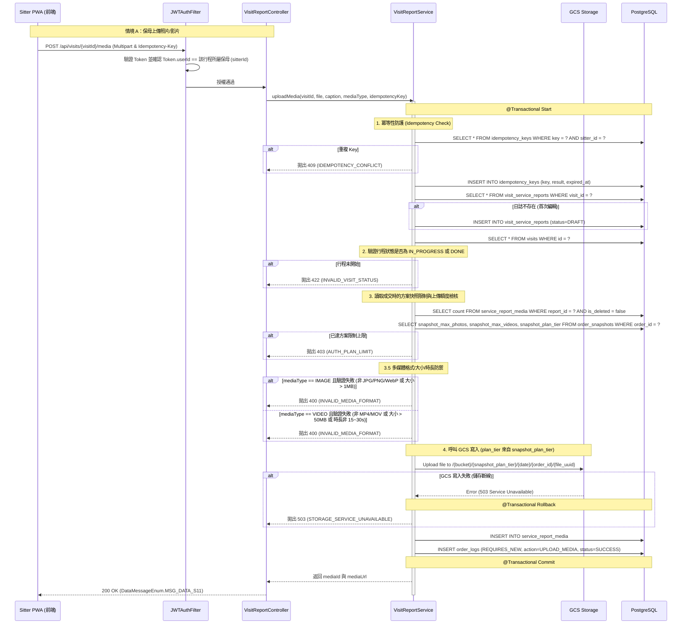
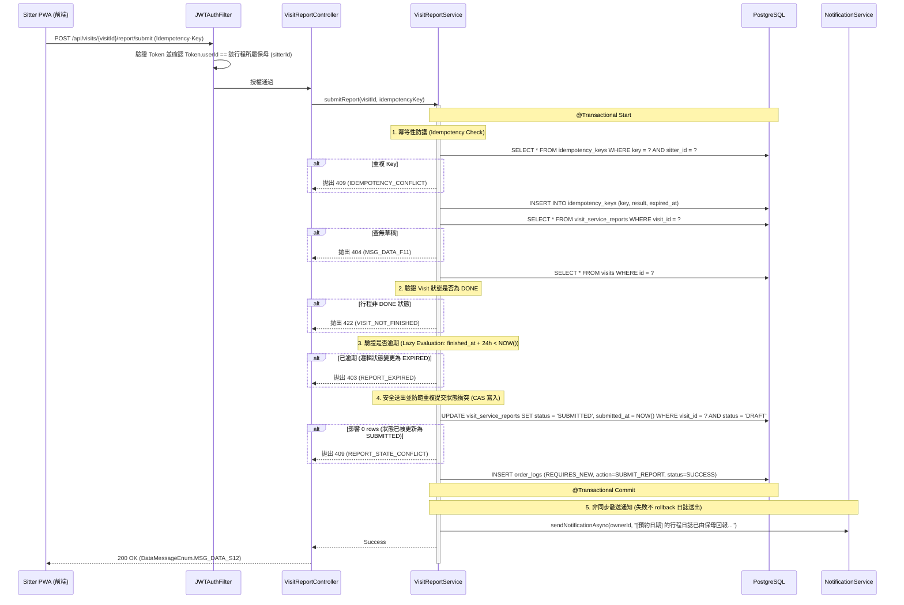

# SD-022: 行程照護日誌與多媒體回報設計文件

| 項目 | 內容 |
|------|------|
| 對應需求 | [PRD-022-care-log.md](file:///Users/will_chiang/Widget_home/cat-sitter-project/docs/sa/fr/PRD-022-care-log.md) |
| 負責 SD | AI (Antigravity) |
| 建立日期 | 2026-05-23 |
| 狀態 | Approved |
| DB 表 | `visit_service_reports`, `service_report_media`, `order_logs`, `idempotency_keys` |
| 相依共用設計 | [錯誤回應](shared/error-response.md), [SaaS 訂閱與 Gating](shared/permission-rbac.md), [多租戶稽核](shared/audit-tenancy.md), [檔案上傳](shared/file-upload.md), [系統配置](shared/config-system.md) |

---

## 1. 序列圖與流程設計

### 1.1 暫存草稿與多媒體上傳 (子模組 A)

本流程涵蓋媒體上傳操作（情境 A），文字草稿暫存之 API 規格與驗證邏輯請詳見 §4.1。後端在首次觸發任何一項操作時，均會自動初始化狀態為 `DRAFT` 的日誌主檔。



### 1.2 送出日誌與非同步通知 (子模組 B)

送出日誌時，後端實施**懶加載判定**（Lazy Evaluation）以防範逾期日誌，並非同步觸發站內通知。



---

## 2. 資料模型變更 (DDL 腳本)

本模組使用 Flyway 進行資料庫變遷，新增 `visit_service_reports` 主表與 `service_report_media` 媒體關聯表。

```sql
-- V20260523_03__create_visit_service_reports.sql

-- 1. 服務日誌主表
CREATE TABLE visit_service_reports (
    id            UUID PRIMARY KEY DEFAULT gen_random_uuid(),
    visit_id      UUID NOT NULL UNIQUE REFERENCES visits(id) ON DELETE CASCADE,
    status        VARCHAR(20) NOT NULL DEFAULT 'DRAFT', -- DRAFT, SUBMITTED
    content       TEXT, -- 文字日誌 (最多 1000 字)
    submitted_at  TIMESTAMPTZ NULL, -- 送出時間 (可為 null，僅狀態為 SUBMITTED 時寫入)
    
    -- 審計與併發鎖定軌跡 (樂觀鎖預設為 0 以防 JPA 序列衝突)
    version       INT NOT NULL DEFAULT 0,
    created_at    TIMESTAMPTZ NOT NULL DEFAULT NOW(),
    updated_at    TIMESTAMPTZ NOT NULL DEFAULT NOW(),
    created_by    UUID,
    updated_by    UUID,
    is_deleted    BOOLEAN NOT NULL DEFAULT FALSE
);

-- 2. 服務日誌多媒體表
CREATE TABLE service_report_media (
    id            UUID PRIMARY KEY DEFAULT gen_random_uuid(),
    report_id     UUID NOT NULL REFERENCES visit_service_reports(id) ON DELETE CASCADE,
    media_url     VARCHAR(255) NOT NULL,
    media_type    VARCHAR(10) NOT NULL, -- IMAGE, VIDEO
    caption       VARCHAR(100), -- 說明文字 (最長 100 字，選填)
    
    -- 審計與併發鎖定軌跡
    version       INT NOT NULL DEFAULT 0,
    created_at    TIMESTAMPTZ NOT NULL DEFAULT NOW(),
    updated_at    TIMESTAMPTZ NOT NULL DEFAULT NOW(),
    created_by    UUID,
    updated_by    UUID,
    is_deleted    BOOLEAN NOT NULL DEFAULT FALSE
);

-- 3. 索引優化 (複合 is_deleted 防止配額查詢時 full scan)
CREATE INDEX idx_visit_service_reports_visit ON visit_service_reports(visit_id, is_deleted);
CREATE INDEX idx_service_report_media_report ON service_report_media(report_id, is_deleted);
```

### 2.1 樂觀鎖更新防禦
為防範弱網下重複暫存或並發覆蓋，更新與邏輯刪除時均使用 JPA 樂觀鎖 `@Version`。若資料已被其他執行緒修改（即資料庫中 `version` 大於傳入值），系統將拋出 `OptimisticLockException`，對應回傳 `409 Conflict` (`VERSION_CONFLICT`)。

---

## 3. order_logs — 業務稽核日誌寫入規格

寫入操作成功後，Service 層必須呼叫 `AuditLogService` 以 `Propagation.REQUIRES_NEW` 獨立寫入操作日誌至 `order_logs`：

| 功能操作 | `func_code` | `action_type` | `action_result` | `target_id` | `target_table` |
|------|------|----|----|----|----|
| 建立或修改草稿 | `SERVICE_REPORT_MGT` | `CREATE` / `UPDATE` | `SUCCESS` / `FAIL` | `reportId` | `visit_service_reports` |
| 上傳媒體檔案 | `SERVICE_REPORT_MEDIA` | `CREATE` | `SUCCESS` / `FAIL` | `mediaId` | `service_report_media` |
| 邏輯刪除媒體檔案 | `SERVICE_REPORT_MEDIA` | `DELETE` | `SUCCESS` / `FAIL` | `mediaId` | `service_report_media` |
| 送出日誌 | `SERVICE_REPORT_SUBMIT` | `UPDATE` | `SUCCESS` / `FAIL` | `reportId` | `visit_service_reports` |

---

## 4. API 設計

### 4.1 暫存文字草稿
* **Method**: `PUT`
* **Path**: `/api/visits/{visitId}/report`
* **Headers**:
  - `Idempotency-Key`: `UUID` (選填)
* **Request Body**:
  ```json
  {
    "content": "今日餵食正常，貓咪精神很好，有幫忙清理砂盆。",
    "version": 0
  }
  ```
* **權限與業務校驗**：
  1. **權限攔截**：僅限該行程所屬保母可呼叫，若為飼主或其他用戶，拋出 `403 Forbidden`。
  2. **行程狀態檢核**：Visit 狀態必須為 `IN_PROGRESS` 或 `DONE`。若為 `PENDING` 或 `SCHEDULED`，拋出 `422 Unprocessable Entity` (`INVALID_VISIT_STATUS`)。
  3. **逾期檢核**：若該行程結束時間（`finished_at`）起算已超過 24 小時（Lazy Evaluation），拋出 `403 Forbidden` (`REPORT_EXPIRED`)。
  4. **狀態校驗**：若日誌已是 `SUBMITTED` 狀態，拒絕暫存，拋出 `409 Conflict` (`REPORT_STATE_CONFLICT`)。
  5. **版本防禦**：比對傳入之 `version`，若版本不符，拋出 `409 Conflict` (`VERSION_CONFLICT`)。
  6. **冪等性防護**：若 Header 帶有 `Idempotency-Key` 且重複，拋出 `409 Conflict` (`IDEMPOTENCY_CONFLICT`)。
* **Response**:
  ```json
  {
    "code": 200,
    "message": "修改成功",
    "data": {
      "reportId": "d513749a-d530-4035-a6d4-c87ae06cf610",
      "status": "DRAFT",
      "version": 1
    }
  }
  ```

### 4.2 上傳媒體檔案
* **Method**: `POST`
* **Path**: `/api/visits/{visitId}/media`
* **Headers**:
  - `Idempotency-Key`: `UUID` (必填)
* **Request Body (Multipart/form-data)**:
  - `file`: `Binary`
  - `mediaType`: `"IMAGE"` | `"VIDEO"` (必填)
  - `caption`: `"貓咪喝水的地方"` (選填)
* **Response**:
  ```json
  {
    "code": 200,
    "message": "新增成功",
    "data": {
      "mediaId": "fa3252a8-c68c-4000-8080-d513749amdia",
      "mediaUrl": "https://storage.googleapis.com/cat_sitter_media/free/2026-05-23/d513749a/fa3252a8.jpg"
    }
  }
  ```

### 4.3 刪除媒體檔案 (邏輯刪除)
* **Method**: `DELETE`
* **Path**: `/api/visits/media/{mediaId}`
* **Headers**:
  - `Idempotency-Key`: `UUID` (選填)
* **Request Body**:
  ```json
  {
    "version": 0
  }
  ```
* **權限與業務校驗**：
  1. **權限攔截**：僅限該行程所屬保母可呼叫，若為飼主呼叫，拋出 `403 Forbidden`。
  2. **狀態校驗**：若該日誌狀態為 `SUBMITTED` 或已被判定為邏輯 `EXPIRED`，拒絕刪除操作，拋出 `409 Conflict` (`REPORT_STATE_CONFLICT`)。
  3. **版本防禦**：比對傳入之 `version`，若版本不符，拋出 `409 Conflict` (`VERSION_CONFLICT`)。
* **Response**:
  ```json
  {
    "code": 200,
    "message": "刪除成功",
    "data": null
  }
  ```

### 4.4 送出日誌
* **Method**: `POST`
* **Path**: `/api/visits/{visitId}/report/submit`
* **Headers**:
  - `Idempotency-Key`: `UUID` (必填)
* **Response**:
  ```json
  {
    "code": 200,
    "message": "修改成功",
    "data": null
  }
  ```

### 4.5 讀取日誌 (角色分流說明)
* **Method**: `GET`
* **Path**: `/api/visits/{visitId}/report`
* **角色分流安全攔截與防禦**：
  1. **保母端查詢 (`Token.userId == sitterId`)**：
     * 無狀態限制。可查閱 `DRAFT` 或邏輯為 `EXPIRED` 的日誌，並可依據 response 的 `isEditable` 控制編輯介面。
  2. **飼主端查詢 (`Token.userId == ownerId`)**：
     * **安全閥限制 (SUBMITTED-only Gate)**：後端檢核若日誌狀態為 `DRAFT`，或經過懶加載判定已逾期（非 `SUBMITTED` 狀態且 finished_at 已過 24 小時），**必須**直接攔截請求並回傳 `404 Not Found` (訊息: "查無資料" `MSG_DATA_F11`)，對飼主完全隔離未送出之草稿。
     * 只有日誌狀態為 `SUBMITTED` 時才允許飼主查詢。
* **Response (保母端或已送出的飼主端)**：
  ```json
  {
    "code": 200,
    "message": "OK",
    "data": {
      "reportId": "d513749a-d530-4035-a6d4-c87ae06cf610",
      "visitId": "2624511e-3f10-4376-b81e-7fb02e615dda",
      "status": "DRAFT", -- 飼主端查閱時只會看到 "SUBMITTED"；保母端查閱若逾期則為邏輯 "EXPIRED"
      "content": "今日餵食正常，貓咪精神很好，有幫忙清理砂盆。",
      "submittedAt": "2026-05-23T21:44:32Z", -- 狀態為 SUBMITTED 時才有值
      "media": [
        {
          "mediaId": "fa3252a8-c68c-4000-8080-d513749amdia",
          "mediaUrl": "https://storage.googleapis.com/cat_sitter_media/free/2026-05-23/d513749a/fa3252a8.jpg",
          "mediaType": "IMAGE",
          "caption": "貓咪喝水的地方"
        }
      ],
      "isEditable": true, -- 保母端依 finished_at 與 status 動態判定；飼主端恆為 false
      "version": 2
    }
  }
  ```

### 4.6 錯誤訊息映射 (DataMessageEnum Mappings)
在業務邏輯異常時，後端應返回以下具體的 `DataMessageEnum` 映射（對應 HTTP 狀態碼）：

| HTTP Status | DataMessageEnum | 適用業務場景 |
|-------------|-----------------|--------------|
| `400` | `MSG_DATA_INVALID_MEDIA` | 圖片驗證（限 JPG/PNG/WebP 且 ≤1MB）或影片驗證（限 MP4/MOV、15~30s 且 ≤50MB）失敗。 |
| `403` | `MSG_DATA_PLAN_LIMIT` | 媒體數量已達當前訂單快照 SaaS 限制上限（Free 0, Basic 5, Pro 10+2, Premium 25+5）。 |
| `403` | `MSG_DATA_REPORT_EXPIRED` | 嘗試暫存或送出已逾期（finished_at 起算 > 24h）之日誌。 |
| `409` | `MSG_DATA_VERSION_CONFLICT` | 樂觀鎖版本不一致（VERSION_CONFLICT），資料已被並發覆蓋。 |
| `409` | `MSG_DATA_STATE_CONFLICT` | 日誌已是 `SUBMITTED` 或邏輯 `EXPIRED` 狀態下嘗試修改或提交。 |
| `409` | `MSG_DATA_IDEMPOTENCY_CONFLICT` | 冪等性識別碼 (Idempotency-Key) 重複提交。 |
| `422` | `MSG_DATA_INVALID_VISIT_STATUS` | 行程未開始 (PENDING / SCHEDULED) 時保母嘗試編輯或上傳。 |
| `422` | `MSG_DATA_VISIT_NOT_FINISHED` | 行程進行中 (IN_PROGRESS) 狀態嘗試點選送出。 |
| `503` | `MSG_DATA_STORAGE_ERROR` | 上傳至儲存層 (GCS) 發生異常故障（STORAGE_SERVICE_UNAVAILABLE）。 |

---

## 5. 權限設計 (SaaS Gating)

本 API 在 Controller 層標註 `@RequirePlan(PlanTier.FREE)` 符合 SaaS 框架。

1. **AOP 方案限制卡控**：標註 `@RequirePlan(PlanTier.FREE)`。後端在攔截器中查詢 Sitter 當前的方案，僅在方案高於等於要求方案時放行。
2. **越權防禦 (JWTAuthFilter)**：
   - 對於 `/api/visits/{visitId}/...` 開頭的端點，過濾器會根據 `visitId` 反查對應訂單的 `sitter_id` 與 `owner_id`。
   - 保母端（編輯/暫存/提交/上傳）：必須符合 `Token.userId == sitterId`。
   - 飼主端（讀取）：必須符合 `Token.userId == ownerId`。若不符，後端統一拋出 `403 Forbidden`。

---

## 6. 業務與設計細節備註

### 6.1 逾期與可編輯性邏輯 (Lazy Evaluation Formula)
後端在處理 `GET` 日誌或是任何寫入 API 前，動態進行記憶體中的逾期檢算：
```java
public boolean isExpired(VisitServiceReport report, Visit visit) {
    if ("SUBMITTED".equals(report.getStatus())) {
        return false;
    }
    // DRAFT 狀態下，檢核目前時間是否超過 finished_at + 24小時
    return visit.getFinishedAt() != null &&
           Instant.now().isAfter(visit.getFinishedAt().toInstant().plus(24, ChronoUnit.HOURS));
}
```
* 前端依據 `isEditable` 的值（`status == DRAFT && !isExpired`）來決定是否置灰或顯示唯讀草稿。

### 6.2 多媒體命名與 Immutability 規則
日誌中的媒體檔案命名完全遵循 `SD-GLOBAL-SPEC 4.1` 的規範，前綴從該預約單的訂單快照中讀取：
- 寫入路徑：`/{bucket}/{snapshot_plan_tier}/{date}/{order_id}/{file_uuid}`。
- 此路徑在寫入 GCS 後即不可變，供 GCS Lifecycle 排程進行自動超期刪除。

### 6.3 業務 audit log
每次狀態變更與媒體修改均需呼叫 `AuditLogService` 將行為軌跡寫入 `order_logs`。寫入日誌之格式須包含 `Correlation-ID` 以便全鏈路排查。
