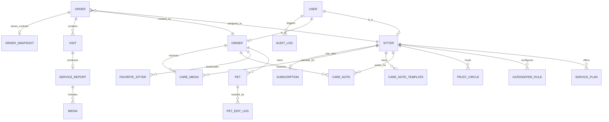

# SD-ERD: 核心實體關係圖 (Core Entity Relationship)

## 1. 核心關聯圖

## 2. 實體詳細設計 (Detailed Schema)

### 2.1 基礎實體規範 (Base Entity Standard)
為了確保審計追蹤與併發控制，除特殊中間表外，所有資料表一律包含以下標準欄位：
- **`id`**: `UUID` (Primary Key, 預設使用隨機 UUID)。
- **`version`**: `INT` (樂觀鎖版本號，用於 JPA `@Version` 防止併發覆蓋)。
- **`created_at`**: `TIMESTAMPTZ` (建立時間)。
- **`updated_at`**: `TIMESTAMPTZ` (最後更新時間)。
- **`created_by`**: `UUID` (建立者 ID，對應 USER.id)。
- **`updated_by`**: `UUID` (最後更新者 ID，對應 USER.id)。
- **`is_deleted`**: `BOOLEAN` (邏輯刪除標記，預設為 false)。

### 2.2 ORDER & ORDER_SNAPSHOT (含財務時間軸)
- **ORDER**
  - `total_amount`: INT (最終結算金額)
  - `settlement_status`: VARCHAR (PENDING_PAYMENT, PAID, COMPLETED)
  - **`paid_at`**: TIMESTAMPTZ (飼主付款日 / 憑證核對日)
  - **`completed_at`**: TIMESTAMPTZ (訂單結案日，作為帳務歸屬基準)
  - **`payout_at`**: TIMESTAMPTZ (預計撥款給保母之日期)
  - **`adjustment_reason`**: TEXT (保母手動調價的原因說明)
  - **`is_disputed`**: BOOLEAN (是否處於爭議凍結狀態，預設為 false)
- **VISIT**
  - `order_id`: UUID (FK)
  - `plan_id`: UUID (FK, 關聯方案)
  - `snapshot_plan_title`: VARCHAR (方案快照名稱)
  - `scheduled_at`: TIMESTAMPTZ (預定執行時間)
  - **`finished_at`**: TIMESTAMPTZ (實際完成時間，用於結案倒數計算)
- **ORDER_SNAPSHOT**
  - `order_id`: UUID (FK)
  - `snapshot_unit_price`: INT, `snapshot_original_total`: INT, `adjustment_amount`: INT
  - `snapshot_plan_title`: VARCHAR, `snapshot_media_retention_days`: INT
  - `snapshot_max_photos`: INT, `snapshot_max_video_seconds`: INT
  - `terms_agreed_at`: TIMESTAMPTZ

### 2.3 SITTER & PROFILE (含審核與彈性資料)
- **SITTER**
  - **`kyc_status`**: VARCHAR (UNVERIFIED, PENDING, VERIFIED, REJECTED, SUSPENDED)
  - **`internal_trust_score`**: INT (內部信用分，預設 100)
  - **`tags`**: JSONB (專長標籤，如 ["老貓照顧", "餵藥", "剪指甲"])
  - **`service_areas`**: JSONB (服務區域，如 ["台北市信義區", "台北市大安區"])
  - `bank_account_info`: JSONB (加密存儲)
- **OWNER**
  - **`address`**: VARCHAR (飼主地址，供保母評估服務距離)
- **SUBSCRIPTION**
  - `sitter_id`: UUID (FK), `plan_tier`: VARCHAR, `monthly_order_count`: INT, `expired_at`: TIMESTAMPTZ

### 2.4 業務輔助實體
- **GATEKEEPER_RULE**: `sitter_id`, `target_client_id`, `rule_type` (WHITELIST, BLACKLIST).
- **TRUST_CIRCLE**: `sitter_a_id`, `sitter_b_id`, `status` (PENDING, ACCEPTED).
- **FAVORITE_SITTER**: `owner_id`, `sitter_id` (複合 PK).
- **PET_EDIT_LOG**: `pet_id`, `editor_id`, `diff_summary` (JSONB).

### 2.5 照護記事與媒體庫 (PRD-021)
- **CARE_NOTE** (照護記事本)
  - `sitter_id`: UUID (FK), `owner_id`: UUID (FK)
  - `sections`: JSONB (結構化大項與條目清單，含流水號)
  - `updated_at`: TIMESTAMPTZ
- **CARE_NOTE_TEMPLATE** (記事模板)
  - `sitter_id`: UUID (FK)
  - `name`: VARCHAR (模板名稱)
  - `sections`: JSONB (同 CARE_NOTE 結構)
  - 限制：每位保母最多 3 筆
- **CARE_MEDIA** (照護媒體庫)
  - `sitter_id`: UUID (FK), `owner_id`: UUID (FK)
  - `caption`: VARCHAR (說明文字)
  - `media_url`: VARCHAR (GCS 路徑)
  - 限制：每對保母-飼主最多 20 筆

---
